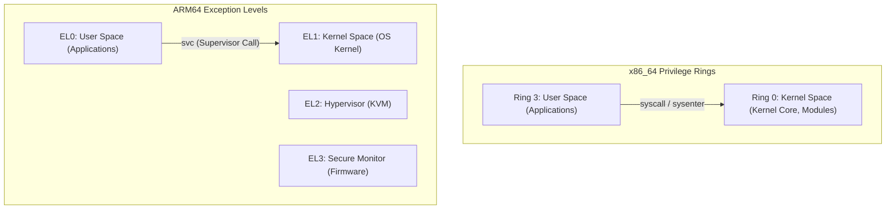
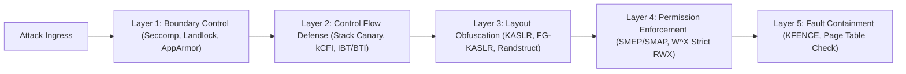

# Kernel Memory Models & Protection Architecture

Analysis of 64-bit virtual memory layout, hardware privilege levels, and defense-in-depth architecture across x86_64 and arm64.

---

## 1. Privilege Level Model Comparison

---

## 2. 64-bit Virtual Address Space Splitting

### 2.1 x86_64 (48-bit / 4-Level Paging)
- `0x0000_0000_0000_0000` ~ `0x0000_7FFF_FFFF_FFFF` (128TB): **User Space**
- `0x0000_8000_0000_0000` ~ `0xFFFF_7FFF_FFFF_FFFF`: Non-canonical hole
- `0xFFFF_8000_0000_0000` ~ `0xFFFF_FFFF_FFFF_FFFF` (128TB): **Kernel Space**
  - Direct mapping (physical memory identity map)
  - vmalloc / ioremap ranges
  - Modules and Kernel Text (`CONFIG_RANDOMIZE_BASE` randomization target)

### 2.2 ARM64 (48-bit VA, TTBR0 vs TTBR1)
- `0x0000_0000_0000_0000` ~ `0x0000_FFFF_FFFF_FFFF`: **TTBR0_EL1** (User Space)
- `0xFFFF_0000_0000_0000` ~ `0xFFFF_FFFF_FFFF_FFFF`: **TTBR1_EL1** (Kernel Space)
- Hardware base registers split lower and upper address spaces directly.

---

## 3. Defense-in-Depth Architecture

