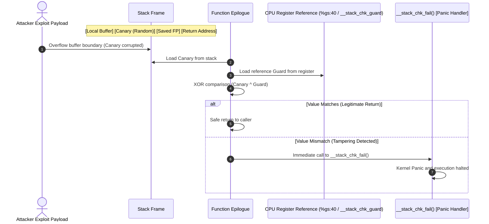

# Stack Protector (`CONFIG_STACKPROTECTOR_STRONG`)

In-depth mechanism analysis and hands-on verification of compiler-injected stack canaries protecting kernel function return addresses against buffer overflows.

---

## 1. Overview & Threat Model

- **Target Vulnerabilities**:
  - Stack-based buffer overflows.
  - Manipulation of saved frame pointers (SFP) and function return addresses (RIP / LR).
  - Return-Oriented Programming (ROP) gadget execution leading to Ring 0 privilege escalation.
- **Attack Scenario & Threat Vectors**:
  - Unbounded memory copy routines (`memcpy`, `strcpy`, off-by-one loop indexing) inside kernel drivers or system calls.
  - Attacker overwrites beyond the boundary of local arrays toward higher memory addresses.
  - When the function reaches its epilogue, execution branches to an attacker-controlled return address.

---

## 2. Architecture & Mechanism

### 2.1 Interactive System Map (Archify Diagram)

Use the interactive controls below to explore the **normal execution flow**, **buffer overflow defense sequence**, and **register differences between x86_64 and ARM64**:

<div class="archify-container">
  <iframe src="../../assets/diagrams/stack-protector/architecture.html" width="100%" height="450px" frameborder="0"></iframe>
</div>

---

### 2.2 Defense Sequence Diagram (Mermaid)



---

### 2.3 Architecture-Specific Assembly Implementation

#### (1) x86_64 Assembly Mechanism
The compiler reads a random value from the `%gs` segment register (Per-CPU storage offset `0x40`) during prologue and validates it during epilogue:

```nasm
; [x86_64 Function Prologue: Canary Insertion]
pushq   %rbp
movq    %rsp, %rbp
subq    $0x50, %rsp
movq    %gs:40, %rax          ; Load canary from Per-CPU segment
movq    %rax, -8(%rbp)        ; Store immediately before return address
xorl    %eax, %eax            ; Clear temporary register to prevent leak

; ... Function body execution ...

; [x86_64 Function Epilogue: Canary Verification]
movq    -8(%rbp), %rax        ; Load canary from stack
xorq    %gs:40, %rax          ; Compare with master canary
jne     .L_stack_chk_fail     ; Branch to failure handler if non-zero
leave
ret

.L_stack_chk_fail:
call    __stack_chk_fail      ; Trigger kernel panic
```

#### (2) ARM64 (aarch64) Assembly Mechanism
ARM64 loads the guard value from global symbol `__stack_chk_guard` and stores it relative to the stack pointer:

```nasm
; [ARM64 Function Prologue: Canary Insertion]
stp     x29, x30, [sp, -80]!  ; Save FP(x29) and LR(x30)
mov     x29, sp
adrp    x8, __stack_chk_guard
ldr     x8, [x8, :lo12:__stack_chk_guard]
str     x8, [sp, 72]          ; Store canary on stack

; ... Function body execution ...

; [ARM64 Function Epilogue: Canary Verification]
ldr     x9, [sp, 72]          ; Load canary from stack
subs    x8, x8, x9            ; Compare values
b.ne    .L_panic_branch       ; Branch on mismatch
ldp     x29, x30, [sp], 80    ; Restore registers and return
ret

.L_panic_branch:
bl      __stack_chk_fail      ; Call panic handler
```

---

## 3. Configuration & Options (Kconfig)

### 3.1 GCC / Clang Compiler Protection Levels

| Flag | Target Functions | Security Level | Overhead |
| :--- | :--- | :--- | :--- |
| `-fno-stack-protector` | Disabled | None | 0% (Baseline) |
| `-fstack-protector` | Functions with `char` arrays >= 8 bytes only | Low | < 0.1% |
| **`-fstack-protector-strong`** | **Any array, or any local variable address reference (`&val`)** | **High (Recommended)** | **< 0.5%** |
| `-fstack-protector-all` | Every function regardless of structure | Extreme | ~5-10% (Suboptimal) |

### 3.2 Linux Kernel Kconfig Configuration

```kconfig
# /configs/features/stack-protector.config
CONFIG_STACKPROTECTOR=y
CONFIG_STACKPROTECTOR_STRONG=y
# CONFIG_STACKPROTECTOR_ALL is not set
```

- `CONFIG_STACKPROTECTOR_STRONG=y` selectively protects functions with potential memory exposure while maintaining runtime overhead under 0.5%.

---

## 4. Hands-on Verification

Verification using LKDTM `CORRUPT_STACK` trigger to intentionally induce a stack overflow, contrasting the runtime behavior between Base and Hardened kernels.

### 4.1 One-Click Verification Commands

=== "x86_64: Hardened (Enabled - Recommended)"

    ```bash
    ./scripts/run_lab.sh --arch x86_64 --feature stack-protector --test test_stack_protector
    ```

    **Runtime Verification Log (Attack Intercepted)**:
    ```text
    =========================================================
      Triggering LKDTM CORRUPT_STACK Test
      Kernel Architecture: x86_64
      Kernel Release:      6.12.109
    =========================================================
    [*] Injecting stack corruption payload...
    [    1.892031] lkdtm: Performing direct entry CORRUPT_STACK
    [    1.892842] lkdtm: attempting bad stack write ...
    [    1.893601] Kernel panic - not syncing: stack-protector: Kernel stack is corrupted in: lkdtm_CORRUPT_STACK+0x4a/0x60
    [    1.894812] CPU: 0 PID: 68 Comm: sh Not tainted 6.12.109-hardened #1
    [    1.895521] Call Trace:
    [    1.895842]  <TASK>
    [    1.896120]  dump_stack_lvl+0x48/0x70
    [    1.896614]  panic+0x140/0x310
    [    1.897011]  __stack_chk_fail+0x15/0x20
    [    1.897410]  lkdtm_CORRUPT_STACK+0x4a/0x60
    ```
    > **Analysis:** The function epilogue detected canary corruption and invoked `__stack_chk_fail()`, preventing ROP execution through immediate kernel panic.

=== "x86_64: Base (Disabled - Vulnerable)"

    ```bash
    ./scripts/run_lab.sh --arch x86_64 --feature stack-protector-disabled --test test_stack_protector
    ```

    **Runtime Verification Log (Unchecked Crash)**:
    ```text
    =========================================================
      Triggering LKDTM CORRUPT_STACK Test
      Kernel Architecture: x86_64
      Kernel Release:      6.12.109
    =========================================================
    [*] Injecting stack corruption payload...
    [    2.104201] lkdtm: Performing direct entry CORRUPT_STACK
    [    2.104910] lkdtm: attempting bad stack write ...
    [    2.105700] general protection fault, probably for non-canonical address 0x4141414141414141: 0000 [#1] PREEMPT SMP
    [    2.106912] RIP: 0010:0x4141414141414141
    ```
    > **Analysis:** With canary disabled, execution jumps directly to attacker input (`0x4141414141414141`), generating a raw general protection fault.

=== "ARM64: Hardened (Enabled)"

    ```bash
    ./scripts/run_lab.sh --arch arm64 --feature stack-protector --test test_stack_protector
    ```

    **Runtime Verification Log (ARM64 Kernel Panic)**:
    ```text
    =========================================================
      Triggering LKDTM CORRUPT_STACK Test
      Kernel Architecture: aarch64
      Kernel Release:      6.12.109
    =========================================================
    [*] Injecting stack corruption payload...
    [    2.012491] lkdtm: Performing direct entry CORRUPT_STACK
    [    2.013102] lkdtm: attempting bad stack write ...
    [    2.013910] Kernel panic - not syncing: stack-protector: Kernel stack is corrupted in: lkdtm_CORRUPT_STACK+0x3c/0x50
    [    2.014901] CPU: 0 PID: 65 Comm: sh Not tainted 6.12.109-arm64-hardened #1
    [    2.015702] Call trace:
    [    2.016012]  dump_backtrace+0x94/0xec
    [    2.016420]  show_stack+0x18/0x24
    [    2.016812]  dump_stack_lvl+0x48/0x60
    [    2.017210]  panic+0x144/0x320
    [    2.017611]  __stack_chk_fail+0x18/0x24
    [    2.018012]  lkdtm_CORRUPT_STACK+0x3c/0x50
    ```

---

## 5. Performance & Overhead Analysis

- **CPU Overhead**: Measured under **0.3% ~ 0.5%** in standard Linux server and I/O workloads.
- **Binary Size Impact**: Kernel `.text` segment grows by approximately **1.2% ~ 1.5%**.
- **Production Recommendation**: High-impact mitigation with negligible cost; strongly recommended as a mandatory baseline across cloud, server, Android, and embedded deployments.
