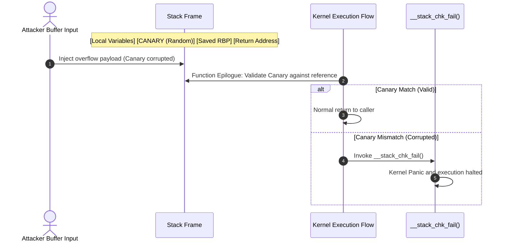

# Stack Protector (`CONFIG_STACKPROTECTOR_STRONG`)

Mechanism and hands-on verification of compiler-injected stack canaries protecting kernel function return addresses against buffer overflows.

---

## 1. Overview & Threat Model

- **Target Vulnerabilities**:
  - Stack-based buffer overflows.
  - Return address hijacking and control flow redirection (ROP/JOP).
- **Attack Scenario**:
  - Unbounded memory copies (`memcpy`, `strcpy`) into stack buffers overwrite the stored frame pointer (SFP) and return address.
  - Upon function epilogue, execution jumps to attacker-controlled gadgets or shellcode, leading to privilege escalation.

---

## 2. Architecture & Defense Mechanism



### Mechanism Breakdown

1. **Function Prologue**:
   - x86_64: Reads random value from `%gs:40` (Per-CPU stack canary) and places it immediately before the return address.
   - ARM64: Loads canary from `__stack_chk_guard` and places it at `[sp, offset]`.
2. **Function Epilogue**:
   - Compares the stack canary value with the master register reference via `xor`.
   - On mismatch, triggers immediate `__stack_chk_fail()` kernel panic.
3. **Trigger Criteria for `-fstack-protector-strong`**:
   - Applied to any function containing an array of any size, address references to local variables, or register references.

---

## 3. Configuration & Options

| Kconfig Symbol                 | Recommended              | Description                              |
| :----------------------------- | :----------------------- | :--------------------------------------- |
| `CONFIG_STACKPROTECTOR`        | `y`                      | Base stack canary infrastructure         |
| `CONFIG_STACKPROTECTOR_STRONG` | `y` (Recommended)        | Compiler flag `-fstack-protector-strong` |
| `CONFIG_STACKPROTECTOR_ALL`    | `n` (Performance impact) | Canary inserted into all functions       |

---

## 4. Hands-on Verification

Verification via LKDTM `CORRUPT_STACK` test trigger.

=== "x86_64: Hardened (Enabled)"

    ```bash
    ./scripts/run_qemu.sh --arch x86_64 --kernel build_dir/x86_64/arch/x86/boot/bzImage

    # Inside guest shell
    echo CORRUPT_STACK > /sys/kernel/debug/provoke-crash/DIRECT
    ```

    **Verification Log (Successful Interception)**:
    ```text
    [    2.104231] lkdtm: Performing direct entry CORRUPT_STACK
    [    2.105420] lkdtm: attempting bad stack write ...
    [    2.106102] Kernel panic - not syncing: stack-protector: Kernel stack is corrupted in: lkdtm_CORRUPT_STACK+0x4a/0x60
    [    2.107519] CPU: 0 PID: 68 Comm: sh Not tainted 6.12.0-hardened #1
    [    2.108421] Call Trace:
    [    2.108812]  <TASK>
    [    2.109152]  panic+0x140/0x310
    [    2.109632]  __stack_chk_fail+0x15/0x20
    [    2.110214]  lkdtm_CORRUPT_STACK+0x4a/0x60
    ```

=== "x86_64: Base (Disabled)"

    ```bash
    ./scripts/run_qemu.sh --arch x86_64 --kernel build_dir/x86_64-base/arch/x86/boot/bzImage

    echo CORRUPT_STACK > /sys/kernel/debug/provoke-crash/DIRECT
    ```

    **Verification Log (Uncontrolled Crash)**:
    ```text
    [    2.412102] lkdtm: Performing direct entry CORRUPT_STACK
    [    2.413204] lkdtm: attempting bad stack write ...
    [    2.414002] general protection fault, probably for non-canonical address 0x4141414141414141: 0000 [#1] PREEMPT SMP
    ```

=== "ARM64: Hardened (Enabled)"

    ```bash
    ./scripts/run_qemu.sh --arch arm64 --kernel build_dir/arm64/arch/arm64/boot/Image

    echo CORRUPT_STACK > /sys/kernel/debug/provoke-crash/DIRECT
    ```

    **Verification Log (ARM64 Kernel Panic)**:
    ```text
    [    2.302194] Kernel panic - not syncing: stack-protector: Kernel stack is corrupted in: lkdtm_CORRUPT_STACK+0x3c/0x50
    [    2.303102] CPU: 0 PID: 65 Comm: sh Not tainted 6.12.0-arm64-hardened #1
    [    2.304011] Call trace:
    [    2.304410]  panic+0x144/0x320
    [    2.304912]  __stack_chk_fail+0x18/0x24
    [    2.305411]  lkdtm_CORRUPT_STACK+0x3c/0x50
    ```

---

## 5. Performance & Overhead Analysis

- **CPU Overhead**: Measured under 0.5% in standard server workloads.
- **Binary Footprint**: Text segment size increases by approximately 1.5%.
- **Production Recommendation**: High-impact security benefit with negligible cost; recommended enabled across all production configurations.
