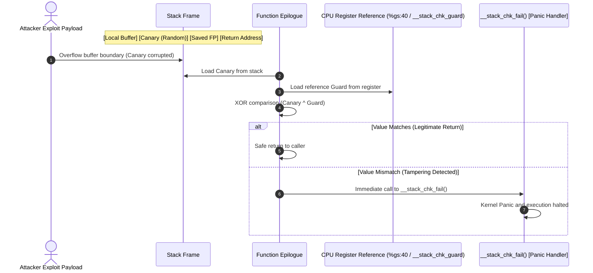

# Stack Protector (`CONFIG_STACKPROTECTOR_STRONG`)

In-depth mechanism analysis and hands-on verification of compiler-injected stack canaries protecting kernel function return addresses against buffer overflows.

---

## 1. Overview & Threat Model

- **Target Vulnerabilities**:
  - Stack-based buffer overflows.
  - Manipulation of saved frame pointers (SFP) and function return addresses (RIP / LR).
  - Return-Oriented Programming (ROP) gadget execution leading to Ring 0 privilege escalation.
- **Attack Scenario & Threat Vectors**:
  - Unbounded memory copy routines (`memcpy`, `strcpy`, off-by-one loop indexing) inside kernel drivers or system calls.
  - Attacker overwrites beyond the boundary of local arrays toward higher memory addresses.
  - When the function reaches its epilogue, execution branches to an attacker-controlled return address.

---

## 2. Architecture & Mechanism

### 2.1 Interactive System Map (Archify Diagram)

Use the interactive controls below to explore the **normal execution flow**, **buffer overflow defense sequence**, and **register differences between x86_64 and ARM64**:

<div class="archify-container">
  <iframe src="../../assets/diagrams/stack-protector/architecture.html" width="100%" height="450px" frameborder="0"></iframe>
</div>

---

### 2.2 Defense Sequence Diagram (Mermaid)



---

### 2.3 Architecture-Specific Assembly Implementation

#### (1) x86_64 Assembly Mechanism

The compiler reads a random value from the `%gs` segment register (Per-CPU storage offset `0x40`) during prologue and validates it during epilogue:

```nasm
; [x86_64 Function Prologue: Canary Insertion]
pushq   %rbp
movq    %rsp, %rbp
subq    $0x50, %rsp
movq    %gs:40, %rax          ; Load canary from Per-CPU segment
movq    %rax, -8(%rbp)        ; Store immediately before return address
xorl    %eax, %eax            ; Clear temporary register to prevent leak

; ... Function body execution ...

; [x86_64 Function Epilogue: Canary Verification]
movq    -8(%rbp), %rax        ; Load canary from stack
xorq    %gs:40, %rax          ; Compare with master canary
jne     .L_stack_chk_fail     ; Branch to failure handler if non-zero
leave
ret

.L_stack_chk_fail:
call    __stack_chk_fail      ; Trigger kernel panic
```

#### (2) ARM64 (aarch64) Assembly Mechanism

ARM64 loads the guard value from global symbol `__stack_chk_guard` and stores it relative to the stack pointer:

```nasm
; [ARM64 Function Prologue: Canary Insertion]
stp     x29, x30, [sp, -80]!  ; Save FP(x29) and LR(x30)
mov     x29, sp
adrp    x8, __stack_chk_guard
ldr     x8, [x8, :lo12:__stack_chk_guard]
str     x8, [sp, 72]          ; Store canary on stack

; ... Function body execution ...

; [ARM64 Function Epilogue: Canary Verification]
ldr     x9, [sp, 72]          ; Load canary from stack
subs    x8, x8, x9            ; Compare values
b.ne    .L_panic_branch       ; Branch on mismatch
ldp     x29, x30, [sp], 80    ; Restore registers and return
ret

.L_panic_branch:
bl      __stack_chk_fail      ; Call panic handler
```

---

### 2.4 Real-World ROP (Return-Oriented Programming) Chains & Buffer Overflow Mechanics

#### (1) Understanding ROP Through the Domino Effect Metaphor

Engineers studying Return-Oriented Programming (ROP) often find it intimidating due to complex assembly nuances and moving stack pointers. However, ROP can be understood intuitively as a **chain of falling dominoes**:

1. **Legitimate Function Call & Return (The Train Track)**:
   - When a program calls a function (`call`), the CPU places a return ticket (the Saved Return Address) onto the stack. When finished, the function executes `ret`, checks the return ticket, and returns safely to the caller.
2. **Buffer Overflow as Ticket Forgery**:
   - When an unprivileged user supplies input exceeding the allocated local buffer size, the data spills over adjacent stack memory, overwriting the saved return ticket with an attacker-controlled memory address.
3. **The ROP Chain Domino Effect**:
   - Modern kernels enforce W^X (Write XOR Execute / NX bit), preventing direct execution of injected shellcode on the stack.
   - To bypass this, attackers identify short existing sequences of machine instructions in the kernel code segment that end in a `ret` instruction. These snippets are called **Gadgets**.
   - Attackers line up these gadget addresses consecutively on the stack like dominoes.
   - When the vulnerable function finishes and executes `ret`, it triggers the first gadget. As that gadget finishes and executes `ret`, the stack pointer moves to the next 8 bytes, knocking down the next domino (gadget).
   - By chaining gadgets together, the attacker executes arbitrary Ring 0 operations—such as calling `commit_creds(&init_cred)` to achieve root privilege—without injecting any new executable code.

#### (2) Stack Memory Layout & Payload Structure

The diagram below illustrates the stack frame layout during a buffer overflow targeting the vulnerable kernel function (`/proc/vuln_stack`):

```text
[Lower Memory Addresses (Stack Top / Local Variables)]
+-------------------------------------------------------------+
| char stack_buffer[64] : 64-byte local buffer                |  <-- 'A' * 64 (Buffer Fill)
+-------------------------------------------------------------+
| [★] STACK CANARY      : 8-byte random secret (%gs:40 / ...) |  <-- 'B' * 8 (Corruption Target!)
+-------------------------------------------------------------+
| Saved Frame Pointer   : 8 bytes (x86_64: RBP / ARM64: x29)  |  <-- 'C' * 8 (FP Overwrite)
+-------------------------------------------------------------+
| Saved Return Address  : 8 bytes (x86_64: RIP / ARM64: x30)  |  <-- ROP Gadget #1 Address
+=============================================================+
| ROP Gadget #1 Argument: 8 bytes (e.g., &init_cred)          |  <-- Arg popped into register
+-------------------------------------------------------------+
| ROP Gadget #2 Address : 8 bytes (e.g., commit_creds)        |  <-- Elevates privilege to UID 0
+-------------------------------------------------------------+
| ROP Gadget #3 Address : 8 bytes (e.g., return to usermode)  |  <-- Spawns root shell
+-------------------------------------------------------------+
[Higher Memory Addresses (Stack Bottom / Caller Frame)]
```

#### (3) Architecture Comparison: x86_64 vs ARM64 (AArch64)

The two primary architectures handle subroutine calls and returns with distinct hardware conventions:

| Comparison Metric | x86_64 Architecture | ARM64 (AArch64) Architecture |
| :--- | :--- | :--- |
| **Return Instruction** | `ret` (Stack-based) | `ret` (Register-based) |
| **Return Target Storage** | Top of stack (Pops `(%rsp)` into `%rip`) | Link Register `x30` (`lr`) |
| **Stack Backup Mechanism** | Pushed automatically by CPU on `call` | Explicitly stored via `stp x29, x30, [sp, -N]!` in prologue |
| **Epilogue Restoration** | `leave; ret` | `ldp x29, x30, [sp], #N; ret` |
| **Calling Convention (1st Arg)** | `%rdi` register (System V AMD64 ABI) | `x0` register (AAPCS64 ABI) |
| **Gadget Primitive** | `pop %rdi; ret` | `ldr x0, [sp, ...]; ldp x29, x30, [sp], ...; ret` |
| **Return to Userspace** | `swapgs_restore_regs_and_return_to_usermode` / `iretq` | `ret_to_user` / `eret` |

- **x86_64 Attack Flow**:
  - `ret` immediately pops the value at `%rsp` into `%rip`. Overwriting the saved return address directly redirects the instruction pointer into a ROP gadget chain.
- **ARM64 Attack Flow**:
  - In ARM64, `ret` branches directly to register `x30` (`br x30`).
  - However, non-leaf functions (functions that call other functions) must preserve `x30` across calls by pushing FP (`x29`) and LR (`x30`) to the stack in their prologue.
  - When exiting, the epilogue executes `ldp x29, x30, [sp], #N` to restore the saved LR from the stack.
  - Therefore, overflowing the stack overwrites the saved copy of `x30`. When the epilogue restores it, `x30` receives the hijacked address, redirecting execution on the subsequent `ret`.

#### (4) The Canary Interception Point

- **Mandatory Precondition**:
  - To overwrite the saved return address (x86_64: RIP / ARM64: `x30`), any contiguous linear buffer overflow **must smash through the 8-byte stack canary** situated between the buffer and the return address.
- **Epilogue Verification Timing**:
  - The compiler-injected verification instructions (`xorq %gs:40, %rax` on x86_64, `subs x8, x8, x9` on ARM64) execute **prior to** the `ret` or `ldp x29, x30` instructions.
  - If the canary has been modified by even a single bit, the equality check fails and control branches immediately to `__stack_chk_fail()`.
  - The kernel halts execution instantly, preventing the CPU from ever executing the very first domino in the attacker's ROP gadget chain.

---

## 3. Configuration & Options (Kconfig)

### 3.1 GCC / Clang Compiler Protection Levels

| Flag                           | Target Functions                                                | Security Level         | Overhead            |
| :----------------------------- | :-------------------------------------------------------------- | :--------------------- | :------------------ |
| `-fno-stack-protector`         | Disabled                                                        | None                   | 0% (Baseline)       |
| `-fstack-protector`            | Functions with `char` arrays >= 8 bytes only                    | Low                    | < 0.1%              |
| **`-fstack-protector-strong`** | **Any array, or any local variable address reference (`&val`)** | **High (Recommended)** | **< 0.5%**          |
| `-fstack-protector-all`        | Every function regardless of structure                          | Extreme                | ~5-10% (Suboptimal) |

### 3.2 Linux Kernel Kconfig Configuration

```kconfig
# /configs/features/stack-protector.config
CONFIG_STACKPROTECTOR=y
CONFIG_STACKPROTECTOR_STRONG=y
# CONFIG_STACKPROTECTOR_ALL is not set
```

- `CONFIG_STACKPROTECTOR_STRONG=y` selectively protects functions with potential memory exposure while maintaining runtime overhead under 0.5%.

---

## 4. Hands-on Verification & Exploit PoC

This lab verifies defenses using both a **real-world kernel ROP Exploit PoC executed by an unprivileged user (`lab`, UID 1000) against `/proc/vuln_stack`** and LKDTM standard crash injections, contrasting behavior between Base and Hardened kernels:

1. **[Test 1/2] Real-World Kernel ROP Exploit PoC (`/bin/exploit_stack_protector`)**:
   - Executed as non-root `lab` (UID 1000), injecting an overflow payload (Canary corruption + Saved FP + Return Address / ROP chain) into the 64-byte stack buffer.
   - **Hardened Kernel**: Catches canary corruption immediately in the epilogue and panics via `__stack_chk_fail()`, preventing any ROP gadget execution.
   - **Base Kernel**: Lacks canaries; the return address is overwritten with `0x4141414141414141`, branching directly to attacker input and causing a General Protection Fault or executing ROP chains.
2. **[Test 2/2] In-Kernel LKDTM Standard Test (`CORRUPT_STACK`)**:
   - Secondary verification using the Linux Kernel Dump Test Module stack crash trigger.

---

### 4.1 One-Click Verification Commands & Runtime Logs

=== "x86_64: Hardened (Enabled: ROP Blocked - Recommended)"

    ```bash
    # Run Hardened kernel with ROP Exploit + LKDTM verification
    ./scripts/run_lab.sh --arch x86_64 --feature stack-protector --test test_stack_protector
    ```

    **Runtime Verification Log (ROP Entry Intercepted by Kernel Panic)**:
    ```text
    =========================================================
      [Test 1/2] Real-World Kernel ROP Exploit PoC
      Target:       /proc/vuln_stack (Stack Buffer Overflow)
      Exploit:      /bin/exploit_stack_protector
      Runner:       lab (UID 1000, non-privileged)
    =========================================================
    [*] Launching ROP payload against vulnerable kernel stack...
    [*] If Stack Protector Strong is active, kernel will panic here!

    =========================================================
      Linux Kernel Hardening Lab - Dual-Arch ROP Exploit PoC
      Target Architecture: x86_64
      Current User: UID = 1000 (non-root)
    =========================================================
    [*] Resolving essential kernel symbols from /proc/kallsyms...
        commit_creds: 0xffffffff8108cdb0
        init_cred:    0xffffffff8264e5c0
    [*] Saved userspace state: CS=0x33, SS=0x2b, SP=0x7ffebe27ca00, RFLAGS=0x246
    [*] Injecting 104 bytes payload into /proc/vuln_stack...
    [*] [Hardened Kernel Expected]: Canary corrupted -> Instant __stack_chk_fail panic.
    [*] [Vulnerable Kernel Expected]: Unbounded overwrite reaches Return Address.

    [    2.135245] vuln_stack: [vuln_stack] Received 104 bytes write from PID 73 (exploit_stack_p)
    [    2.136014] vuln_stack: [vuln_stack] Finished buffer copy (104 bytes), returning to caller...
    [    2.136709] Kernel panic - not syncing: stack-protector: Kernel stack is corrupted in: vuln_stack_write+0xcf/0xde
    [    2.137683] CPU: 0 UID: 1000 PID: 73 Comm: exploit_stack_p Not tainted 6.12.109 #1
    [    2.138379] Hardware name: QEMU Standard PC (i440FX + PIIX, 1996), BIOS 1.17.0-debian-1.17.0-1ubuntu1 04/01/2014
    [    2.139420] Call Trace:
    [    2.139682]  <TASK>
    [    2.139893]  dump_stack_lvl+0x60/0x80
    [    2.140263]  panic+0x140/0x310
    [    2.140590]  __stack_chk_fail+0x14/0x20
    [    2.140959]  vuln_stack_write+0xcf/0xde [vuln_stack]
    [    2.141443]  proc_reg_write+0x57/0xa0
    [    2.141804]  vfs_write+0xd2/0x450
    [    2.142131]  ksys_write+0x65/0xf0
    [    2.142475]  do_syscall_64+0x68/0x140
    [    2.142851]  entry_SYSCALL_64_after_hwframe+0x76/0x7e
    ```
    > **Analysis:** The payload injected by `lab` smashed through the canary to reach the return address. When the function epilogue executed `xorq %gs:40, %rax`, the mismatch was caught instantly, routing control into `__stack_chk_fail()` and safely halting the system before reading attacker gadget address `0x4141414141414141`.

=== "x86_64: Base (Disabled: Vulnerable)"

    ```bash
    # Run unprotected base kernel
    ./scripts/run_lab.sh --arch x86_64 --feature stack-protector-disabled --test test_stack_protector
    ```

    **Runtime Verification Log (Unchecked Overwrite & General Protection Fault)**:
    ```text
    =========================================================
      [Test 1/2] Real-World Kernel ROP Exploit PoC
      Target:       /proc/vuln_stack (Stack Buffer Overflow)
      Exploit:      /bin/exploit_stack_protector
      Runner:       lab (UID 1000, non-privileged)
    =========================================================
    [*] Launching ROP payload against vulnerable kernel stack...
    [*] Injecting 104 bytes payload into /proc/vuln_stack...
    [    2.104201] vuln_stack: [vuln_stack] Received 104 bytes write from PID 73 (exploit_stack_p)
    [    2.104910] vuln_stack: [vuln_stack] Finished buffer copy (104 bytes), returning to caller...
    [    2.105700] general protection fault, probably for non-canonical address 0x4141414141414141: 0000 [#1] PREEMPT SMP
    [    2.106912] RIP: 0010:0x4141414141414141
    [    2.107401] RSP: 0018:ffffc900001f3e30 EFLAGS: 00010246
    [    2.107902] RAX: 0000000000000068 RBX: ffff888004f21000 RCX: 0000000000000000
    [    2.108510] RDX: 0000000000000000 RSI: ffffc900001f3e40 RDI: ffff888004f21000
    ```
    > **Analysis:** Lacking canaries, the buffer overflow directly rewrote the return address on the stack to `0x4141414141414141`. The CPU popped this corrupted value into `%rip` upon `ret`, resulting in a GPF crash. With valid gadget addresses, an attacker would attain complete control over kernel execution.

=== "ARM64: Hardened (Enabled: ROP Blocked)"

    ```bash
    # Run ARM64 Hardened kernel
    ./scripts/run_lab.sh --arch arm64 --feature stack-protector --test test_stack_protector
    ```

    **Runtime Verification Log (ARM64 Epilogue Subtraction & Panic Defense)**:
    ```text
    =========================================================
      [Test 1/2] Real-World Kernel ROP Exploit PoC
      Target:       /proc/vuln_stack (Stack Buffer Overflow)
      Exploit:      /bin/exploit_stack_protector
      Runner:       lab (UID 1000, non-privileged)
    =========================================================
    [*] Launching ROP payload against vulnerable kernel stack...
    [*] If Stack Protector Strong is active, kernel will panic here!

    =========================================================
      Linux Kernel Hardening Lab - Dual-Arch ROP Exploit PoC
      Target Architecture: arm64 (aarch64)
      Current User: UID = 1000 (non-root)
    =========================================================
    [*] Resolving essential kernel symbols from /proc/kallsyms...
        commit_creds: 0xffff8000800c14e0
        init_cred:    0xffff800081d58300
    [*] Building ARM64 ROP/JOP payload layout...
    [*] Injecting 96 bytes payload into /proc/vuln_stack...
    [*] [Hardened Kernel Expected]: Canary corrupted -> Instant __stack_chk_fail panic.
    [*] [Vulnerable Kernel Expected]: Unbounded overwrite reaches Return Address.

    [    2.418192] vuln_stack: [vuln_stack] Received 96 bytes write from PID 73 (exploit_stack_p)
    [    2.419012] vuln_stack: [vuln_stack] Finished buffer copy (96 bytes), returning to caller...
    [    2.419782] Kernel panic - not syncing: stack-protector: Kernel stack is corrupted in: vuln_stack_write+0x168/0x168
    [    2.420791] CPU: 1 UID: 1000 PID: 73 Comm: exploit_stack_p Not tainted 6.12.109 #1
    [    2.421480] Hardware name: linux,dummy-virt (DT)
    [    2.421921] Call trace:
    [    2.422170]  dump_backtrace.part.0+0xe0/0xec
    [    2.422581]  show_stack+0x18/0x24
    [    2.422910]  dump_stack_lvl+0x60/0x80
    [    2.423270]  dump_stack+0x18/0x24
    [    2.423599]  panic+0x160/0x33c
    [    2.423910]  __stack_chk_fail+0x18/0x24
    [    2.424290]  vuln_stack_write+0x168/0x168 [vuln_stack]
    [    2.424780]  proc_reg_write+0x64/0xa4
    [    2.425140]  vfs_write+0xd0/0x458
    [    2.425480]  ksys_write+0x70/0x108
    [    2.425810]  __arm64_sys_write+0x1c/0x2c
    [    2.426210]  invoke_syscall+0x48/0x114
    [    2.426590]  el0_svc_common.constprop.0+0x40/0xe0
    [    2.427050]  do_el0_svc+0x1c/0x28
    [    2.427380]  el0_svc+0x34/0xd8
    [    2.427690]  el0t_64_sync_handler+0x120/0x12c
    [    2.428110]  el0t_64_sync+0x190/0x194
    ```
    > **Analysis:** On ARM64, the epilogue's `subs x8, x8, x9` detected stack canary corruption before restoring `x30` via `ldp x29, x30, [sp], #N`. Control branched immediately to `__stack_chk_fail()`, neutralizing the threat before arbitrary control flow hijacking could take place.

=== "ARM64: Base (Disabled: Vulnerable)"

    ```bash
    # Run ARM64 Base kernel
    ./scripts/run_lab.sh --arch arm64 --feature stack-protector-disabled --test test_stack_protector
    ```

    **Runtime Verification Log (Overwritten x30 Register & Instruction Abort)**:
    ```text
    =========================================================
      [Test 1/2] Real-World Kernel ROP Exploit PoC
    =========================================================
    [*] Injecting 96 bytes payload into /proc/vuln_stack...
    [    2.315021] Unable to handle kernel paging request at virtual address 4141414141414141
    [    2.315910] Mem abort info:
    [    2.316210]   ESR = 0x0000000086000004
    [    2.316620]   EC = 0x21: Instruction Abort, current EL
    [    2.317110] pc : 0x4141414141414141 lr : 0x4141414141414141
    ```
    > **Analysis:** Without stack protection, the saved link register `x30` on the stack was overwritten with `0x4141414141414141`. When the epilogue restored `x30` and executed `ret`, the CPU attempted to fetch instructions from the corrupted address, triggering a fatal Instruction Abort exception.

---

## 5. Performance & Overhead Analysis

- **CPU Overhead**: Measured under **0.3% ~ 0.5%** in standard Linux server and I/O workloads.
- **Binary Size Impact**: Kernel `.text` segment grows by approximately **1.2% ~ 1.5%**.
- **Production Recommendation**: High-impact mitigation with negligible cost; strongly recommended as a mandatory baseline across cloud, server, Android, and embedded deployments.

---

## 6. Lecture & Presentation Script (English Speaking Practice)

This section provides a realistic first-person presentation script and essential technical speaking phrases for engineering seminars, technical interviews, and conference talks.

### 6.1 Full Speaking Script

#### Part 1: Opening Hook & Problem Statement

> "Hello everyone. Today, let's take a deep dive into one of the most fundamental yet critical defenses in the Linux kernel: **Stack Protector Strong**, or `CONFIG_STACKPROTECTOR_STRONG`."
>
> "Many engineers find Return-Oriented Programming, or ROP, intimidating because of complex stack movements and gadget chains. But if you strip away the jargon, ROP is essentially a chain of falling dominoes. When an unprivileged local user exploits an unbounded stack copy in a kernel driver, they smash through the stack to overwrite the function's return address."
>
> "In Ring 0, that manipulated return address triggers a domino effect of short machine code snippets—ROP gadgets ending in `ret`—that ultimately call `commit_creds(&init_cred)` to elevate the process to root. So the million-dollar question is: how can the kernel cleanly cut this domino chain before the very first domino falls?"

#### Part 2: Diagram & Architecture Walkthrough

> "If you look at our interactive architecture map above, notice where the **Stack Canary** sits. It is strategically placed right between the local buffer and the saved frame pointer."
>
> "Here is how it works under the hood: during the function prologue, the compiler inserts assembly instructions that fetch a random 64-bit secret from a protected CPU register—specifically `%gs:40` on x86_64, or `__stack_chk_guard` on ARM64—and places it right onto the stack."
>
> "Now examine the epilogue. Right before the function executes `ret` on x86_64, or restores the Link Register `x30` on ARM64, the CPU loads that canary from the stack and validates it against the original register value. If an attacker overflowed the buffer, that canary is guaranteed to be corrupted. The comparison fails, and instead of jumping into the attacker's ROP chain, the kernel immediately jumps to `__stack_chk_fail()`, triggering a kernel panic and halting execution on the spot."

#### Part 3: Live Demo Commentary

> "Let's see this in action in our QEMU environment. We built a dual test suite: Test 1 runs a real-world C exploit PoC as an unprivileged user `lab`, and Test 2 triggers LKDTM's `CORRUPT_STACK`."
>
> "First, look at the unprotected Base kernel. When user `lab` writes a 104-byte payload into `/proc/vuln_stack`, the return address is overwritten with `0x4141414141414141`. The kernel executes `ret` and instantly crashes with a General Protection Fault at that exact address. If this were a weaponized exploit, the attacker would have full control over the execution flow."
>
> "Now look at our Hardened kernel running with `CONFIG_STACKPROTECTOR_STRONG=y`. On both x86_64 and ARM64, the moment the payload hits the stack, the epilogue catches the canary corruption: `Kernel panic - not syncing: stack-protector: Kernel stack is corrupted in: vuln_stack_write`. The canary intercepted the buffer overflow, neutralizing the ROP attack before the CPU could execute a single gadget."

#### Part 4: Key Takeaways & Production Advice

> "To wrap up: why do we specifically enforce `-fstack-protector-strong` instead of `-all`? Because `-strong` intelligently targets functions with local buffers or variable address references. This delivers virtually identical security coverage as `-all`, but keeps CPU overhead under 0.5%."
>
> "In modern production environments—from cloud hypervisors to Android smartphones—this is an absolute, non-negotiable baseline defense. Thank you."

---

### 6.2 Key Presentation Phrases & Speaking Patterns

| Intent / Context | Recommended Spoken Phrase | Usage & Delivery Notes |
| :--- | :--- | :--- |
| **Breaking the Exploit Chain** | *"cut the domino chain before the first domino falls"* | Vivid metaphor explaining how canaries preempt ROP gadgets. |
| **Transitioning to Architecture** | *"Under the hood, ..."* / *"If we look under the hood..."* | Natural transition when moving into low-level internals or assembly. |
| **Describing Memory Corruption** | *"smash through ~"* / *"overwrite the return address"* | Vivid, idiomatic description of buffer overflows bypassing boundaries. |
| **Emphasizing Immediate Mitigation** | *"halt execution on the spot"* / *"intercept the attack"* | Highlights the immediate fail-safe nature of the panic handler. |
| **Discussing Engineering Decisions** | *"When considering the trade-offs..."* | Effective segue when weighing CPU overhead against security benefits. |
| **Concluding with Strong Recommendation** | *"an absolute, non-negotiable baseline defense"* | Authoritative closing statement for production readiness. |

