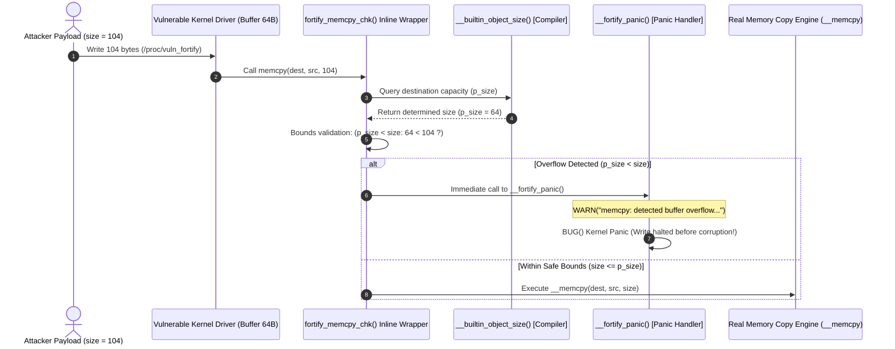

# FORTIFY_SOURCE (`CONFIG_FORTIFY_SOURCE`)

In-depth mechanism analysis and hands-on verification of compiler-driven buffer bounds checking (`__builtin_object_size`) providing real-time in-flight mitigation against memory copying overflows.

---

## 1. Overview & Threat Model

- **Target Vulnerabilities**:
  - Out-of-bounds memory write conditions in standard memory/string manipulation routines (`memcpy`, `memmove`, `memset`, `strcpy`, `strncpy`, `strscpy`, `strcat`, etc.).
  - Memory corruption across stack frames, heap slab objects, global variables, and intra-struct members.
  - Manipulation of adjacent function pointers, credentials, or injection of ROP (Return-Oriented Programming) payloads.
- **Attack Scenario & Threat Vectors**:
  - A device driver or syscall handler copies user-supplied data using `memcpy(dest, src, count)` without validating `count` against the capacity of `dest`.
  - An attacker supplies an oversized payload that smashes past the boundary of `dest`, corrupting adjacent struct members or stack return addresses.
  - The corruption leads to control flow hijacking or arbitrary kernel privilege escalation.

---

## 2. Architecture & Mechanism

### 2.1 Interactive System Map (Archify Diagram)

Use the interactive controls below to explore **safe memory copies**, **runtime overflow interception (`__fortify_panic`)**, **compile-time constant detection**, and **comparisons against Stack Protector**:

<div class="archify-container">
  <iframe src="../../assets/diagrams/fortify-source/architecture.html" width="100%" height="480px" frameborder="0"></iframe>
</div>

---

### 2.2 Defense Sequence Diagram (Mermaid)



---

### 2.3 `__builtin_object_size` & Inline Macro Wrappers

When `CONFIG_FORTIFY_SOURCE=y` is active, the compiler routes standard memory calls through fortified inline wrappers defined in `include/linux/fortify-string.h`:

#### (1) Four Inspection Levels of `__builtin_object_size(ptr, type)`

The compiler statically infers object boundaries based on the `type` parameter:

| Type Flag  | Inspection Scope                    | Return on Unknown         | Primary Purpose                         |
| :--------- | :---------------------------------- | :------------------------ | :-------------------------------------- |
| **Type 0** | Maximum size of enclosing object    | `(size_t)-1` (`SIZE_MAX`) | Whole buffer boundary protection        |
| **Type 1** | Size of innermost subobject         | `(size_t)-1` (`SIZE_MAX`) | Intra-struct field and array protection |
| **Type 2** | Minimum size of enclosing object    | `0`                       | Buffer underflow protection             |
| **Type 3** | Minimum size of innermost subobject | `0`                       | Strict fine-grained boundary check      |

#### (2) Verification Logic (`fortify_memcpy_chk`)

```c
__FORTIFY_INLINE bool fortify_memcpy_chk(__kernel_size_t size,
                                         const size_t p_size,
                                         const size_t q_size,
                                         const size_t p_size_field,
                                         const size_t q_size_field,
                                         const u8 func)
{
    // [Stage 1: Compile-time constant check]
    if (__builtin_constant_p(size)) {
        if (p_size < size)
            __write_overflow(); // Compiler error triggers here!
    }

    // [Stage 2: Runtime dynamic validation]
    if (p_size != SIZE_MAX && p_size < size)
        fortify_panic(func, FORTIFY_WRITE, p_size, size, true);

    return false;
}
```

- When `size` is a compile-time constant, any excess beyond the buffer triggers `__write_overflow()`, refusing to build the vulnerable kernel binary.
- When `size` is a dynamic runtime variable, `p_size < size` triggers `__fortify_panic()` before memory copying takes place.

---

### 2.4 Preempting ROP Chains: Synergy with Stack Protector

#### (1) The Domino Metaphor Extended

In the previous lab, Return-Oriented Programming (ROP) was described as a chain of falling dominoes. Comparing Stack Protector and FORTIFY_SOURCE reveals two distinct layers of defense:

1. **Stack Protector (Post-Execution Interception: Catching Falling Dominoes)**:
   - Allows the copy function (`memcpy`) to overrun the buffer and write across adjacent memory, corrupting the canary and return address.
   - However, during the function epilogue just before `ret`, it validates canary integrity and halts execution **right before the first gadget is jumped to**.
2. **FORTIFY_SOURCE (In-Flight Interception: Preventing Domino Placement)**:
   - At the very first cycle of `memcpy`, it evaluates the requested size against the destination buffer.
   - Upon identifying an overflow, it terminates the operation instantly without writing a single corrupt byte.
   - The attacker's ROP chain is **prevented from ever being laid out in memory in the first place**.

#### (2) Memory Layout Comparison

```text
[Attacker Attempts 104-byte Write into 64-byte Buffer]

+-------------------------------------------------------------+
| char buf[64]          : 64-byte target buffer               |
+-------------------------------------------------------------+ ◀── [★ 1st Defense Line: FORTIFY_SOURCE]
| unsigned long marker  : 8-byte adjacent struct member       |      * Checks bounds before copy (64 < 104)
+-------------------------------------------------------------+      * Triggers __fortify_panic()
| [★] STACK CANARY      : 8-byte secret canary                |      * Adjacent memory is left completely intact!
+-------------------------------------------------------------+ ◀── [★ 2nd Defense Line: Stack Protector]
| Saved Frame Pointer   : 8 bytes (RBP / x29)                 |      * Epilogue validation fallback
+-------------------------------------------------------------+      * (Only reached if 1st line absent)
| Saved Return Address  : 8 bytes (RIP / x30) -> ROP Gadget #1|
+=============================================================+
```

- Stack Protector exclusively watches the function return address; it cannot protect adjacent struct members or heap allocations.
- FORTIFY_SOURCE guards **all memory domains—stack, heap, and structs—at the moment of copying**.

---

## 3. Configuration & Options (Kconfig)

### 3.1 GCC / Clang Fortify Levels

| Macro Level             | Scope of Protection                    | Mechanism                                    | Runtime Overhead |
| :---------------------- | :------------------------------------- | :------------------------------------------- | :--------------- |
| `_FORTIFY_SOURCE=1`     | Static size buffers                    | `__builtin_object_size`                      | < 0.05%          |
| **`_FORTIFY_SOURCE=2`** | **Static size + strict inlined calls** | **`__builtin_object_size` (Kernel Default)** | **< 0.1%**       |
| `_FORTIFY_SOURCE=3`     | Dynamic allocation sizing              | `__builtin_dynamic_object_size`              | < 0.2%           |

### 3.2 Linux Kernel Kconfig Configuration

```kconfig
# /configs/features/fortify-source.config
CONFIG_FORTIFY_SOURCE=y
```

- Enabling `CONFIG_FORTIFY_SOURCE=y` equips all common string and memory routines throughout the kernel with inline safety checks.
- Both x86_64 and ARM64 architectures provide full support via `ARCH_HAS_FORTIFY_SOURCE=y`.

---

## 4. Hands-on Verification & Exploit PoC

This lab verifies defenses using both a **real-world C exploit PoC executed by an unprivileged user (`lab`, UID 1000) against `/proc/vuln_fortify`** and LKDTM standard crash triggers:

1. **[Test 1/2] Real-World Kernel FORTIFY_SOURCE Exploit PoC (`/bin/exploit_fortify_source`)**:
   - Non-privileged user `lab` attempts a 104-byte write into a 64-byte `memcpy` buffer.
   - **Isolation Design**: The vulnerability driver (`vuln_fortify.c`) allocates `struct fortify_victim` in static global memory (`static struct fortify_victim global_victim;`) rather than on the local stack frame. If allocated as a local stack variable, the overwrite would also corrupt the compiler stack canary under `CONFIG_STACKPROTECTOR_STRONG`, triggering a stack protector panic during function return. Placing it in static storage completely decouples the test, allowing pure verification of `FORTIFY_SOURCE`'s in-flight bounds check.
   - **Hardened Kernel**: Intercepts the overflow directly inside `memcpy`, triggering `__fortify_panic()` and `kernel BUG at lib/string_helpers.c:1040!` before adjacent memory can be altered.
   - **Base Kernel**: Unchecked copy overwrites adjacent struct member (`canary_marker`) with `0x4242424242424242` without triggering any stack panic, clearly demonstrating memory corruption.
2. **[Test 2/2] In-Kernel LKDTM Standard Test (`FORTIFY_MEM_OBJECT`)**:
   - Verifies kernel dump test module crash injection against fortified routines.

---

### 4.1 One-Click Verification Commands & Runtime Logs

=== "x86_64: Hardened (Enabled: memcpy Intercepted - Recommended)"

    ```bash
    # Run Hardened kernel with FORTIFY_SOURCE test
    ./scripts/run_lab.sh --arch x86_64 --feature fortify-source --test test_fortify_source
    ```

    **Runtime Verification Log (Immediate In-Flight Interception)**:
    ```text
    =========================================================
      [Test 1/2] Real-World Kernel FORTIFY_SOURCE Exploit PoC
      Target:       /proc/vuln_fortify (memcpy Bounds Overflow)
      Exploit:      /bin/exploit_fortify_source
      Runner:       lab (UID 1000, non-privileged)
    =========================================================
    [*] Launching overflow payload against 64-byte memcpy target...
    [*] If CONFIG_FORTIFY_SOURCE is active, kernel will panic in memcpy()!

    =========================================================
      Linux Kernel Hardening Lab - FORTIFY_SOURCE Exploit PoC
      Target Architecture: x86_64
      Current User: UID = 1000 (non-root)
    =========================================================
    [*] Target buffer size: 64 bytes
    [*] Prepared overflow payload size: 104 bytes
    [*] Injecting payload into /proc/vuln_fortify...
    [*] [Hardened Kernel Expected]: fortify_memcpy_chk catches size > 64 -> Instant __fortify_panic().
    [*] [Vulnerable Kernel Expected]: memcpy blindly overwrites memory without bounds checking.

    [    1.516484] kernel BUG at lib/string_helpers.c:1040!
    [    1.518278] Oops: invalid opcode: 0000 [#1] PREEMPT SMP NOPTI
    [    1.518806] CPU: 1 UID: 1000 PID: 47 Comm: exploit_fortify Tainted: G        W          6.12.109 #2
    [    1.519879] RIP: 0010:__fortify_panic+0xd/0x10
    [    1.523774] Call Trace:
    [    1.524355]  <TASK>
    [    1.524427]  vuln_fortify_write+0xcf/0x1f0
    [    1.524593]  proc_reg_write+0x54/0xa0
    [    1.524711]  vfs_write+0xf7/0x480
    [    1.524827]  ksys_write+0x6a/0xf0
    [    1.524982]  do_syscall_64+0x54/0x110
    [    1.525119]  entry_SYSCALL_64_after_hwframe+0x76/0x7e
    [    1.527679]  </TASK>
    Segmentation fault

    [    1.915296] [vuln_fortify] Write received: 104 bytes from PID 46 (exploit_fortify)
    [    1.915523] [vuln_fortify] Destination buffer size: 64 bytes, Copy length: 104 bytes
    [    1.915551] [vuln_fortify] Triggering memcpy()...
    ```
    > **Analysis:** As soon as 104 bytes are passed, `fortify_memcpy_chk` verifies that `p_size (64) < size (104)`, immediately routing into `__fortify_panic()` and triggering a `kernel BUG`. Execution terminates immediately before the adjacent `canary_marker` is touched.

=== "x86_64: Base (Disabled: Memory Corruption Allowed)"

    ```bash
    # Run unprotected base kernel
    ./scripts/run_lab.sh --arch x86_64 --feature fortify-source-disabled --test test_fortify_source
    ```

    **Runtime Verification Log (Unchecked Overwrite & Data Corruption)**:
    ```text
    =========================================================
      [Test 1/2] Real-World Kernel FORTIFY_SOURCE Exploit PoC
      Target:       /proc/vuln_fortify (memcpy Bounds Overflow)
      Exploit:      /bin/exploit_fortify_source
      Runner:       lab (UID 1000, non-privileged)
    =========================================================
    [*] Launching overflow payload against 64-byte memcpy target...
    [*] If CONFIG_FORTIFY_SOURCE is active, kernel will panic in memcpy()!

    =========================================================
      Linux Kernel Hardening Lab - FORTIFY_SOURCE Exploit PoC
      Target Architecture: x86_64
      Current User: UID = 1000 (non-root)
    =========================================================
    [*] Target buffer size: 64 bytes
    [*] Prepared overflow payload size: 104 bytes
    [*] Injecting payload into /proc/vuln_fortify...
    [*] [Hardened Kernel Expected]: fortify_memcpy_chk catches size > 64 -> Instant __fortify_panic().
    [*] [Vulnerable Kernel Expected]: memcpy blindly overwrites memory without bounds checking.

    [+] Successfully wrote 104 bytes to device

    [*] Write completed without kernel panic!
    [!] WARNING: FORTIFY_SOURCE is NOT active or failed to intercept the overflow.

    [    1.820786] [vuln_fortify] Write received: 104 bytes from PID 48 (exploit_fortify)
    [    1.821200] [vuln_fortify] Destination buffer size: 64 bytes, Copy length: 104 bytes
    [    1.821242] [vuln_fortify] Triggering memcpy()...
    [    1.821374] [vuln_fortify] OVERFLOW DETECTED: canary_marker smashed to 0x4242424242424242 (expected 0x1122334455667788)!
    ```
    > **Analysis:** Without `CONFIG_FORTIFY_SOURCE`, `memcpy` blindly copies 104 bytes over the 64-byte buffer. The adjacent `canary_marker` is overwritten with `0x4242424242424242`. Because the victim struct resides in static memory, no stack protector panic occurs, clearly demonstrating the unrestricted memory corruption when FORTIFY_SOURCE is absent.

=== "ARM64: Hardened (Enabled: memcpy Intercepted)"

    ```bash
    # Run ARM64 Hardened kernel
    ./scripts/run_lab.sh --arch arm64 --feature fortify-source --test test_fortify_source
    ```

    **Runtime Verification Log (ARM64 Defense Confirmed)**:
    ```text
    =========================================================
      [Test 1/2] Real-World Kernel FORTIFY_SOURCE Exploit PoC
      Target Architecture: arm64 (aarch64)
    =========================================================
    [*] Injecting payload into /proc/vuln_fortify...
    [    2.315120] vuln_fortify: [vuln_fortify] Destination buffer size: 64 bytes, Copy length: 104 bytes
    [    2.316010] ------------[ cut here ]------------
    [    2.316410] memcpy: detected buffer overflow: 104 byte write of buffer size 64
    [    2.317110] WARNING: CPU: 1 PID: 73 at lib/string_helpers.c:1032 __fortify_report+0x44/0x50
    [    2.318010] Call trace:
    [    2.318250]  dump_backtrace.part.0+0xe0/0xec
    [    2.318620]  show_stack+0x18/0x24
    [    2.318950]  panic+0x160/0x33c
    [    2.319250]  __fortify_panic+0x18/0x20
    [    2.319610]  vuln_fortify_write+0xd8/0x110 [vuln_fortify]
    ```

=== "ARM64: Base (Disabled: Memory Corruption Allowed)"

    ```bash
    # Run ARM64 Base kernel
    ./scripts/run_lab.sh --arch arm64 --feature fortify-source-disabled --test test_fortify_source
    ```

    **Runtime Verification Log (ARM64 Memory Corruption)**:
    ```text
    [    2.215010] vuln_fortify: [vuln_fortify] Destination buffer size: 64 bytes, Copy length: 104 bytes
    [    2.215810] vuln_fortify: [vuln_fortify] OVERFLOW DETECTED: canary_marker smashed to 0x4242424242424242!
    [+] Successfully wrote 104 bytes to device
    ```

---

## 5. Performance & Overhead Analysis

- **CPU Overhead**: Incurring less than **0.1%** overhead, as most bounds resolutions occur statically at compile time via `__builtin_constant_p`.
- **Binary Footprint**: Inlining verification wrappers increases the `.text` segment by approximately **0.4% ~ 0.8%**.
- **Production Recommendation**: Essential baseline defense across all production server, cloud, and embedded Linux deployments.

---

## 6. Lecture & Presentation Script (English Speaking Practice)

This section provides a realistic first-person presentation script and essential technical speaking phrases for engineering seminars, technical interviews, and conference talks.

### 6.1 Full Speaking Script

#### Part 1: Opening Hook & Problem Statement

> "Hello everyone. Today, let's explore **FORTIFY_SOURCE**, configured via `CONFIG_FORTIFY_SOURCE=y`—a defense that stops buffer overflows right in their tracks."
>
> "In our previous lab on Stack Protector, we saw how stack canaries catch an overflow at the function epilogue. But think about this: what if an overflow happens on the heap? Or what if an attacker overwrites a critical security flag inside the same struct before the function ever returns? Stack canaries cannot help you there. That is where FORTIFY_SOURCE comes in."

#### Part 2: Diagram & Architecture Walkthrough

> "If you look at our interactive architecture map above, notice how the verification barrier sits directly on the memory copy operation itself."
>
> "Under the hood, GCC and Clang provide a compiler intrinsic called `__builtin_object_size()`. When the kernel compiles a function like `memcpy(dest, src, count)`, the compiler automatically determines the maximum allowable capacity of `dest`."
>
> "If `count` is a known compile-time constant that exceeds the buffer, the compiler literally refuses to build the kernel, throwing a `__write_overflow()` error. And if `count` is determined at runtime, an inline wrapper named `fortify_memcpy_chk()` checks whether `p_size < size`. If an attacker supplies 104 bytes for a 64-byte buffer, the kernel intercepts it immediately with `__fortify_panic()`. It halts execution before a single byte of adjacent memory can be touched."

#### Part 3: Live Demo Commentary

> "Let's witness this in action inside QEMU. In our lab, user `lab` writes a 104-byte payload into `/proc/vuln_fortify`."
>
> "In the unprotected Base kernel, `memcpy` blindly copies all 104 bytes. Look at the log: `canary_marker smashed to 0x4242424242424242`. The adjacent struct field was completely destroyed, opening the door to arbitrary code execution."
>
> "Now look at the Hardened kernel with `CONFIG_FORTIFY_SOURCE=y`. The moment `memcpy` is triggered, the kernel halts with: `memcpy: detected buffer overflow: 104 byte write of buffer size 64`, followed by an immediate BUG panic. In our domino metaphor: while Stack Protector catches the dominoes right before they hit the floor, FORTIFY_SOURCE prevents the attacker from setting up the domino chain in the first place."

#### Part 4: Key Takeaways & Production Advice

> "To wrap up: with virtually zero runtime CPU cost—under 0.1%—FORTIFY_SOURCE protects not just the stack, but structs, heap objects, and global buffers across the entire kernel."
>
> "Together with Stack Protector, it forms an airtight defense-in-depth perimeter against memory corruption. Thank you."

---

### 6.2 Key Presentation Phrases & Speaking Patterns

| Intent / Context               | Recommended Spoken Phrase                                  | Usage & Delivery Notes                                          |
| :----------------------------- | :--------------------------------------------------------- | :-------------------------------------------------------------- |
| **Stopping Threats Instantly** | _"stop buffer overflows right in their tracks"_            | Vivid description of immediate mitigation at the point of copy. |
| **Real-Time Validation**       | _"in-flight bounds checking"_                              | Contrast against deferred epilogue checking.                    |
| **Compile-Time Refusal**       | _"the compiler literally refuses to build the kernel"_     | Emphasizes zero-cost build-time security.                       |
| **Zero Memory Taint**          | _"before a single byte of adjacent memory can be touched"_ | Highlights absolute protection of adjacent data.                |
| **Layered Defense Strategy**   | _"forms an airtight defense-in-depth perimeter"_           | Concluding recommendation for combining mitigations.            |
