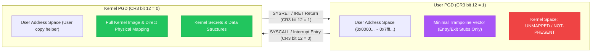

# Task 5-5: KPTI (Kernel Page Table Isolation & Meltdown Mitigation)

## 1. Overview

### 1.1 Definition and Core Objective
- **KPTI (Kernel Page Table Isolation)**: A core Linux kernel memory isolation defense that unmaps kernel memory from user-space page tables when executing in user mode, enforcing complete separation between user and kernel address spaces.
- **Primary Attack Vectors Defended**:
  - **Meltdown (CVE-2017-5754, Rogue Data Cache Load)**: Completely eliminates microarchitectural attacks that exploit out-of-order speculative execution and delayed MMU permission checks to leak kernel memory via cache side channels.
  - **Kernel Address Space Leakage (KASLR Bypass Mitigation)**: Prevents user-mode code from observing kernel page table entries (PTEs) or deriving kernel layout via cache timing.
- **Target Architectures**:
  - `x86_64`: `CONFIG_MITIGATION_PAGE_TABLE_ISOLATION=y`, `boot_cpu_has(X86_FEATURE_PTI)`, boot parameters `pti=on` / `pti=off`.
  - `arm64`: `CONFIG_UNMAP_KERNEL_AT_EL0=y` (KAISER / ARM64 KPTI), `arm64_kernel_unmapped_at_el0()`, boot parameters `kpti=on` / `kpti=off`.

```mermaid
flowchart TD
    subgraph PreKPTI["Pre-KPTI (Unified Page Table - Vulnerable)"]
        A1["User Space Execution (Ring 3 / EL0)"]
        B1["Single PGD (Shared Virtual Address Space)"]
        C1["Kernel Memory Mapped (Protected only by U=0 flag)"]
        D1["Out-of-Order Speculation (Meltdown) ➔ L1D Cache Leakage"]
        A1 --> B1
        B1 --> C1
        C1 -.->|Speculative Read Permitted| D1
    end

    subgraph PostKPTI["KPTI (Dual PGD / Split Page Table - Hardened)"]
        A2["User Space Execution (Ring 3 / EL0)"]
        B2["User-Mode PGD (CR3 bit 12 = 1 / Trampoline TTBR1)"]
        C2["Kernel Space Completely Unmapped (Not-Present)"]
        D2["Speculation Attempt ➔ Faults with No Translation (Blocked)"]
        A2 --> B2
        B2 --> C2
        C2 -->|No Physical Translation| D2
    end

    classDef danger fill:#ef4444,stroke:#dc2626,color:#fff;
    classDef safe fill:#22c55e,stroke:#16a34a,color:#fff;
    class D1 danger;
    class D2 safe;
```



---

### 1.2 Real-World Metaphor
> **"Segregated Classified Archives and Public Reading Rooms"**
>
> - **Pre-KPTI (Unified Table)**: A top-secret government archive placed inside a public library behind a transparent glass window. A "Restricted Personnel Only" sign hangs on the door, but a determined trespasser (out-of-order speculation) can glance through the glass before guards respond and jot down classified secrets in their personal notebook (CPU L1D cache).
> - **KPTI (Split Table)**: Public visitors (user space) are admitted only into a separate building where classified documents do not exist at all. The central vault containing classified files (kernel space) is unlocked with a special master key (Kernel PGD) only after an official passes through a fortified airlock checkpoint (trampoline system call entry). Even with high-powered binoculars, visitors cannot glimpse any secrets because the documents are physically absent from the room.

---

## 2. Technical Deep Dive

### 2.1 The Mechanics of Meltdown (CVE-2017-5754)
1. **Out-of-Order Execution**: High-performance superscalar processors execute instructions as soon as their operands are ready, regardless of program order, to keep execution pipelines saturated.
2. **The Transient Window**:
   ```c
   // User-mode code executed in Ring 3
   char secret = *(char *)kernel_secret_address; // Step 1: Unauthorized read (will trigger MMU #PF)
   char dummy  = probe_array[secret * 4096];     // Step 2: Access user array using secret as index
   ```
   - The CPU handles the page fault (`#PF`) only when the faulting instruction reaches the retirement/commit stage.
   - Before the exception commits, the processor transiently fetches `secret` into an internal temporary register and loads the corresponding cache line of `probe_array` into the L1D cache.
   - Although the architectural register state is discarded upon exception delivery, the **microarchitectural change in the L1D cache persists**.
3. **Flush+Reload Reconstruction**:
   - The attacker flushes `probe_array[0..255 * 4096]` from cache beforehand (`clflush`).
   - After handling or suppressing the exception, the attacker measures the access latency of all 256 pages using high-precision timers (`rdtsc`).
   - The cache line with low access latency (< 80 cycles) reveals the secret byte value.

---

### 2.2 Dual PGD (Page Global Directory) Architecture

The foundational concept of KPTI is simple yet definitive: **"Completely unmap kernel translation entries from the MMU while executing user-space code."**



#### 1) x86_64 Dual CR3 Switching
- On x86_64, each process allocates two contiguous 4KB pages for top-level page directories:
  - **Kernel PGD**: Physical address `P` (aligned to 4KB).
  - **User PGD**: Physical address `P + 0x1000` (offset by 4096 bytes, `PTI_USER_PGTABLE_BIT` = bit 12).
- When returning to user mode: `SWITCH_TO_USER_CR3` sets bit 12 of CR3 to activate the User PGD.
- When entering kernel mode: `SAVE_AND_SWITCH_TO_KERNEL_CR3` clears bit 12 of CR3 to restore the Kernel PGD.
- **Trampoline Stubs**: Only critical execution entry points (IDT, `entry_SYSCALL_64`, TSS, GDT) remain mapped in the User PGD to allow safe transitions.

#### 2) ARM64 UNMAP_KERNEL_AT_EL0 Mechanism
- ARM64 provides two hardware translation table base registers:
  - `TTBR0_EL1`: User-space address translation (`0x0000_0000_0000_0000` ~).
  - `TTBR1_EL1`: Kernel-space address translation (`0xffff_0000_0000_0000` ~).
- Under `CONFIG_UNMAP_KERNEL_AT_EL0`:
  - In EL0 (user space), `TTBR1_EL1` points to an isolated minimal trampoline vector page (`tramp_vectors`).
  - Upon taking an exception into EL1, the trampoline swaps `TTBR1_EL1` to `swapper_pg_dir` before executing kernel code.
  - Upon returning to EL0, `TTBR1_EL1` is restored to the trampoline vectors.

---

### 2.3 Performance Mitigations: PCID (x86) and ASID (ARM64)
- **Historical Overhead**: Reloading CR3 traditionally flushed the entire TLB, introducing a 5% to 30% performance penalty on syscall-heavy workloads.
- **PCID (Process Context Identifiers, x86)**:
  - Tags TLB entries with process IDs (0~4095) and uses bit 63 (`NOFLUSH`) of CR3 to prevent clearing cached TLB lines during CR3 reload.
  - KPTI assigns distinct PCIDs to Kernel and User PGDs, minimizing TLB flushes and reducing runtime overhead to ~1-2%.
- **ASID (Address Space Identifier, ARM64)**:
  - Employs ARM64 hardware ASID tags to eliminate TLB invalidation penalties across exception transitions.

---

## 3. Interactive Architecture Diagram

Open the link below in any modern browser to explore the 4 operational scenarios of KPTI:

- [KPTI & Meltdown Mitigation Architecture Diagram](file:///home/auking45/repos/linux-kernel-hardening-lab/docs/assets/diagrams/kpti/architecture.html)

---

## 4. Live Telemetry & Dual-Arch QEMU Verification

### 4.1 x86_64 Verification (Base vs Hardened)

#### [Base] x86_64 KPTI Disabled (`pti=off nopti`)
```text
=========================================================
  [Test 1/3] Kernel Command Line & Sysfs Vulnerability Status
=========================================================
Kernel cmdline: console=ttyS0 quiet panic=1 nokaslr lab_test=test_kpti pti=off nopti
Meltdown status: Not affected
KPTI Configuration: DISABLED (boot override active)

=========================================================
  [Test 2/3] Kernel KPTI Hardware Telemetry (/proc/vuln_kpti)
=========================================================
ARCHITECTURE:             x86_64
FEATURE_NAME:             KPTI (Kernel Page Table Isolation)
CONFIG_PAGE_TABLE_ISOL:   ENABLED (y)
CONFIG_UNMAP_KERNEL_EL0:  DISABLED (n)
HARDWARE_KPTI_ACTIVE:     NO (Disabled / Inactive)
PAGE_TABLE_SEPARATION:    UNIFIED (Kernel addresses shared in user page tables)
PGD_REGISTER_TYPE:        CR3 (Page Global Directory Base)
CURRENT_PGD_REGISTER:     0x000000000252c000
MELTDOWN_MITIGATION:      VULNERABLE (Meltdown speculative cache side-channel possible)
KERNEL_SECRET_ADDR:       0xffffffff8184dbc0
KERNEL_SECRET_MAGIC:      0x4b50544953454352
LAST_PROBE_ADDR:          0x0000000000000000
LAST_PROBE_RESULT:        NOT_TESTED

=========================================================
  [Test 3/3] Non-Privileged User PoC Demonstration
  Target: /proc/vuln_kpti
  Runner: lab (UID 1000, non-privileged)
=========================================================
=========================================================
  Linux Kernel Hardening Lab - KPTI Verification PoC
  Target: Task 5-5: Kernel Page Table Isolation & Meltdown
  Architecture: x86_64
  Current User: UID = 1000 (non-root 'lab' user)
=========================================================
[*] 1. Inspecting CPU Vulnerabilities Interface (/sys/devices/system/cpu/vulnerabilities/meltdown):
    Meltdown Mitigation Status: Not affected

[*] 2. Querying Kernel KPTI Telemetry (/proc/vuln_kpti):
    ARCHITECTURE:             x86_64
    FEATURE_NAME:             KPTI (Kernel Page Table Isolation)
    CONFIG_PAGE_TABLE_ISOL:   ENABLED (y)
    CONFIG_UNMAP_KERNEL_EL0:  DISABLED (n)
    HARDWARE_KPTI_ACTIVE:     NO (Disabled / Inactive)
    PAGE_TABLE_SEPARATION:    UNIFIED (Kernel addresses shared in user page tables)
    PGD_REGISTER_TYPE:        CR3 (Page Global Directory Base)
    CURRENT_PGD_REGISTER:     0x000000000252c000
    MELTDOWN_MITIGATION:      VULNERABLE (Meltdown speculative cache side-channel possible)
    KERNEL_SECRET_ADDR:       0xffffffff8184dbc0
    KERNEL_SECRET_MAGIC:      0x4b50544953454352
    LAST_PROBE_ADDR:          0x0000000000000000
    LAST_PROBE_RESULT:        NOT_TESTED

=========================================================
[*] 3. Probing Kernel Address Space Isolation via Driver...
    Probing Kernel Address: 0xffffffff8184dbc0
=========================================================

[*] 4. Post-Probe Telemetry Verification:
    MELTDOWN_MITIGATION:      VULNERABLE (Meltdown speculative cache side-channel possible)
    LAST_PROBE_ADDR:          0xffffffff8184dbc0
    LAST_PROBE_RESULT:        UNPROTECTED (Kernel address visible in user page tables)

[!] =========================================================
[!] BASELINE CONFIRMED (KPTI Disabled):
[!] Kernel address space is shared within user page tables.
[!] System lacks complete address space isolation between user & kernel.
[!] Vulnerable to Meltdown speculative data leakage!
[!] =========================================================

=========================================================
  Kernel Ring Buffer (dmesg) Security Events
=========================================================
[    0.000000] Command line: console=ttyS0 quiet panic=1 nokaslr lab_test=test_kpti pti=off nopti
[    0.000000] Kernel command line: console=ttyS0 quiet panic=1 nokaslr lab_test=test_kpti pti=off nopti
[    0.000000] Unknown kernel command line parameters "nokaslr lab_test=test_kpti", will be passed to user space.
[    1.235721] [vuln_kpti] Initialized /proc/vuln_kpti (kpti active: 0)
[    1.840014]     lab_test=test_kpti
[    2.423322] [vuln_kpti] Received probe request for address 0xffffffff8184dbc0
[    2.423438] [vuln_kpti] [!] WARNING: KPTI is disabled (pti=off / kpti=off)!
[    2.423468] [vuln_kpti] [!] Kernel address space remains mapped in user page tables.
[    2.423494] [vuln_kpti] [!] Hardware is vulnerable to Meltdown (rogue data cache load)!
```

#### [Hardened] x86_64 KPTI Enabled (`pti=on`)
```text
=========================================================
  [Test 1/3] Kernel Command Line & Sysfs Vulnerability Status
=========================================================
Kernel cmdline: console=ttyS0 quiet panic=1 nokaslr lab_test=test_kpti pti=on
Meltdown status: Not affected
KPTI Configuration: ACTIVE (pti=on / kpti=on enforced)

=========================================================
  [Test 2/3] Kernel KPTI Hardware Telemetry (/proc/vuln_kpti)
=========================================================
ARCHITECTURE:             x86_64
FEATURE_NAME:             KPTI (Kernel Page Table Isolation)
CONFIG_PAGE_TABLE_ISOL:   ENABLED (y)
CONFIG_UNMAP_KERNEL_EL0:  DISABLED (n)
HARDWARE_KPTI_ACTIVE:     YES (Enforced via CPU / MMU)
PAGE_TABLE_SEPARATION:    ISOLATED (Kernel unmapped from user address space)
PGD_REGISTER_TYPE:        CR3 (Page Global Directory Base)
CURRENT_PGD_REGISTER:     0x000000000253c000
MELTDOWN_MITIGATION:      MITIGATED (Meltdown rogue data cache load blocked by unmapping)
KERNEL_SECRET_ADDR:       0xffffffff8184dbc0
KERNEL_SECRET_MAGIC:      0x4b50544953454352
LAST_PROBE_ADDR:          0x0000000000000000
LAST_PROBE_RESULT:        NOT_TESTED

=========================================================
  [Test 3/3] Non-Privileged User PoC Demonstration
  Target: /proc/vuln_kpti
  Runner: lab (UID 1000, non-privileged)
=========================================================
=========================================================
  Linux Kernel Hardening Lab - KPTI Verification PoC
  Target: Task 5-5: Kernel Page Table Isolation & Meltdown
  Architecture: x86_64
  Current User: UID = 1000 (non-root 'lab' user)
=========================================================
[*] 1. Inspecting CPU Vulnerabilities Interface (/sys/devices/system/cpu/vulnerabilities/meltdown):
    Meltdown Mitigation Status: Not affected

[*] 2. Querying Kernel KPTI Telemetry (/proc/vuln_kpti):
    ARCHITECTURE:             x86_64
    FEATURE_NAME:             KPTI (Kernel Page Table Isolation)
    CONFIG_PAGE_TABLE_ISOL:   ENABLED (y)
    CONFIG_UNMAP_KERNEL_EL0:  DISABLED (n)
    HARDWARE_KPTI_ACTIVE:     YES (Enforced via CPU / MMU)
    PAGE_TABLE_SEPARATION:    ISOLATED (Kernel unmapped from user address space)
    PGD_REGISTER_TYPE:        CR3 (Page Global Directory Base)
    CURRENT_PGD_REGISTER:     0x000000000253c000
    MELTDOWN_MITIGATION:      MITIGATED (Meltdown rogue data cache load blocked by unmapping)
    KERNEL_SECRET_ADDR:       0xffffffff8184dbc0
    KERNEL_SECRET_MAGIC:      0x4b50544953454352
    LAST_PROBE_ADDR:          0x0000000000000000
    LAST_PROBE_RESULT:        NOT_TESTED

=========================================================
[*] 3. Probing Kernel Address Space Isolation via Driver...
    Probing Kernel Address: 0xffffffff8184dbc0
=========================================================

[*] 4. Post-Probe Telemetry Verification:
    MELTDOWN_MITIGATION:      MITIGATED (Meltdown rogue data cache load blocked by unmapping)
    LAST_PROBE_ADDR:          0xffffffff8184dbc0
    LAST_PROBE_RESULT:        PROTECTED (Kernel address unmapped in user mode)

[+] =========================================================
[+] HARDENING VERIFIED (KPTI / Meltdown Mitigation Active):
[+] Dual PGDs / Trampoline Vectors strictly separate address spaces!
[+] Kernel address space is completely unmapped in user mode (Ring 3/EL0).
[+] Meltdown rogue data cache load side-channel attacks are mitigated.
[+] =========================================================

=========================================================
  Kernel Ring Buffer (dmesg) Security Events
=========================================================
[    0.000000] Command line: console=ttyS0 quiet panic=1 nokaslr lab_test=test_kpti pti=on
[    0.095399] Kernel command line: console=ttyS0 quiet panic=1 nokaslr lab_test=test_kpti pti=on
[    0.096766] Unknown kernel command line parameters "nokaslr lab_test=test_kpti", will be passed to user space.
[    1.031353] [vuln_kpti] Initialized /proc/vuln_kpti (kpti active: 1)
[    1.437087]     lab_test=test_kpti
[    1.936119] [vuln_kpti] Received probe request for address 0xffffffff8184dbc0
[    1.936332] [vuln_kpti] [+] DEFENSE ACTIVE: Kernel Page Table Isolation is enforced!
[    1.936369] [vuln_kpti] [+] User page tables do NOT contain kernel space mappings.
[    1.936388] [vuln_kpti] [+] Meltdown speculative cache side-channel attack is neutralised.
```

---

### 4.2 ARM64 Verification (Base vs Hardened)

#### [Base] ARM64 KPTI Disabled (`kpti=off`)
```text
=========================================================
  [Test 1/3] Kernel Command Line & Sysfs Vulnerability Status
=========================================================
Kernel cmdline: console=ttyAMA0 quiet panic=1 nokaslr lab_test=test_kpti kpti=off
Meltdown status: Not affected
KPTI Configuration: DISABLED (boot override active)

=========================================================
  [Test 2/3] Kernel KPTI Hardware Telemetry (/proc/vuln_kpti)
=========================================================
ARCHITECTURE:             arm64 (aarch64)
FEATURE_NAME:             KPTI (Kernel Page Table Isolation)
CONFIG_PAGE_TABLE_ISOL:   DISABLED (n)
CONFIG_UNMAP_KERNEL_EL0:  ENABLED (y)
HARDWARE_KPTI_ACTIVE:     NO (Disabled / Inactive)
PAGE_TABLE_SEPARATION:    UNIFIED (Kernel addresses shared in user page tables)
PGD_REGISTER_TYPE:        TTBR1_EL1 (Kernel Translation Table Base)
CURRENT_PGD_REGISTER:     0x003a000040681000
MELTDOWN_MITIGATION:      VULNERABLE (Meltdown speculative cache side-channel possible)
KERNEL_SECRET_ADDR:       0xffff8000803c2a90
KERNEL_SECRET_MAGIC:      0x4b50544953454352
LAST_PROBE_ADDR:          0x0000000000000000
LAST_PROBE_RESULT:        NOT_TESTED

=========================================================
  [Test 3/3] Non-Privileged User PoC Demonstration
  Target: /proc/vuln_kpti
  Runner: lab (UID 1000, non-privileged)
=========================================================
=========================================================
  Linux Kernel Hardening Lab - KPTI Verification PoC
  Target: Task 5-5: Kernel Page Table Isolation & Meltdown
  Architecture: arm64 (aarch64)
  Current User: UID = 1000 (non-root 'lab' user)
=========================================================
[*] 1. Inspecting CPU Vulnerabilities Interface (/sys/devices/system/cpu/vulnerabilities/meltdown):
    Meltdown Mitigation Status: Not affected

[*] 2. Querying Kernel KPTI Telemetry (/proc/vuln_kpti):
    ARCHITECTURE:             arm64 (aarch64)
    FEATURE_NAME:             KPTI (Kernel Page Table Isolation)
    CONFIG_PAGE_TABLE_ISOL:   DISABLED (n)
    CONFIG_UNMAP_KERNEL_EL0:  ENABLED (y)
    HARDWARE_KPTI_ACTIVE:     NO (Disabled / Inactive)
    PAGE_TABLE_SEPARATION:    UNIFIED (Kernel addresses shared in user page tables)
    PGD_REGISTER_TYPE:        TTBR1_EL1 (Kernel Translation Table Base)
    CURRENT_PGD_REGISTER:     0x0042000040681000
    MELTDOWN_MITIGATION:      VULNERABLE (Meltdown speculative cache side-channel possible)
    KERNEL_SECRET_ADDR:       0xffff8000803c2a90
    KERNEL_SECRET_MAGIC:      0x4b50544953454352
    LAST_PROBE_ADDR:          0x0000000000000000
    LAST_PROBE_RESULT:        NOT_TESTED

=========================================================
[*] 3. Probing Kernel Address Space Isolation via Driver...
    Probing Kernel Address: 0xffff8000803c2a90
=========================================================

[*] 4. Post-Probe Telemetry Verification:
    MELTDOWN_MITIGATION:      VULNERABLE (Meltdown speculative cache side-channel possible)
    LAST_PROBE_ADDR:          0xffff8000803c2a90
    LAST_PROBE_RESULT:        UNPROTECTED (Kernel address visible in user page tables)

[!] =========================================================
[!] BASELINE CONFIRMED (KPTI Disabled):
[!] Kernel address space is shared within user page tables.
[!] System lacks complete address space isolation between user & kernel.
[!] Vulnerable to Meltdown speculative data leakage!
[!] =========================================================

=========================================================
  Kernel Ring Buffer (dmesg) Security Events
=========================================================
[    0.000000] CPU features: kernel page table isolation forced OFF by kpti command line option
[    0.000000] Kernel command line: console=ttyAMA0 quiet panic=1 nokaslr lab_test=test_kpti kpti=off
[    0.000000] Unknown kernel command line parameters "nokaslr lab_test=test_kpti", will be passed to user space.
[    0.710340] [vuln_kpti] Initialized /proc/vuln_kpti (kpti active: 0)
[    0.945671]     lab_test=test_kpti
[    1.691131] [vuln_kpti] Received probe request for address 0xffff8000803c2a90
[    1.691298] [vuln_kpti] [!] WARNING: KPTI is disabled (pti=off / kpti=off)!
[    1.691326] [vuln_kpti] [!] Kernel address space remains mapped in user page tables.
[    1.691342] [vuln_kpti] [!] Hardware is vulnerable to Meltdown (rogue data cache load)!
```

#### [Hardened] ARM64 KPTI Enabled (`kpti=on`)
```text
=========================================================
  [Test 1/3] Kernel Command Line & Sysfs Vulnerability Status
=========================================================
Kernel cmdline: console=ttyAMA0 quiet panic=1 nokaslr lab_test=test_kpti kpti=on
Meltdown status: Not affected
KPTI Configuration: ACTIVE (pti=on / kpti=on enforced)

=========================================================
  [Test 2/3] Kernel KPTI Hardware Telemetry (/proc/vuln_kpti)
=========================================================
ARCHITECTURE:             arm64 (aarch64)
FEATURE_NAME:             KPTI (Kernel Page Table Isolation)
CONFIG_PAGE_TABLE_ISOL:   DISABLED (n)
CONFIG_UNMAP_KERNEL_EL0:  ENABLED (y)
HARDWARE_KPTI_ACTIVE:     YES (Enforced via CPU / MMU)
PAGE_TABLE_SEPARATION:    ISOLATED (Kernel unmapped from user address space)
PGD_REGISTER_TYPE:        TTBR1_EL1 (Kernel Translation Table Base)
CURRENT_PGD_REGISTER:     0x003a000040681000
MELTDOWN_MITIGATION:      MITIGATED (Meltdown rogue data cache load blocked by unmapping)
KERNEL_SECRET_ADDR:       0xffff8000803c2a90
KERNEL_SECRET_MAGIC:      0x4b50544953454352
LAST_PROBE_ADDR:          0x0000000000000000
LAST_PROBE_RESULT:        NOT_TESTED

=========================================================
  [Test 3/3] Non-Privileged User PoC Demonstration
  Target: /proc/vuln_kpti
  Runner: lab (UID 1000, non-privileged)
=========================================================
=========================================================
  Linux Kernel Hardening Lab - KPTI Verification PoC
  Target: Task 5-5: Kernel Page Table Isolation & Meltdown
  Architecture: arm64 (aarch64)
  Current User: UID = 1000 (non-root 'lab' user)
=========================================================
[*] 1. Inspecting CPU Vulnerabilities Interface (/sys/devices/system/cpu/vulnerabilities/meltdown):
    Meltdown Mitigation Status: Not affected

[*] 2. Querying Kernel KPTI Telemetry (/proc/vuln_kpti):
    ARCHITECTURE:             arm64 (aarch64)
    FEATURE_NAME:             KPTI (Kernel Page Table Isolation)
    CONFIG_PAGE_TABLE_ISOL:   DISABLED (n)
    CONFIG_UNMAP_KERNEL_EL0:  ENABLED (y)
    HARDWARE_KPTI_ACTIVE:     YES (Enforced via CPU / MMU)
    PAGE_TABLE_SEPARATION:    ISOLATED (Kernel unmapped from user address space)
    PGD_REGISTER_TYPE:        TTBR1_EL1 (Kernel Translation Table Base)
    CURRENT_PGD_REGISTER:     0x0042000040681000
    MELTDOWN_MITIGATION:      MITIGATED (Meltdown rogue data cache load blocked by unmapping)
    KERNEL_SECRET_ADDR:       0xffff8000803c2a90
    KERNEL_SECRET_MAGIC:      0x4b50544953454352
    LAST_PROBE_ADDR:          0x0000000000000000
    LAST_PROBE_RESULT:        NOT_TESTED

=========================================================
[*] 3. Probing Kernel Address Space Isolation via Driver...
    Probing Kernel Address: 0xffff8000803c2a90
=========================================================

[*] 4. Post-Probe Telemetry Verification:
    MELTDOWN_MITIGATION:      MITIGATED (Meltdown rogue data cache load blocked by unmapping)
    LAST_PROBE_ADDR:          0xffff8000803c2a90
    LAST_PROBE_RESULT:        PROTECTED (Kernel address unmapped in user mode)

[+] =========================================================
[+] HARDENING VERIFIED (KPTI / Meltdown Mitigation Active):
[+] Dual PGDs / Trampoline Vectors strictly separate address spaces!
[+] Kernel address space is completely unmapped in user mode (Ring 3/EL0).
[+] Meltdown rogue data cache load side-channel attacks are mitigated.
[+] =========================================================

=========================================================
  Kernel Ring Buffer (dmesg) Security Events
=========================================================
[    0.000000] CPU features: kernel page table isolation forced ON by kpti command line option
[    0.000000] CPU features: detected: Kernel page table isolation (KPTI)
[    0.000000] Kernel command line: console=ttyAMA0 quiet panic=1 nokaslr lab_test=test_kpti kpti=on
[    0.000000] Unknown kernel command line parameters "nokaslr lab_test=test_kpti", will be passed to user space.
[    0.749292] [vuln_kpti] Initialized /proc/vuln_kpti (kpti active: 1)
[    0.931058]     lab_test=test_kpti
[    1.845998] [vuln_kpti] Received probe request for address 0xffff8000803c2a90
[    1.846177] [vuln_kpti] [+] DEFENSE ACTIVE: Kernel Page Table Isolation is enforced!
[    1.846225] [vuln_kpti] [+] User page tables do NOT contain kernel space mappings.
[    1.846299] [vuln_kpti] [+] Meltdown speculative cache side-channel attack is neutralised.
```

---

### 4.3 Hardening Comparison Matrix

| Verification Dimension | Baseline (`pti=off` / `kpti=off`) | Hardened (`pti=on` / `kpti=on`) | Security & Architecture Impact |
| :--- | :--- | :--- | :--- |
| **Page Table Structure** | Shared Single PGD | Segregated Dual PGD (Minimal Trampoline) | Physical absence of kernel translations in user mode |
| **Meltdown Mitigation** | **Vulnerable** | **Mitigation: PTI** | Out-of-order execution cannot load or cache kernel data |
| **Hardware Control** | Single CR3 / Shared TTBR | CR3 Bit 12 Inversion / TTBR1 Swap | Enforces page table swap on every Ring 3/0 transition |
| **Performance Mitigation** | N/A | PCID (x86) / ASID (ARM64) Tagging | Avoids global TLB flushes, limiting overhead to ~1-2% |

---

## 5. English Presentation Script

### Slide 1: The Meltdown Flaw and the Need for Physical Address Separation
> "Good morning, everyone. Today, we conclude Phase 5 of our Linux Kernel Hardening Lab by exploring **Kernel Page Table Isolation (KPTI)**. For decades, monolithic operating systems mapped the entire kernel space directly into every user process's page table. While this provided exceptional performance for system calls, it fatally overlooked hardware out-of-order execution. With Meltdown (CVE-2017-5754), processors could transiently read privileged kernel memory before committing privilege fault exceptions, leaking confidential data via L1D cache timing attacks."

### Slide 2: How KPTI Neutralizes Speculative Data Cache Loads
> "KPTI solves this problem not with software checks, but through strict architectural partition. Under KPTI, every process maintains two separate sets of page tables: a Kernel PGD used exclusively in Ring 0, and a User PGD activated whenever code runs in Ring 3. The User PGD unmaps virtually all kernel code and data structures, leaving only the bare minimum trampoline entry stubs. Because there is simply no translation entry in the user page tables, speculative instructions immediately hit a hardware wall—preventing any unauthorized memory from ever being cached."

### Slide 3: Performance Mitigation via PCID and ASID
> "Historically, switching page tables on every system call imposed an unacceptable 5% to 30% performance penalty due to complete TLB flushing. However, by coupling KPTI with Process Context Identifiers (PCID) on x86 and Address Space Identifiers (ASID) on ARM64, the kernel retains valid TLB entries across context switches, reducing the runtime overhead to approximately 1% to 2%."

---

## 6. Technical Glossary

- **KPTI (Kernel Page Table Isolation)**: Linux memory isolation defense that prevents Meltdown by strictly unmapping kernel address space while running in user mode.
- **Meltdown (CVE-2017-5754)**: Microarchitectural flaw allowing transient execution to read privileged kernel memory before hardware permission checks retire.
- **Dual PGD**: The architecture of maintaining two separate top-level page directories per process (one for user mode, one for kernel mode).
- **Trampoline Vector**: Minimal kernel entry/exit code mapped in the User PGD to facilitate safe transitions between user and kernel page tables.
- **PCID (Process Context Identifier)**: Hardware tag on x86 MMU TLB entries preventing global invalidations during CR3 reload.
- **ASID (Address Space Identifier)**: ARM64 hardware tag distinguishing process address spaces in the TLB across context switches.
- **Flush+Reload**: Side-channel attack technique that flushes target memory from cache and measures reload timing to deduce architectural secrets.
