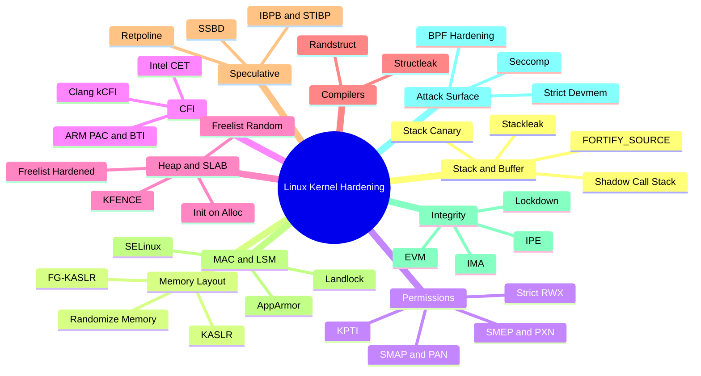

# Hardening Features Taxonomy Roadmap

Ten core categories and article mapping table for Linux kernel security hardening features.

---

## 1. Feature Categories Hierarchy

---

## 2. Feature Lab Status

| Number | Feature Name | Kconfig Symbol | Supported Arch | Status |
| :--- | :--- | :--- | :--- | :--- |
| **01** | [Stack Protector (Canary)](01-stack-protector.md) | `CONFIG_STACKPROTECTOR_STRONG` | x86_64, arm64 | Ready |
| **02** | Fortify Source | `CONFIG_FORTIFY_SOURCE` | x86_64, arm64 | Planned |
| **03** | Shadow Call Stack | `CONFIG_SHADOW_CALL_STACK` | arm64 | Planned |
| **04** | Stackleak Plugin | `CONFIG_GCC_PLUGIN_STACKLEAK` | x86_64, arm64 | Planned |
| **05** | KASLR | `CONFIG_RANDOMIZE_BASE` | x86_64, arm64 | Planned |
| **06** | Strict Kernel RWX | `CONFIG_STRICT_KERNEL_RWX` | x86_64, arm64 | Planned |
| **07** | SMEP & SMAP / PAN & PXN | CPU Feature | x86_64, arm64 | Planned |
| **08** | Kernel CFI | `CONFIG_CFI_CLANG` | x86_64, arm64 | Planned |
| **09** | SLAB Freelist Hardening | `CONFIG_SLAB_FREELIST_HARDENED` | x86_64, arm64 | Planned |
| **10** | KFENCE | `CONFIG_KFENCE` | x86_64, arm64 | Planned |
| **11** | AppArmor LSM | `CONFIG_SECURITY_APPARMOR` | x86_64, arm64 | Planned |
| **12** | IMA / EVM | `CONFIG_IMA`, `CONFIG_EVM` | x86_64, arm64 | Planned |
| **13** | IPE LSM | `CONFIG_SECURITY_IPE` | x86_64, arm64 | Planned |
| **14** | Kernel Lockdown | `CONFIG_SECURITY_LOCKDOWN_LSM` | x86_64, arm64 | Planned |
| **15** | Seccomp-BPF | `CONFIG_SECCOMP_FILTER` | x86_64, arm64 | Planned |
