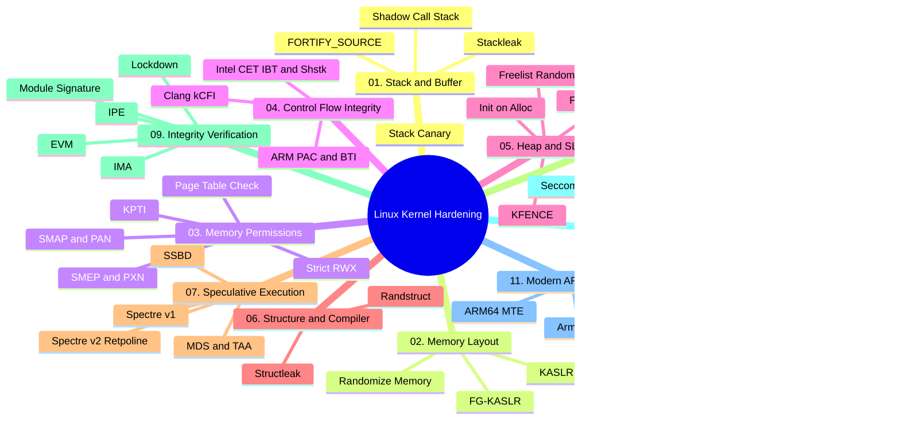

# Hardening Features Taxonomy Roadmap

Complete mapping table for all 44 hands-on Linux kernel security hardening features across 11 core categories.

---

## 1. Feature Categories Hierarchy

```mermaid
mindmap
  root((Linux Kernel Hardening))
    01. Stack and Buffer
      Stack Canary
      FORTIFY_SOURCE
      Shadow Call Stack
      Stackleak
    02. Memory Layout
      KASLR
      FG-KASLR
      Randomize Memory
    03. Memory Permissions
      Strict RWX
      SMEP and PXN
      SMAP and PAN
      Page Table Check
      KPTI
    04. Control Flow Integrity
      Clang kCFI
      Intel CET IBT and Shstk
      ARM PAC and BTI
    05. Heap and SLAB
      Freelist Random
      Freelist Hardened
      Init on Alloc
      Hardened Usercopy
      KFENCE
    06. Structure and Compiler
      Structleak
      Randstruct
    07. Speculative Execution
      Spectre v1
      Spectre v2 Retpoline
      SSBD
      MDS and TAA
    08. MAC and LSM
      LSM Stacking
      AppArmor
      SELinux
      Landlock
    09. Integrity Verification
      IMA
      EVM
      IPE
      Lockdown
      Module Signature
    10. Attack Surface Reduction
      Seccomp-BPF
      BPF Hardening
      Strict Devmem
      Kernel Info Leaks
      Yama Ptrace Scope
      Kexec Restrictions
    11. Modern ARMv8/ARMv9
      ARM64 MTE
      ARMv9 POE
      Android AVF and pKVM
      Arm CCA
```

---

## 2. Feature Lab Status (All 44 Features)

### Category 01. Stack & Buffer Protection

| # | Feature Name | Kconfig Symbol | Supported Arch | Status |
| :---: | :--- | :--- | :---: | :---: |
| **01** | [Stack Protector (Canary)](01-stack-protector.md) | `CONFIG_STACKPROTECTOR_STRONG` | x86_64, arm64 | Ready |
| **02** | [FORTIFY_SOURCE](02-fortify-source.md) | `CONFIG_FORTIFY_SOURCE` | x86_64, arm64 | Ready |
| **03** | [Shadow Call Stack (SCS)](03-shadow-call-stack.md) | `CONFIG_SHADOW_CALL_STACK` | arm64 | Ready |
| **04** | [STACKLEAK Plugin](04-stackleak.md) | `CONFIG_GCC_PLUGIN_STACKLEAK` | x86_64, arm64 | Ready |

### Category 02. Memory Layout & Randomization

| # | Feature Name | Kconfig Symbol | Supported Arch | Status |
| :---: | :--- | :--- | :---: | :---: |
| **05** | [KASLR](05-kaslr.md) | `CONFIG_RANDOMIZE_BASE` | x86_64, arm64 | Ready |
| **06** | [FG-KASLR](06-fgkaslr.md) | `CONFIG_FG_KASLR` | x86_64 | Ready |
| **07** | [Randomize Memory](07-randomize-memory.md) | `CONFIG_RANDOMIZE_MEMORY` | x86_64, arm64 | Ready |

### Category 03. Memory Permissions & Access Separation

| # | Feature Name | Kconfig Symbol | Supported Arch | Status |
| :---: | :--- | :--- | :---: | :---: |
| **08** | [Strict Kernel RWX (W^X)](08-strict-rwx.md) | `CONFIG_STRICT_KERNEL_RWX` | x86_64, arm64 | Ready |
| **09** | [SMEP & PXN (ret2usr Defense)](09-smep-pxn.md) | CPU Feature (SMEP / PXN) | x86_64, arm64 | Ready |
| **10** | [SMAP & PAN (User Data Access Prevention)](10-smap-pan.md) | CPU Feature (SMAP / PAN) | x86_64, arm64 | Ready |
| **11** | [Page Table Check](11-page-table-check.md) | `CONFIG_PAGE_TABLE_CHECK` | x86_64, arm64 | Ready |
| **12** | [KPTI (Kernel Page Table Isolation)](12-kpti.md) | `CONFIG_PAGE_TABLE_ISOLATION` | x86_64, arm64 | Ready |

### Category 04. Control Flow Integrity (CFI)

| # | Feature Name | Kconfig Symbol | Supported Arch | Status |
| :---: | :--- | :--- | :---: | :---: |
| **13** | [Clang kCFI](13-kcfi.md) | `CONFIG_CFI_CLANG` | x86_64, arm64 | Ready |
| **14** | [x86 IBT & Shadow Stack (CET)](14-ibt-shstk.md) | `CONFIG_X86_KERNEL_IBT` | x86_64 | Ready |
| **15** | [ARM64 BTI & PAC](15-bti-pac.md) | `CONFIG_ARM64_BTI`, `CONFIG_ARM64_PTR_AUTH` | arm64 | Ready |

### Category 05. Heap & SLAB Allocator Hardening

| # | Feature Name | Kconfig Symbol | Supported Arch | Status |
| :---: | :--- | :--- | :---: | :---: |
| **16** | [SLAB Freelist Hardening](16-slab-freelist.md) | `CONFIG_SLAB_FREELIST_HARDENED` | x86_64, arm64 | Ready |
| **17** | [Heap Zeroing (Alloc & Free)](17-heap-init.md) | `CONFIG_INIT_ON_ALLOC_DEFAULT_ON` | x86_64, arm64 | Ready |
| **18** | [Hardened Usercopy](18-hardened-usercopy.md) | `CONFIG_HARDENED_USERCOPY` | x86_64, arm64 | Ready |
| **19** | [KFENCE (Memory Safety Detector)](19-kfence.md) | `CONFIG_KFENCE` | x86_64, arm64 | Ready |

### Category 06. Structure & Compiler Level Protections

| # | Feature Name | Kconfig Symbol | Supported Arch | Status |
| :---: | :--- | :--- | :---: | :---: |
| **20** | [Structleak Plugin](20-structleak.md) | `CONFIG_GCC_PLUGIN_STRUCTLEAK_BYREF_ALL` | x86_64, arm64 | Ready |
| **21** | [Randstruct Plugin](21-randstruct.md) | `CONFIG_RANDSTRUCT_FULL` | x86_64, arm64 | Ready |

### Category 07. Speculative Execution Defenses

| # | Feature Name | Kconfig Symbol | Supported Arch | Status |
| :---: | :--- | :--- | :---: | :---: |
| **22** | [Spectre v1 (array_index_nospec)](22-spectre-v1.md) | `array_index_nospec` | x86_64, arm64 | Ready |
| **23** | [Spectre v2 (Retpoline, IBPB, STIBP)](23-spectre-v2.md) | `CONFIG_MITIGATION_RETPOLINE` | x86_64, arm64 | Ready |
| **24** | [Speculative Store Bypass Disable (SSBD)](24-ssbd.md) | `CONFIG_MITIGATION_SSB` | x86_64, arm64 | Ready |
| **25** | [MDS & TAA Mitigation (VERW)](25-mds.md) | `CONFIG_MITIGATION_MDS` | x86_64 | Ready |

### Category 08. Mandatory Access Control & LSM Framework

| # | Feature Name | Kconfig Symbol | Supported Arch | Status |
| :---: | :--- | :--- | :---: | :---: |
| **26** | [Stackable LSM Architecture](26-lsm-stacking.md) | `CONFIG_LSM` | x86_64, arm64 | Ready |
| **27** | [AppArmor Process Isolation](27-apparmor.md) | `CONFIG_SECURITY_APPARMOR` | x86_64, arm64 | Ready |
| **28** | [SELinux Type Enforcement](28-selinux.md) | `CONFIG_SECURITY_SELINUX` | x86_64, arm64 | Ready |
| **29** | [Landlock Sandboxing](29-landlock.md) | `CONFIG_SECURITY_LANDLOCK` | x86_64, arm64 | Ready |

### Category 09. System & Binary Integrity Verification

| # | Feature Name | Kconfig Symbol | Supported Arch | Status |
| :---: | :--- | :--- | :---: | :---: |
| **30** | [IMA Integrity Measurement](30-ima.md) | `CONFIG_IMA` | x86_64, arm64 | Ready |
| **31** | [EVM Metadata Protection](31-evm.md) | `CONFIG_EVM` | x86_64, arm64 | Ready |
| **32** | [IPE Policy Enforcement](32-ipe.md) | `CONFIG_SECURITY_IPE` | x86_64, arm64 | Ready |
| **33** | [Kernel Lockdown LSM](33-lockdown.md) | `CONFIG_SECURITY_LOCKDOWN_LSM` | x86_64, arm64 | Ready |
| **34** | [Module Signature Verification](34-module-sig.md) | `CONFIG_MODULE_SIG_FORCE` | x86_64, arm64 | Ready |

### Category 10. Attack Surface Reduction & System Hardening

| # | Feature Name | Kconfig Symbol | Supported Arch | Status |
| :---: | :--- | :--- | :---: | :---: |
| **35** | [Seccomp-BPF Syscall Filtering](35-seccomp.md) | `CONFIG_SECCOMP_FILTER` | x86_64, arm64 | Ready |
| **36** | [BPF Hardening & JIT Blinding](36-bpf-hardening.md) | `CONFIG_BPF_JIT_ALWAYS_ON` | x86_64, arm64 | Ready |
| **37** | [Strict Devmem & Strict I/O](37-strict-devmem.md) | `CONFIG_STRICT_DEVMEM` | x86_64, arm64 | Ready |
| **38** | [Kernel Info Leaks & Dmesg Restrict](38-info-leaks.md) | `CONFIG_SECURITY_DMESG_RESTRICT` | x86_64, arm64 | Ready |
| **39** | [Yama LSM Ptrace Scope](39-yama-ptrace.md) | `CONFIG_SECURITY_YAMA` | x86_64, arm64 | Ready |
| **40** | [Kexec Restrictions & Hardening](40-kexec-restrict.md) | `CONFIG_KEXEC_SIG_FORCE` | x86_64, arm64 | Ready |

### Category 11. Modern ARMv8/ARMv9 & Mobile Security

| # | Feature Name | Kconfig Symbol | Supported Arch | Status |
| :---: | :--- | :--- | :---: | :---: |
| **41** | [ARM64 MTE (Memory Tagging Extension)](41-arm64-mte.md) | `CONFIG_ARM64_MTE` | arm64 | Ready |
| **42** | [ARMv9 POE / S1POE (Permission Overlay)](42-armv9-poe.md) | `CONFIG_ARM64_POE` | arm64 | Ready |
| **43** | [Android Virtualization (AVF / pKVM)](43-avf-pkvm.md) | `CONFIG_KVM` | arm64 | Ready |
| **44** | [Arm CCA (Confidential Compute Architecture)](44-arm-cca.md) | `CONFIG_ARM64_RME` | arm64 | Ready |
