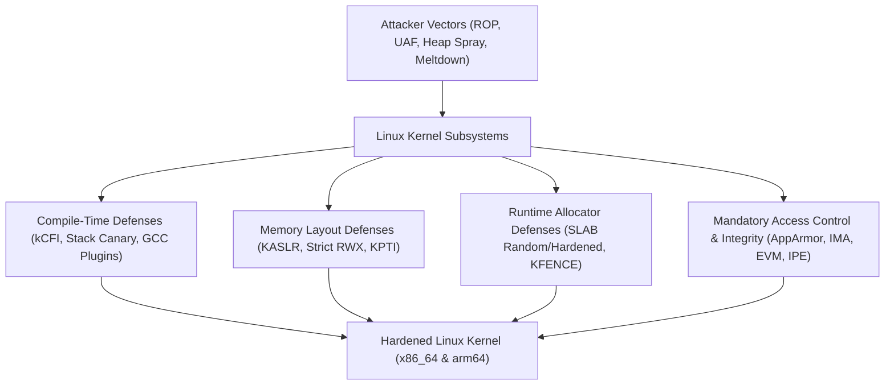

# Linux Kernel Hardening Lab

An engineering and interactive lab exploring internal mechanisms of Linux kernel security hardening features, verified through hands-on kernel builds and QEMU virtual machine runs on x86_64 and arm64 architectures.

---

## 1. Lab Architecture & Design Philosophy

- **Theory Combined with Concrete Binary Verification**:
  - Analysis of Kconfig definitions and source code implementation.
  - Side-by-side comparison between Base (hardening disabled) and Hardened kernels.
  - Runtime proof of defense mechanisms using LKDTM (Linux Kernel Dump Test Module) and custom exploit PoCs.
- **Dual-Architecture Support (x86_64 & arm64)**:
  - Comparative study between Intel/AMD hardware technologies (CET IBT/SHSTK, SMEP, SMAP) and ARM security extensions (PAC, BTI, PAN, PXN).
- **Engineering Precision**:
  - Concise technical prose and clear data flows.
  - Visual-first approach with diagrams and structured comparison tables.

---

## 2. 10 Core Hardening Categories

| Category                         | Key Mechanism                                                   | Key Kconfig & Technologies                                                 |
| :------------------------------- | :-------------------------------------------------------------- | :------------------------------------------------------------------------- |
| **1. Stack & Buffer**            | Stack frame integrity and buffer boundary verification          | `CONFIG_STACKPROTECTOR_STRONG`, `CONFIG_FORTIFY_SOURCE`                    |
| **2. Memory Layout**             | Randomization of kernel text, modules, and physical mapping     | `CONFIG_RANDOMIZE_BASE` (KASLR), FG-KASLR                                  |
| **3. Memory Permissions**        | W^X enforcement, separation of user and kernel privileges       | `CONFIG_STRICT_KERNEL_RWX`, SMEP/SMAP, KPTI                                |
| **4. Control Flow Integrity**    | Forward-edge and backward-edge indirect branch validation       | Clang kCFI, Intel CET (IBT/SHSTK), ARM PAC/BTI                             |
| **5. Heap & SLAB Hardening**     | Metadata obfuscation, zero-initialization to mitigate UAF       | `CONFIG_SLAB_FREELIST_HARDENED`, `CONFIG_INIT_ON_ALLOC_DEFAULT_ON`, KFENCE |
| **6. Compiler Plugins**          | Structure layout randomization, stack clearing                  | `CONFIG_GCC_PLUGIN_RANDSTRUCT`, `CONFIG_GCC_PLUGIN_STACKLEAK`              |
| **7. Speculative Mitigations**   | Hardware vulnerability mitigation (Spectre, Meltdown)           | Retpoline, IBPB, STIBP, SSBD                                               |
| **8. Access Control (LSM)**      | Process-level mandatory access control and isolation            | AppArmor, SELinux, Landlock                                                |
| **9. Integrity Verification**    | Measurement, xattr signing, and policy enforcement              | IMA, EVM, IPE, Kernel Lockdown                                             |
| **10. Attack Surface Reduction** | Syscall filtering, memory device restrictions, info leak limits | Seccomp-BPF, `CONFIG_STRICT_DEVMEM`, Yama ptrace                           |

---

## 3. Getting Started

1. [Quick Start](getting-started/index.md): Prepare toolchains and QEMU environment.
2. [Dual-Arch Environment](getting-started/dual-arch.md): Set up x86_64 and aarch64 cross-compilation and runners.
3. [Architecture](architecture/index.md): Review memory models and privilege ring transitions.
4. [Features Roadmap](features/index.md): Hands-on labs with reproducible test logs.
