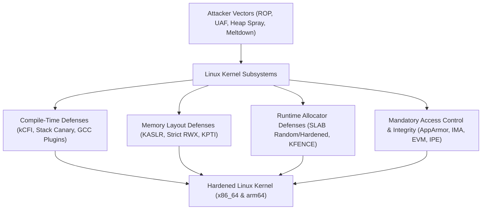

# Linux Kernel Hardening Lab

  
x86_64 &amp; ARM64 Interactive Security Verification Lab

  
Linux Kernel Hardening Engineering &amp; Exploit Defense Lab

  

    An engineering and interactive verification lab exploring internal mechanisms of Linux kernel security hardening features at the source code and assembly level, verified through Base vs. Hardened kernel builds, custom exploit PoCs, and LKDTM runs on x86_64 and arm64 QEMU virtual machines.
  

  

    <a href="getting-started/" class="lab-btn lab-btn--primary">Get Started →</a>
    <a href="features/" class="lab-btn lab-btn--secondary">44+ Hardening Features</a>
    <a href="scenarios/" class="lab-btn lab-btn--secondary">Attack Scenarios</a>
  

  

    

      
44+ Features

      
In-depth analysis across 11 core hardening categories

    

    

      
x86_64 &amp; ARM64

      
Cross-arch comparison of CET/SMEP/SMAP &amp; PAC/BTI/MTE

    

    

      
Base vs Hardened

      
Runtime proof with real-world exploit PoCs &amp; LKDTM

    

    

      
Interactive Flow

      
Dynamic SVG architecture simulators for control flow inspection

    

  

```mermaid
graph TD
    A["Attacker Vectors (ROP, UAF, Heap Spray, Meltdown)"] --> B["Linux Kernel Subsystems"]
    B --> C["Compile-Time Defenses (kCFI, Stack Canary, GCC Plugins)"]
    B --> D["Memory Layout Defenses (KASLR, Strict RWX, KPTI)"]
    B --> E["Runtime Allocator Defenses (SLAB Random/Hardened, KFENCE)"]
    B --> F["Mandatory Access Control & Integrity (AppArmor, IMA, EVM, IPE)"]
    C & D & E & F --> G["Hardened Linux Kernel (x86_64 & arm64)"]
```

---

## 1. Lab Architecture & Design Philosophy

- **Theory Combined with Concrete Binary Verification**:
  - Analysis of Kconfig definitions and source code implementation.
  - Side-by-side comparison between Base (hardening disabled) and Hardened kernels.
  - Runtime proof of defense mechanisms using LKDTM (Linux Kernel Dump Test Module) and custom exploit PoCs.
- **Dual-Architecture Support (x86_64 & arm64)**:
  - Comparative study between Intel/AMD hardware technologies (CET IBT/SHSTK, SMEP, SMAP) and ARM security extensions (PAC, BTI, PAN, PXN).
- **Engineering Precision**:
  - Concise technical prose and clear data flows.
  - Visual-first approach with diagrams and structured comparison tables.

---

## 2. 11 Core Hardening Categories
 
| Category | Key Mechanism | Key Kconfig & Featured Mitigations |
| :--- | :--- | :--- |
| [**1. Stack & Buffer**](features/index.md#category-01-stack-buffer-protection) | Stack frame integrity and buffer boundary verification | [`Stack Protector`](features/01-stack-protector.md), [`FORTIFY_SOURCE`](features/02-fortify-source.md) |
| [**2. Memory Layout**](features/index.md#category-02-memory-layout-randomization) | Randomization of kernel text, modules, and physical mapping | [`KASLR`](features/05-kaslr.md), [`FG-KASLR`](features/06-fgkaslr.md) |
| [**3. Memory Permissions**](features/index.md#category-03-memory-permissions-access-separation) | W^X enforcement, separation of user and kernel privileges | [`Strict RWX`](features/08-strict-rwx.md), [`SMEP/PXN`](features/09-smep-pxn.md) |
| [**4. Control Flow Integrity**](features/index.md#category-04-control-flow-integrity-cfi) | Forward-edge and backward-edge indirect branch validation | [`Clang kCFI`](features/13-kcfi.md), [`Intel CET`](features/14-ibt-shstk.md) |
| [**5. Heap & SLAB Hardening**](features/index.md#category-05-heap-slab-allocator-hardening) | Metadata obfuscation, zero-initialization to mitigate UAF | [`SLAB Freelist`](features/16-slab-freelist.md), [`KFENCE`](features/19-kfence.md) |
| [**6. Compiler Plugins**](features/index.md#category-06-structure-compiler-level-protections) | Structure layout randomization, stack clearing | [`Randstruct`](features/21-randstruct.md), [`STACKLEAK`](features/04-stackleak.md) |
| [**7. Speculative Mitigations**](features/index.md#category-07-speculative-execution-defenses) | Hardware vulnerability mitigation (Spectre, Meltdown) | [`Spectre v1`](features/22-spectre-v1.md), [`Spectre v2`](features/23-spectre-v2.md) |
| [**8. Access Control (LSM)**](features/index.md#category-08-mandatory-access-control-lsm-framework) | Process-level mandatory access control and isolation | [`AppArmor`](features/27-apparmor.md), [`SELinux`](features/28-selinux.md) |
| [**9. Integrity Verification**](features/index.md#category-09-system-binary-integrity-verification) | Measurement, xattr signing, and policy enforcement | [`IMA`](features/30-ima.md), [`Lockdown`](features/33-lockdown.md) |
| [**10. Attack Surface Reduction**](features/index.md#category-10-attack-surface-reduction-system-hardening) | Syscall filtering, memory device restrictions, info leak limits | [`Seccomp-BPF`](features/35-seccomp.md), [`Strict Devmem`](features/37-strict-devmem.md) |
| [**11. Modern ARM & Mobile**](features/index.md#category-11-modern-armv8armv9-mobile-security) | Hardware memory tagging, permission overlays, pKVM & CCA | [`ARM64 MTE`](features/41-arm64-mte.md), [`ARMv9 POE`](features/42-armv9-poe.md) |

---

## 3. Getting Started

1. [Quick Start](getting-started/index.md): Prepare toolchains and QEMU environment.
2. [Dual-Arch Environment](getting-started/dual-arch.md): Set up x86_64 and aarch64 cross-compilation and runners.
3. [Architecture](architecture/index.md): Review memory models and privilege ring transitions.
4. [Features Roadmap](features/index.md): Hands-on labs with reproducible test logs.
