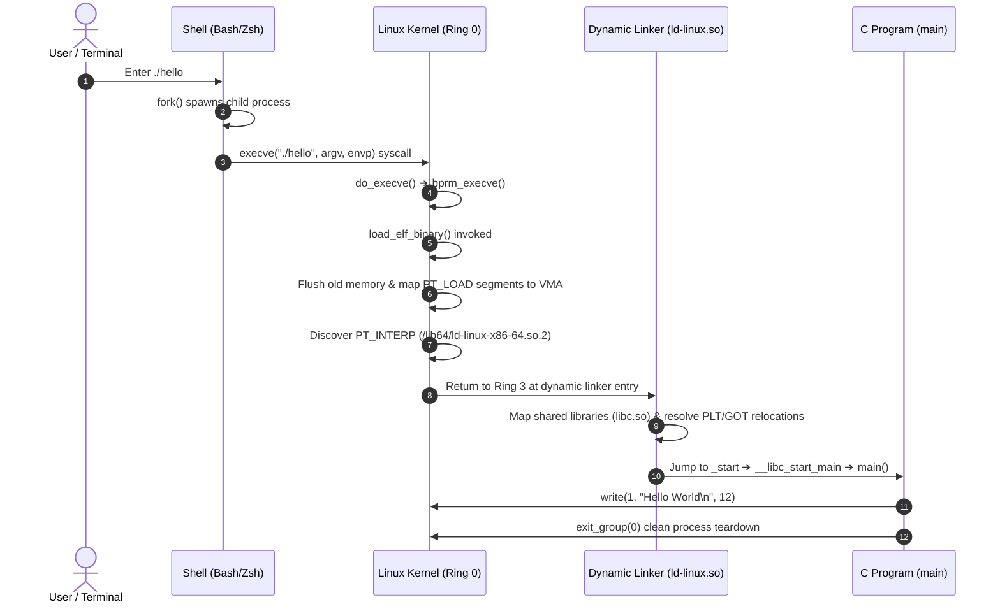

# 01. Hello World Lifecycle and ELF Execution Pipeline (Program Lifecycle)

Tracing the complete execution lifecycle of the classic `"Hello World"` program from source text to terminal output and termination through compiler toolchains and the Linux operating system kernel.

---

## 1. Learning Objectives & Overview

- Trace the transformation of C source code (<code>hello.c</code>) through the preprocessor, compiler, assembler, and linker into a 64-bit ELF executable.
- Investigate how typing <code>./hello</code> triggers the <code>execve()</code> system call, transferring execution into Ring 0 kernel space.
- Examine how the Linux kernel's <code>load_elf_binary()</code> routine constructs the virtual memory area (VMA) layout and maps `PT_LOAD` segments.
- Understand the role of the dynamic linker (<code>ld-linux.so</code>) and the C runtime startup sequence (<code>_start</code> ➔ <code>__libc_start_main</code>) leading to <code>main()</code> invocation.

---

## 2. Interactive Execution Lifecycle Diagram

Explore the 5 stages from source compilation to kernel entry and exit through the interactive diagram below:

<div style="width: 100%; margin: 24px 0; border: 1px solid rgba(255,255,255,0.1); border-radius: 12px; overflow: hidden;">
  <iframe src="../../assets/diagrams/principles/01-hello-lifecycle.html" style="width: 100%; border: none; display: block; overflow: hidden;" scrolling="no" onload="try { const c = this.contentWindow.document.getElementById('diagramCanvas'); if(c) this.style.height = Math.ceil(c.getBoundingClientRect().height) + 'px'; } catch(e){}"></iframe>
</div>

---

## 3. Four-Stage Build Pipeline Deep-Dive

Converting C source code into an executable binary traverses four sequential tools:

```
[hello.c] ➔ [Preprocessor cpp] ➔ [hello.i] ➔ [Compiler cc1] ➔ [hello.s]
          ➔ [Assembler as]     ➔ [hello.o] ➔ [Linker ld]    ➔ [hello (ELF64)]
```

1. **Preprocessing (`cpp`)**:
   - Expands `#include <stdio.h>` header files inline, replaces macros, and strips code comments.
2. **Compilation (`cc1`)**:
   - Parses high-level syntax into an Abstract Syntax Tree (AST), outputting target-specific assembly instructions (<code>hello.s</code>).
3. **Assembly (`as`)**:
   - Translates human-readable assembly instructions into raw machine bytecode, generating a relocatable object file (<code>hello.o</code>, ELF Relocatable).
4. **Linking (`ld`)**:
   - Resolves symbol addresses with C runtime startup objects (<code>crt1.o</code>, <code>crti.o</code>) and shared libraries (<code>libc.so</code>) to produce the final executable ELF binary.

---

## 4. Kernel-Space Process Loading: `load_elf_binary()`

When an executable binary is launched from a terminal, the shell and kernel collaborate across the privilege boundary:



---

## 5. Lab Source Code & ELF Inspection

- **Lab Source Code**: [`hello.c`](../../assets/labs/principles/01-hello-lifecycle/hello.c) (Local Asset) | [GitHub Source Code Repository :octicons-mark-github-16:](https://github.com/auking45/linux-kernel-hardening-lab/blob/main/labs/principles/01-hello-lifecycle/hello.c)
- **Dedicated Makefile**: [`Makefile`](../../assets/labs/principles/01-hello-lifecycle/Makefile)

### 5.1 Running the Demo

```bash
cd labs/principles/01-hello-lifecycle
make run
```

```
=== [1] Running Hello World Binary ===
./hello
[+] Hello, System Security Principles!
[+] Process PID: 12458, PPID: 11020
[+] main() address: 0x55dc98a21149
[+] g_greeting (.rodata): 0x55dc98a22008
[+] g_run_counter (.data): 0x55dc98a24018 (value=1)
[+] argc: 1, argv[0]: ./hello
```

### 5.2 Deep ELF Inspection

```bash
make inspect
```

- `readelf -h hello`: View the ELF magic bytes (`\x7fELF`), target architecture, and entry point (`0x1060`).
- `readelf -l hello`: Review kernel `PT_LOAD` segments and enforced memory permissions (`R E`, `RW `).
- `readelf -S hello`: Verify boundaries and offsets of `.text`, `.rodata`, `.data`, and `.bss` sections.

---

## 6. Summary & Next Chapter

- A simple `"Hello World"` application relies on an intricate symphony of toolchains, ELF segment parsing, kernel `execve` handling, dynamic linking, and runtime initialization.
- In the next chapter, we examine how the kernel organizes memory segments within the 64-bit address space: **[02. Process Anatomy and Virtual Address Space](02-virtual-memory-layout.md)**.
