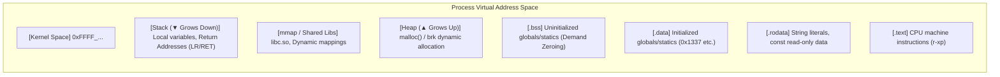
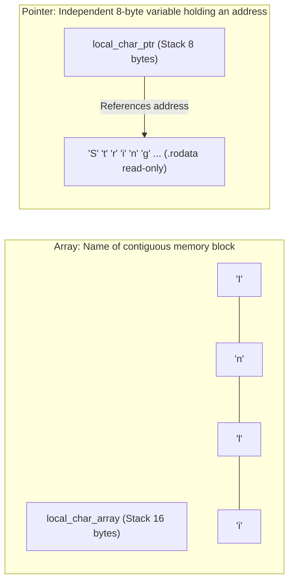
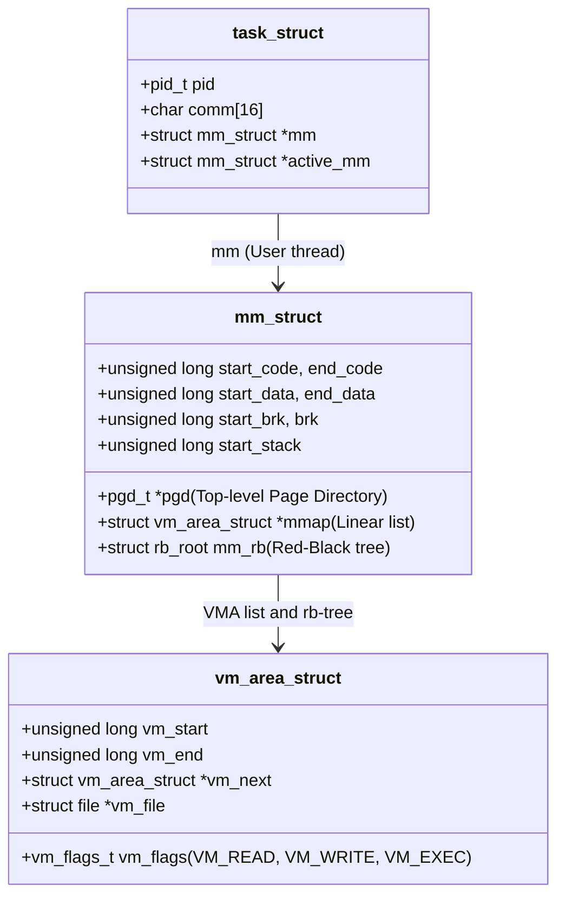
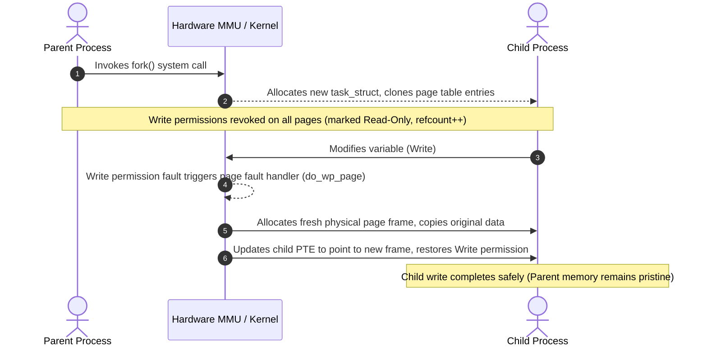
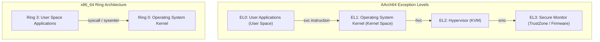

# 02. Process Anatomy and Virtual Address Space (Virtual Address Space)

Every process executed under Linux does not directly see physical hardware RAM, but instead operates inside an isolated, private **64-bit Virtual Address Space** provided by the Linux kernel and the CPU Memory Management Unit (MMU). This chapter establishes **AArch64 (ARM64)** as the primary architecture for modern mobile, IoT, and embedded system security, with comparative architectural analysis against **x86_64**.

---

## 1. Learning Objectives & Overview

- Understand the 64-bit virtual memory division (User Space vs. Kernel Space) and AArch64 `TTBR0_EL1` / `TTBR1_EL1` dual register architecture.
- Examine memory placement and storage class persistence for global variables, function-scoped `static` variables, and stack local variables.
- Analyze the memory anatomy of arrays versus pointers (`&arr == arr == &arr[0]` vs. `&ptr != ptr`) and string literal optimizations.
- Explore kernel process memory abstractions (`task_struct`, `mm_struct`, `vm_area_struct`) and memory sharing across threads and kernel threads.
- Verify `fork()` Copy-on-Write (COW) mechanics and `execve()` binary image replacement and VMA reconstruction.
- Contrast hardware privilege levels (AArch64 EL0–EL3 vs. x86 Ring 0–3) and hardware-enforced W^X (Write XOR Execute) memory protection.
- Diagnose and verify the root causes of Segmentation Fault (SIGSEGV) exceptions: `SEGV_MAPERR` vs. `SEGV_ACCERR`.

---

## 2. Interactive Virtual Memory Map Inspector

Click on any segment in the virtual memory tower below to explore its address ranges, access permissions, and underlying security implications:

<div style="width: 100%; margin: 24px 0; border: 1px solid rgba(255,255,255,0.1); border-radius: 12px; overflow: hidden;">
  <iframe src="../../assets/diagrams/principles/02-virtual-memory.html" style="width: 100%; border: none; display: block; overflow: hidden;" scrolling="no" onload="try { const c = this.contentWindow.document.getElementById('diagramCanvas'); if(c) this.style.height = Math.ceil(c.getBoundingClientRect().height) + 'px'; } catch(e){}"></iframe>
</div>

---

## 3. 64-bit Virtual Address Space Architecture: AArch64 vs. x86_64

Modern 64-bit processors typically do not use the entire 64-bit address space ($2^{64} \approx 16 \text{ EB}$), adopting a 48-bit virtual address width ($2^{48} = 256 \text{ TB}$):

```
[0xFFFFFFFFFFFFFFFF] ───────────┐
                                │ Kernel Space (Upper Half)
[0xFFFF000000000000] ───────────┘ (AArch64: TTBR1_EL1 / x86_64: CR3 Top Half)
                                
  ( Non-Canonical / Unmapped )   Unmapped Gap (Hardware exception on access)
                                
[0x0000FFFFFFFFFFFF] ───────────┐ (AArch64: TTBR0_EL1)
                                │ User Space (Lower Half)
[0x0000000000000000] ───────────┘
```

### 3.1 AArch64 Hardware Split Architecture (`TTBR0_EL1` vs. `TTBR1_EL1`)

The ARM64 architecture physically bifurcates the translation pipeline at the register level:

1. **`TTBR0_EL1` (Translation Table Base Register 0)**:
   - Holds the base address for the User Space translation table (`0x0000_0000_0000_0000 ~ 0x0000_FFFF_FFFF_FFFF`).
   - During a process context switch, the kernel only swaps `TTBR0_EL1` to point to the incoming process page table.
2. **`TTBR1_EL1` (Translation Table Base Register 1)**:
   - Holds the base address for the Kernel Space translation table (`0xFFFF_0000_0000_0000 ~ 0xFFFF_FFFF_FFFF_FFFF`).
   - Kernel mappings remain permanently bound, eliminating TLB churn and kernel page table thrashing on context switches.
3. **`TCR_EL1` (Translation Control Register)**:
   - Configures the independent address sizes via `T0SZ` and `T1SZ` (e.g., 39-bit, 48-bit, or 52-bit virtual addressing).

### 3.2 x86_64 Canonical Address Rules

On x86_64, a single root register (`CR3`) points to the 4-level (PML4) or 5-level (PML5) paging hierarchy:

- In 48-bit addressing, the upper 16 bits (bits 48–63) must replicate bit 47 via sign extension.
- When bit 47 is `0`, addresses below `0x00007FFFFFFFFFFF` (User Space) are valid; when `1`, addresses above `0xFFFF800000000000` (Kernel Space) are valid.
- Accessing the non-canonical gap (approximately 16,777,216 TB) triggers a hardware General Protection Fault (`#GP`).

---

## 4. Memory Segments and Variable Classification (Storage Class Persistence)

Variables declared within a C program reside in distinct memory segments based on their storage class and lexical scope:



### 4.1 Variable Classification and Lifetime Comparison

| Variable Type | Declaration Example | Segment Location | Initialization Timing | Valid Lifetime | Lexical Scope |
| :--- | :--- | :--- | :--- | :--- | :--- |
| **Initialized Global** | `int g_val = 10;` | `.data` | Compile time | Entire process lifetime | Program-wide (`extern`) |
| **Uninitialized Global** | `int g_zero;` | `.bss` | Zeroed on demand (demand-zero page fault) | Entire process lifetime | Program-wide |
| **Static Local Variable** | `static int cnt = 0;` | `.data` / `.bss` | First execution | Entire process lifetime | Restricted to enclosing function |
| **Stack Local Variable** | `int local_x = 5;` | `Stack` | Runtime upon function entry | Deallocated on function return | Enclosing block / function |
| **Dynamic Heap Variable** | `malloc(256);` | `Heap` | Runtime when `malloc()` is called | Persists until `free()` | Any scope holding the pointer |

### 4.2 Function-Scoped Static Variable Persistence

A `static` variable declared inside a function is syntactically scoped to that function, but its storage is allocated inside the `.data` segment just like a global variable. When the function returns and its stack frame is destroyed, the static variable remains intact in `.data`:

```c
void demonstrate_static_persistence(void) {
    static int call_counter = 0; // Allocated once in .data segment
    call_counter++;
    printf("Invocation: %d (address: %p)\n", call_counter, (void *)&call_counter);
}
```

---

## 5. Memory Anatomy: Arrays vs. Pointers

Although C syntax often treats arrays and pointers interchangeably, their virtual memory layout and hardware representation differ fundamentally.



### 5.1 Array Identity Property (`&arr == arr == &arr[0]`)

- The array identifier (`local_char_array`) is not a pointer variable; it is a compile-time symbol identifying the start of contiguous bytes allocated on the stack.
- The following three expressions evaluate to the exact same stack address:
  1. `&local_char_array`: The base address of the entire array block.
  2. `local_char_array`: The decayed pointer to the first element.
  3. `&local_char_array[0]`: The explicit address of element 0.

### 5.2 Pointer Distinction Property (`&ptr != ptr`)

- A pointer variable (`local_char_ptr`) occupies an independent 8-byte slot on the stack frame.
- `&local_char_ptr`: The address where the pointer itself lives (**Stack**).
- `local_char_ptr`: The value stored inside the pointer, pointing to the string literal located in the **`.rodata`** segment.
- Mutability contrast:
  - `char arr[] = "Test";` $\rightarrow$ String literal is copied into stack memory at runtime; modifying elements (`arr[0] = 'X'`) is permitted.
  - `const char *ptr = "Test";` $\rightarrow$ Points directly to `.rodata`; any write attempt immediately triggers a hardware permission violation (`SEGV_ACCERR`).

---

## 6. Kernel Memory Abstraction Model

The Linux kernel tracks and regulates each process's virtual address space through hierarchical data structures in kernel memory:



### 6.1 Core Memory Management Structures

1. **`task_struct` (Process Control Block)**:
   - Represents an executing task (process or thread) in the kernel.
   - For user processes, the `mm` pointer references an allocated `mm_struct`.
2. **`mm_struct` (Memory Descriptor)**:
   - Manages the entire virtual address space of a process.
   - `pgd`: Physical address of the top-level Page Global Directory (loaded into AArch64 `TTBR0_EL1` or x86 `CR3`).
   - `mmap` / `mm_rb`: Tracks all virtual memory areas (`vm_area_struct`) via a singly-linked list for iteration and an augmented red-black tree for $O(\log n)$ address lookups.
3. **`vm_area_struct` (VMA)**:
   - Describes a contiguous virtual address range (`vm_start` to `vm_end`) with homogeneous page permissions (`vm_flags`).
   - Each entry in `/proc/[pid]/maps` directly corresponds to one `vm_area_struct`.

### 6.2 Process vs. Thread vs. Kernel Thread Memory Sharing

- **Processes (`fork`)**: Receive independent `mm_struct` instances and distinct page tables.
- **User Threads (`pthread_create` / `clone(CLONE_VM)`)**: All threads in a process share the identical `mm_struct` (`task_struct->mm` points to the same object). Because they share the same address space, thread synchronization (mutexes, atomics) is required.
- **Kernel Threads (`kthreadd` descendants)**:
  - Do not require user-space memory mappings (`task_struct->mm == NULL`).
  - During context switches, kernel threads borrow the `active_mm` of the preceding user process for kernel-space translation.

---

## 7. Process Lifecycle and Memory Transitions

### 7.1 `fork()` and Copy-on-Write (COW) Mechanics

Traditional Unix `fork()` duplicated physical memory frames eagerly, incurring significant overhead. Linux avoids unnecessary memory duplication via **Copy-on-Write (COW)**:



1. During `fork()`, the kernel copies the `mm_struct` structure and duplicates page table entries (PTEs) without copying physical frames.
2. All writable pages in both parent and child are marked **Read-Only** in the hardware page tables, with page frame reference counts incremented.
3. When either process attempts a write operation, the MMU traps with a Page Fault Exception.
4. The kernel page fault handler (`do_wp_page()`) allocates a new physical frame, duplicates the 4KB page contents, updates the faulting process's page table, and restores write permission.

### 7.2 `execve()` and Memory Image Reconstruction

When `execve()` executes, the kernel purges the existing address space and reconstructs it from the target ELF binary:

1. Frees all existing VMAs and tears down page tables (`exit_mmap`).
2. Reads the new ELF header and generates fresh VMAs for `LOAD` segments (`.text`, `.rodata`, `.data`, `.bss`).
3. Allocates a fresh user stack (initializing environment variables, `argc`, and `argv`) and initializes the heap break.
4. Sets the Program Counter (`PC` / `RIP`) to the ELF entry point (`_start`) and begins user-space execution.

---

## 8. Hardware Privilege Levels and W^X Memory Protection

### 8.1 AArch64 Exception Levels vs. x86_64 Privilege Rings



- **AArch64**:
  - `EL0`: Unprivileged user execution. Hardware access is barred; requests enter `EL1` via `svc` (Supervisor Call).
  - `EL1`: Privileged kernel execution. Regulates MMU tables (`TTBR0/1`), page attributes, and hardware exceptions.
  - Page permission bits: `AP[2:1]` (access permissions), `UXN` (User Execute-Never), `PXN` (Privileged Execute-Never) prevent privilege escalation attacks such as ret2usr / SMEP bypass.
- **x86_64**:
  - `Ring 3` (User) $\leftrightarrow$ `Ring 0` (Kernel), transitioned via `syscall` / `sysret`.

### 8.2 W^X (Write XOR Execute) Security Invariant

To block shellcode execution from data memory regions, modern processors enforce the W^X invariant:

$$\text{Permission} \subseteq \{ \text{Read, Write} \} \lor \text{Permission} \subseteq \{ \text{Read, Execute} \}$$

- Writable pages are never granted execution permission (`W ^ X`).
- The ARM `XN` / `UXN` bit and x86 `NX` (No-Execute) bit instruct the MMU to fault immediately if an instruction fetch targets stack or heap memory.

---

## 9. Hardware Segmentation Fault (SIGSEGV) Diagnosis

When illegal memory access occurs, the kernel parses the MMU page fault registers and issues a `SIGSEGV` signal containing diagnostic metadata (`si_code`):

| Signal Code | Numeric Value | Root Cause | Example Trigger Scenario |
| :--- | :---: | :--- | :--- |
| **`SEGV_MAPERR`** | `1` | Address does not map to any existing VMA (`vm_area_struct`) | NULL pointer dereference (`0x0`), non-canonical address access |
| **`SEGV_ACCERR`** | `2` | Address is mapped, but the access violates VMA permissions | Writing to `.rodata`, executing instructions on an NX stack |

---

## 10. Lab Demonstration and Verification

- **Lab Source Code**: [`address_space_demo.c`](../../assets/labs/principles/02-address-space/address_space_demo.c) (Local source) | [GitHub Source Repository :octicons-mark-github-16:](https://github.com/auking45/linux-kernel-hardening-lab/blob/main/labs/principles/02-address-space/address_space_demo.c)
- **Dedicated Makefile**: [`Makefile`](../../assets/labs/principles/02-address-space/Makefile)

### 10.1 Memory Segments and Variable / Array / Pointer Inspection

=== "AArch64 (Default Architecture)"
    ```bash
    cd labs/principles/02-address-space
    make run
    ```

    ```
    === Running address_space_demo on aarch64 ===
    qemu-aarch64 -L /usr/aarch64-linux-gnu ./address_space_demo
    ============================================================
     64-bit Process Virtual Address Space Inspection (PID: 35)
    ============================================================
    [1] Code Segment (.text)       : 0x74268fe312b0 (main)
                                   : 0x74268fe312a8 (dummy_function)
    [2] Read-Only Data (.rodata)   : 0x74268fe31700 ("System Security Principles 2026")
    [3] Initialized Data (.data)   : 0x74268fe50010 (0x1337)
    [4] Uninitialized Data (.bss)  : 0x74268fe50018 (0x0)
    [5] Heap Segment (malloc)      : 0x400000a3e2a0 (size=256)
    [6] Memory Mapped Region (mmap): 0x400000b3e000 (page-aligned)
    [7] Shared Library (libc)      : 0x4000008c0410 (printf)
    [8] Stack Segment (RSP/SP area): 0x4000007fecfc (&local_stack_var)
                                   : 0x4000007fecec (&argc)
    [9] Kernel Space Boundary      : 0xffff000000000000 (AArch64 TTBR1) / 0xffff800000000000 (x86_64)

    ------------------------------------------------------------
     Variable Classification & Static Persistence Analysis
    ------------------------------------------------------------
    [*] Static Function-Scope Variable Persistence Across Calls:
         - Invocation 1: address=0x74268fe5001c, value=1
         - Invocation 2: address=0x74268fe5001c, value=2
         - Invocation 3: address=0x74268fe5001c, value=3

    ------------------------------------------------------------
     Array vs. Pointer Memory Anatomy in Virtual Memory
    ------------------------------------------------------------
    [*] Array Identity Property (&arr == arr == &arr[0]):
        - Address of array (&local_char_array) : 0x4000007fed18
        - Array identifier  (local_char_array)  : 0x4000007fed18
        - First element     (&local_char_array[0]): 0x4000007fed18
        -> Status: All 3 expressions evaluate to the exact same stack address.

    [*] Pointer Distinction Property (&ptr != ptr):
        - Address of pointer variable (&local_char_ptr): 0x4000007fed00 (Stack)
        - Value of pointer variable   (local_char_ptr) : 0x74268fe31ea8 (.rodata)
        -> Status: Pointer variable on stack holds target address located in .rodata.
    ```

=== "x86_64 (Comparative Architecture)"
    ```bash
    cd labs/principles/02-address-space
    make ARCH=x86_64 run
    ```

    ```
    === Running address_space_demo on x86_64 ===
    ./address_space_demo
    ============================================================
     64-bit Process Virtual Address Space Inspection (PID: 36)
    ============================================================
    [1] Code Segment (.text)       : 0x5d8ed922995e (main)
                                   : 0x5d8ed9229953 (dummy_function)
    [2] Read-Only Data (.rodata)   : 0x5d8ed922a020 ("System Security Principles 2026")
    [3] Initialized Data (.data)   : 0x5d8ed922d010 (0x1337)
    [4] Uninitialized Data (.bss)  : 0x5d8ed922d018 (0x0)
    [5] Heap Segment (malloc)      : 0x5d8f0936f2a0 (size=256)
    [6] Memory Mapped Region (mmap): 0x74472957a000 (page-aligned)
    [7] Shared Library (libc)      : 0x744729260100 (printf)
    [8] Stack Segment (RSP/SP area): 0x7fffb2065044 (&local_stack_var)
                                   : 0x7fffb206503c (&argc)
    [9] Kernel Space Boundary      : 0xffff000000000000 (AArch64 TTBR1) / 0xffff800000000000 (x86_64)

    ------------------------------------------------------------
     Variable Classification & Static Persistence Analysis
    ------------------------------------------------------------
    [*] Static Function-Scope Variable Persistence Across Calls:
         - Invocation 1: address=0x5d8ed922d01c, value=1
         - Invocation 2: address=0x5d8ed922d01c, value=2
         - Invocation 3: address=0x5d8ed922d01c, value=3

    ------------------------------------------------------------
     Array vs. Pointer Memory Anatomy in Virtual Memory
    ------------------------------------------------------------
    [*] Array Identity Property (&arr == arr == &arr[0]):
        - Address of array (&local_char_array) : 0x7fffb2065060
        - Array identifier  (local_char_array)  : 0x7fffb2065060
        - First element     (&local_char_array[0]): 0x7fffb2065060
        -> Status: All 3 expressions evaluate to the exact same stack address.

    [*] Pointer Distinction Property (&ptr != ptr):
        - Address of pointer variable (&local_char_ptr): 0x7fffb2065048 (Stack)
        - Value of pointer variable   (local_char_ptr) : 0x5d8ed922a7ae (.rodata)
        -> Status: Pointer variable on stack holds target address located in .rodata.
    ```

### 10.2 Copy-on-Write (COW) Memory Isolation Verification

Execute `make run-cow` to verify that parent and child share the same virtual addresses upon `fork()`, and that modifications trigger automatic page allocation and isolation:

```bash
make run-cow
```

```
============================================================
 Process Lifecycle & Copy-on-Write (COW) Verification
============================================================
[*] Parent Process (PID: 39) Initial State:
    - Global Variable (g_initialized_data) : 0x7e0dbf0d0010 = 0x1337
    - Local Variable  (local_cow_var)      : 0x4000007fecb0 = 100

[*] Invoking fork() system call...

[+] [Child PID: 41] Before Memory Modification:
    - Virtual Address g_initialized_data : 0x7e0dbf0d0010 = 0x1337
    - Virtual Address local_cow_var      : 0x4000007fecb0 = 100
    (Notice: Virtual addresses match parent exactly. MMU pages are shared read-only)

[+] [Child PID: 41] Modifying Variables (Triggering MMU COW Page Fault)...
[+] [Child PID: 41] After Memory Modification:
    - Virtual Address g_initialized_data : 0x7e0dbf0d0010 = 0xbeef
    - Virtual Address local_cow_var      : 0x4000007fecb0 = 999
    (MMU allocated private physical frames. Child modifications are isolated!)

[*] [Parent PID: 39] After Child Termination:
    - Virtual Address g_initialized_data : 0x7e0dbf0d0010 = 0x1337
    - Virtual Address local_cow_var      : 0x4000007fecb0 = 100
    (Parent memory remains completely untouched at 0x1337 and 100)
```

### 10.3 Hardware Segmentation Fault (SIGSEGV) Diagnosis

Testing hardware page fault signal parsing via `sigaction` with `SA_SIGINFO`:

=== "SEGV_MAPERR (NULL Pointer Dereference)"
    ```bash
    make run-segv-null
    ```

    ```
    [*] Setting up sigaction for SIGSEGV inspection...
    [*] Triggering NULL Pointer Dereference (*(volatile int *)NULL = 0x41414141)...

    [!] ========================================================
    [!] HARDWARE PAGE FAULT TRAP: SIGSEGV (Signal 11) Received
    [!] Faulting Memory Address (si_addr) : (nil)
    [!] Kernel Diagnostic Code  (si_code) : 1 -> SEGV_MAPERR (Address not mapped to any Virtual Memory Area)
    [!] ========================================================
    ```

=== "SEGV_ACCERR (Read-Only Write Violation)"
    ```bash
    make run-segv-rodata
    ```

    ```
    [*] Setting up sigaction for SIGSEGV inspection...
    [*] Triggering Write to Read-Only (.rodata) Memory: address=0x7aa343691700

    [!] ========================================================
    [!] HARDWARE PAGE FAULT TRAP: SIGSEGV (Signal 11) Received
    [!] Faulting Memory Address (si_addr) : 0x7aa343691700
    [!] Kernel Diagnostic Code  (si_code) : 2 -> SEGV_ACCERR (Invalid permissions for mapped Virtual Memory Area)
    [!] ========================================================
    ```

---

## 11. Summary & Next Steps

- Linux processes execute inside structured virtual memory topologies comprising code, data, heap, mmap, and stack segments.
- AArch64 cleanly separates user and kernel address tables at the hardware register level (`TTBR0_EL1` vs. `TTBR1_EL1`).
- The kernel's `task_struct`, `mm_struct`, and `vm_area_struct` manage memory segments and enforce the W^X security model.
- Copy-on-Write and SIGSEGV diagnostics (`SEGV_MAPERR` vs. `SEGV_ACCERR`) are governed directly by MMU page fault exceptions.
- The next chapter dives into dynamic function activation records and procedure calling conventions in **[03. Stack Frame Architecture and Calling Conventions (ABI)](03-stack-frame-and-abi.md)**.
