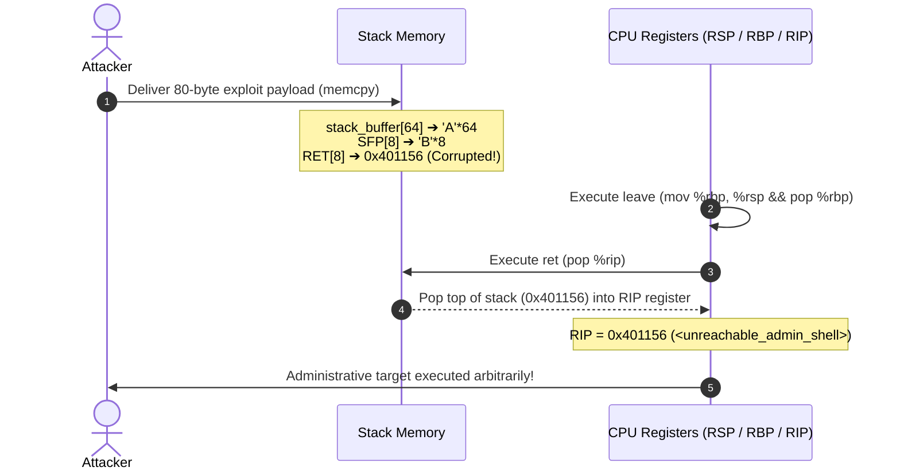

# 05. Classic Stack Buffer Overflow and Control Flow Hijacking (Buffer Overflow & Control Flow Hijack)

Investigating the classic binary exploitation flaw where unbounded input copies overflow stack buffers, **smashing the saved Return Address and hijacking the CPU Instruction Pointer (RIP)** to divert program execution.

---

## 1. Learning Objectives & Overview

- Trace the mechanics of legacy C functions (`strcpy()`, `gets()`, `memcpy()`) that omit input boundary checks.
- Step through the memory smashing progression across the local buffer, Saved RBP (SFP), and Return Address (RET).
- Examine how the `ret` epilogue pops the corrupted address into `RIP`, immediately granting arbitrary control flow.
- Connect this classic vulnerability to the modern trio of system protections: Stack Canary, NX/DEP, and ASLR.

---

## 2. Interactive Buffer Overflow & RIP Hijack Simulator

Observe how input bytes corrupt the stack and seize CPU control through the 4-phase interactive diagram below:

<div style="width: 100%; margin: 24px 0; border: 1px solid rgba(255,255,255,0.1); border-radius: 12px; overflow: hidden;">
  <iframe src="../../assets/diagrams/principles/05-bof-rip.html" style="width: 100%; border: none; display: block; overflow: hidden;" scrolling="no" onload="try { const c = this.contentWindow.document.getElementById('diagramCanvas'); if(c) this.style.height = Math.ceil(c.getBoundingClientRect().height) + 'px'; } catch(e){}"></iframe>
</div>

---

## 3. Vulnerability Mechanism: Unbounded Memory Copies

```c
void vulnerable_service(const char *user_input, size_t input_len) {
    char stack_buffer[64];
    /* Flaw: Copies data exceeding the 64-byte boundary of stack_buffer */
    memcpy(stack_buffer, user_input, input_len);
}
```

- Stack memory is populated from lower addresses (RSP) towards higher addresses.
- If user input exceeds 64 bytes, it spills beyond `stack_buffer`, systematically overwriting the **Saved Frame Pointer (8 bytes)** and the **Return Address (8 bytes)** located immediately above.

---

## 4. Exploit Payload Layout & RIP Redirection

Payload byte structure required to redirect control to an administrative shell routine (`unreachable_admin_shell` at `0x401156`):

```
[0x00 .. 0x3F] (64 bytes) : 'A' * 64 (Buffer padding)
[0x40 .. 0x47] ( 8 bytes) : 'B' * 8  (Overwrites Saved RBP / SFP)
[0x48 .. 0x4F] ( 8 bytes) : 0x0000000000401156 (Target Return Address)
Total: 80 bytes
```



---

## 5. Lab Source Code & Hijacking Verification

- **Lab Source Code**: [`bof_demo.c`](../../assets/labs/principles/05-bof-rip/bof_demo.c) (Local Asset) | [GitHub Source Code Repository :octicons-mark-github-16:](https://github.com/auking45/linux-kernel-hardening-lab/blob/main/labs/principles/05-bof-rip/bof_demo.c)
- **Dedicated Makefile**: [`Makefile`](../../assets/labs/principles/05-bof-rip/Makefile)

### 5.1 Normal In-Bounds Execution

```bash
cd labs/principles/05-bof-rip
make run-normal
```

```
============================================================
 Classic Buffer Overflow & RIP Hijacking Simulator
============================================================
[*] Target Function unreachable_admin_shell : 0x401156
[*] main() Function                         : 0x40124a

=== [Mode 1: Normal In-Bounds Operation] ===
[+] Sending safe payload (33 bytes) into 64-byte buffer.
--- [Stack State Before Input Copy] ---
  stack_buffer[0] Address : 0x7fffffffe000
  Saved RBP (SFP) Address : 0x7fffffffe040
  Saved RET Address       : 0x7fffffffe048 (points to: 0x401267)
  Buffer to RET Distance  : 72 bytes
---------------------------------------
[+] vulnerable_service() executing 'ret' instruction...
[+] Clean return from vulnerable_service()! Normal workflow resumed.
```

### 5.2 Exploit Execution (RIP Hijacking)

```bash
make run-attack
```

```
=== [Mode 2: Buffer Overflow & RIP Hijack Attack] ===
[+] Fabricated Exploit Payload (80 bytes):
    [0..63]  Buffer Padding   : 64 bytes of 'A' (0x41)
    [64..71] SFP / Saved RBP  : 8 bytes of 'B' (0x42)
    [72..79] Target RET Addr  : 0x401156 (unreachable_admin_shell)

[!] Delivering exploit payload into vulnerable_service()...
--- [Stack State Before Input Copy] ---
  Saved RET Address       : 0x7fffffffe048 (points to: 0x401267)
--- [Stack State After Input Copy] ---
  Saved RET Address now   : 0x7fffffffe048 (points to: 0x401156)
---------------------------------------
[+] vulnerable_service() executing 'ret' instruction...

============================================================
 [!] CRITICAL SECURITY COMPROMISE: Control Flow Hijacked!
============================================================
 [★] CPU Instruction Pointer (RIP/PC) redirected to:
     unreachable_admin_shell() at 0x401156!
 [★] Attacker gained arbitrary code execution in target process.
============================================================
```

---

## 6. Bridge to Modern Operating System Defenses

Classic buffer overflow exploits are thwarted on modern production systems by three foundational defense layers:

1. **Stack Canary (`-fstack-protector`)**:
   - Random cookie placed between local buffers and SFP; corrupting it triggers `__stack_chk_fail()` and terminates execution before `ret`.
2. **W^X / NX (Non-Executable Stack, DEP)**:
   - Eliminates execution privileges on writable stack pages; jumping to injected shellcode causes an immediate hardware trap.
3. **ASLR (Address Space Layout Randomization) & PIE**:
   - Randomizes binary and library addresses on each run, preventing attackers from predicting target function locations.

> [!TIP]
> With these foundational principles mastered, continue to the real-world humanoid robot exploit chain and kernel hardening defenses in the **[Attack Scenarios](../scenarios/index.md)** track.
