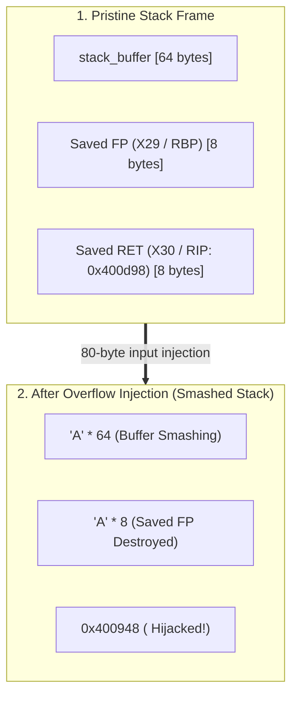
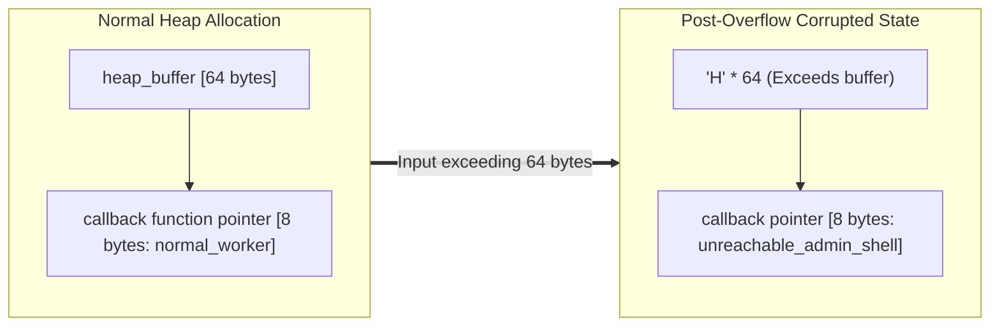

# 05. Classic Buffer Overflow and RIP/PC Hijacking (Buffer Overflow & Control Flow Hijack)

Analyzing foundational binary exploitation principles where missing boundary checks in C allow attacker-supplied input to overflow memory limits, **corrupt function pointers and return addresses, and hijack the CPU instruction pointer (PC / RIP)**. Features **AArch64 (ARM64)** as the default architecture for modern device and mobile system security, with comparative analysis against **x86_64** stack/heap frames and next-generation hardware defense mechanisms (ARM PAC/BTI vs. Intel CET).

---

## 1. Learning Objectives & Overview

- Identify vulnerability mechanisms in unconstrained memory copy functions (`memcpy()`, `strcpy()`, `gets()`).
- Master stack frame layouts (`Buffer` ➔ `Saved FP` ➔ `Saved RET`) and trace memory transitions using GDB inspection.
- Analyze crashes caused by single-byte partial overwrites vs. full control flow hijacking.
- Understand how **NOP Sleds** absorb runtime stack address drift caused by environment variables and argument lengths.
- Study **Heap Buffer Overflow (Heap BOF)** targeting function pointers within dynamically allocated structures.
- Review the fundamental mechanics of Format String vulnerabilities (`printf(buffer)`) and arbitrary memory manipulation.
- Evaluate the 5 multi-layered modern defense mechanisms (Canary, NX, ASLR, PAC/BTI, CET).

---

## 2. Interactive Buffer Overflow & PC/RIP Hijack Simulator

Step through the 4 progressive stages (normal state ➔ buffer overflow ➔ SFP/RET corruption ➔ PC/RIP redirection) in the interactive simulation below:

<div style="width: 100%; margin: 24px 0; border: 1px solid rgba(255,255,255,0.1); border-radius: 12px; overflow: hidden;">
  <iframe src="../../assets/diagrams/principles/05-bof-rip.html" style="width: 100%; border: none; display: block; overflow: hidden;" scrolling="no" onload="try { const c = this.contentWindow.document.getElementById('diagramCanvas'); if(c) this.style.height = Math.ceil(c.getBoundingClientRect().height) + 'px'; } catch(e){}"></iframe>
</div>

---

## 3. Root Causes & Environmental Preconditions

### 3.1 Dangerous Functions and Missing Boundary Checks

C delegates boundary verification to the programmer. Copying data exceeding destination capacity corrupts contiguous memory:

- **Strictly Deprecated**: `gets()` (lacks any parameter to specify buffer capacity).
- **High-Risk Functions**: `strcpy()`, `strcat()`, `sprintf()`, `scanf("%s")` (copies indefinitely until hitting null terminator `\0`).
- **Misused Functions**: `memcpy(dest, src, n)` (where length argument `n` exceeds destination allocation).

### 3.2 Environmental Preconditions for Classic Exploitation

Modern Linux distributions enforce multi-layered mitigations by default. Reproducing classic buffer overflows requires explicitly disabling these protections:

1. **Disable Kernel ASLR**:
   ```bash
   sudo sysctl -w kernel.randomize_va_space=0
   ```
2. **Disable Compiler Hardening Flags**:
   - `-fno-stack-protector`: Disables stack canaries.
   - `-z execstack`: Marks the stack executable (disables NX/DEP).
   - `-no-pie`: Fixes the code segment base address.

---

## 4. Stack-Based Buffer Overflow (Stack BOF)

### 4.1 Stack Frame Layout & Memory Trace

When a function executes, its stack frame is arranged from low to high memory:

```
[ Low Memory (SP / RSP) ]
  ▲  stack_buffer[0..63]      (Local buffer - 64 bytes)
  │  [Padding / Alignment]    (Compiler 16-byte stack alignment space)
  │  Saved Frame Pointer (FP) (Caller frame pointer: AArch64 X29 / x86_64 RBP - 8 bytes)
  │  Saved Return Address     (Caller return address: AArch64 X30 / x86_64 RET - 8 bytes)
[ High Memory ]
```



### 4.2 GDB Memory Tracing & Single-Byte Partial Overwrites

Using GDB to inspect the stack before and after overflow illustrates this memory transition:

1. **Pristine State Memory Dump (`x/16gx $sp`)**:
   ```
   (gdb) x/16gx $sp
   0x7fffffffe000: 0x4141414141414141 0x0000000000000000
   0x7fffffffe040: 0x00007fffffffe060 0x00000000004014bd
   ```
   - `0x00007fffffffe060`: Caller Saved Frame Pointer.
   - `0x00000000004014bd`: Valid Return Address returning to the caller.
2. **Single-Byte Partial Overwrite (Off-by-One)**:
   - Corrupting only the least significant byte of the return address (e.g. `0x004014bd` ➔ `0x00401400`):
   - Causes the CPU to return to invalid or corrupted instructions, triggering an immediate `SIGSEGV` crash.
3. **Full Return Address Smash**:
   - Overwriting all 8 bytes of the return address with the target function address (`unreachable_admin_shell`, `0x400948`) redirects execution immediately upon executing the function epilogue (`ret` / `ret x30`).

---

## 5. NOP Sledding & Stack Address Drift Tolerance

### 5.1 Stack Address Drift Problem

Even when ASLR is disabled, variations in environment variables (`envp`), argument lengths (`argv`), and stack alignment create slight address variances (drift) in the stack pointer (`SP`):

```c
/* Classical stack estimation function */
unsigned long get_esp(void) {
    __asm__("mov %rsp, %rax"); /* or mov %sp, %x0 */
}
```

### 5.2 NOP Sled Mechanics

Attackers prepend a large array of No-Operation (`NOP`) instructions ahead of the shellcode:

```
[ NOP Sledding Exploit Payload Layout ]
+---------------------------------------+---------------------+
| NOP Sled (\x90 or \x1f\x20\x03\xd5)   | Shellcode / Target  |
+---------------------------------------+---------------------+
▲                                       ▲
Estimated Jump Target Address           Actual Exploit Payload
```

- **Architecture-Specific NOP Opcodes**:
  - x86 / x86_64: `0x90` (`nop`)
  - AArch64: `0xd503201f` (`nop`)
- **Execution Mechanism**: As long as the corrupted return address lands anywhere within the NOP sled range, the CPU sequentially executes NOPs without fault, safely sliding down into the final shellcode.

---

## 6. Heap-Based Buffer Overflow (Heap BOF)

Buffer overflows are not confined to the stack; they occur identically within dynamically allocated memory managed by `malloc()` (the Slide Chapter 8.3 `heapexploit2` model):



```c
struct HeapTarget {
    char heap_buffer[64];
    void (*callback)(void); /* Adjacent function pointer */
};

struct HeapTarget *target = malloc(sizeof(struct HeapTarget));
target->callback = normal_worker;

/* Flaw: Overwrites beyond heap_buffer into adjacent callback pointer */
memcpy(target->heap_buffer, user_input, 72);

/* Indirect branch jumps to the hijacked function! */
target->callback();
```

- Heap buffer overflows corrupt **adjacent function pointers, C++ virtual method tables (vtables), and heap chunk metadata**, hijacking execution without touching stack return addresses.

---

## 7. Format String Vulnerabilities Overview

Introduced in Slide Chapter 8.4, format string vulnerabilities occur when user input is passed directly to output routines without a format specifier:

```c
/* Vulnerable Code Flaw */
printf(user_input); /* Correct Usage: printf("%s", user_input); */
```

- **Information Disclosure (`%x`, `%p`)**: Successively pops stack values, leaking ASLR base addresses and stack canaries.
- **Arbitrary Memory Write (`%n`)**: Writes the number of characters output so far to the pointed memory location, allowing attackers to overwrite return addresses or Global Offset Table (GOT) entries.

---

## 8. Lab Source Code & Verification Steps

- **Lab Source Code**: [`bof_demo.c`](../../assets/labs/principles/05-bof-rip/bof_demo.c) (Local Asset) | [GitHub Source Code Repository :octicons-mark-github-16:](https://github.com/auking45/linux-kernel-hardening-lab/blob/main/labs/principles/05-bof-rip/bof_demo.c)
- **Dedicated Makefile**: [`Makefile`](../../assets/labs/principles/05-bof-rip/Makefile)

### 8.1 Mode 1: Normal In-Bounds Operation

=== "AArch64 (Default Target)"
    ```bash
    cd labs/principles/05-bof-rip
    make run-normal
    ```

    ```
    === [1] Running Normal Mode [aarch64] ===
    qemu-aarch64 -L /usr/aarch64-linux-gnu ./bof_demo
    ============================================================
     Classic Buffer Overflow & Control Flow Hijack [AArch64]
    ============================================================
    [*] unreachable_admin_shell Address : 0x400948
    [*] normal_worker Address           : 0x400928
    [*] main() Function Address         : 0x400e7c

    === [Mode 1: Normal In-Bounds Operation] ===
    [+] Sending safe payload (33 bytes) into 64-byte buffer.
    --- [Stack State Before Input Copy] ---
      session.stack_buffer[0] Address : 0x4000007fee48
      session.dispatch_handler Addr   : 0x4000007fee88 (points to: 0x400928)
      Saved Frame Pointer (FP/X29/RBP): 0x4000007fee20
      Saved Return Address (LR/X30/RIP): 0x400d98
      Buffer to Handler Distance      : 64 bytes
    ---------------------------------------
    --- [Stack State After Input Copy] ---
      session.dispatch_handler now    : 0x400928
    ---------------------------------------
    [+] Invoking session.dispatch_handler()...
    [+] normal_worker() executed safely. Operation completed.
    ```

### 8.2 Mode 2: Stack Function Pointer Overwrite

=== "AArch64 (Default Target)"
    ```bash
    make run-attack
    ```

    ```
    === [2] Running Stack FP Hijack Attack [aarch64] ===
    qemu-aarch64 -L /usr/aarch64-linux-gnu ./bof_demo --stack-fp
    ...
    === [Mode 2: Stack Buffer Overflow (Function Pointer Hijack)] ===
    [+] Fabricated Exploit Payload (72 bytes):
        [0..63]  Buffer Padding   : 64 bytes of 'A' (0x41)
        [64..71] Hijacked Target  : 0x400948 (unreachable_admin_shell)

    [!] Delivering exploit payload into vulnerable_stack_service()...
    --- [Stack State After Input Copy] ---
      session.dispatch_handler now    : 0x400948
    ---------------------------------------
    [+] Invoking session.dispatch_handler()...

    ============================================================
     [!] CRITICAL SECURITY COMPROMISE: Control Flow Hijacked!
    ============================================================
     [★] CPU Instruction Pointer (RIP / PC) redirected to:
         unreachable_admin_shell() at 0x400948!
     [★] Attacker gained arbitrary code execution in target process.
    ============================================================
    ```

### 8.3 Mode 3: Heap Buffer Overflow (Slide 8.3)

=== "AArch64 (Default Target)"
    ```bash
    make run-heap
    ```

    ```
    === [3] Running Heap Buffer Overflow Attack [aarch64] ===
    qemu-aarch64 -L /usr/aarch64-linux-gnu ./bof_demo --heap-bof
    ...
    === [Mode 3: Heap Buffer Overflow (Slide Chapter 8.3 heapexploit2)] ===
    [*] Allocating struct HeapTarget (72 bytes) on heap via malloc()...
    --- [Heap Layout Before Overflow] ---
      target->heap_buffer[0] Addr   : 0x4216b0
      target->callback Pointer Addr : 0x4216f0 (points to: 0x400928)
      Buffer to Callback Distance   : 64 bytes
    -------------------------------------
    [+] Injecting 72 bytes into 64-byte heap_buffer...
    --- [Heap Layout After Overflow] ---
      target->callback Pointer now  : 0x400948
    ------------------------------------
    [!] Invoking target->callback() on heap...

    ============================================================
     [!] CRITICAL SECURITY COMPROMISE: Control Flow Hijacked!
    ============================================================
     [★] CPU Instruction Pointer (RIP / PC) redirected to:
         unreachable_admin_shell() at 0x400948!
    ============================================================
    ```

### 8.4 Mode 4: NOP Sled Tolerance Simulation

=== "AArch64 (Default Target)"
    ```bash
    make run-nop-sled
    ```

    ```
    === [4] Running NOP Sled Simulation [aarch64] ===
    qemu-aarch64 -L /usr/aarch64-linux-gnu ./bof_demo --nop-sled
    ...
    === [Mode 4: NOP Sled Simulation & Address Drift Tolerance] ===
    [*] Classical exploit challenge: Exact stack addresses drift across runs.
        Pre-pending NOP instructions allows imprecise jumps to glide into payload.

      NOP Opcode for Target Architecture : 0xd503201f (AArch64 'nop')
      NOP Sled Size                      : 32 instructions
      Shellcode Location                 : Offset +32

      [Sled Trace Visualizer]
      Offset 0x00: [ 0xd503201f (AArch64 'nop') ] (Glide forward)
      Offset 0x04: [ 0xd503201f (AArch64 'nop') ] (Glide forward)
      Offset 0x08: [ 0xd503201f (AArch64 'nop') ] (Glide forward)
      Offset ....: [ ... NOP Sledding ... ]
      Offset 0x20: [ ★ SHELLCODE / TARGET ENTRY ★ ] ➔ Execution succeeds!
    ```

=== "x86_64 (Comparative Target)"
    ```bash
    make ARCH=x86_64 run-attack
    make ARCH=x86_64 run-heap
    make ARCH=x86_64 run-nop-sled
    ```

    - Execute stack FP hijack, heap buffer overflow, and `0x90` NOP sled simulation natively on x86_64.

---

## 9. Modern 5-Layered Operating System Hardening Defenses

Modern operating systems deploy multi-layered defenses at the compiler, kernel, and hardware levels to mitigate classic buffer overflows:

| Defense Mechanism | AArch64 (ARMv8.3+ / ARMv8.5+) | x86_64 (Intel CET) | Core Principles & Mechanics |
| :--- | :--- | :--- | :--- |
| **Return Address Protection** | **PAC (Pointer Authentication)**<br/>(`paciasp` / `autiasp`) | **CET Shadow Stack**<br/>(Hardware Shadow Stack) | Cryptographically signs pointers with hardware keys or isolates return addresses in a dedicated hardware shadow stack |
| **Indirect Branch Protection** | **BTI (Branch Target Identification)**<br/>(`bti c`, `bti j`) | **CET IBT**<br/>(`ENDBR64` landing pad) | Raises hardware exceptions if indirect branches jump to instructions other than authorized landing pads |
| **Stack Canary** | Stack Canary (`-fstack-protector`) | Stack Canary (`-fstack-protector`) | Inserts random guard values at frame boundaries; immediately aborts process upon detecting corruption |
| **Memory Execution Prevention** | XN (Execute-Never / NX) | NX / DEP (No-Execute) | Revokes execution permissions on data pages (stack and heap) to enforce W^X |
| **Address Randomization** | ASLR & PIE | ASLR & PIE | Randomizes segment base addresses on each execution to defeat hardcoded jump predictions |

> [!TIP]
> With these foundational principles mastered, continue to **[Attack Scenarios](../scenarios/index.md)** to analyze real-world Linux CVE vulnerabilities and kernel hardening defenses.
