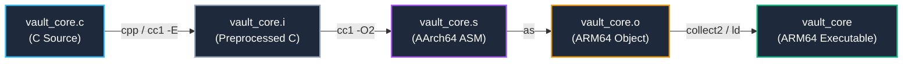
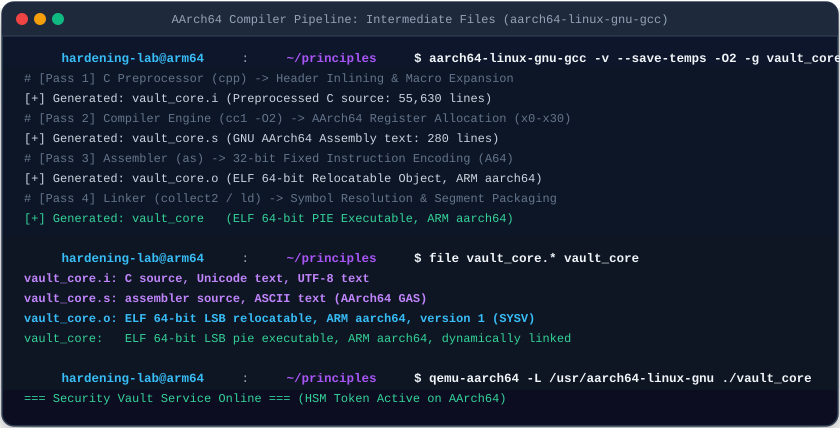
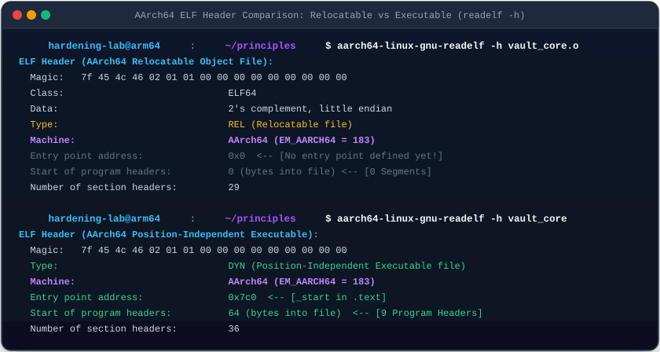
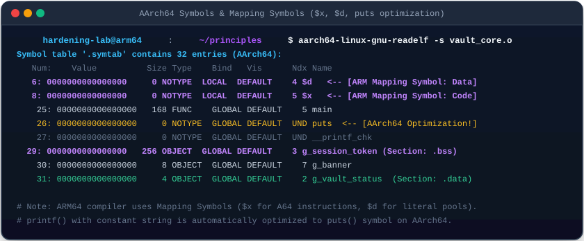

# 06. Compilation Pipeline & ELF File Format Deep Dive

In-depth analysis of the low-level compiler toolchain pipeline converting C source code into machine code, featuring **AArch64 (ARM64)** as the primary default architecture for modern device security alongside server/legacy **x86_64** in a **Dual-Architecture Dual-View** perspective.

---

## 1. Learning Objectives & Overview

- Trace the step-by-step compilation pipeline from C source code through the AArch64 cross-compiler (`aarch64-linux-gnu-gcc`) generating intermediate artifacts (`.i`, `.s`, `.o`).
- Perform a comparative analysis of the **ELF header (`Elf64_Ehdr`) and metadata** between relocatable object files (`.o`) and final executable binaries.
- Analyze the dual architectural design of ELF: **Linking View (Section-oriented, Section Header Table)** vs. **Execution View (Segment-oriented, Program Header Table)**.
- Investigate ARM64-specific **Mapping Symbols (`$x` code, `$d` data)** and compiler optimization behaviors (`printf` ➔ `puts`).
- Evaluate structural differences between **AArch64 device architectures and x86_64 server architectures**.

---

## 2. Interactive ELF File Structure & Dual-View Diagram

Interact with the diagram below to explore the mapping relationships between the ELF header, segments, sections, and W^X memory permission flags:

<div style="width: 100%; margin: 24px 0; border: 1px solid rgba(255,255,255,0.1); border-radius: 12px; overflow: hidden;">
  <iframe src="../../assets/diagrams/principles/06-elf-structure.html" style="width: 100%; border: none; display: block; overflow: hidden;" scrolling="no" onload="try { const c = this.contentWindow.document.getElementById('diagramCanvas'); if(c) this.style.height = Math.ceil(c.getBoundingClientRect().height) + 'px'; } catch(e){}"></iframe>
</div>

---

## 3. Compiler Toolchain Pipeline & Intermediate Artifacts

Lowering high-level C code to native CPU machine code proceeds through four sequential toolchain invocations:



### 3.1 Preserving Intermediate Artifacts via `-v --save-temps`

Passing `-v --save-temps` instructs the compiler to retain all intermediate pipeline files and print internal toolchain invocations:



=== "AArch64 (Default - Device)"
    ```bash
    aarch64-linux-gnu-gcc -v --save-temps -O2 -g vault_core.c -o vault_core 2> gcc_verbose.log
    file vault_core.* vault_core
    ```
    ```
    vault_core.i: C source, Unicode text, UTF-8 text
    vault_core.s: assembler source, ASCII text (AArch64 GAS syntax)
    vault_core.o: ELF 64-bit LSB relocatable, ARM aarch64, version 1 (SYSV)
    vault_core:   ELF 64-bit LSB pie executable, ARM aarch64, version 1 (SYSV), dynamically linked
    ```

=== "x86_64 (Server/Legacy)"
    ```bash
    gcc-13 -v --save-temps -O2 -g vault_core.c -o vault_core_x86 2> gcc_verbose.log
    file vault_core_x86.* vault_core_x86
    ```
    ```
    vault_core_x86.s: assembler source, ASCII text (x86_64 AT&T syntax)
    vault_core_x86.o: ELF 64-bit LSB relocatable, x86-64, version 1 (SYSV)
    vault_core_x86:   ELF 64-bit LSB pie executable, x86-64, version 1 (SYSV), dynamically linked
    ```

- **Pass 1: Preprocessing (`cpp / cc1 -E`)**: Inlines headers (`#include <stdio.h>`) and expands macros, outputting over 55,000 lines of expanded C source code in `vault_core.i`.
- **Pass 2: Compilation (`cc1`)**: Allocates AArch64 registers (`x0`~`x30`) and translates code into 32-bit fixed-length A64 instructions in `vault_core.s`.
- **Pass 3: Assembly (`as`)**: Encodes assembly instructions into binary machine code, outputting the relocatable object `vault_core.o`.
- **Pass 4: Linking (`collect2 / ld`)**: Resolves external symbol references, links startup routines, and bundles shared libraries (`libc.so`) to construct `vault_core`.

---

## 4. ELF Header Comparison: Relocatable (`.o`) vs. Executable

The kernel loader and linker determine the binary format and file layout by reading the 64-byte **ELF Header (`Elf64_Ehdr`)**:



```bash
# Inspect AArch64 Relocatable Object Header
aarch64-linux-gnu-readelf -h vault_core.o

# Inspect AArch64 Final Executable Binary Header
aarch64-linux-gnu-readelf -h vault_core
```

### 4.1 Comparative Header Field Analysis (Dual-Architecture Matrix)

| ELF Header Field (`Elf64_Ehdr`) | AArch64 Relocatable (`.o`) | AArch64 Executable | x86_64 Executable | Architectural Significance |
| :--- | :--- | :--- | :--- | :--- |
| **`e_ident[EI_MAG0..3]`** | `\x7fELF` | `\x7fELF` | `\x7fELF` | Magic bytes validated by the Linux kernel |
| **`e_machine`** | **`AArch64` (183)** | **`AArch64` (183)** | `x86-64` (62) | Hardware processor architecture target |
| **`e_type`** | `ET_REL` (Relocatable) | `ET_DYN` (PIE Executable) | `ET_DYN` (PIE Executable) | Object module vs. ASLR-supported executable |
| **`e_entry`** | `0x0` (Undefined) | `0x7c0` (`_start`) | `0x1190` (`_start`) | Relocatable objects have no entry point; executables define `_start` |
| **`e_phoff` / `e_phnum`** | `0` (0 entries) | `64` (9 entries) | `64` (13 entries) | Program Headers (memory segments) required by loader |
| **`e_shoff` / `e_shnum`** | `7920` (29 entries) | `71752` (36 entries) | `16832` (39 entries) | Section Headers offset and count |

---

## 5. Section Header Table & AArch64 Mapping Symbols (`$x`, `$d`)

The Section Header Table segregates code, data, and metadata, featuring unique AArch64 mapping symbols:



```bash
aarch64-linux-gnu-readelf -s vault_core.o
```

```
Symbol table '.symtab' contains 32 entries:
   Num:    Value          Size Type    Bind   Vis      Ndx Name
     6: 0000000000000000     0 NOTYPE  LOCAL  DEFAULT    4 $d
     8: 0000000000000000     0 SECTION LOCAL  DEFAULT    5 $x
    25: 0000000000000000   168 FUNC    GLOBAL DEFAULT    5 main
    26: 0000000000000000     0 NOTYPE  GLOBAL DEFAULT  UND puts
    27: 0000000000000000     0 NOTYPE  GLOBAL DEFAULT  UND __printf_chk
    29: 0000000000000000   256 OBJECT  GLOBAL DEFAULT    3 g_session_token
    30: 0000000000000000     8 OBJECT  GLOBAL DEFAULT    7 g_banner
    31: 0000000000000000     4 OBJECT  GLOBAL DEFAULT    2 g_vault_status
```

### 5.1 The Role of ARM Mapping Symbols

- **`$x` (A64 Code Mapping Symbol)**:
  - Informs the linker and disassembler that bytes beginning at this location are 32-bit fixed-width **AArch64 (A64) machine instructions**.
- **`$d` (Data Mapping Symbol)**:
  - Designates literal pools or constant data tables embedded in the code section.
  - Unique to the ARM architecture family; absent in x86_64.

### 5.2 Compiler Optimization & Section Placement Rules

1. **Automatic Optimization: `printf` ➔ `puts`**:
   - For calls like `printf("Security Vault Service Online\n")` containing only a constant string and trailing newline, the compiler (`cc1 -O2`) replaces the invocation with `puts()` to eliminate format string parsing overhead.
   - Formatted strings with format specifiers are dispatched to `__printf_chk`, leveraging glibc's built-in stack fortification.
2. **Section Placement Rules**:
   - `g_vault_status = 1` (Initialized Global): Placed in `.data` (writable).
   - `g_session_token[256]` (Uninitialized Buffer): Placed in `.bss` (NOBITS), consuming 0 bytes in the on-disk ELF file.
   - `g_banner = "..."` (String Constant): Placed in `.rodata` (read-only segment).

---

## 6. Practical Lab Source Code & Verification (Dual-Architecture)

- **Lab Source Code**: [`vault_core.c`](../../assets/labs/principles/06-elf-structure/vault_core.c) | [`elf_inspector.c`](../../assets/labs/principles/06-elf-structure/elf_inspector.c)
- **Lab Makefile**: [`Makefile`](../../assets/labs/principles/06-elf-structure/Makefile)

=== "AArch64 (Default - Device)"
    ```bash
    cd labs/principles/06-elf-structure

    # 1. Generate compilation pipeline intermediate files (AArch64)
    make pipeline

    # 2. Run AArch64 binary using QEMU user emulator
    make run

    # 3. Compare ELF headers (vault_core.o vs. vault_core)
    make inspect-header

    # 4. Inspect section headers (.text, .rodata, .data, .bss)
    make inspect-sections

    # 5. Check symbol table and $x, $d mapping symbols
    make inspect-symbols
    ```

=== "x86_64 (Server/Legacy)"
    ```bash
    # Build and run natively on host x86_64
    make pipeline ARCH=x86_64
    make run ARCH=x86_64
    make inspect-header ARCH=x86_64
    make inspect-symbols ARCH=x86_64
    ```

---

## 7. Summary & Next Module

- The compiler pipeline progressively refines code across 4 stages: preprocessing (`.i`), assembly text (`.s`), relocatable object (`.o`), and final executable.
- AArch64 ELF specifies machine architecture `EM_AARCH64 (183)` and utilizes mapping symbols (`$x`, `$d`) to differentiate code and literal pools.
- Next, explore cross-module name resolution in **[07. Symbol Resolution and Linking Mechanism](07-symbols-and-linking.md)**.
