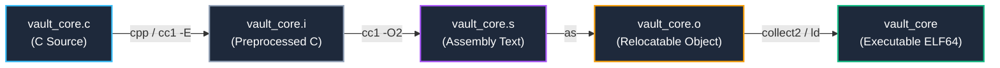

# 06. Compilation Pipeline & ELF File Format Deep Dive

In-depth analysis of the low-level compiler toolchain pipeline converting C source code into CPU machine code, and the dual-view architecture (**Linking View vs. Execution View**) of the Linux standard executable specification: **ELF (Executable and Linkable Format)**.

---

## 1. Learning Objectives & Overview

- Trace the step-by-step compilation pipeline from C source code through preprocessor (`cpp`), compiler engine (`cc1`), assembler (`as`), and linker (`ld`), inspecting intermediate artifacts (`.i`, `.s`, `.o`).
- Perform a comparative analysis of the **ELF header (`Elf64_Ehdr`) and metadata** between relocatable object files (`.o`) and final executable binaries.
- Analyze the dual architectural design of ELF: **Linking View (Section-oriented, Section Header Table)** vs. **Execution View (Segment-oriented, Program Header Table)**.
- Verify compiler optimization behaviors such as function substitution (`printf` ➔ `puts`), section partitioning (`.rodata`, `.data`, `.bss`), and DWARF debug information placement (`.debug_*`).

---

## 2. Interactive ELF File Structure & Dual-View Diagram

Interact with the diagram below to explore the mapping relationships between the ELF header, segments, sections, and W^X memory permission flags:

<div style="width: 100%; margin: 24px 0; border: 1px solid rgba(255,255,255,0.1); border-radius: 12px; overflow: hidden;">
  <iframe src="../../assets/diagrams/principles/06-elf-structure.html" style="width: 100%; border: none; display: block; overflow: hidden;" scrolling="no" onload="try { const c = this.contentWindow.document.getElementById('diagramCanvas'); if(c) this.style.height = Math.ceil(c.getBoundingClientRect().height) + 'px'; } catch(e){}"></iframe>
</div>

---

## 3. Compiler Toolchain Pipeline & Intermediate Artifacts

Lowering high-level C code to native CPU machine code proceeds through four sequential toolchain invocations:



### 3.1 Preserving Intermediate Artifacts via `-v --save-temps`

Passing `-v --save-temps` to GCC instructs the compiler to retain all intermediate pipeline files and print internal toolchain invocations:


```bash
gcc-13 -v --save-temps -O2 -g vault_core.c -o vault_core 2> gcc_verbose.log
file vault_core.* vault_core
```

```
vault_core.i: C source, Unicode text, UTF-8 text
vault_core.s: assembler source, ASCII text
vault_core.o: ELF 64-bit LSB relocatable, x86-64, version 1 (SYSV), with debug_info
vault_core:   ELF 64-bit LSB pie executable, x86-64, version 1 (SYSV), dynamically linked
```

- **Pass 1: Preprocessing (`cpp / cc1 -E`)**: Expands macros (`#define`), evaluates conditional compilation directives (`#ifdef`), and inlines header files (`#include <stdio.h>`), generating over 55,000 lines of expanded C source code in `vault_core.i`.
- **Pass 2: Compilation (`cc1`)**: Parses the syntax tree (AST), optimizes intermediate representations (GIMPLE/RTL), and outputs target-specific x86_64 assembly text in `vault_core.s`.
- **Pass 3: Assembly (`as`)**: Encodes assembly instructions into binary machine code, outputting the relocatable ELF object file `vault_core.o`.
- **Pass 4: Linking (`collect2 / ld`)**: Resolves external symbol references, merges sections, and links C runtime startup files (`crt1.o`, `crti.o`, `crtn.o`) and shared libraries (`libc.so`) to construct the final executable `vault_core`.

---

## 4. ELF Header Comparison: Relocatable (`.o`) vs. Executable

The kernel loader and static linker determine the binary format and file layout by reading the 64-byte **ELF Header (`Elf64_Ehdr`)** located at offset 0:


```bash
# Inspect Relocatable Object Header
readelf -h vault_core.o

# Inspect Final Executable Binary Header
readelf -h vault_core
```

### 4.1 Comparative Header Field Analysis

| ELF Header Field (`Elf64_Ehdr`) | `vault_core.o` (Relocatable) | `vault_core` (Executable Binary) | Architectural Significance |
| :--- | :--- | :--- | :--- |
| **`e_ident[EI_MAG0..3]`** | `\x7fELF` | `\x7fELF` | Magic bytes validated by the Linux kernel (`load_elf_binary`) |
| **`e_type`** | `ET_REL` (Relocatable) | `ET_DYN` (PIE Executable) | Non-executable object module vs. ASLR-supported standalone executable |
| **`e_entry`** | `0x0` (Undefined) | `0x1190` (`_start`) | Relocatable objects have no entry point; executables define `_start` |
| **`e_phoff` / `e_phnum`** | `0` (0 entries) | `64` (13 entries) | Program Headers (memory segments) exist only in loadable executables |
| **`e_shoff` / `e_shnum`** | `9816` (24 entries) | `16832` (39 entries) | Section Headers used by linkers; expanded in executables with runtime metadata |

---

## 5. Section Header Table & Compiler Optimization Analysis

The **Section Header Table** defines how individual chunks of code, data, and metadata are segregated for linker processing:


```bash
readelf -s vault_core.o
```

```
Symbol table '.symtab' contains 24 entries:
   Num:    Value          Size Type    Bind   Vis      Ndx Name
    18: 0000000000000000   272 FUNC    GLOBAL DEFAULT    6 main
    19: 0000000000000000     0 NOTYPE  GLOBAL DEFAULT  UND puts
    20: 0000000000000000     8 OBJECT  GLOBAL DEFAULT    8 g_banner
    21: 0000000000000000     0 NOTYPE  GLOBAL DEFAULT  UND __printf_chk
    22: 0000000000000000   256 OBJECT  GLOBAL DEFAULT    3 g_session_token
    23: 0000000000000000     4 OBJECT  GLOBAL DEFAULT    2 g_vault_status
```

### 5.1 Symbol Resolution & Optimization Mechanics

1. **Automatic Optimization: `printf` ➔ `puts`**:
   - For calls like `printf("Security Vault Active\n")` containing only a constant string and trailing newline, the compiler (`cc1 -O2`) replaces the invocation with `puts()` (Ndx=UND) to eliminate format string parsing overhead.
   - Formatted strings with format specifiers are dispatched to `__printf_chk`, leveraging glibc's built-in stack fortification.
2. **Section Placement Rules**:
   - `g_vault_status = 1` (Initialized Global): Assigned to `.data` (Ndx=2, writable data).
   - `g_session_token[256]` (Uninitialized Buffer): Assigned to `.bss` (Ndx=3, NOBITS), consuming zero bytes in the on-disk ELF file.
   - `g_banner = "..."` (String Constant): Placed in `.rodata` (read-only segment).

```bash
# Dump string constants from .rodata
readelf -p .rodata vault_core

# Inspect compiler toolchain version string (.comment section)
readelf -p .comment vault_core
```

---

## 6. Practical Lab Source Code & Verification

- **Lab Source Code**: [`vault_core.c`](../../assets/labs/principles/06-elf-structure/vault_core.c) | [`elf_inspector.c`](../../assets/labs/principles/06-elf-structure/elf_inspector.c)
- **Lab Makefile**: [`Makefile`](../../assets/labs/principles/06-elf-structure/Makefile)

### 6.1 Building and Inspecting Artifacts

```bash
cd labs/principles/06-elf-structure

# 1. Generate compilation pipeline intermediate files (.i, .s, .o)
make pipeline

# 2. Compare ELF headers (vault_core.o vs. vault_core)
make inspect-header

# 3. Inspect section headers (.text, .rodata, .data, .bss)
make inspect-sections

# 4. Dump string contents (.rodata, .comment)
make inspect-strings

# 5. Check symbol table and compiler puts optimization
make inspect-symbols

# 6. Verify DWARF debug sections (-g)
make inspect-debug
```

---

## 7. Summary & Next Module

- The compiler pipeline progressively refines code across 4 stages: preprocessing (`.i`), assembly text (`.s`), relocatable object (`.o`), and final executable.
- Relocatable objects (`.o`) contain only Section Headers for linkers, while executables add Program Headers (Segments) required by the Linux kernel loader.
- Next, explore how linkers resolve names across multiple object modules in **[07. Symbol Resolution and Linking Mechanism](07-symbols-and-linking.md)**.
