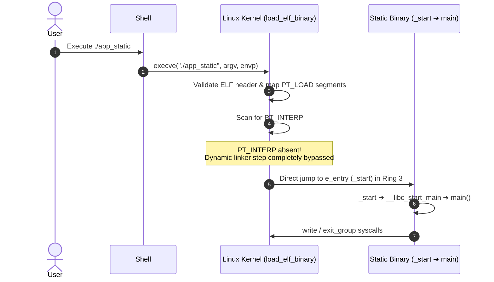

# 08. Static Linking and Binary Loading (Static Linking & Loading)

Examining how **Static Linking** bundles all dependent library code and C runtime routines directly into an ELF executable, and how the Linux kernel executes **self-contained binaries** without a dynamic linker.

---

## 1. Learning Objectives & Overview

- Understand static library archives (`.a`) and the selective module extraction algorithm of `ld`.
- Trace how compiling with `-static` inlines `libc.a` and `crt0.o` into the final executable.
- Examine how `load_elf_binary()` handles the absence of `PT_INTERP`, leaping directly to `_start`.
- Analyze the operational and security tradeoffs between static and dynamic linking.

---

## 2. Interactive Static Linking & Loading Timeline

Explore the static linking and direct kernel loading timeline below:

<div style="width: 100%; height: 600px; margin: 24px 0; border: 1px solid rgba(255,255,255,0.1); border-radius: 12px; overflow: hidden;">
  <iframe src="../../assets/diagrams/principles/08-static-loading.html" style="width: 100%; height: 100%; border: none;"></iframe>
</div>

---

## 3. Static Library Archive (`.a`) Mechanics

Static libraries are collections of uncompressed object files (`.o`) indexed by the `ar` utility:

```bash
ar rcs libops.a libops.o
```

- **Selective Extraction**:
  - The linker only extracts members defining symbols present in the unresolved symbol set ($U$).
  - As a result, linker command-line ordering matters (`gcc app.o -lops` succeeds, whereas `gcc -lops app.o` may fail).

---

## 4. Kernel Direct Loading Sequence

Statically linked binaries require no dynamic runtime interpreter:



---

## 5. Tradeoffs: Static vs Dynamic Linking

| Dimension | Static Linking (`-static`) | Dynamic Linking (Default) |
| :--- | :--- | :--- |
| **Binary Size** | Large (~952 KB with libc) | Small (~16 KB) |
| **Portability** | Completely standalone | Dependent on system glibc versions |
| **Memory Efficiency** | Separate code copy per process | Shared physical RX pages across processes |
| **Security Hijacking** | Immune to `LD_PRELOAD` injections | Susceptible to environment manipulation |
| **Vulnerability Patching** | Requires rebuilding all applications | Single shared library replacement patches all |

---

## 6. Lab Source Code & Metadata Comparison

- **Lab Source Code**: [`app.c`](../../assets/labs/principles/08-static-linking-loading/app.c) (Local Asset) | [GitHub Source Code Repository :octicons-mark-github-16:](https://github.com/auking45/linux-kernel-hardening-lab/blob/main/labs/principles/08-static-linking-loading/app.c)
- **Dedicated Makefile**: [`Makefile`](../../assets/labs/principles/08-static-linking-loading/Makefile)

### 6.1 Comparing Static and Dynamic Executables

```bash
cd labs/principles/08-static-linking-loading
make compare
```

```
=== [Binary Metadata Comparison] ===
file app_dyn
app_dyn: ELF 64-bit LSB executable, x86-64, version 1 (SYSV), dynamically linked, interpreter /lib64/ld-linux-x86-64.so.2, not stripped
file app_static
app_static: ELF 64-bit LSB executable, x86-64, version 1 (GNU/Linux), statically linked, with debug_info, not stripped

=== [Binary File Sizes] ===
ls -lh app_dyn app_static
-rwxr-xr-x 1 user user  16K app_dyn
-rwxr-xr-x 1 user user 952K app_static
```

### 6.2 Validating Dependencies (`ldd`)

```bash
make run-static
```

- Running `ldd app_static` confirms: `"not a dynamic executable"`.

---

## 7. Summary & Next Chapter

- Static linking yields portable, independent executables at the cost of disk space and shared memory caching.
- In the next chapter, we investigate the standard dynamic model: **[09. Dynamic Linking (PLT/GOT) and Runtime Loading (dlopen)](09-dynamic-linking-and-loading.md)**.
