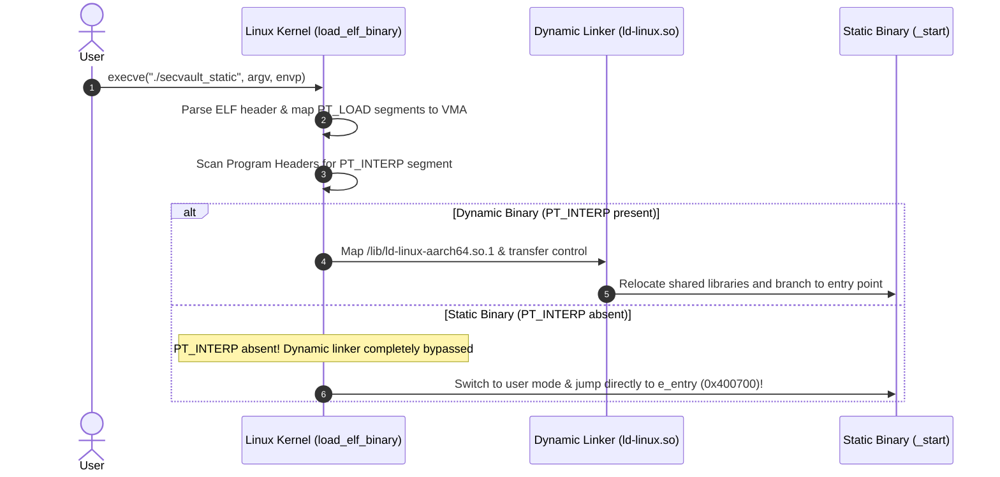

# 08. Static Linking & Binary Loading (Static Linking & Loading)

In-depth analysis of **Static Linking**, bundling all external libraries and C runtime routines into an autonomous binary, and the kernel's **Self-Contained Loading** mechanism bypassing the dynamic linker, featuring **AArch64 as the primary default architecture**.

---

## 1. Learning Objectives & Overview

- Deconstruct the internal archive format (`.a`) of static libraries and understand symbol indexing using `aarch64-linux-gnu-ar`.
- Analyze the linker's **Selective Extraction Algorithm** and investigate symbol resolution failures arising from command-line ordering dependencies.
- Investigate the Linux kernel's `load_elf_binary()` execution flow, observing how the absence of a `PT_INTERP` segment triggers a direct jump to the AArch64 entry point (`_start`, `0x400700`).
- Correlate on-disk `PT_LOAD` segments directly to runtime virtual memory layout across AArch64 and x86_64.
- Evaluate the engineering and security trade-offs between static and dynamic linking, including immunity against `LD_PRELOAD` environment variable hijacking.

---

## 2. Interactive Static Linking & Kernel Direct Loading Diagram

Interact with the 4-phase timeline below to observe archive member extraction, direct kernel invocation of `_start`, and architectural differences between static and dynamic executables:

<div style="width: 100%; margin: 24px 0; border: 1px solid rgba(255,255,255,0.1); border-radius: 12px; overflow: hidden;">
  <iframe src="../../assets/diagrams/principles/08-static-loading.html" style="width: 100%; border: none; display: block; overflow: hidden;" scrolling="no" onload="try { const c = this.contentWindow.document.getElementById('diagramCanvas'); if(c) this.style.height = Math.ceil(c.getBoundingClientRect().height) + 'px'; } catch(e){}"></iframe>
</div>

---

## 3. Static Library Archive (`.a`) Internals & Selective Extraction

A static library is an uncompressed archive container packaging multiple relocatable object files (`.o`) alongside an internal symbol table index:


```bash
# 1. Package relocatable object files into an AArch64 static library archive
aarch64-linux-gnu-ar rcs libsecure.a crypto_mac.o token_validator.o

# 2. List member modules packaged within the archive
aarch64-linux-gnu-ar -t libsecure.a

# 3. Inspect symbols defined across each member module
aarch64-linux-gnu-readelf -s libsecure.a
```

```
File: libsecure.a(crypto_mac.o) [AArch64]
    10: 0000000000000000    48 FUNC    GLOBAL DEFAULT    1 compute_mac
File: libsecure.a(token_validator.o) [AArch64]
    10: 0000000000000000    64 FUNC    GLOBAL DEFAULT    1 validate_security_token
```

### 3.1 Linker's Selective Module Extraction Algorithm

- The linker never copies the entire archive into the final binary.
- It examines the current set of unresolved external symbols ($U$) and extracts **only** those member object files that provide definitions satisfying entries in $U$.
- Unreferenced member objects (dead code) are omitted, minimizing binary bloat.
- **Command-Line Ordering Sensitivity**: Because the linker scans arguments from left to right, libraries must appear after the objects that reference them (`gcc secvault.o -lsecure`). Placing the library first causes the linker to ignore it because $U$ is empty at that point.

---

## 4. Kernel Loader (`load_elf_binary`) & `PT_INTERP` Absence

Applying the `-static` flag compiles the program as an independent binary with standard C library routines (`libc.a`) and startup code (`crt1.o`) embedded directly:



```bash
# Dynamic Binary: Explicit interpreter path defined (/lib/ld-linux-aarch64.so.1)
aarch64-linux-gnu-readelf -l secvault_dyn | grep -A 1 INTERP
  INTERP         0x0000000000000238 0x0000000000000238 0x0000000000000238
                 0x000000000000001b 0x000000000000001b  R      0x1

# Static Binary: PT_INTERP is absent
aarch64-linux-gnu-readelf -l secvault_static | grep -A 1 INTERP || echo "PT_INTERP is absent"
```

---

## 5. `PT_LOAD` Segments vs. Process Memory Mapping

Static executables are directly mapped into virtual memory areas (VMAs) by the kernel loader:


```bash
# Inspect segment loading directives in Program Headers (AArch64)
aarch64-linux-gnu-readelf -l secvault_static | grep -A 1 LOAD
```

```
  LOAD           0x0000000000000000 0x0000000000400000 0x0000000000400000
                 0x0000000000085188 0x0000000000085188  R E    0x10000
  LOAD           0x0000000000090000 0x00000000004a0000 0x00000000004a0000
                 0x00000000000089e8 0x000000000000f680  RW     0x10000
```

### 5.1 Kernel VMA 1:1 Correlation Matrix (Dual Architecture)

| Segment | AArch64 Static Binary | x86_64 Static Binary | Memory Flags | Architectural Purpose |
| :--- | :--- | :--- | :--- | :--- |
| **LOAD 1** | `VirtAddr: 0x400000`, `Size: 0x85188` | `VirtAddr: 0x400000`, `Size: 0x1b448` | `R E` / `R` | Executable code (`.text`, `_start`) & headers |
| **LOAD 2** | `VirtAddr: 0x4a0000`, `Size: 0x0f680` | `VirtAddr: 0x41c000`, `Size: 0x6f521` | `RW` / `R E` | Mutable data (`.data`, `.bss`) |
| **Page Size** | **64KB / 4KB** alignment (`0x10000`) | **4KB** alignment (`0x1000`) | - | AArch64 kernel supports 64KB huge pages |

---

## 6. Static vs. Dynamic Linking: Security & Footprint Trade-offs

```bash
ls -lh secvault_dyn secvault_static
file secvault_dyn
file secvault_static
```

```
-rwxr-xr-x 1 user user  70K secvault_dyn
-rwxr-xr-x 1 user user 620K secvault_static

secvault_dyn:    ELF 64-bit LSB pie executable, ARM aarch64, dynamically linked
secvault_static: ELF 64-bit LSB executable, ARM aarch64, statically linked
```

| Evaluation Area | Static Linking (`secvault_static`) | Dynamic Linking (`secvault_dyn`) | Security & Operational Impact |
| :--- | :--- | :--- | :--- |
| **Binary Footprint** | 620 KB (Bundles C runtime routines) | 70 KB (External dependency) | Static binaries ideal for standalone firmware/rescue |
| **External Dependencies**| Zero (`statically linked`) | glibc and dynamic loader required | Prevents version mismatch failures on deployment |
| **Library Hijacking** | **Completely Immune** (`LD_PRELOAD` ignored) | Susceptible to environment tampering | Attackers cannot hijack routines via `LD_PRELOAD` |
| **Patch Management** | Recompilation required for all binaries | Centralized `libc.so` update patches all | Dynamic linking is preferable for rapid OS patching |

---

## 7. Practical Lab Source Code & Verification (Dual-Architecture)

- **Lab Source Code**: [`secvault.c`](../../assets/labs/principles/08-static-linking-loading/secvault.c) | [`crypto_mac.c`](../../assets/labs/principles/08-static-linking-loading/crypto_mac.c) | [`token_validator.c`](../../assets/labs/principles/08-static-linking-loading/token_validator.c) | [`libsecure.h`](../../assets/labs/principles/08-static-linking-loading/libsecure.h)
- **Lab Makefile**: [`Makefile`](../../assets/labs/principles/08-static-linking-loading/Makefile)

=== "AArch64 (Default - Device)"
    ```bash
    cd labs/principles/08-static-linking-loading

    # 1. Build static library archive
    make libsecure.a

    # 2. Build both dynamic and static executables
    make secvault_dyn secvault_static

    # 3. Run static binary using QEMU
    make run-static

    # 4. Inspect archive member files and symbol table
    make inspect-archive

    # 5. Verify PT_INTERP segment absence
    make inspect-interp

    # 6. Check entry point address and disassemble _start
    make inspect-entry
    ```

=== "x86_64 (Server/Legacy)"
    ```bash
    # Build and compare natively on x86_64
    make compare ARCH=x86_64
    make run-static ARCH=x86_64
    make inspect-interp ARCH=x86_64
    ```

---

## 8. Summary & Next Module

- Static linking creates self-contained executables directly loaded by the kernel into VMA without requiring `PT_INTERP` or the dynamic loader.
- While static binaries offer complete immunity against library preload attacks, they introduce larger binary sizes and delayed security updates.
- Next, explore modern Linux runtime linking mechanisms in **[09. Dynamic Linking and Runtime Dynamic Loading](09-dynamic-linking-and-loading.md)**.
