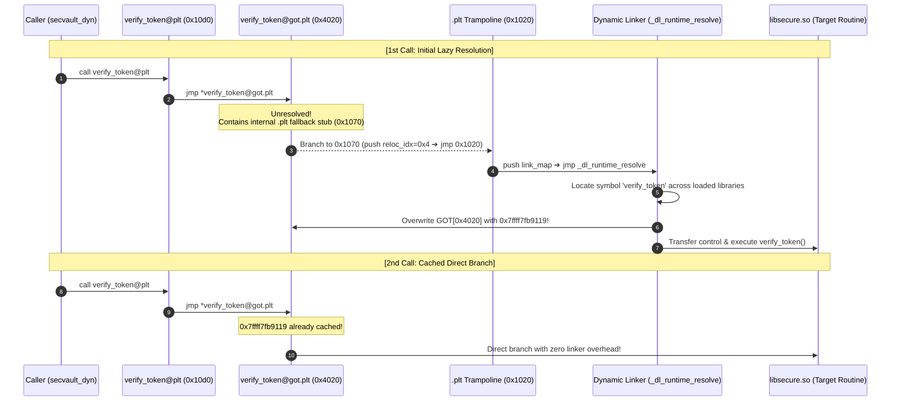
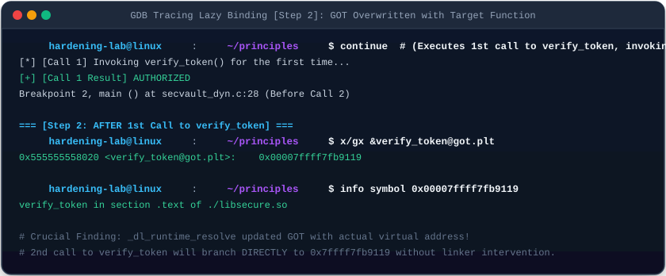

# 09. Dynamic Linking & Runtime Dynamic Loading (Dynamic Linking & Loading)

In-depth analysis of **Dynamic Linking (Shared Objects)** enabling physical memory deduplication and live patching across Linux processes, the low-level **PLT / GOT Lazy Binding** dispatch mechanism, and runtime on-demand module loading via the **`dlopen` API**.

---

## 1. Learning Objectives & Overview

- Understand **Position-Independent Code (PIC)** and indirect data addressing mechanisms enabling shared objects (`.so`) to share physical executable pages (RX) across independent processes.
- Inspect the `.dynamic` section and identify runtime library dependencies cataloged under `DT_NEEDED` tags.
- Trace the low-level collaboration between the **Procedure Linkage Table (PLT)** and **Global Offset Table (GOT)** across 1st-call lazy binding resolution and 2nd-call direct caching using GDB.
- Deconstruct the `Elf64_Rela` relocation entry byte structure for `R_X86_64_JUMP_SLOT`.
- Analyze security implications including **GOT Overwrite attacks** and mitigation mechanisms enforced by **Full RELRO (`-z relro -z now`)**.
- Implement modular dynamic loading workflows using the C `dlopen()`, `dlsym()`, and `dlclose()` APIs.

---

## 2. Interactive PLT/GOT & dlopen Architecture Diagram

Interact with the 3 modes below to trace 1st-call lazy binding resolution, 2nd-call direct branch execution, and runtime `dlopen` plugin loading:

<div style="width: 100%; margin: 24px 0; border: 1px solid rgba(255,255,255,0.1); border-radius: 12px; overflow: hidden;">
  <iframe src="../../assets/diagrams/principles/09-dynamic-linking.html" style="width: 100%; border: none; display: block; overflow: hidden;" scrolling="no" onload="try { const c = this.contentWindow.document.getElementById('diagramCanvas'); if(c) this.style.height = Math.ceil(c.getBoundingClientRect().height) + 'px'; } catch(e){}"></iframe>
</div>

---

## 3. Position-Independent Code (PIC) & Dynamic Linker Metadata

Under ASLR, shared libraries (`libsecure.so`) may be loaded into completely different virtual memory addresses across different process address spaces:

- Code segments cannot contain hardcoded absolute addresses. Instead, all external functions and global data are accessed indirectly via the **Global Offset Table (GOT)** located in the writable data segment (`-fPIC`).
- ELF binaries specify the dynamic linker (`ld-linux-x86-64.so.2`) via the `PT_INTERP` segment and catalog dependency shared libraries under `DT_NEEDED` tags in the `.dynamic` section.

```bash
# Inspect dynamic interpreter path
readelf -p .interp secvault_dyn

# Inspect dynamic dependencies (DT_NEEDED)
readelf -d secvault_dyn | grep -E 'NEEDED|RPATH|RUNPATH'
```

```
 0x0000000000000001 (NEEDED)             Shared library: [libsecure.so]
 0x0000000000000001 (NEEDED)             Shared library: [libc.so.6]
 0x000000000000001d (RUNPATH)            Library runpath: [.]
```

---

## 4. Low-Level Lazy Binding Pipeline Mechanics

While modern compilers frequently default to Full RELRO, classic Unix systems and high-throughput environments rely on **Lazy Binding (`-Wl,-z,lazy`)** to defer symbol resolution until a function is explicitly invoked:



---

## 5. Live GDB Tracing: Observing Lazy Binding State Transitions

Tracing `secvault_dyn` with GDB provides concrete evidence of how the GOT entry at `0x555555558020` transitions across two successive calls to `verify_token()`:

### 5.1 Step 1: Before the 1st Call (Unresolved State)

Prior to the initial invocation, the GOT slot points directly back to the `.plt` trampoline stub:


```bash
gdb -q -nx ./secvault_dyn
(gdb) b main && run
(gdb) x/gx &verify_token@got.plt
0x555555558020 <verify_token@got.plt>:    0x0000555555555070

(gdb) x/2i 0x0000555555555070
   0x555555555070:  endbr64
   0x555555555074:  push   $0x4        # Slot index in .rela.plt
   0x555555555079:  jmp    0x555555555020 # .plt header (_dl_runtime_resolve)
```

### 5.2 Step 2: After the 1st Call (Resolved State)

The dynamic resolver (`_dl_runtime_resolve`) overwrites the GOT entry with the genuine target address:



```bash
(gdb) continue # Execute 1st call
[*] [Call 1] Invoking verify_token() for the first time...
[+] [Call 1 Result] AUTHORIZED

(gdb) x/gx &verify_token@got.plt
0x555555558020 <verify_token@got.plt>:    0x00007ffff7fb9119

(gdb) info symbol 0x00007ffff7fb9119
verify_token in section .text of ./libsecure.so
```

- Subsequent invocations skip the resolver entirely, jumping directly to `0x7ffff7fb9119` in `libsecure.so`.

---

## 6. Dynamic Relocation Table & `Elf64_Rela` Structure

The dynamic linker inspects relocation entries in `.rela.plt` to link unresolved symbols to GOT addresses:


```bash
readelf -r secvault_dyn
```

```
Relocation section '.rela.plt' at offset 0x668 contains 5 entries:
  Offset          Info           Type           Sym. Value        Sym. Name + Addend
  000000004020  000500000007 R_X86_64_JUMP_SLOT 0000000000000000 verify_token + 0
```

### 6.1 `Elf64_Rela` Byte Breakdown

```c
typedef struct {
    Elf64_Addr   r_offset; /* 0x00004020 : Target GOT slot offset to overwrite (8B) */
    Elf64_Xword  r_info;   /* 0x000500000007 : Symbol Index (High 32b) + Reloc Type (Low 32b) (8B) */
    Elf64_Sxword r_addend; /* 0x00000000 : Explicit addend value (8B) */
} Elf64_Rela; /* Total 24 bytes */
```

- **`r_offset = 0x4020`**: Memory address of `verify_token`'s GOT entry relative to `_GLOBAL_OFFSET_TABLE_`.
- **`r_info = 0x000500000007`**:
  - High 32 bits (`0x5`): Index 5 within the dynamic symbol table (`.dynsym`).
  - Low 32 bits (`0x7`): Relocation identifier `R_X86_64_JUMP_SLOT`.

---

## 7. Security Implications: GOT Overwrite vs. Full RELRO

- **GOT Overwrite Vulnerability**:
  - Because lazy binding requires in-flight updates to `.got.plt`, the GOT region remains writable (`rw-p`).
  - Memory corruption exploits (format string bugs, heap overflows) can overwrite a GOT pointer with an arbitrary address (such as `system()`), hijacking control flow upon the next function invocation.
- **Defense Mechanism: Full RELRO (`-Wl,-z,relro,-z,now`)**:
  - Eliminates lazy binding by forcing the dynamic linker to resolve all imported symbols during process initialization.
  - Immediately marks the entire GOT region as **read-only (`r--p`) via `mprotect`**, permanently preventing runtime pointer modification.

---

## 8. Runtime Dynamic Loading API (`dlopen` / `dlsym`)

Standard C interface for on-demand shared object loading without static link-time declarations:

```c
#include <dlfcn.h>

void *handle = dlopen("./libplugin.so", RTLD_NOW);
int (*exec)(int) = dlsym(handle, "plugin_execute");
exec(42);
dlclose(handle);
```

---

## 9. Practical Lab Source Code & Verification

- **Lab Source Code**: [`secvault_dyn.c`](../../assets/labs/principles/09-dynamic-linking-loading/secvault_dyn.c) | [`libsecure.c`](../../assets/labs/principles/09-dynamic-linking-loading/libsecure.c) | [`dlopen_demo.c`](../../assets/labs/principles/09-dynamic-linking-loading/dlopen_demo.c) | [`plugin.c`](../../assets/labs/principles/09-dynamic-linking-loading/plugin.c) | [`trace_got.gdb`](../../assets/labs/principles/09-dynamic-linking-loading/trace_got.gdb)
- **Lab Makefile**: [`Makefile`](../../assets/labs/principles/09-dynamic-linking-loading/Makefile)

```bash
cd labs/principles/09-dynamic-linking-loading

# 1. Execute dynamically linked binary
make run

# 2. Run runtime dlopen dynamic plugin execution
make run-dlopen

# 3. Inspect PT_INTERP and DT_NEEDED dependencies
make inspect-interp
make inspect-dynamic

# 4. Examine PLT stubs and GOT relocation entries
make inspect-got

# 5. Execute automated GDB script tracing lazy binding GOT updates
make trace-lazy-binding
```

---

## 10. Summary & Transition to Hardening Modules

- Dynamic linking maximizes memory reuse across processes via Position-Independent Code (PIC) and PLT/GOT indirection.
- Lazy binding resolves functions on the initial call and branches directly on subsequent invocations.
- Having mastered fundamental system principles, proceed to the **[Kernel Hardening Features Reference](../features/index.md)** and hands-on **[Attack Scenarios](../scenarios/index.md)** to explore real-world mitigation architectures.
