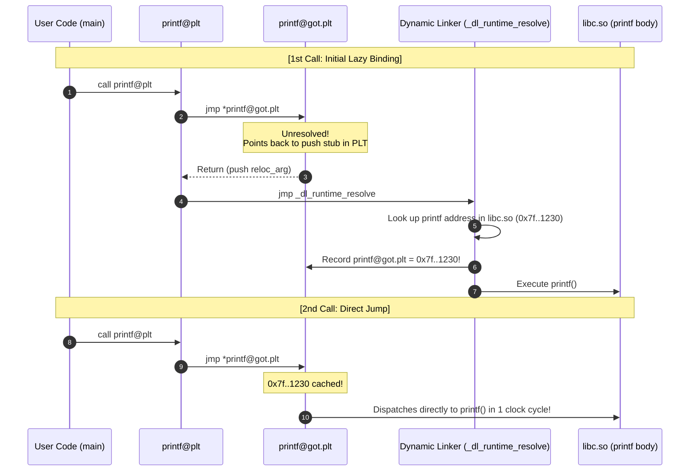

# 09. Dynamic Linking and Runtime Loading (Dynamic Linking & Loading)

Investigating how **Dynamic Linking** and Shared Objects (`.so`) optimize memory, the mechanics of **PLT (Procedure Linkage Table)** and **GOT (Global Offset Table)** during **Lazy Binding**, and runtime plugin architectures via the **`dlopen` API**.

---

## 1. Learning Objectives & Overview

- Understand why **Position-Independent Code (PIC, `-fPIC`)** is essential for sharing physical code pages across multiple processes.
- Trace how the dynamic linker (`ld-linux.so`) cooperates with the **PLT and GOT** to resolve symbols at runtime.
- Contrast the first execution (lazy binding resolution) with subsequent calls (direct dispatch).
- Analyze the **GOT Overwrite vulnerability** and the **Full RELRO (`-z relro -z now`)** mitigation.
- Build and execute dynamic plugins using `dlopen()`, `dlsym()`, and `dlclose()`.

---

## 2. Interactive PLT/GOT & dlopen Diagram

Step through the three modes (Lazy Binding, Direct Jump, dlopen API) below:

<div style="width: 100%; height: 600px; margin: 24px 0; border: 1px solid rgba(255,255,255,0.1); border-radius: 12px; overflow: hidden;">
  <iframe src="../../assets/diagrams/principles/09-dynamic-linking.html" style="width: 100%; height: 100%; border: none;"></iframe>
</div>

---

## 3. Position-Independent Code (PIC) & The GOT

Shared library text (`libc.so`) must remain identical across processes even when mapped to varying virtual addresses (ASLR):

- As a result, code pages cannot contain hardcoded absolute addresses.
- All global data and external function references are dispatched indirectly through the **Global Offset Table (GOT)**, located at a known relative offset from the code.

---

## 4. PLT / GOT Lazy Binding Pipeline

When an application invokes an external library function such as `printf()`:



---

## 5. Security: GOT Overwrite vs Full RELRO

- **GOT Overwrite Exploit**:
  - To permit lazy binding, `.got.plt` must remain writable (`rw-p`) throughout execution.
  - Attackers exploiting arbitrary write flaws can overwrite `printf@got` with `system()`, executing shell commands upon subsequent `printf()` calls.
- **Defense: Full RELRO (Read-Only Relocations)**:
  - Compile with `-Wl,-z,relro,-z,now`.
  - Resolves all external symbols at startup (Immediate Binding), then marks `.got` strictly **Read-Only (`r--p`)**, permanently blocking overwrites.

---

## 6. Runtime Dynamic Loading (`dlopen` / `dlsym`)

Loading shared objects programmatically on demand:

```c
#include <dlfcn.h>

void *handle = dlopen("./libplugin.so", RTLD_NOW);
int (*run)(int) = dlsym(handle, "plugin_execute");
run(42);
dlclose(handle);
```

---

## 7. Lab Source Code & Verification

- **Lab Source Code**: [`dlopen_demo.c`](../../assets/labs/principles/09-dynamic-linking-loading/dlopen_demo.c) (Local Asset) | [GitHub Source Code Repository :octicons-mark-github-16:](https://github.com/auking45/linux-kernel-hardening-lab/blob/main/labs/principles/09-dynamic-linking-loading/dlopen_demo.c)
- **Dedicated Makefile**: [`Makefile`](../../assets/labs/principles/09-dynamic-linking-loading/Makefile)

### 7.1 Running Runtime `dlopen` Demo

```bash
cd labs/principles/09-dynamic-linking-loading
make run-dlopen
```

```
=== [1] Running Runtime Dynamic Loading (dlopen) ===
./dlopen_demo
============================================================
 Runtime Dynamic Loading (dlopen / dlsym Demonstration)
============================================================
[+] Opening shared library at runtime: ./libplugin.so
[+] Library mapped into address space! Handle: 0x3b0326d0
[+] Resolved symbol 'plugin_name'    at address: 0x7fa7329a5110
[+] Resolved symbol 'plugin_execute' at address: 0x7fa7329a5120

[*] Plugin Name Result  : High-Precision Telemetry Sensor Plugin v1.0
[libplugin.so] Executing telemetry calculation on input=10...
[*] Plugin Execute Result: 427

[+] Calling dlclose(0x3b0326d0) to unmap library...
[+] Library safely unmapped from process memory.
============================================================
```

---

## 8. Summary & Curriculum Bridge

- Dynamic linking maximizes memory efficiency and enables modular extension via `dlopen`.
- With these fundamentals mastered, explore kernel-level protections in the **[Hardening Features Reference](../features/index.md)** and full exploit chains in **[Attack Scenarios](../scenarios/index.md)**.
