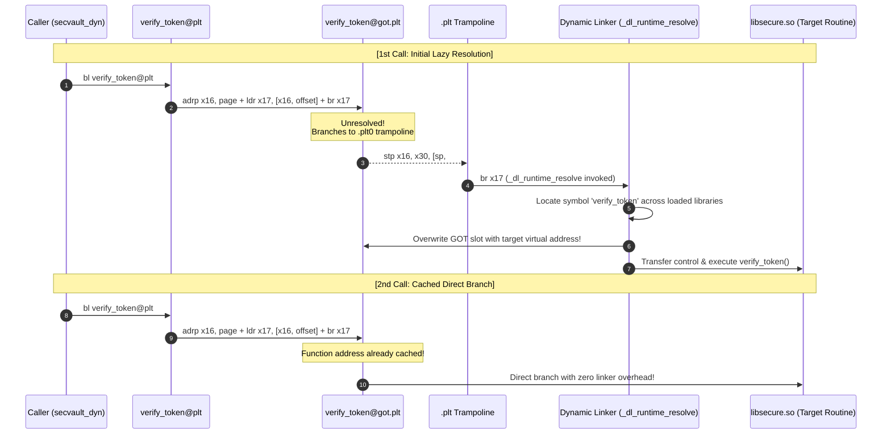
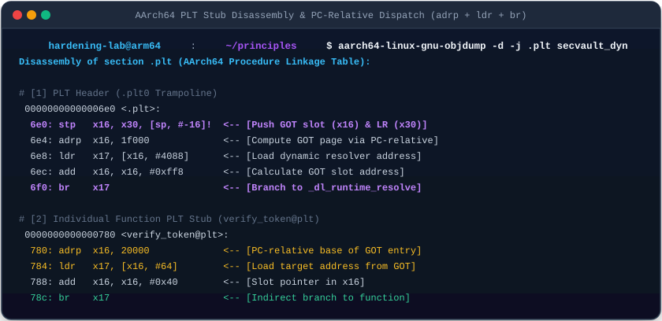
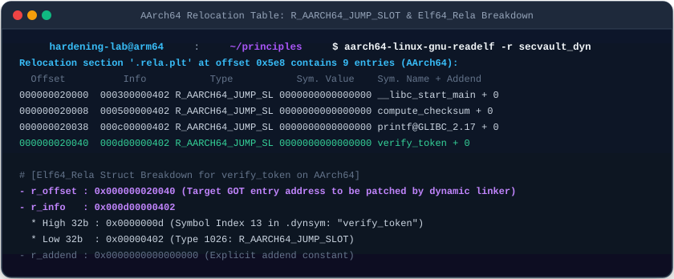

# 09. Dynamic Linking & Runtime Dynamic Loading (Dynamic Linking & Loading)

In-depth analysis of **Dynamic Linking (Shared Objects)** enabling physical memory deduplication across Linux processes, the low-level **PLT / GOT Lazy Binding** dispatch mechanism, and runtime module loading via the **`dlopen` API**, featuring **AArch64 as the primary default architecture**.

---

## 1. Learning Objectives & Overview

- Understand **Position-Independent Code (PIC)** and indirect data addressing mechanisms enabling shared objects (`.so`) to share physical executable pages (RX) across independent processes.
- Inspect the `.dynamic` section and identify runtime library dependencies cataloged under `DT_NEEDED` tags in `ld-linux-aarch64.so.1`.
- Trace the architectural differences between **AArch64 PLT indirect branching (`adrp` + `ldr` + `br x17`)** and x86_64 indirect jumping (`jmp *GOT`).
- Investigate the **`.plt0` trampoline** preserving the GOT slot pointer (`x16`) and Link Register return address (`x30`) via `stp x16, x30, [sp, #-16]!`.
- Deconstruct the `Elf64_Rela` relocation entry byte structure for `R_AARCH64_JUMP_SLOT`.
- Analyze security implications including **GOT Overwrite attacks**, mitigations enforced by **Full RELRO (`-z relro -z now`)**, and ARMv8.5+ **BTI / PAC** hardware guardrails.

---

## 2. Interactive PLT/GOT & dlopen Architecture Diagram

Interact with the 3 modes below to trace 1st-call lazy binding resolution, 2nd-call direct branch execution, and runtime `dlopen` plugin loading:

<div style="width: 100%; margin: 24px 0; border: 1px solid rgba(255,255,255,0.1); border-radius: 12px; overflow: hidden;">
  <iframe src="../../assets/diagrams/principles/09-dynamic-linking.html" style="width: 100%; border: none; display: block; overflow: hidden;" scrolling="no" onload="try { const c = this.contentWindow.document.getElementById('diagramCanvas'); if(c) this.style.height = Math.ceil(c.getBoundingClientRect().height) + 'px'; } catch(e){}"></iframe>
</div>

---

## 3. Position-Independent Code (PIC) & Dynamic Linker Metadata

Under ASLR, shared libraries (`libsecure.so`) may be loaded into completely different virtual memory addresses across different process address spaces:

- Code segments cannot contain hardcoded absolute addresses. Instead, all external functions and global data are accessed indirectly via the **Global Offset Table (GOT)** located in the writable data segment (`-fPIC`).
- ELF binaries specify the dynamic linker via `PT_INTERP` and catalog dependency shared libraries under `DT_NEEDED` tags in `.dynamic`.

```bash
# Inspect dynamic interpreter path (AArch64)
aarch64-linux-gnu-readelf -p .interp secvault_dyn

# Inspect dynamic dependencies (DT_NEEDED)
aarch64-linux-gnu-readelf -d secvault_dyn | grep -E 'NEEDED|RPATH|RUNPATH'
```

```
 0x0000000000000001 (NEEDED)             Shared library: [libsecure.so]
 0x0000000000000001 (NEEDED)             Shared library: [libc.so.6]
 0x000000000000001d (RUNPATH)            Library runpath: [.]
```

---

## 4. Low-Level Lazy Binding Pipeline Mechanics

While modern compilers default to Full RELRO, classic high-throughput environments utilize **Lazy Binding (`-Wl,-z,lazy`)** to defer symbol resolution until explicit function invocation:



---

## 5. AArch64 vs. x86_64 PLT Disassembly Comparison



=== "AArch64 (Default - Device)"
    ```armasm
    ; 1. Individual Function PLT Stub (verify_token@plt)
    0000000000000780 <verify_token@plt>:
     780:  90000110  adrp  x16, 20000        ; Compute 4KB page of GOT via PC-relative
     784:  f9402211  ldr   x17, [x16, #64]   ; Load address from GOT[verify_token]
     788:  91010210  add   x16, x16, #0x40   ; Place relocation slot pointer in x16
     78c:  d61f0220  br    x17               ; Branch indirectly to x17

    ; 2. Common PLT Header (.plt0 Trampoline)
    00000000000006e0 <.plt>:
     6e0:  a9bf7bf0  stp   x16, x30, [sp, #-16]! ; Push GOT slot (x16) & return address (LR x30)
     6e4:  f00000f0  adrp  x16, 1f000            ; Resolver page address
     6e8:  f947fe11  ldr   x17, [x16, #4088]     ; Load _dl_runtime_resolve address
     6ec:  913fe210  add   x16, x16, #0xff8
     6f0:  d61f0220  br    x17                   ; Direct jump to dynamic resolver
    ```

=== "x86_64 (Server/Legacy)"
    ```nasm
    ; 1. Individual Function PLT Stub (verify_token@plt.sec)
    00000000000010d0 <verify_token@plt>:
      10d0: endbr64
      10d4: jmp    *0x2f46(%rip)        ; Direct indirect jump via GOT slot (0x4020)

    ; 2. Common PLT Header (.plt)
    0000000000001020 <.plt>:
      1020: push   0x2fca(%rip)         ; Push link_map
      1026: jmp    *0x2fcc(%rip)        ; Jump to _dl_runtime_resolve
    ```

- **AArch64 Architectural Advantage**: AArch64 uses `adrp` and `ldr` with 4KB page granularity, enabling precise PC-relative displacement control.
- **Hardware Guards**: In AArch64, indirect branch targets (`br x17`) are guarded by **BTI (`bti c`)**, trapping illegal landing branches with hardware SIGILL exceptions.

---

## 6. Dynamic Relocation Table & `Elf64_Rela` Structure

The dynamic linker inspects relocation entries in `.rela.plt` to link unresolved symbols to GOT addresses:



```bash
aarch64-linux-gnu-readelf -r secvault_dyn
```

```
Relocation section '.rela.plt' at offset 0x5e8 contains 9 entries:
  Offset          Info           Type           Sym. Value    Sym. Name + Addend
000000020040  000d00000402 R_AARCH64_JUMP_SL 0000000000000000 verify_token + 0
```

### 6.1 `Elf64_Rela` Byte Breakdown (AArch64)

```c
typedef struct {
    Elf64_Addr   r_offset; /* 0x000000020040 : Target GOT entry address to overwrite (8B) */
    Elf64_Xword  r_info;   /* 0x000d00000402 : Symbol Index (High 32b) + Reloc Type (Low 32b) (8B) */
    Elf64_Sxword r_addend; /* 0x000000000000 : Explicit addend value (8B) */
} Elf64_Rela; /* Total 24 bytes */
```

- **`r_offset = 0x20040`**: Memory address of `verify_token`'s GOT entry.
- **`r_info = 0x000d00000402`**:
  - High 32 bits (`0xd = 13`): Index 13 within `.dynsym` (`verify_token`).
  - Low 32 bits (`0x402 = 1026`): Relocation identifier `R_AARCH64_JUMP_SLOT`.

---

## 7. Security Implications: GOT Overwrite vs. Full RELRO & BTI/PAC

- **GOT Overwrite Vulnerability**:
  - Because lazy binding requires in-flight updates to `.got.plt`, the GOT region remains writable (`rw-p`).
  - Memory corruption exploits can overwrite a GOT pointer with an arbitrary address, hijacking control flow upon the next invocation.
- **Defense 1: Full RELRO (`-Wl,-z,relro,-z,now`)**:
  - Eliminates lazy binding by forcing the dynamic linker to resolve all imported symbols on startup.
  - Immediately marks the entire GOT region as **read-only (`r--p`) via `mprotect`**, permanently preventing runtime pointer modification.
- **Defense 2: ARM64 Hardware Guardrails (BTI & PAC)**:
  - **BTI (Branch Target Identification)**: Verifies that indirect branch targets (`br x17`) land strictly on valid `bti c` landing pads.
  - **PAC (Pointer Authentication)**: Signs the Link Register (`x30`) saved on the stack with cryptographic PAC keys (`paciasp`/`autiasp`), preventing ROP exploitation.

---

## 8. Practical Lab Source Code & Verification (Dual-Architecture)

- **Lab Source Code**: [`secvault_dyn.c`](../../assets/labs/principles/09-dynamic-linking-loading/secvault_dyn.c) | [`libsecure.c`](../../assets/labs/principles/09-dynamic-linking-loading/libsecure.c) | [`dlopen_demo.c`](../../assets/labs/principles/09-dynamic-linking-loading/dlopen_demo.c) | [`plugin.c`](../../assets/labs/principles/09-dynamic-linking-loading/plugin.c) | [`trace_got.gdb`](../../assets/labs/principles/09-dynamic-linking-loading/trace_got.gdb)
- **Lab Makefile**: [`Makefile`](../../assets/labs/principles/09-dynamic-linking-loading/Makefile)

=== "AArch64 (Default - Device)"
    ```bash
    cd labs/principles/09-dynamic-linking-loading

    # 1. Execute AArch64 dynamic binary via QEMU
    make run

    # 2. Run runtime dlopen dynamic plugin execution
    make run-dlopen

    # 3. Inspect PT_INTERP and DT_NEEDED dependencies
    make inspect-interp
    make inspect-dynamic

    # 4. Examine PLT stubs and GOT relocation entries
    make inspect-got

    # 5. Inspect AArch64 PLT indirect branch structure
    make trace-lazy-binding
    ```

=== "x86_64 (Server/Legacy)"
    ```bash
    # Execute natively and run batch GDB tracing on x86_64
    make run ARCH=x86_64
    make trace-lazy-binding ARCH=x86_64
    ```

---

## 9. Summary & Transition to Hardening Modules

- Dynamic linking maximizes memory reuse across processes via Position-Independent Code (PIC) and PLT/GOT indirection.
- AArch64 dispatches indirect branches via `adrp` and `br x17`, reinforced by BTI and PAC hardware protection.
- Having mastered fundamental system principles, proceed to the **[Kernel Hardening Features Reference](../features/index.md)** and hands-on **[Attack Scenarios](../scenarios/index.md)** to explore real-world mitigation architectures.
