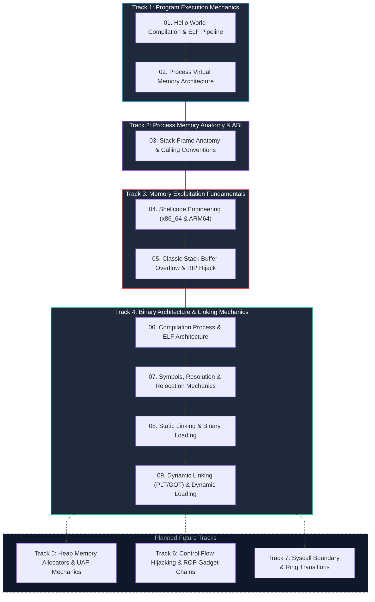

# System Security Principles & Program Execution Mechanics

Starting from the most foundational question—**"How does a simple Hello World program get compiled, loaded, and executed on a CPU?"**—this curriculum investigates the immutable principles of system security: Linux process memory layouts, the System V/ARM64 ABI function calling conventions, machine-level shellcode engineering, and classic stack buffer overflow exploitation leading to instruction pointer (RIP) hijacking.

---

## 🎯 Pedagogical Objectives & Core Philosophy

1. **Bottom-Up Systems Perspective**:
   - Trace how high-level C code transforms through assembly and ELF relocatable objects into an executable binary, and how the Linux kernel's `execve()` and MMU materialize it into an isolated process.
2. **Diagram-Driven Intuitive Visualization**:
   - Render unseen memory byte streams, stack growth dynamics, and CPU register transitions through responsive, interactive HTML diagrams.
3. **Extensible Modular Curriculum**:
   - Establish a track-based modular hierarchy capable of seamless expansion into advanced tracks such as dynamic linking/PLT/GOT, heap allocation mechanics, ROP gadget chaining, and kernel system call transitions.

---

## 🗺️ Curriculum Roadmap

---

## 📚 Course Modules & Hands-on Lab Overview

| Chapter | Topic & Core Focus | Key Concepts Covered | Dedicated Lab Code | Status |
| :---: | :--- | :--- | :--- | :---: |
| **01** | **[Hello World Execution Lifecycle](01-hello-world-pipeline.md)** | C Source ➔ Preprocessing ➔ Compilation ➔ Assembly ➔ Linking ➔ `execve` Kernel Ingress ➔ `load_elf_binary` ➔ `_start` ➔ `main()` | `readelf`, `objdump`, `nm`, `strace` | Active |
| **02** | **[Process Anatomy & Virtual Address Space](02-virtual-memory-layout.md)** | 64-bit Virtual Address Partitioning, Canonical Hole, Text/Data/BSS/Heap/mmap/Stack Segment Permissions (W^X) | `/proc/[pid]/maps` dump | Active |
| **03** | **[Stack Frame Mechanics & Calling Convention (ABI)](03-stack-frame-and-abi.md)** | Downward Stack Growth, Prologue (`push rbp; mov rbp, rsp`), Epilogue (`leave; ret`), SFP, RET Address Offset Math | System V AMD64 vs ARM64 AAPCS | Active |
| **04** | **[Shellcode Architecture & Opcode Engineering](04-shellcode-engineering.md)** | Machine Opcode Structure, `execve("/bin/sh")` Syscall Setup, Null-Byte (`\x00`) Elimination, Position Independence (PIC) | x86_64 & ARM64 Null-Free Shellcode | Active |
| **05** | **[Classic Stack Buffer Overflow & Control Flow](05-stack-bof-rip.md)** | Unchecked Memory Copying, Buffer ➔ SFP ➔ RET Smash Pipeline, Arbitrary Code Execution & Modern Defense Bridge (Canary, NX, ASLR) | Buffer Overflow Simulator | Active |
| **06** | **[Compilation Process & ELF Architecture](06-compilation-and-elf.md)** | AST ➔ IR ➔ ASM Pipeline, Linking View vs Execution View, `PT_LOAD`, `PT_INTERP`, `PT_GNU_STACK` | C-based `Elf64_Ehdr` parser | Active |
| **07** | **[Symbols, Resolution & Relocation Mechanics](07-symbols-and-linking.md)** | Symbol Table (`Elf64_Sym`), Three Rules of Strong vs Weak, Relocation Formula (`S + A - P`) & Instruction Patching | Weak Symbol Override Lab | Active |
| **08** | **[Static Linking & Binary Loading](08-static-linking-and-loading.md)** | Static Archive (`.a`), Inlined `libc.a`, `PT_INTERP` Absence and Direct Kernel `_start` Jump | Static Archive & Self-Contained Binary | Active |
| **09** | **[Dynamic Linking (PLT/GOT) & Runtime Loading](09-dynamic-linking-and-loading.md)** | Shared Objects (`.so`), Position-Independent Code (PIC), PLT/GOT Lazy Binding, GOT Overwrite vs Full RELRO, `dlopen` | PLT/GOT Inspector & `dlopen` Plugin | Active |

---

## 🚀 Get Started

Begin your journey with the foundational software build pipeline and operating system process loading in **[01. Hello World Lifecycle and ELF Execution Pipeline](01-hello-world-pipeline.md)**.
