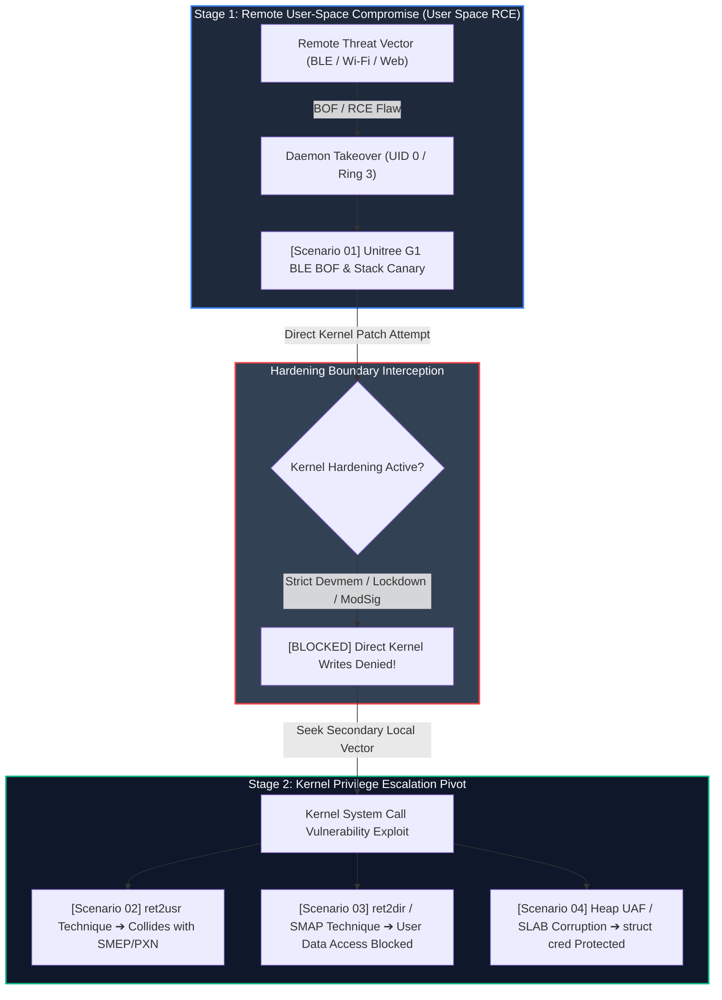

# Attack Scenarios & Hardening Defense

This section moves away from static reference manuals and approaches security from a problem-solving perspective, analyzing **real-world Cyber-Physical System (CPS) and humanoid robotics attack kill chains** and how **Linux kernel hardening features** intercept them.

---

## 🎯 Educational Approach: "From Attacker's Perspective to Defender's Guard"

While the `Features` tab acts as an encyclopedic specification of 44 hardening features, `Attack Scenarios` provides a **cause-and-effect problem-solving pipeline**:

1. **Real-World CVE Case Studies**: Analysis of real vulnerabilities disclosed in commercial humanoid robots (e.g., Unitree G1 EDU) and embedded Linux.
2. **Cyber-Physical Impact Modeling**: Tracing how memory corruption translates directly into physical hazards (actuator torque runaway, gait disruption, safety interlock overrides).
3. **Vertical Flow Architecture Diagrams**: Interactive timeline diagrams designed for seamless top-to-bottom storytelling without tab switching.
4. **Progressive Disclosure**: High-level presentation summaries paired with register-level engineering deep-dive references.

---

## 🗺️ Humanoid Robotics Security Scenario Roadmap

| Scenario | Core Vulnerability & Technique | Real-World CVE Precedent | Primary & Secondary Defenses | Status |
| :---: | :--- | :--- | :--- | :---: |
| **01** | **[Stack Buffer Overflow (BOF)](01-humanoid-bof.md)** | **CVE-2026-76640** (Unitree G1 EDU BLE Daemon BOF ➔ Locomotion PC Root) | **Stack Protector** & **Fortify Source** | <span style="color: #22c55e; font-weight: bold;">Active</span> |
| **02** | **Return-to-User (ret2usr)** | **CVE-2017-7308** (Packet Socket Bug ➔ User Shellcode Execution) | **SMEP** (x86) & **PXN** (ARM64) | Planned |
| **03** | **User Data Access (ret2dir / SMAP)** | **CVE-2016-8655** (Packet Socket UAF ➔ User Data Tampering) | **SMAP** (x86) & **PAN** (ARM64) | Planned |
| **04** | **Heap UAF & SLAB Corruption** | **CVE-2022-0185** (fs_context Heap BOF ➔ `struct cred` Overwrite) | **SLAB Freelist Hardening** & **KFENCE** | Planned |
| **05** | **Control Flow Hijacking (CFI)** | **CVE-2021-4154** (Type Confusion ➔ Indirect Function Pointer Hijack) | **Clang kCFI** & **ARM64 PAC/BTI** | Planned |
| **06** | **Side-Channel & Speculative Leaks** | **CVE-2018-3646** / **Spectre v1/v2** (AI Vision Accelerator vs CPU Leaks) | **array_index_nospec** & **Retpoline/KPTI** | Planned |

---

## 3. 🛡️ Core Architectural Principle: Rooting (UID 0 / Ring 3) vs Kernel Space (Ring 0) {: #security-boundary-root-vs-kernel }

Many system administrators and developers mistakenly assume that **"once root (UID 0) is compromised, the attacker commands absolute and omnipotent control over the entire OS and hardware"**. From the Linux kernel architecture perspective, however, **user-space root privilege (Rooting) and kernel execution control (Kernel Compromise) represent fundamentally distinct security boundaries**:

```
+---------------------------------------------------------------------------------------+
| [USER SPACE (Ring 3 / EL0)]                                                           |
|   - Unprivileged User (UID 1000)                                                      |
|   - Root Administrator (UID 0) <=== Attacker landing zone via daemon RCE (Scenario 01)|
|     * Controls filesystem (/etc, configs) and standard network stack                  |
|     * [Hardware Isolation] CANNOT execute CPU privileged opcodes or touch phys memory!|
+---------------------------------------------------------------------------------------+
       │
       │ === [Hardware Privilege Transition Boundary (System Call / Exception)] ===
       │ (Kernel Hardening Defenses: Lockdown LSM, Module Signing, Strict Devmem)
       ▼
+---------------------------------------------------------------------------------------+
| [KERNEL SPACE (Ring 0 / EL1)]                                                         |
|   - MMU page table manipulation, kernel text/data, interrupt descriptors (IDT/VBAR)   |
|   - Full hardware sovereignty (Kernel hardening defeat, persistent stealth rootkits)  |
+---------------------------------------------------------------------------------------+
```

### 3.1 Separation of User Identity (UID) and Hardware Execution Privilege (Ring)

The Linux security model operates on a dual-tiered foundation: **Operating System Identity Separation** and **Hardware Execution Ring Isolation**:

1. **User ID (UID 0 vs UID 1000) — OS Logical Credential**:
   - Managed within the kernel's credential descriptor (`struct cred`) as a logical integer value.
   - UID 0 (`root`) satisfies standard POSIX filesystem permission checks (`rwxr-xr-x`) and Linux Capabilities (`CAP_SYS_ADMIN`, `CAP_NET_ADMIN`, etc.).
   - However, from the CPU hardware perspective, **a UID 0 process remains strictly confined within unprivileged user mode (Ring 3 / EL0)**.

2. **CPU Execution Rings (Ring 3 vs Ring 0) — Hardware Circuit Isolation**:
   - Enforced directly by CPU circuitry (x86_64 CPL register, ARM64 CurrentEL register).
   - Tasks in Ring 3 (EL0) are forbidden from modifying MMU page tables or writing to hardware control registers (x86 `CR0`, `CR3`, `CR4` / ARM `SCTLR_EL1`, `TTBR0/1_EL1`).
   - Any attempt to execute privileged opcodes in user mode triggers an immediate hardware **Illegal Instruction (`SIGILL`)** or **General Protection Fault (`#GP`)** exception.

---

### 3.2 Four Critical Operations Blocked by Kernel Hardening Even Under Root (UID 0)

In legacy Linux systems, obtaining root permitted trivial transitions to Ring 0 by patching `/dev/mem` or inserting arbitrary loadable kernel modules (LKMs). In a **modern hardened Linux kernel**, however, the following actions remain strictly intercepted and blocked even for UID 0:

| Target Operation | Attacker's Objective | Intercepting Kernel Hardening Mechanism | Defense Impact & Outcome |
| :--- | :--- | :--- | :--- |
| **Direct Physical Memory & Kernel Patching** | Inject shellcode or inline hooks into live kernel memory | `CONFIG_STRICT_DEVMEM`<br>+ Kernel Lockdown LSM (`integrity` mode) | Access to `/dev/mem` or `/dev/kmem` rejected with `EPERM` even for UID 0 |
| **Unsigned Malicious Kernel Module Loading** | Insert persistent Ring 0 rootkits via LKMs | `CONFIG_MODULE_SIG_FORCE`<br>+ `CONFIG_MODULE_SIG_ALL` | `init_module()` syscall immediately rejected without trusted private key signature |
| **CPU Privileged Control Register Modification** | Disable SMEP/SMAP bits or alter MMU page directories | Hardware Ring 3 Trap<br>(CPU CPL / Exception Level validation) | Instructions like `mov %rax, %cr4` trigger immediate CPU `#GP` / `SIGILL` traps |
| **System Binary & Boot Parameter Tampering** | Replace boot binaries or hijack execution via kexec | IMA (Integrity Measurement) / EVM<br>+ `CONFIG_KEXEC_SIG` | Unverified binary execution denied and unsigned kernel kexec pivots blocked |

---

### 3.3 The Inevitable Attack Chain Evolution: Daemon Compromise to Kernel Pivot

Because of this impenetrable hardware and kernel hardening boundary between Ring 3 and Ring 0, realistic attacker kill chains cannot conclude with a single exploit. Attackers are **forced into a multi-stage pivoting lifecycle**:



1. **Stage 1 (Scenario 01 - Initial Ingress)**:
   - Attackers compromise memory flaws (BOF) in exposed network daemons, attaining user-space administrative credentials (UID 0).
2. **Boundary Interception (Hardening Wall)**:
   - Despite root credentials, kernel hardening defenses (`Strict Devmem`, `Lockdown`, `Module Signing`) thwart attempts to deploy kernel rootkits or seize hardware sovereignty.
3. **Stage 2 (Scenarios 02 through 06 - Kernel Escapes)**:
   - Attackers must pivot to local privilege escalation (LPE) flaws in syscall handlers or network subsystems to break from Ring 3 into Ring 0.
   - Intercepting attempts to pivot execution into user shellcode constitutes **[Scenario 02. ret2usr & SMEP/PXN Defense]**, while blocking kernel heap corruption constitutes **[Scenario 04. Heap UAF & SLAB Hardening]**.

---

## 4. 🚀 Get Started

Begin with the foundational memory corruption flaw disclosed in modern humanoids: **[Scenario 01: Humanoid Wireless Daemon Buffer Overflow and Stack Canary Defense](01-humanoid-bof.md)**.

