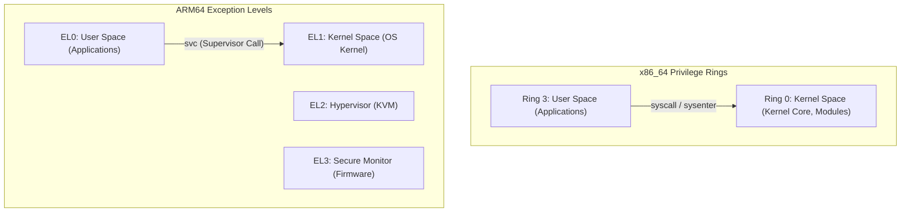

# 커널 메모리 모델 및 보안 아키텍처 (Memory & Protection Models)

x86_64 및 arm64 아키텍처의 가상 메모리 분할 구조, 특권 레벨 모델 및 커널 하드닝 방어 계층 분석.

---

## 1. 특권 레벨 모델 비교

---

## 2. 64비트 가상 주소 공간 분할 (Virtual Address Space)

### 2.1 x86_64 (48-bit / 4-Level Paging 기준)
- `0x0000_0000_0000_0000` ~ `0x0000_7FFF_FFFF_FFFF` (128TB): **유저 공간 (User Space)**
- `0x0000_8000_0000_0000` ~ `0xFFFF_7FFF_FFFF_FFFF`: 비정규 주소 홀 (Canonical Hole)
- `0xFFFF_8000_0000_0000` ~ `0xFFFF_FFFF_FFFF_FFFF` (128TB): **커널 공간 (Kernel Space)**
  - Direct Mapping (페이지-프레임 매핑)
  - vmalloc / ioremap 영역
  - Module / Kernel Text 영역 (`CONFIG_RANDOMIZE_BASE`에 의해 난수화 적용)

### 2.2 ARM64 (48-bit VA 기준, TTBR0 vs TTBR1)
- `0x0000_0000_0000_0000` ~ `0x0000_FFFF_FFFF_FFFF`: **TTBR0_EL1** (유저 공간)
- `0xFFFF_0000_0000_0000` ~ `0xFFFF_FFFF_FFFF_FFFF`: **TTBR1_EL1** (커널 공간)
- 하드웨어 레벨에서 상위 주소 레지스터(TTBR1)와 하위 주소 레지스터(TTBR0)가 엄격히 분리되어 동작함.

---

## 3. 커널 하드닝의 다중 방어 계층 (Defense-in-Depth)

