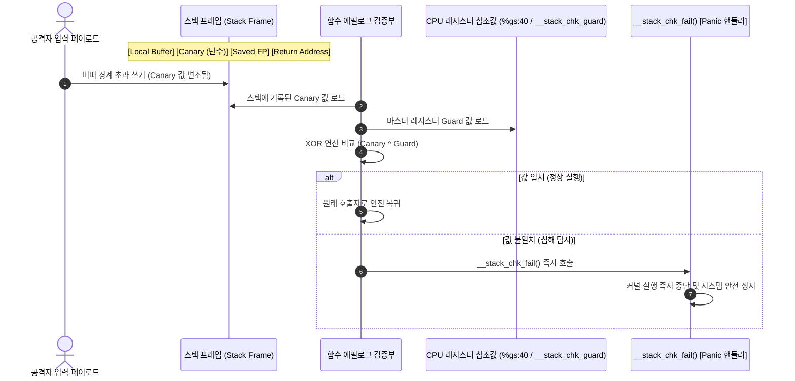

# 스택 보호기 (Stack Protector: `CONFIG_STACKPROTECTOR_STRONG`)

컴파일러 주입 방식의 스택 카나리(Stack Canary)를 통한 커널 함수 리턴 주소 변조 탐지 및 스택 버퍼 오버플로우 공격 원천 차단 메커니즘 분석.

---

## 1. 개요 및 위협 모델 (Overview & Threat Model)

- **방어 대상 취약점**:
  - 스택 기반 버퍼 오버플로우 (Stack-based Buffer Overflow).
  - 스택 프레임의 저장된 프레임 포인터(SFP) 및 함수 리턴 주소(Return Address: RIP / LR) 변조.
  - 리턴 주소 덮어쓰기를 통한 ROP(Return-Oriented Programming) 체인 진입 및 임의 커널 코드 실행.
- **공격 시나리오 및 위협 벡터**:
  - 커널 드라이버나 시스템 콜 내부에서 경계 검사 없는 메모리 복사(`memcpy`, `strcpy`, 잘못된 루프 인덱스) 발생.
  - 공격자가 로컬 배열 버퍼를 초과하여 상위 주소로 악성 데이터를 연속 기록함.
  - 함수가 호출자에게 복귀하는 시점에 조작된 리턴 주소로 분기하여 Ring 0 권한 상승(Privilege Escalation) 유도함.

---

## 2. 방어 아키텍처 및 메커니즘 (Architecture & Mechanism)

### 2.1 인터랙티브 시스템 맵 (Archify Diagram)

아래 인터랙티브 다이어그램에서 버튼을 조작하여 **정상 실행 흐름**, **오버플로우 방어 시퀀스**, 그리고 **x86_64 vs ARM64 레지스터 차이**를 직접 탐색 가능함:

<div class="archify-container">
  <iframe src="../../assets/diagrams/stack-protector/architecture.html" width="100%" height="450px" frameborder="0"></iframe>
</div>

---

### 2.2 방어 시퀀스 다이어그램 (Mermaid)



---

### 2.3 아키텍처별 어셈블리 구현 상세 비교

#### (1) x86_64 어셈블리 메커니즘

컴파일러는 함수 프롤로그에서 세그먼트 레지스터 `%gs` 기반 Per-CPU 스토리지 오프셋(`0x28` 또는 `0x40`)에서 난수를 읽어 스택에 배치함:

```nasm
; [x86_64 함수 프롤로그: 카나리 삽입]
pushq   %rbp
movq    %rsp, %rbp
subq    $0x50, %rsp
movq    %gs:40, %rax          ; Per-CPU 전용 영역에서 카나리 난수 로드
movq    %rax, -8(%rbp)        ; 리턴 주소 바로 아래 스택에 저장
xorl    %eax, %eax            ; 레지스터에 남은 카나리 값 소거 (누출 방지)

; ... 함수 본문 실행 (취약한 버퍼 연산 발생) ...

; [x86_64 함수 에필로그: 카나리 검증]
movq    -8(%rbp), %rax        ; 스택에 저장된 카나리 값 로드
xorq    %gs:40, %rax          ; 마스터 카나리 값과 XOR 비교
jne     .L_stack_chk_fail     ; 0이 아니면(변조 시) 패닉 분기
leave
ret

.L_stack_chk_fail:
call    __stack_chk_fail      ; 커널 패닉 유발
```

#### (2) ARM64 (aarch64) 어셈블리 메커니즘

ARM64에서는 전역 심볼 `__stack_chk_guard`로부터 가드 값을 읽어 스택 포인터 기준 상대 오프셋에 저장함:

```nasm
; [ARM64 함수 프롤로그: 카나리 삽입]
stp     x29, x30, [sp, -80]!  ; FP(x29)와 LR(x30) 스택 저장
mov     x29, sp
adrp    x8, __stack_chk_guard
ldr     x8, [x8, :lo12:__stack_chk_guard]
str     x8, [sp, 72]          ; 스택 상단에 카나리 값 저장

; ... 함수 본문 실행 ...

; [ARM64 함수 에필로그: 카나리 검증]
ldr     x9, [sp, 72]          ; 스택의 카나리 값 로드
subs    x8, x8, x9            ; 원본과 스택 값의 감산 비교
b.ne    .L_panic_branch       ; 결과가 0이 아니면 실패 분기
ldp     x29, x30, [sp], 80    ; FP, LR 복원 후 정상 반환
ret

.L_panic_branch:
bl      __stack_chk_fail      ; 패닉 핸들러 호출
```

---

### 2.4 실전 ROP(Return-Oriented Programming) 체인과 스택 버퍼 오버플로우의 작동 원리

#### (1) 도미노(Domino) 비유로 이해하는 ROP 체인의 본질

ROP(Return-Oriented Programming)를 처음 접할 때 복잡한 어셈블리와 스택 포인터 이동 때문에 많은 엔지니어가 어려움을 겪음. 이를 **"도미노 쓰러뜨리기"**에 비유하면 직관적으로 이해 가능함:

1. **일반적인 함수 호출 및 반환 (정상 궤도)**:
   - 기차가 정해진 역(함수)에 도착(`call`)하여 작업을 수행한 뒤, 출발역에서 발급해 준 복귀 티켓(스택에 저장된 리턴 주소: Return Address)을 확인하고 정확히 출발역으로 되돌아감(`ret`).
2. **버퍼 오버플로우를 통한 티켓 위조**:
   - 승객(입력 데이터)이 지정된 좌석(로컬 버퍼) 크기를 초과하여 차장실까지 난입한 뒤, 복귀 티켓에 적힌 목적지를 출발역 대신 공격자가 지정한 임의의 지점으로 바꿔치기함.
3. **ROP 체인의 도미노 연쇄 효과**:
   - 현대 커널은 W^X(Write XOR Execute / NX 비트) 보호가 기본 적용되어 스택 영역의 직접 쉘코드 실행이 불가능함.
   - 따라서 공격자는 커널 코드 영역에 이미 합법적으로 존재하는 짧은 기계어 코드 조각들(이를 **가젯: Gadget**이라 부름)을 스택 상에 도미노처럼 연속 배치함.
   - 각 가젯의 마지막 명령어는 반드시 `ret`로 끝남.
   - 첫 번째 가젯이 실행되고 `ret`를 만나면, 스택 포인터(`%rsp`/`sp`)가 다음 8바이트로 이동하면서 **다음 가젯(도미노)을 연쇄적으로 쓰러뜨림(실행함)**.
   - 결과적으로 공격자는 커널 내부에 새로운 코드를 단 1바이트도 주입하지 않고도, 오직 기존 가젯들의 호출 순서를 스택에 조립하는 것만으로 원하는 임의 로직(예: 권한 상승 `commit_creds(&init_cred)`)을 완벽히 실행함.

#### (2) 메모리 레이아웃 및 페이로드 구조 (Memory Layout)

아래 다이어그램은 64바이트 로컬 버퍼를 가진 취약 함수(`/proc/vuln_stack`)에서 스택 버퍼 오버플로우가 발생할 때의 스택 메모리 배치도를 나타냄:

```text
[낮은 메모리 주소 (Stack Top / Local Variables)]
+-------------------------------------------------------------+
| char stack_buffer[64] : 64 바이트 로컬 버퍼                     |  <-- 'A' * 64 (버퍼 채우기)
+-------------------------------------------------------------+
| [★] STACK CANARY      : 8 바이트 난수 (%gs:40 / __stack_chk) |  <-- 'B' * 8 (변조 대상!)
+-------------------------------------------------------------+
| Saved Frame Pointer   : 8 바이트 (x86_64: RBP / ARM64: x29)   |  <-- 'C' * 8 (FP 오염)
+-------------------------------------------------------------+
| Saved Return Address  : 8 바이트 (x86_64: RIP / ARM64: x30)   |  <-- ROP Gadget #1 주소
+=============================================================+
| ROP Gadget #1 Argument: 8 바이트 (예: &init_cred)             |  <-- pop %rdi 가젯의 인자
+-------------------------------------------------------------+
| ROP Gadget #2 Address : 8 바이트 (예: commit_creds)           |  <-- 권한 상승 함수 진입
+-------------------------------------------------------------+
| ROP Gadget #3 Address : 8 바이트 (예: return to userspace)   |  <-- 유저 모드 셸 복귀
+-------------------------------------------------------------+
[높은 메모리 주소 (Stack Bottom / Caller Frame)]
```

#### (3) x86_64 vs ARM64(AArch64) ROP/JOP 메커니즘 심층 비교

리눅스 커널이 구동되는 양대 아키텍처는 하드웨어 수준의 서브루틴 분기 및 스택 관리 방식에서 근본적인 차이를 보임:

| 비교 항목                     | x86_64 아키텍처                                        | ARM64 (AArch64) 아키텍처                                    |
| :---------------------------- | :----------------------------------------------------- | :---------------------------------------------------------- |
| **함수 복귀 명령어**          | `ret` (스택 기반)                                      | `ret` (레지스터 기반)                                       |
| **복귀 주소 저장소**          | 스택 최상단 (`(%rsp)`에서 `%rip`로 팝)                 | 링크 레지스터 `x30` (`lr`)                                  |
| **스택 백업 방식**            | `call` 실행 시 하드웨어가 자동으로 스택에 Push         | 컴파일러가 프롤로그에서 `stp x29, x30, [sp, -N]!` 명시 수행 |
| **에필로그 복원 방식**        | `leave; ret`                                           | `ldp x29, x30, [sp], #N; ret`                               |
| **함수 호출 규약 (1st 인자)** | `%rdi` 레지스터 (System V AMD64 ABI)                   | `x0` 레지스터 (AAPCS64 ABI)                                 |
| **ROP 가젯 형태**             | `pop %rdi; ret`                                        | `ldr x0, [sp, ...]; ldp x29, x30, [sp], ...; ret`           |
| **유저스페이스 복귀**         | `swapgs_restore_regs_and_return_to_usermode` / `iretq` | `ret_to_user` / `eret`                                      |

- **x86_64의 공격 흐름**:
  - `ret` 명령어는 스택 포인터(`%rsp`)가 가리키는 메모리 값을 즉각 `%rip`로 꺼내어 점프함.
  - 따라서 Saved Return Address 오프셋에 가젯 주소(`pop %rdi; ret`)를 적고, 그 바로 뒤에 `&init_cred`의 커널 주소를 배치한 뒤 `commit_creds`를 호출하면 손쉽게 루트 권한(`UID=0`)을 획득함.
- **ARM64의 공격 흐름**:
  - ARM64의 `ret`는 레지스터 `x30`에 저장된 주소로 분기(`br x30`)하므로, 얼핏 보면 스택을 덮어써도 복귀 주소가 바뀌지 않을 것처럼 보임.
  - 그러나 비단말(Non-leaf) 함수는 자식 함수 호출 시 `x30`이 파괴되므로, 프롤로그에서 스택에 `x29`(FP)와 `x30`(LR)을 반드시 저장하고 에필로그에서 `ldp x29, x30, [sp], #N`으로 복원함.
  - 공격자가 스택 버퍼 오버플로우로 스택에 백업된 `x30` 위치를 조작하면, 에필로그에서 복원되는 순간 `x30`에 악성 주소가 들어가 결국 임의 제어 흐름 탈취가 가능해짐.

#### (4) 스택 보호기(Stack Canary)의 결정적 절단 지점 (The Interception Point)

- **선결 조건의 원천 차단**:
  - 공격자가 x86_64의 Saved RIP 또는 ARM64의 Saved `x30`을 덮어쓰기 위해서는, 메모리 구조상 로컬 버퍼 바로 뒤에 위치한 **8바이트 스택 카나리 영역을 무조건 밟고 지나가야만(Smash through) 함**.
- **에필로그 검증 시점의 절대적 우위**:
  - 컴파일러가 삽입한 카나리 검증 코드(`xorq %gs:40, %rax` 또는 `subs x8, x8, x9`)는 CPU가 `ret` 명령이나 `ldp x29, x30`을 실행하기 **직전**에 동작함.
  - 카나리가 단 1비트라도 훼손되었을 경우 에필로그는 호출자로 복귀하지 않고 즉시 `__stack_chk_fail()` 커널 패닉을 호출함.
  - 따라서 공격자가 정교하게 구성한 ROP 도미노 체인의 **첫 번째 가젯(First Gadget)조차 실행되지 못하고, 공격 시도 자체가 발생 즉시 물리적으로 절단**됨.

---

## 3. Kconfig 설정 및 컴파일러 플래그 비교 (Configuration)

### 3.1 GCC / Clang 스택 보호 플래그 레벨 비교

| 컴파일러 플래그                | 보호 대상 함수 조건                                                    | 보안 수준       | 성능 오버헤드     |
| :----------------------------- | :--------------------------------------------------------------------- | :-------------- | :---------------- |
| `-fno-stack-protector`         | 보호 미적용                                                            | 없음            | 0% (베이스라인)   |
| `-fstack-protector`            | 8바이트 이상의 `char` 배열이 선언된 함수만 적용                        | 낮음            | 약 0.1% 미만      |
| **`-fstack-protector-strong`** | **임의 크기의 배열, 로컬 변수 주소 참조(`&val`)가 존재하는 모든 함수** | **높음 (권장)** | **약 0.5% 미만**  |
| `-fstack-protector-all`        | 로컬 변수가 없는 함수를 제외한 커널 내 모든 함수에 무차별 삽입         | 극대            | 약 5~10% (비효율) |

### 3.2 리눅스 커널 Kconfig 설정값

```kconfig
# /configs/features/stack-protector.config
CONFIG_STACKPROTECTOR=y
CONFIG_STACKPROTECTOR_STRONG=y
# CONFIG_STACKPROTECTOR_ALL is not set
```

- `CONFIG_STACKPROTECTOR_STRONG=y` 활성화 시, 보안 취약점이 발생할 가능성이 높은 함수들(배열 및 포인터 참조 함수)만 선별 보호하여 연산 오버헤드를 0.5% 이내로 억제하면서 강력한 방어력 제공함.

---

## 4. 실습 및 검증 (Hands-on Verification & Exploit PoC)

본 랩에서는 단순 크래시 관찰(LKDTM)뿐만 아니라, **비권한 일반 사용자(`lab`, UID 1000)가 실제 커널 취약 드라이버(`/proc/vuln_stack`)를 상대로 실행하는 실전 ROP Exploit PoC**를 통해 Base 커널과 Hardened 커널의 보안 동작 차이를 직접 실측 비교 검증함:

1. **[Test 1/2] 실전 커널 ROP Exploit PoC (`/bin/exploit_stack_protector`)**:
   - 일반 사용자 `lab`(UID 1000) 계정에서 64바이트 취약 스택 버퍼에 오버플로우 페이로드(Canary 변조 + Saved FP + Return Address/ROP 체인)를 주입함.
   - **Hardened 커널**: 리턴 주소 도달 직전의 8바이트 카나리 오염을 감지하고 `__stack_chk_fail()` 즉시 패닉 유발 (ROP 첫 가젯 진입 원천 봉쇄).
   - **Base 커널**: 카나리가 없어 리턴 주소가 오염되고, CPU가 조작된 주소(`0x4141414141414141`)로 무조건 분기하여 일반 보호 오류(GPF) 또는 ROP 체인 실행.
2. **[Test 2/2] 커널 내장 LKDTM 표준 테스트 (`CORRUPT_STACK`)**:
   - 커널 크래시 주입 모듈을 통한 스택 오염 차단 보조 검증 수행.

---

### 4.1 원클릭 검증 명령어 및 실측 결과 로그

=== "x86_64: Hardened (보호 활성화: ROP 차단 - 권장)"

    ```bash
    # Hardened 커널 실행 및 ROP Exploit + LKDTM 테스트 자동 구동
    ./scripts/run_lab.sh --arch x86_64 --feature stack-protector --test test_stack_protector
    ```

    **런타임 실측 출력 로그 (ROP 가젯 진입 전 커널 패닉 차단 성공)**:
    ```text
    =========================================================
      [Test 1/2] Real-World Kernel ROP Exploit PoC
      Target:       /proc/vuln_stack (Stack Buffer Overflow)
      Exploit:      /bin/exploit_stack_protector
      Runner:       lab (UID 1000, non-privileged)
    =========================================================
    [*] Launching ROP payload against vulnerable kernel stack...
    [*] If Stack Protector Strong is active, kernel will panic here!

    =========================================================
      Linux Kernel Hardening Lab - Dual-Arch ROP Exploit PoC
      Target Architecture: x86_64
      Current User: UID = 1000 (non-root)
    =========================================================
    [*] Resolving essential kernel symbols from /proc/kallsyms...
        commit_creds: 0xffffffff8108cdb0
        init_cred:    0xffffffff8264e5c0
    [*] Saved userspace state: CS=0x33, SS=0x2b, SP=0x7ffebe27ca00, RFLAGS=0x246
    [*] Injecting 104 bytes payload into /proc/vuln_stack...
    [*] [Hardened Kernel Expected]: Canary corrupted -> Instant __stack_chk_fail panic.
    [*] [Vulnerable Kernel Expected]: Unbounded overwrite reaches Return Address.

    [    2.135245] vuln_stack: [vuln_stack] Received 104 bytes write from PID 73 (exploit_stack_p)
    [    2.136014] vuln_stack: [vuln_stack] Finished buffer copy (104 bytes), returning to caller...
    [    2.136709] Kernel panic - not syncing: stack-protector: Kernel stack is corrupted in: vuln_stack_write+0xcf/0xde
    [    2.137683] CPU: 0 UID: 1000 PID: 73 Comm: exploit_stack_p Not tainted 6.12.109 #1
    [    2.138379] Hardware name: QEMU Standard PC (i440FX + PIIX, 1996), BIOS 1.17.0-debian-1.17.0-1ubuntu1 04/01/2014
    [    2.139420] Call Trace:
    [    2.139682]  <TASK>
    [    2.139893]  dump_stack_lvl+0x60/0x80
    [    2.140263]  panic+0x140/0x310
    [    2.140590]  __stack_chk_fail+0x14/0x20
    [    2.140959]  vuln_stack_write+0xcf/0xde [vuln_stack]
    [    2.141443]  proc_reg_write+0x57/0xa0
    [    2.141804]  vfs_write+0xd2/0x450
    [    2.142131]  ksys_write+0x65/0xf0
    [    2.142475]  do_syscall_64+0x68/0x140
    [    2.142851]  entry_SYSCALL_64_after_hwframe+0x76/0x7e
    ```
    > **분석:** 공격자(`lab`)가 주입한 페이로드가 64바이트 버퍼를 넘어 카나리 영역을 덮어쓴 상태에서 함수가 에필로그에 도달함. 에필로그의 `xorq %gs:40, %rax` 검사에서 불일치가 즉각 감지되어 `__stack_chk_fail()`이 호출되었으며, 공격자의 첫 번째 ROP 가젯 주소(`0x4141414141414141`)를 읽기 전에 커널이 안전하게 중단됨.

=== "x86_64: Base (보호 비활성화: 취약 커널)"

    ```bash
    # 보호 옵션이 비활성화된 커널 실행
    ./scripts/run_lab.sh --arch x86_64 --feature stack-protector-disabled --test test_stack_protector
    ```

    **런타임 실측 출력 로그 (카나리 검증 부재 및 조작된 RIP로 제어 흐름 분기)**:
    ```text
    =========================================================
      [Test 1/2] Real-World Kernel ROP Exploit PoC
      Target:       /proc/vuln_stack (Stack Buffer Overflow)
      Exploit:      /bin/exploit_stack_protector
      Runner:       lab (UID 1000, non-privileged)
    =========================================================
    [*] Launching ROP payload against vulnerable kernel stack...
    [*] Injecting 104 bytes payload into /proc/vuln_stack...
    [    2.104201] vuln_stack: [vuln_stack] Received 104 bytes write from PID 73 (exploit_stack_p)
    [    2.104910] vuln_stack: [vuln_stack] Finished buffer copy (104 bytes), returning to caller...
    [    2.105700] general protection fault, probably for non-canonical address 0x4141414141414141: 0000 [#1] PREEMPT SMP
    [    2.106912] RIP: 0010:0x4141414141414141
    [    2.107401] RSP: 0018:ffffc900001f3e30 EFLAGS: 00010246
    [    2.107902] RAX: 0000000000000068 RBX: ffff888004f21000 RCX: 0000000000000000
    [    2.108510] RDX: 0000000000000000 RSI: ffffc900001f3e40 RDI: ffff888004f21000
    ```
    > **분석:** 스택 카나리가 배치되지 않아 버퍼 오버플로우가 아무런 방해 없이 스택 상의 리턴 주소를 `0x4141414141414141`로 덮어씀. `ret` 명령이 실행되는 순간 조작된 주소가 `%rip`에 그대로 적재되어 통제 불능 크래시(GPF)를 유발함. 공격자가 유효한 커널 ROP 체인 주소를 공급했을 경우 완전한 루트 권한 탈취로 이어짐.

=== "ARM64: Hardened (보호 활성화: ROP 차단)"

    ```bash
    # ARM64 Hardened 커널 실행 및 검증
    ./scripts/run_lab.sh --arch arm64 --feature stack-protector --test test_stack_protector
    ```

    **런타임 실측 출력 로그 (ARM64 에필로그 감산 검증 및 안전 차단)**:
    ```text
    =========================================================
      [Test 1/2] Real-World Kernel ROP Exploit PoC
      Target:       /proc/vuln_stack (Stack Buffer Overflow)
      Exploit:      /bin/exploit_stack_protector
      Runner:       lab (UID 1000, non-privileged)
    =========================================================
    [*] Launching ROP payload against vulnerable kernel stack...
    [*] If Stack Protector Strong is active, kernel will panic here!

    =========================================================
      Linux Kernel Hardening Lab - Dual-Arch ROP Exploit PoC
      Target Architecture: arm64 (aarch64)
      Current User: UID = 1000 (non-root)
    =========================================================
    [*] Resolving essential kernel symbols from /proc/kallsyms...
        commit_creds: 0xffff8000800c14e0
        init_cred:    0xffff800081d58300
    [*] Building ARM64 ROP/JOP payload layout...
    [*] Injecting 96 bytes payload into /proc/vuln_stack...
    [*] [Hardened Kernel Expected]: Canary corrupted -> Instant __stack_chk_fail panic.
    [*] [Vulnerable Kernel Expected]: Unbounded overwrite reaches Return Address.

    [    2.418192] vuln_stack: [vuln_stack] Received 96 bytes write from PID 73 (exploit_stack_p)
    [    2.419012] vuln_stack: [vuln_stack] Finished buffer copy (96 bytes), returning to caller...
    [    2.419782] Kernel panic - not syncing: stack-protector: Kernel stack is corrupted in: vuln_stack_write+0x168/0x168
    [    2.420791] CPU: 1 UID: 1000 PID: 73 Comm: exploit_stack_p Not tainted 6.12.109 #1
    [    2.421480] Hardware name: linux,dummy-virt (DT)
    [    2.421921] Call trace:
    [    2.422170]  dump_backtrace.part.0+0xe0/0xec
    [    2.422581]  show_stack+0x18/0x24
    [    2.422910]  dump_stack_lvl+0x60/0x80
    [    2.423270]  dump_stack+0x18/0x24
    [    2.423599]  panic+0x160/0x33c
    [    2.423910]  __stack_chk_fail+0x18/0x24
    [    2.424290]  vuln_stack_write+0x168/0x168 [vuln_stack]
    [    2.424780]  proc_reg_write+0x64/0xa4
    [    2.425140]  vfs_write+0xd0/0x458
    [    2.425480]  ksys_write+0x70/0x108
    [    2.425810]  __arm64_sys_write+0x1c/0x2c
    [    2.426210]  invoke_syscall+0x48/0x114
    [    2.426590]  el0_svc_common.constprop.0+0x40/0xe0
    [    2.427050]  do_el0_svc+0x1c/0x28
    [    2.427380]  el0_svc+0x34/0xd8
    [    2.427690]  el0t_64_sync_handler+0x120/0x12c
    [    2.428110]  el0t_64_sync+0x190/0x194
    ```
    > **분석:** ARM64 아키텍처 환경에서도 에필로그의 `subs x8, x8, x9` 연산을 통해 스택 상의 카나리 변조가 즉각 적발됨. `ldp x29, x30, [sp], #N`으로 조작된 링크 레지스터 `x30`을 복원하기 직전에 `__stack_chk_fail()`로 직행하여 임의 코드 실행을 완벽히 방어함.

=== "ARM64: Base (보호 비활성화: 취약 커널)"

    ```bash
    # ARM64 Base 커널 실행
    ./scripts/run_lab.sh --arch arm64 --feature stack-protector-disabled --test test_stack_protector
    ```

    **런타임 출력 로그 (변조된 x30 레지스터로 점프 실패 및 커널 트랜슬레이션 폴트)**:
    ```text
    =========================================================
      [Test 1/2] Real-World Kernel ROP Exploit PoC
    =========================================================
    [*] Injecting 96 bytes payload into /proc/vuln_stack...
    [    2.315021] Unable to handle kernel paging request at virtual address 4141414141414141
    [    2.315910] Mem abort info:
    [    2.316210]   ESR = 0x0000000086000004
    [    2.316620]   EC = 0x21: Instruction Abort, current EL
    [    2.317110] pc : 0x4141414141414141 lr : 0x4141414141414141
    ```
    > **분석:** 카나리 방어막이 부재하여 스택의 저장된 `x30`이 공격자 값(`0x4141414141414141`)으로 덮어써졌고, 에필로그의 `ret` 명령어가 변조된 `x30` 주소로 분기를 시도하다 커널 명령어 중단(Instruction Abort) 예외를 발생시킴.

---

## 5. 성능 및 오버헤드 분석 (Performance & Overhead)

- **연산 오버헤드 측정 결과**:
  - 일반적인 리눅스 서버 및 파일 I/O 워크로드에서 CPU 처리량 오버헤드는 **0.3% ~ 0.5% 미만**으로 측정됨.
  - `-strong` 옵션의 지능적 선별 주입 덕분에 핫패스(Hot-path)의 단순 연산 함수들은 불필요한 카나리 검증 연산을 회피함.
- **바이너리 풋프린트(Binary Footprint)**:
  - 커널 텍스트(`.text`) 세그먼트 크기가 약 **1.2% ~ 1.5% 증가**함.
- **실무 적용 가이드**:
  - 오버헤드가 극히 미미하며 메모리 오염 공격의 가장 기초적인 진입을 원천 봉쇄하므로, 클라우드 서버, 모바일(Android), 임베디드 리눅스를 막론하고 **필수 활성화(Must-have)** 권장함.

---

## 6. 강의 및 발표 스크립트 (Lecture & Presentation Script - English Practice)

세미나, 사내 기술 발표 또는 해외 엔지니어링 인터뷰에서 본 피처를 직접 설명할 때 활용할 수 있는 실전 1인칭 영어 스피킹 대본 및 주요 표현 정리.

### 6.1 영문 강의 대본 (Full Speaking Script)

#### Part 1: Opening Hook & Problem Statement

> "Hello everyone. Today, let's take a deep dive into one of the most fundamental yet critical defenses in the Linux kernel: **Stack Protector Strong**, or `CONFIG_STACKPROTECTOR_STRONG`."
>
> "Many engineers find Return-Oriented Programming, or ROP, intimidating because of complex stack movements and gadget chains. But if you strip away the jargon, ROP is essentially a chain of falling dominoes. When an unprivileged local user exploits an unbounded stack copy in a kernel driver, they smash through the stack to overwrite the function's return address."
>
> "In Ring 0, that manipulated return address triggers a domino effect of short machine code snippets—ROP gadgets ending in `ret`—that ultimately call `commit_creds(&init_cred)` to elevate the process to root. So the million-dollar question is: how can the kernel cleanly cut this domino chain before the very first domino falls?"

#### Part 2: Diagram & Architecture Walkthrough

> "If you look at our interactive architecture map above, notice where the **Stack Canary** sits. It is strategically placed right between the local buffer and the saved frame pointer."
>
> "Here is how it works under the hood: during the function prologue, the compiler inserts assembly instructions that fetch a random 64-bit secret from a protected CPU register—specifically `%gs:40` on x86_64, or `__stack_chk_guard` on ARM64—and places it right onto the stack."
>
> "Now examine the epilogue. Right before the function executes `ret` on x86_64, or restores the Link Register `x30` on ARM64, the CPU loads that canary from the stack and validates it against the original register value. If an attacker overflowed the buffer, that canary is guaranteed to be corrupted. The comparison fails, and instead of jumping into the attacker's ROP chain, the kernel immediately jumps to `__stack_chk_fail()`, triggering a kernel panic and halting execution on the spot."

#### Part 3: Live Demo Commentary

> "Let's see this in action in our QEMU environment. We built a dual test suite: Test 1 runs a real-world C exploit PoC as an unprivileged user `lab`, and Test 2 triggers LKDTM's `CORRUPT_STACK`."
>
> "First, look at the unprotected Base kernel. When user `lab` writes a 104-byte payload into `/proc/vuln_stack`, the return address is overwritten with `0x4141414141414141`. The kernel executes `ret` and instantly crashes with a General Protection Fault at that exact address. If this were a weaponized exploit, the attacker would have full control over the execution flow."
>
> "Now look at our Hardened kernel running with `CONFIG_STACKPROTECTOR_STRONG=y`. On both x86_64 and ARM64, the moment the payload hits the stack, the epilogue catches the canary corruption: `Kernel panic - not syncing: stack-protector: Kernel stack is corrupted in: vuln_stack_write`. The canary intercepted the buffer overflow, neutralizing the ROP attack before the CPU could execute a single gadget."

#### Part 4: Key Takeaways & Production Advice

> "To wrap up: why do we specifically enforce `-fstack-protector-strong` instead of `-all`? Because `-strong` intelligently targets functions with local buffers or variable address references. This delivers virtually identical security coverage as `-all`, but keeps CPU overhead under 0.5%."
>
> "In modern production environments—from cloud hypervisors to Android smartphones—this is an absolute, non-negotiable baseline defense. Thank you."

---

### 6.2 핵심 프레젠테이션 영어 표현 (Key Presentation Phrases)

| 한국어 표현                         | 권장 영어 스피킹 표현                                      | 용례 및 발화 팁                                          |
| :---------------------------------- | :--------------------------------------------------------- | :------------------------------------------------------- |
| **"도미노 연쇄 효과를 차단하다"**   | _"cut the domino chain before the first domino falls"_     | ROP 가젯 체인의 선제 차단 동작을 비유할 때 활용          |
| **"내부 동작 원리를 살펴보면"**     | _"Under the hood, ..."_ / _"If we look under the hood..."_ | 아키텍처나 어셈블리 설명으로 넘어갈 때 자연스러운 전환구 |
| **"~를 덮어쓰다/변조하다"**         | _"smash through ~"_ / _"overwrite the return address"_     | 버퍼 오버플로우로 메모리가 파괴되는 동작 묘사            |
| **"즉시/현장에서 차단하다"**        | _"halt execution on the spot"_ / _"intercept the attack"_  | 보안 통제 동작의 신속성 강조                             |
| **"절충/트레이드오프를 고려할 때"** | _"When considering the trade-offs..."_                     | 성능 vs 보안 수준을 비교 설명할 때 유용                  |
| **"타협할 수 없는 기본 방어선"**    | _"an absolute, non-negotiable baseline defense"_           | 결론 요약 시 강력한 권고 표현                            |
