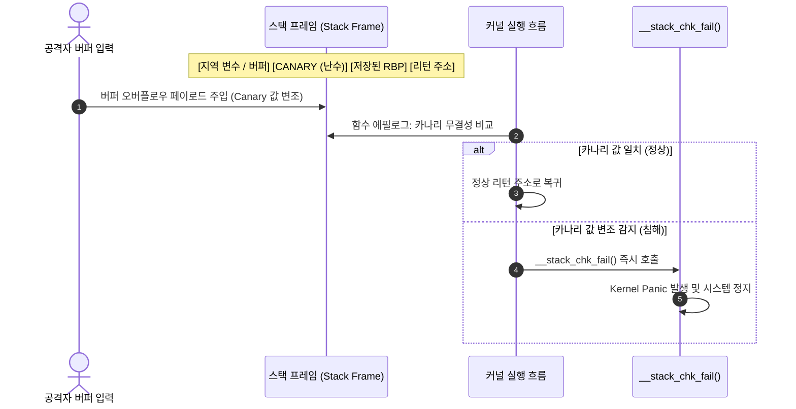

# 스택 보호기 (Stack Protector: `CONFIG_STACKPROTECTOR_STRONG`)

컴파일러 주입 방식의 스택 카나리(Stack Canary)를 통한 커널 함수 리턴 주소 변조 및 버퍼 오버플로우 공격 방어 메커니즘 분석.

---

## 1. 개요 및 위협 모델 (Overview & Threat Model)

- **방어 대상 취약점**:
  - 스택 기반 버퍼 오버플로우 (Stack-based Buffer Overflow).
  - 함수 리턴 주소 덮어쓰기(Return Address Overwrite)를 통한 제어 흐름 탈취(ROP/JOP).
- **공격 시나리오**:
  - 커널 공간 내 지역 배열(Local Buffer)에 경계 검사 없는 데이터 복사(`memcpy`, `strcpy` 등) 발생 시, 스택 프레임 상위의 저장된 프레임 포인터(SFP) 및 리턴 주소(Return Address)를 공격자 제어 값으로 조작함.
  - 함수 반환 시 공격자가 조작한 ROP 가젯 주소로 분기하여 권한 상승(Privilege Escalation) 유도함.

---

## 2. 방어 아키텍처 및 메커니즘 (Architecture & Mechanism)



### 동작 원리 상세 분석

1. **함수 프롤로그(Prologue)**:
   - x86_64: `%gs:40` (세그먼트 레지스터 기반 Per-CPU 스택 카나리 값)에서 난수를 읽어 스택 프레임의 리턴 주소 바로 직전에 저장함.
   - ARM64: `__stack_chk_guard` 전역 또는 Per-CPU 변수로부터 카나리 값을 로드하여 `[sp, offset]`에 저장함.
2. **함수 에필로그(Epilogue)**:
   - 함수 반환 직전 스택에 기록된 값과 원본 카나리 레지스터 값을 `xor` 비교함.
   - 값이 불일치할 경우 즉시 커널 패닉 함수(`__stack_chk_fail()`)를 호출하여 실행을 중단함.
3. **`-fstack-protector-strong` 적용 조건**:
   - 8바이트 이상의 배열뿐만 아니라 임의의 배열, 프레임 포인터 주소를 취하는 모든 로컬 변수가 선언된 함수에 자동으로 카나리를 삽입함.

---

## 3. Kconfig 설정 및 제어 옵션 (Configuration)

| Kconfig 심볼                   | 권장 설정       | 설명                                             |
| :----------------------------- | :-------------- | :----------------------------------------------- |
| `CONFIG_STACKPROTECTOR`        | `y`             | 기본 스택 카나리 인프라 활성화                   |
| `CONFIG_STACKPROTECTOR_STRONG` | `y` (권장)      | GCC/Clang의 `-fstack-protector-strong` 옵션 적용 |
| `CONFIG_STACKPROTECTOR_ALL`    | `n` (성능 고려) | 모든 함수에 카나리 삽입 (약 5~10% 오버헤드 발생) |

---

## 4. 실습 및 검증 (Hands-on Verification)

LKDTM(Linux Kernel Dump Test Module)의 `CORRUPT_STACK` 트리거를 통한 방어 동작 검증.

=== "x86_64: Hardened (보호 활성화)"

    ```bash
    # QEMU 실행
    ./scripts/run_qemu.sh --arch x86_64 --kernel build_dir/x86_64/arch/x86/boot/bzImage

    # 게스트 셸에서 스택 변조 고의 트리거
    echo CORRUPT_STACK > /sys/kernel/debug/provoke-crash/DIRECT
    ```

    **검증 로그 (차단 성공)**:
    ```text
    [    2.104231] lkdtm: Performing direct entry CORRUPT_STACK
    [    2.105420] lkdtm: attempting bad stack write ...
    [    2.106102] Kernel panic - not syncing: stack-protector: Kernel stack is corrupted in: lkdtm_CORRUPT_STACK+0x4a/0x60
    [    2.107519] CPU: 0 PID: 68 Comm: sh Not tainted 6.12.0-hardened #1
    [    2.108421] Call Trace:
    [    2.108812]  <TASK>
    [    2.109152]  panic+0x140/0x310
    [    2.109632]  __stack_chk_fail+0x15/0x20
    [    2.110214]  lkdtm_CORRUPT_STACK+0x4a/0x60
    ```

=== "x86_64: Base (보호 비활성화)"

    ```bash
    # CONFIG_STACKPROTECTOR 미적용 커널 실행
    ./scripts/run_qemu.sh --arch x86_64 --kernel build_dir/x86_64-base/arch/x86/boot/bzImage

    echo CORRUPT_STACK > /sys/kernel/debug/provoke-crash/DIRECT
    ```

    **검증 로그 (감지 실패 및 비정상 크래시)**:
    ```text
    [    2.412102] lkdtm: Performing direct entry CORRUPT_STACK
    [    2.413204] lkdtm: attempting bad stack write ...
    [    2.414002] general protection fault, probably for non-canonical address 0x4141414141414141: 0000 [#1] PREEMPT SMP
    # 스택 카나리 패닉이 아닌 공격자 입력값(0x4141...)으로 직접 점프하여 임의 예외 발생
    ```

=== "ARM64: Hardened (보호 활성화)"

    ```bash
    ./scripts/run_qemu.sh --arch arm64 --kernel build_dir/arm64/arch/arm64/boot/Image

    echo CORRUPT_STACK > /sys/kernel/debug/provoke-crash/DIRECT
    ```

    **검증 로그 (ARM64 패닉 정상 출력)**:
    ```text
    [    2.302194] Kernel panic - not syncing: stack-protector: Kernel stack is corrupted in: lkdtm_CORRUPT_STACK+0x3c/0x50
    [    2.303102] CPU: 0 PID: 65 Comm: sh Not tainted 6.12.0-arm64-hardened #1
    [    2.304011] Call trace:
    [    2.304410]  panic+0x144/0x320
    [    2.304912]  __stack_chk_fail+0x18/0x24
    [    2.305411]  lkdtm_CORRUPT_STACK+0x3c/0x50
    ```

---

## 5. 성능 및 오버헤드 분석 (Performance & Overhead)

- **CPU 연산 오버헤드**: 일반 서버 워크로드 기준 약 0.5% 미만으로 측정됨.
- **바이너리 크기 변화**: 텍스트(Text) 세그먼트 크기 약 1.5% 증가함.
- **실무 적용 권고**: 성능 저하 영향이 미미하며 가장 기본적인 무결성 방어 수단이므로 모든 실서버 및 프로덕션 환경에서 필수 활성화 권장함.
