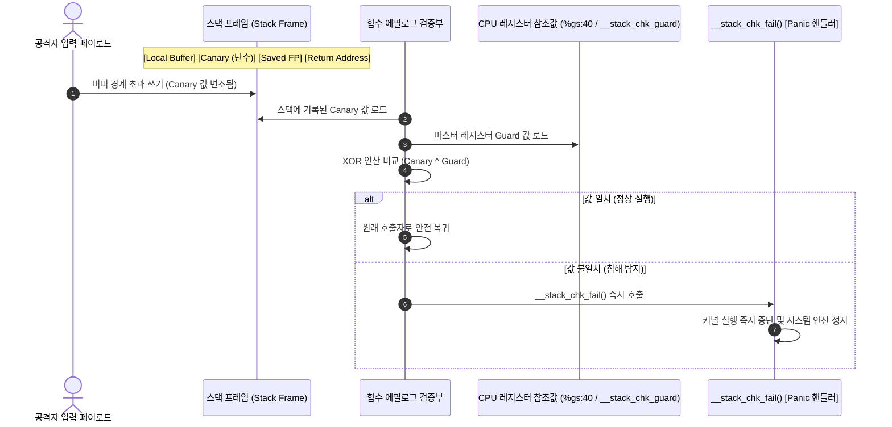

# 스택 보호기 (Stack Protector: `CONFIG_STACKPROTECTOR_STRONG`)

컴파일러 주입 방식의 스택 카나리(Stack Canary)를 통한 커널 함수 리턴 주소 변조 탐지 및 스택 버퍼 오버플로우 공격 원천 차단 메커니즘 분석.

---

## 1. 개요 및 위협 모델 (Overview & Threat Model)

- **방어 대상 취약점**:
  - 스택 기반 버퍼 오버플로우 (Stack-based Buffer Overflow).
  - 스택 프레임의 저장된 프레임 포인터(SFP) 및 함수 리턴 주소(Return Address: RIP / LR) 변조.
  - 리턴 주소 덮어쓰기를 통한 ROP(Return-Oriented Programming) 체인 진입 및 임의 커널 코드 실행.
- **공격 시나리오 및 위협 벡터**:
  - 커널 드라이버나 시스템 콜 내부에서 경계 검사 없는 메모리 복사(`memcpy`, `strcpy`, 잘못된 루프 인덱스) 발생.
  - 공격자가 로컬 배열 버퍼를 초과하여 상위 주소로 악성 데이터를 연속 기록함.
  - 함수가 호출자에게 복귀하는 시점에 조작된 리턴 주소로 분기하여 Ring 0 권한 상승(Privilege Escalation) 유도함.

---

## 2. 방어 아키텍처 및 메커니즘 (Architecture & Mechanism)

### 2.1 인터랙티브 시스템 맵 (Archify Diagram)

아래 인터랙티브 다이어그램에서 버튼을 조작하여 **정상 실행 흐름**, **오버플로우 방어 시퀀스**, 그리고 **x86_64 vs ARM64 레지스터 차이**를 직접 탐색 가능함:

<div class="archify-container">
  <iframe src="../../assets/diagrams/stack-protector/architecture.html" width="100%" height="450px" frameborder="0"></iframe>
</div>

---

### 2.2 방어 시퀀스 다이어그램 (Mermaid)



---

### 2.3 아키텍처별 어셈블리 구현 상세 비교

#### (1) x86_64 어셈블리 메커니즘

컴파일러는 함수 프롤로그에서 세그먼트 레지스터 `%gs` 기반 Per-CPU 스토리지 오프셋(`0x28` 또는 `0x40`)에서 난수를 읽어 스택에 배치함:

```nasm
; [x86_64 함수 프롤로그: 카나리 삽입]
pushq   %rbp
movq    %rsp, %rbp
subq    $0x50, %rsp
movq    %gs:40, %rax          ; Per-CPU 전용 영역에서 카나리 난수 로드
movq    %rax, -8(%rbp)        ; 리턴 주소 바로 아래 스택에 저장
xorl    %eax, %eax            ; 레지스터에 남은 카나리 값 소거 (누출 방지)

; ... 함수 본문 실행 (취약한 버퍼 연산 발생) ...

; [x86_64 함수 에필로그: 카나리 검증]
movq    -8(%rbp), %rax        ; 스택에 저장된 카나리 값 로드
xorq    %gs:40, %rax          ; 마스터 카나리 값과 XOR 비교
jne     .L_stack_chk_fail     ; 0이 아니면(변조 시) 패닉 분기
leave
ret

.L_stack_chk_fail:
call    __stack_chk_fail      ; 커널 패닉 유발
```

#### (2) ARM64 (aarch64) 어셈블리 메커니즘

ARM64에서는 전역 심볼 `__stack_chk_guard`로부터 가드 값을 읽어 스택 포인터 기준 상대 오프셋에 저장함:

```nasm
; [ARM64 함수 프롤로그: 카나리 삽입]
stp     x29, x30, [sp, -80]!  ; FP(x29)와 LR(x30) 스택 저장
mov     x29, sp
adrp    x8, __stack_chk_guard
ldr     x8, [x8, :lo12:__stack_chk_guard]
str     x8, [sp, 72]          ; 스택 상단에 카나리 값 저장

; ... 함수 본문 실행 ...

; [ARM64 함수 에필로그: 카나리 검증]
ldr     x9, [sp, 72]          ; 스택의 카나리 값 로드
subs    x8, x8, x9            ; 원본과 스택 값의 감산 비교
b.ne    .L_panic_branch       ; 결과가 0이 아니면 실패 분기
ldp     x29, x30, [sp], 80    ; FP, LR 복원 후 정상 반환
ret

.L_panic_branch:
bl      __stack_chk_fail      ; 패닉 핸들러 호출
```

---

## 3. Kconfig 설정 및 컴파일러 플래그 비교 (Configuration)

### 3.1 GCC / Clang 스택 보호 플래그 레벨 비교

| 컴파일러 플래그                | 보호 대상 함수 조건                                                    | 보안 수준       | 성능 오버헤드     |
| :----------------------------- | :--------------------------------------------------------------------- | :-------------- | :---------------- |
| `-fno-stack-protector`         | 보호 미적용                                                            | 없음            | 0% (베이스라인)   |
| `-fstack-protector`            | 8바이트 이상의 `char` 배열이 선언된 함수만 적용                        | 낮음            | 약 0.1% 미만      |
| **`-fstack-protector-strong`** | **임의 크기의 배열, 로컬 변수 주소 참조(`&val`)가 존재하는 모든 함수** | **높음 (권장)** | **약 0.5% 미만**  |
| `-fstack-protector-all`        | 로컬 변수가 없는 함수를 제외한 커널 내 모든 함수에 무차별 삽입         | 극대            | 약 5~10% (비효율) |

### 3.2 리눅스 커널 Kconfig 설정값

```kconfig
# /configs/features/stack-protector.config
CONFIG_STACKPROTECTOR=y
CONFIG_STACKPROTECTOR_STRONG=y
# CONFIG_STACKPROTECTOR_ALL is not set
```

- `CONFIG_STACKPROTECTOR_STRONG=y` 활성화 시, 보안 취약점이 발생할 가능성이 높은 함수들(배열 및 포인터 참조 함수)만 선별 보호하여 연산 오버헤드를 0.5% 이내로 억제하면서 강력한 방어력 제공함.

---

## 4. 실습 및 검증 (Hands-on Verification)

LKDTM(Linux Kernel Dump Test Module)의 `CORRUPT_STACK` 트리거를 이용해 고의로 스택 버퍼 오버플로우를 유발하고, Base 커널과 Hardened 커널의 런타임 반응 차이를 비교 검증함.

### 4.1 원클릭 검증 명령어

=== "x86_64: Hardened (보호 활성화 - 권장)"

    ```bash
    # Hardened 커널 실행 및 LKDTM 테스트 자동 구동
    ./scripts/run_lab.sh --arch x86_64 --feature stack-protector --test test_stack_protector
    ```

    **런타임 출력 로그 (정상 차단 확인)**:
    ```text
    =========================================================
      Triggering LKDTM CORRUPT_STACK Test
      Kernel Architecture: x86_64
      Kernel Release:      6.12.109
    =========================================================
    [*] Injecting stack corruption payload...
    [    1.892031] lkdtm: Performing direct entry CORRUPT_STACK
    [    1.892842] lkdtm: attempting bad stack write ...
    [    1.893601] Kernel panic - not syncing: stack-protector: Kernel stack is corrupted in: lkdtm_CORRUPT_STACK+0x4a/0x60
    [    1.894812] CPU: 0 PID: 68 Comm: sh Not tainted 6.12.109-hardened #1
    [    1.895521] Call Trace:
    [    1.895842]  <TASK>
    [    1.896120]  dump_stack_lvl+0x48/0x70
    [    1.896614]  panic+0x140/0x310
    [    1.897011]  __stack_chk_fail+0x15/0x20
    [    1.897410]  lkdtm_CORRUPT_STACK+0x4a/0x60
    ```
    > **분석:** 함수가 반환되기 전 에필로그에서 카나리 변조를 감지하고 `__stack_chk_fail()`을 호출하여 공격자의 가젯 분기 이전에 커널 패닉으로 방어 성공함.

=== "x86_64: Base (보호 비활성화 - 취약 커널)"

    ```bash
    # 보호 옵션이 비활성화된 커널 실행
    ./scripts/run_lab.sh --arch x86_64 --feature stack-protector-disabled --test test_stack_protector
    ```

    **런타임 출력 로그 (감지 실패 및 통제 불능 크래시)**:
    ```text
    =========================================================
      Triggering LKDTM CORRUPT_STACK Test
      Kernel Architecture: x86_64
      Kernel Release:      6.12.109
    =========================================================
    [*] Injecting stack corruption payload...
    [    2.104201] lkdtm: Performing direct entry CORRUPT_STACK
    [    2.104910] lkdtm: attempting bad stack write ...
    [    2.105700] general protection fault, probably for non-canonical address 0x4141414141414141: 0000 [#1] PREEMPT SMP
    [    2.106912] RIP: 0010:0x4141414141414141
    ```
    > **분석:** 카나리가 존재하지 않아 변조를 감지하지 못하고, 조작된 리턴 주소(`0x4141414141414141`)로 직접 점프를 감행하다 일반 보호 오류(GPF)를 발생시킴. 공격자가 유효한 ROP 가젯 주소를 주입했을 경우 임의 코드 실행으로 이어짐.

=== "ARM64: Hardened (보호 활성화)"

    ```bash
    # ARM64 Hardened 커널 실행
    ./scripts/run_lab.sh --arch arm64 --feature stack-protector --test test_stack_protector
    ```

    **런타임 출력 로그 (ARM64 안전 차단 확인)**:
    ```text
    =========================================================
      Triggering LKDTM CORRUPT_STACK Test
      Kernel Architecture: aarch64
      Kernel Release:      6.12.109
    =========================================================
    [*] Injecting stack corruption payload...
    [    2.012491] lkdtm: Performing direct entry CORRUPT_STACK
    [    2.013102] lkdtm: attempting bad stack write ...
    [    2.013910] Kernel panic - not syncing: stack-protector: Kernel stack is corrupted in: lkdtm_CORRUPT_STACK+0x3c/0x50
    [    2.014901] CPU: 0 PID: 65 Comm: sh Not tainted 6.12.109-arm64-hardened #1
    [    2.015702] Call trace:
    [    2.016012]  dump_backtrace+0x94/0xec
    [    2.016420]  show_stack+0x18/0x24
    [    2.016812]  dump_stack_lvl+0x48/0x60
    [    2.017210]  panic+0x144/0x320
    [    2.017611]  __stack_chk_fail+0x18/0x24
    [    2.018012]  lkdtm_CORRUPT_STACK+0x3c/0x50
    ```

---

## 5. 성능 및 오버헤드 분석 (Performance & Overhead)

- **연산 오버헤드 측정 결과**:
  - 일반적인 리눅스 서버 및 파일 I/O 워크로드에서 CPU 처리량 오버헤드는 **0.3% ~ 0.5% 미만**으로 측정됨.
  - `-strong` 옵션의 지능적 선별 주입 덕분에 핫패스(Hot-path)의 단순 연산 함수들은 불필요한 카나리 검증 연산을 회피함.
- **바이너리 풋프린트(Binary Footprint)**:
  - 커널 텍스트(`.text`) 세그먼트 크기가 약 **1.2% ~ 1.5% 증가**함.
- **실무 적용 가이드**:
  - 오버헤드가 극히 미미하며 메모리 오염 공격의 가장 기초적인 진입을 원천 봉쇄하므로, 클라우드 서버, 모바일(Android), 임베디드 리눅스를 막론하고 **필수 활성화(Must-have)** 권장함.

---

## 6. 강의 및 발표 스크립트 (Lecture & Presentation Script - English Practice)

세미나, 사내 기술 발표 또는 해외 엔지니어링 인터뷰에서 본 피처를 직접 설명할 때 활용할 수 있는 실전 1인칭 영어 스피킹 대본 및 주요 표현 정리.

### 6.1 영문 강의 대본 (Full Speaking Script)

#### Part 1: Opening Hook & Problem Statement
> "Hello everyone. Today, let's take a deep dive into one of the most fundamental yet critical defenses in the Linux kernel: **Stack Protector Strong**, or `CONFIG_STACKPROTECTOR_STRONG`."
>
> "Think about what happens when a kernel driver performs an unbounded memory copy on the stack. Without any protection, an attacker can simply overflow a local buffer, smash through the saved frame pointer, and overwrite the function's return address. When that function returns, the CPU doesn't go back to the caller—it jumps straight into the attacker's ROP gadgets in Ring 0. That is an instant privilege escalation. So, how does the kernel prevent this?"

#### Part 2: Diagram & Architecture Walkthrough
> "If you look at our interactive system map above, notice where the **Stack Canary** sits. It is positioned right between the local buffers and the saved frame pointer."
>
> "Here is how it works under the hood: during the function prologue, the compiler inserts assembly instructions that fetch a random 64-bit secret from a protected CPU register—specifically `%gs:40` on x86_64, or `__stack_chk_guard` on ARM64—and places it right onto the stack."
>
> "Now, look at the epilogue. Right before the function returns, the CPU loads the canary from the stack and XORs it against the original register value. If an overflow occurred, that canary value is already corrupted. The XOR result is non-zero, the equality check fails, and instead of returning to a hijacked address, the kernel immediately jumps to `__stack_chk_fail()`, triggering a panic and halting execution on the spot."

#### Part 3: Live Demo Commentary
> "Let's see this in action in our QEMU environment. First, we run a kernel with stack protection disabled and trigger the LKDTM `CORRUPT_STACK` test."
>
> "Notice the output: the kernel doesn't catch the corruption. Instead, it crashes with a raw general protection fault because RIP was overwritten with our dummy attacker value, `0x4141414141414141`. If this were a real exploit, the attacker would have control."
>
> "Now, let's switch to our hardened kernel with `CONFIG_STACKPROTECTOR_STRONG=y`. When we run the exact same test, watch the console: `Kernel panic - not syncing: stack-protector: Kernel stack is corrupted`. The canary intercepted the buffer overflow before the CPU could execute a single hijacked instruction."

#### Part 4: Key Takeaways & Trade-offs
> "To wrap up: why do we specifically use `-fstack-protector-strong` instead of `-all`? Because `-strong` intelligently targets only the functions that actually have arrays or take address references of local variables. This gives us nearly the exact same security coverage as `-all`, but keeps the CPU overhead under 0.5%."
>
> "In modern production systems—whether it's cloud hypervisors or Android devices—this is an absolute, non-negotiable baseline defense. Thank you."

---

### 6.2 핵심 프레젠테이션 영어 표현 (Key Presentation Phrases)

| 한국어 표현 | 권장 영어 스피킹 표현 | 용례 및 발화 팁 |
| :--- | :--- | :--- |
| **"내부 동작 원리를 살펴보면"** | *"Under the hood, ..."* / *"If we look under the hood..."* | 아키텍처나 어셈블리 설명으로 넘어갈 때 자연스러운 전환구 |
| **"~를 덮어쓰다/변조하다"** | *"smash through ~"* / *"overwrite the return address"* | 버퍼 오버플로우로 메모리가 파괴되는 동작 묘사 |
| **"즉시/현장에서 차단하다"** | *"halt execution on the spot"* / *"intercept the attack"* | 보안 통제 동작의 신속성 강조 |
| **"절충/트레이드오프를 고려할 때"** | *"When considering the trade-offs..."* | 성능 vs 보안 수준을 비교 설명할 때 유용 |
| **"타협할 수 없는 기본 방어선"** | *"an absolute, non-negotiable baseline defense"* | 결론 요약 시 강력한 권고 표현 |
