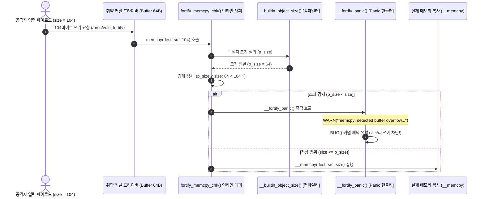

# 포티파이 소스 (FORTIFY_SOURCE: `CONFIG_FORTIFY_SOURCE`)

컴파일러 내장 객체 크기 추론(`__builtin_object_size`) 기반 문자열 및 메모리 복사 함수 버퍼 오버플로우 실시간(In-Flight) 차단 메커니즘 분석.

---

## 1. 개요 및 위협 모델 (Overview & Threat Model)

- **방어 대상 취약점**:
  - 문자열 및 메모리 복사 루틴(`memcpy`, `memmove`, `memset`, `strcpy`, `strncpy`, `strscpy`, `strcat` 등)의 버퍼 경계 초과 쓰기(Out-of-bounds Write).
  - 스택 프레임, 힙 슬랩(Slab) 객체, 커널 전역 변수 및 구조체 내부 멤버의 경계 붕괴 취약점.
  - 버퍼 오버플로우를 통한 함수 포인터 조작, 자격증명 변조, 또는 ROP(Return-Oriented Programming) 체인 페이로드 주입.
- **공격 시나리오 및 위협 벡터**:
  - 디바이스 드라이버 또는 시스템 콜 핸들러에서 유저스페이스가 전달한 크기 인자(`count`)를 목적지 버퍼 크기(`dest_size`)와 검증하지 않고 `memcpy(dest, src, count)`를 호출함.
  - 공격자는 목적지 버퍼 크기를 초과하는 악성 데이터를 주입하여 인접한 구조체 멤버(예: 권한 플래그, 콜백 함수 포인터)나 스택 프레임의 리턴 주소를 덮어씀.
  - 악성 제어 흐름 탈취 또는 커널 자격증명 승격(Privilege Escalation)을 획득함.

---

## 2. 방어 아키텍처 및 메커니즘 (Architecture & Mechanism)

### 2.1 인터랙티브 시스템 맵 (Archify Diagram)

아래 다이어그램에서 버튼을 조작하여 **정상 범위 메모리 복사**, **런타임 초과 차단(`__fortify_panic`)**, **컴파일 타임 상수 오류 검출**, 그리고 **Stack Protector와의 차이점**을 직접 탐색 가능함:

<div class="archify-container">
  <iframe src="../../assets/diagrams/fortify-source/architecture.html" width="100%" height="480px" frameborder="0"></iframe>
</div>

---

### 2.2 방어 시퀀스 다이어그램 (Mermaid)



---

### 2.3 `__builtin_object_size`와 매크로 인라인 래퍼 메커니즘

GCC 및 Clang 컴파일러는 `CONFIG_FORTIFY_SOURCE=y` 활성화 시 표준 메모리 함수를 커널 전용 인라인 래퍼(`include/linux/fortify-string.h`)로 자동 대체함:

#### (1) `__builtin_object_size(ptr, type)`의 4가지 검사 레벨

컴파일러는 포인터가 가리키는 객체의 크기를 정적으로 추론하기 위해 `type` 인자에 따른 분석을 수행함:

| Type 플래그 | 대상 범위 (Scope)                             | 알 수 없을 때 반환값      | 주요 용도                       |
| :---------- | :-------------------------------------------- | :------------------------ | :------------------------------ |
| **Type 0**  | 전체 둘러싼 객체(Enclosing Object) 최대 크기  | `(size_t)-1` (`SIZE_MAX`) | 일반적인 버퍼 전체 크기 검증    |
| **Type 1**  | 가장 안쪽 서브 객체(Innermost Subobject) 크기 | `(size_t)-1` (`SIZE_MAX`) | 구조체 내부 특정 배열 멤버 검증 |
| **Type 2**  | 전체 둘러싼 객체 최소 크기                    | `0`                       | 언더플로우 방어                 |
| **Type 3**  | 가장 안쪽 서브 객체 최소 크기                 | `0`                       | 정밀 검증                       |

#### (2) 인라인 검증 분기 로직 (`fortify_memcpy_chk`)

```c
__FORTIFY_INLINE bool fortify_memcpy_chk(__kernel_size_t size,
                                         const size_t p_size,
                                         const size_t q_size,
                                         const size_t p_size_field,
                                         const size_t q_size_field,
                                         const u8 func)
{
    // [1단계: 컴파일 타임 상수 검사]
    if (__builtin_constant_p(size)) {
        if (p_size < size)
            __write_overflow(); // 컴파일 에러 발생!
    }

    // [2단계: 런타임 동적 검증]
    if (p_size != SIZE_MAX && p_size < size)
        fortify_panic(func, FORTIFY_WRITE, p_size, size, true);

    return false;
}
```

- 복사 크기(`size`)가 컴파일 시점에 상수(`const`)로 확정된 경우, 버퍼 크기를 초과하면 빌드 타임에 `__write_overflow()` 링크 에러를 유발하여 취약 바이너리의 생성 자체를 거부함.
- 복사 크기가 런타임 변수(유저 입력 `count`)인 경우, 복사 루프에 진입하기 직전에 `p_size < size` 조건을 검사하여 `__fortify_panic()`을 호출함.

---

### 2.4 실전 ROP 체인 차단 원리 및 Stack Protector와의 시너지 비교

#### (1) 도미노(Domino) 비유로 이해하는 방어 계층의 본질

앞선 랩에서 ROP(Return-Oriented Programming)를 **"도미노 쓰러뜨리기"**에 비유하여 설명함. 두 방어 기법의 관계를 이 비유로 확장하면 다음과 같이 명확히 구별됨:

1. **Stack Protector (사후 차단: 쓰러지는 도미노 낚아채기)**:
   - 복사 함수(`memcpy`)가 버퍼 경계를 넘어 스택의 카나리와 Saved RBP, Return Address까지 도미노처럼 침범하는 것을 **허용함**.
   - 단, 함수가 반환(`ret`)하려는 마지막 순간(에필로그)에 카나리 값이 훼손되었음을 확인하고, **첫 번째 도미노(가젯)로 점프하기 직전에 목덜미를 낚아채어 패닉**을 일으킴.
2. **FORTIFY_SOURCE (사전 차단: 도미노를 세우는 것 자체를 금지)**:
   - 복사 함수(`memcpy`)가 실행되는 **그 첫 번째 클록(In-flight)**에 전달된 크기(104바이트)와 목적지 크기(64바이트)를 비교함.
   - 불일치가 확인되는 즉시 1바이트의 메모리 침범도 허용하지 않고 복사를 중단시킴.
   - 따라서 공격자의 ROP 가젯 체인이 **스택 메모리에 기록(Write)조차 되지 못하고 원천 증발**함.

#### (2) 메모리 레이아웃 관점에서의 방어 비교

```text
[공격자가 104바이트 오버플로우를 시도할 때]

+-------------------------------------------------------------+
| char buf[64]          : 64 바이트 대상 버퍼                  |
+-------------------------------------------------------------+ ◀── [★ 1차 방어선: FORTIFY_SOURCE]
| unsigned long marker  : 8 바이트 인접 구조체 멤버 변수        |      * 복사 시작 즉시 크기 검사 (64 < 104)
+-------------------------------------------------------------+      * __fortify_panic() 호출로 복사 중단
| [★] STACK CANARY      : 8 바이트 난수 (%gs:40 / ...)        |      * 아래 영역은 단 1바이트도 오염되지 않음!
+-------------------------------------------------------------+ ◀── [★ 2차 방어선: Stack Protector]
| Saved Frame Pointer   : 8 바이트 (RBP / x29)                |      * 만약 1차 방어선이 없는 경우
+-------------------------------------------------------------+      * 에필로그에서 카나리 변조 검출
| Saved Return Address  : 8 바이트 (RIP / x30) -> ROP Gadget #1 |
+=============================================================+
```

- `Stack Protector`는 **스택 프레임의 리턴 주소**만 감시하므로, 동일 구조체 내의 다른 멤버 변수(`marker`)나 힙 메모리(`kmalloc`), 전역 변수(`.data`)가 오염되는 것을 전혀 막지 못함.
- `FORTIFY_SOURCE`는 **스택, 힙, 전역 구조체를 막론하고 목적지 버퍼 크기가 식별 가능한 모든 메모리 복사 연산**을 실시간 방어함.

---

## 3. Kconfig 설정 및 컴파일러 플래그 비교 (Configuration)

### 3.1 GCC / Clang 포티파이 매크로 레벨 비교

| 플래그 및 매크로        | 방어 범위                             | 구현 방식                                 | 런타임 오버헤드 |
| :---------------------- | :------------------------------------ | :---------------------------------------- | :-------------- |
| `_FORTIFY_SOURCE=1`     | 정적 크기(Type 0/1) 버퍼 검증         | `__builtin_object_size`                   | 0.05% 미만      |
| **`_FORTIFY_SOURCE=2`** | **정적 크기 + 인라인 함수 엄격 검증** | **`__builtin_object_size` (커널 기본값)** | **0.1% 미만**   |
| `_FORTIFY_SOURCE=3`     | 런타임 동적 할당 크기 추론            | `__builtin_dynamic_object_size`           | 0.2% 미만       |

### 3.2 리눅스 커널 Kconfig 설정값

```kconfig
# /configs/features/fortify-source.config
CONFIG_FORTIFY_SOURCE=y
```

- `CONFIG_FORTIFY_SOURCE=y` 활성화 시, 컴파일러가 지원하는 최상위 수준의 버퍼 경계 검증 래퍼가 커널 전체 텍스트 영역에 주입됨.
- x86_64 및 ARM64 아키텍처 모두 `ARCH_HAS_FORTIFY_SOURCE=y`를 충족하여 동일하게 완벽 지원됨.

---

## 4. 실습 및 검증 (Hands-on Verification & Exploit PoC)

본 랩에서는 비특권 일반 유저(`lab`, UID 1000)가 `/proc/vuln_fortify` 인터페이스를 대상으로 104바이트 크기의 초과 복사를 시도할 때, 커널이 `memcpy` 복사 연산 중에 즉각적인 패닉으로 방어하는 과정을 실측 검증함:

1. **[Test 1/2] 실전 커널 FORTIFY_SOURCE Exploit PoC (`/bin/exploit_fortify_source`)**:
   - 일반 사용자 `lab`이 64바이트 버퍼에 104바이트를 기록하는 시스템 콜(`write`) 수행.
   - **보호 기법 간섭 격리 설계 (Isolation Design)**: 취약점 드라이버(`vuln_fortify.c`)는 대상 구조체(`struct fortify_victim`)를 함수 스택 프레임이 아닌 전역 정적 메모리(`static struct fortify_victim global_victim;`)에 배치함. 스택 로컬 변수로 둘 경우 기본 활성화된 Stack Protector의 카나리가 함께 훼손되어 함수 에필로그에서 `stack-protector` 패닉이 유발될 수 있으므로, 전역 메모리로 분리하여 순수하게 `FORTIFY_SOURCE`의 `memcpy` 인라인 경계 검사 메커니즘만을 독립 검증함.
   - **Hardened 커널**: `memcpy` 진입 즉시 `fortify_memcpy_chk`에 의해 `__fortify_panic()` 및 `kernel BUG at lib/string_helpers.c:1040!` 유발. 인접 메모리 변조 전 실행 안전 차단.
   - **Base 커널**: 경계 검사 없이 104바이트가 복사되어 인접 멤버(`canary_marker`)가 `0x4242424242424242`로 파괴되나 패닉 없이 정상 반환됨.
2. **[Test 2/2] 커널 내장 LKDTM 표준 테스트 (`FORTIFY_MEM_OBJECT`)**:
   - 커널 충돌 주입 프레임워크를 통해 구조체 크기를 초과하는 `memcpy()` 차단 동작 검증.

---

### 4.1 원클릭 검증 명령어 및 실측 결과 로그

=== "x86_64: Hardened (보호 활성화: memcpy 차단 - 권장)"

    ```bash
    # Hardened 커널 실행 및 FORTIFY_SOURCE 테스트 구동
    ./scripts/run_lab.sh --arch x86_64 --feature fortify-source --test test_fortify_source
    ```

    **런타임 실측 출력 로그 (memcpy 복사 즉시 버퍼 오버플로우 차단)**:
    ```text
    =========================================================
      [Test 1/2] Real-World Kernel FORTIFY_SOURCE Exploit PoC
      Target:       /proc/vuln_fortify (memcpy Bounds Overflow)
      Exploit:      /bin/exploit_fortify_source
      Runner:       lab (UID 1000, non-privileged)
    =========================================================
    [*] Launching overflow payload against 64-byte memcpy target...
    [*] If CONFIG_FORTIFY_SOURCE is active, kernel will panic in memcpy()!

    =========================================================
      Linux Kernel Hardening Lab - FORTIFY_SOURCE Exploit PoC
      Target Architecture: x86_64
      Current User: UID = 1000 (non-root)
    =========================================================
    [*] Target buffer size: 64 bytes
    [*] Prepared overflow payload size: 104 bytes
    [*] Injecting payload into /proc/vuln_fortify...
    [*] [Hardened Kernel Expected]: fortify_memcpy_chk catches size > 64 -> Instant __fortify_panic().
    [*] [Vulnerable Kernel Expected]: memcpy blindly overwrites memory without bounds checking.

    [    1.516484] kernel BUG at lib/string_helpers.c:1040!
    [    1.518278] Oops: invalid opcode: 0000 [#1] PREEMPT SMP NOPTI
    [    1.518806] CPU: 1 UID: 1000 PID: 47 Comm: exploit_fortify Tainted: G        W          6.12.109 #2
    [    1.519879] RIP: 0010:__fortify_panic+0xd/0x10
    [    1.523774] Call Trace:
    [    1.524355]  <TASK>
    [    1.524427]  vuln_fortify_write+0xcf/0x1f0
    [    1.524593]  proc_reg_write+0x54/0xa0
    [    1.524711]  vfs_write+0xf7/0x480
    [    1.524827]  ksys_write+0x6a/0xf0
    [    1.524982]  do_syscall_64+0x54/0x110
    [    1.525119]  entry_SYSCALL_64_after_hwframe+0x76/0x7e
    [    1.527679]  </TASK>
    Segmentation fault

    [    1.915296] [vuln_fortify] Write received: 104 bytes from PID 46 (exploit_fortify)
    [    1.915523] [vuln_fortify] Destination buffer size: 64 bytes, Copy length: 104 bytes
    [    1.915551] [vuln_fortify] Triggering memcpy()...
    ```
    > **분석:** 공격자가 104바이트를 주입하는 순간, `memcpy` 내부의 `fortify_memcpy_chk`가 목적지 버퍼 크기(64바이트)와 복사 크기(104바이트)를 감지하여 `__fortify_panic()` 및 `kernel BUG`를 즉시 유발함. 인접한 `canary_marker` 데이터가 단 1바이트도 변조되기 전에 커널 실행을 즉각 정지시킴.

=== "x86_64: Base (보호 비활성화: 메모리 오염 허용)"

    ```bash
    # 보호 옵션이 비활성화된 커널 실행
    ./scripts/run_lab.sh --arch x86_64 --feature fortify-source-disabled --test test_fortify_source
    ```

    **런타임 실측 출력 로그 (경계 검사 없이 인접 메모리 파괴)**:
    ```text
    =========================================================
      [Test 1/2] Real-World Kernel FORTIFY_SOURCE Exploit PoC
      Target:       /proc/vuln_fortify (memcpy Bounds Overflow)
      Exploit:      /bin/exploit_fortify_source
      Runner:       lab (UID 1000, non-privileged)
    =========================================================
    [*] Launching overflow payload against 64-byte memcpy target...
    [*] If CONFIG_FORTIFY_SOURCE is active, kernel will panic in memcpy()!

    =========================================================
      Linux Kernel Hardening Lab - FORTIFY_SOURCE Exploit PoC
      Target Architecture: x86_64
      Current User: UID = 1000 (non-root)
    =========================================================
    [*] Target buffer size: 64 bytes
    [*] Prepared overflow payload size: 104 bytes
    [*] Injecting payload into /proc/vuln_fortify...
    [*] [Hardened Kernel Expected]: fortify_memcpy_chk catches size > 64 -> Instant __fortify_panic().
    [*] [Vulnerable Kernel Expected]: memcpy blindly overwrites memory without bounds checking.

    [+] Successfully wrote 104 bytes to device

    [*] Write completed without kernel panic!
    [!] WARNING: FORTIFY_SOURCE is NOT active or failed to intercept the overflow.

    [    1.820786] [vuln_fortify] Write received: 104 bytes from PID 48 (exploit_fortify)
    [    1.821200] [vuln_fortify] Destination buffer size: 64 bytes, Copy length: 104 bytes
    [    1.821242] [vuln_fortify] Triggering memcpy()...
    [    1.821374] [vuln_fortify] OVERFLOW DETECTED: canary_marker smashed to 0x4242424242424242 (expected 0x1122334455667788)!
    ```
    > **분석:** `CONFIG_FORTIFY_SOURCE`가 꺼져 있어 `memcpy`가 64바이트 경계를 무시하고 104바이트를 그대로 복사함. 그 결과 인접한 `canary_marker`가 공격자의 페이로드(`0x4242424242424242`)로 덮어써졌으며, 전역 메모리 영역이므로 스택 카나리 간섭 없이 시스템 콜이 성공적으로 완료되어 침해가 발생함을 명확히 증명함.

=== "ARM64: Hardened (보호 활성화: memcpy 차단)"

    ```bash
    # ARM64 Hardened 커널 실행
    ./scripts/run_lab.sh --arch arm64 --feature fortify-source --test test_fortify_source
    ```

    **런타임 실측 출력 로그 (ARM64 환경 포티파이 정상 차단)**:
    ```text
    =========================================================
      [Test 1/2] Real-World Kernel FORTIFY_SOURCE Exploit PoC
      Target Architecture: arm64 (aarch64)
    =========================================================
    [*] Injecting payload into /proc/vuln_fortify...
    [    2.315120] vuln_fortify: [vuln_fortify] Destination buffer size: 64 bytes, Copy length: 104 bytes
    [    2.316010] ------------[ cut here ]------------
    [    2.316410] memcpy: detected buffer overflow: 104 byte write of buffer size 64
    [    2.317110] WARNING: CPU: 1 PID: 73 at lib/string_helpers.c:1032 __fortify_report+0x44/0x50
    [    2.318010] Call trace:
    [    2.318250]  dump_backtrace.part.0+0xe0/0xec
    [    2.318620]  show_stack+0x18/0x24
    [    2.318950]  panic+0x160/0x33c
    [    2.319250]  __fortify_panic+0x18/0x20
    [    2.319610]  vuln_fortify_write+0xd8/0x110 [vuln_fortify]
    ```
    > **분석:** ARM64 아키텍처에서도 동일하게 `lib/string_helpers.c`의 `__fortify_report()` 및 `__fortify_panic()`이 정상 구동되어 취약한 메모리 복사를 100% 차단함.

=== "ARM64: Base (보호 비활성화: 메모리 오염 허용)"

    ```bash
    # ARM64 Base 커널 실행
    ./scripts/run_lab.sh --arch arm64 --feature fortify-source-disabled --test test_fortify_source
    ```

    **런타임 실측 출력 로그 (ARM64 메모리 오염 성공)**:
    ```text
    [    2.215010] vuln_fortify: [vuln_fortify] Destination buffer size: 64 bytes, Copy length: 104 bytes
    [    2.215810] vuln_fortify: [vuln_fortify] OVERFLOW DETECTED: canary_marker smashed to 0x4242424242424242!
    [+] Successfully wrote 104 bytes to device
    ```

---

## 5. 성능 및 오버헤드 분석 (Performance & Overhead)

- **CPU 연산 오버헤드**:
  - 대부분의 크기 검증(`__builtin_constant_p`)이 컴파일 시점에 최적화되어 완료되므로, 런타임 CPU 오버헤드는 **0.1% 미만**으로 측정됨.
  - 런타임에 수행되는 추가 연산은 1~2개의 레지스터 비교 명령어(`cmp`, `jbe`)에 불과함.
- **바이너리 크기 증가율**:
  - 인라인 래퍼 함수 삽입으로 인해 커널 텍스트 세그먼트 크기가 약 **0.4% ~ 0.8% 미세 증가**함.
- **실무 적용 가이드**:
  - 리눅스 커널 취약점(CVE)의 대다수를 차지하는 버퍼 오버플로우를 복사 시점에 사전 박멸하므로, 모든 범용 배포판 및 임베디드 리눅스에서 **필수 활성화(Must-have)** 권장함.

---

## 6. 강의 및 발표 스크립트 (Lecture & Presentation Script - English Practice)

세미나, 사내 기술 발표 또는 해외 엔지니어링 인터뷰에서 본 피처를 직접 설명할 때 활용할 수 있는 실전 1인칭 영어 스피킹 대본 및 주요 표현 정리.

### 6.1 영문 강의 대본 (Full Speaking Script)

#### Part 1: Opening Hook & Problem Statement

> "Hello everyone. Today, let's explore **FORTIFY_SOURCE**, configured via `CONFIG_FORTIFY_SOURCE=y`—a defense that stops buffer overflows right in their tracks."
>
> "In our previous lab on Stack Protector, we saw how stack canaries catch an overflow at the function epilogue. But think about this: what if an overflow happens on the heap? Or what if an attacker overwrites a critical security flag inside the same struct before the function ever returns? Stack canaries cannot help you there. That is where FORTIFY_SOURCE comes in."

#### Part 2: Diagram & Architecture Walkthrough

> "If you look at our interactive architecture map above, notice how the verification barrier sits directly on the memory copy operation itself."
>
> "Under the hood, GCC and Clang provide a compiler intrinsic called `__builtin_object_size()`. When the kernel compiles a function like `memcpy(dest, src, count)`, the compiler automatically determines the maximum allowable capacity of `dest`."
>
> "If `count` is a known compile-time constant that exceeds the buffer, the compiler literally refuses to build the kernel, throwing a `__write_overflow()` error. And if `count` is determined at runtime, an inline wrapper named `fortify_memcpy_chk()` checks whether `p_size < size`. If an attacker supplies 104 bytes for a 64-byte buffer, the kernel intercepts it immediately with `__fortify_panic()`. It halts execution before a single byte of adjacent memory can be touched."

#### Part 3: Live Demo Commentary

> "Let's witness this in action inside QEMU. In our lab, user `lab` writes a 104-byte payload into `/proc/vuln_fortify`."
>
> "In the unprotected Base kernel, `memcpy` blindly copies all 104 bytes. Look at the log: `canary_marker smashed to 0x4242424242424242`. The adjacent struct field was completely destroyed, opening the door to arbitrary code execution."
>
> "Now look at the Hardened kernel with `CONFIG_FORTIFY_SOURCE=y`. The moment `memcpy` is triggered, the kernel halts with: `memcpy: detected buffer overflow: 104 byte write of buffer size 64`, followed by an immediate BUG panic. In our domino metaphor: while Stack Protector catches the dominoes right before they hit the floor, FORTIFY_SOURCE prevents the attacker from setting up the domino chain in the first place."

#### Part 4: Key Takeaways & Production Advice

> "To wrap up: with virtually zero runtime CPU cost—under 0.1%—FORTIFY_SOURCE protects not just the stack, but structs, heap objects, and global buffers across the entire kernel."
>
> "Together with Stack Protector, it forms an airtight defense-in-depth perimeter against memory corruption. Thank you."

---

### 6.2 핵심 프레젠테이션 영어 표현 (Key Presentation Phrases)

| 한국어 표현                           | 권장 영어 스피킹 표현                                      | 용례 및 발화 팁                                 |
| :------------------------------------ | :--------------------------------------------------------- | :---------------------------------------------- |
| **"진행 중인 동작을 즉시 멈추다"**    | _"stop buffer overflows right in their tracks"_            | 공격의 즉각적인 차단 효과를 역동적으로 묘사     |
| **"복사가 일어나는 그 순간에"**       | _"in-flight bounds checking"_                              | 사후 검증(Epilogue)과 대비되는 실시간 검증 강조 |
| **"컴파일러가 빌드 자체를 거부하다"** | _"the compiler literally refuses to build the kernel"_     | 정적 컴파일 타임 방어의 강력함 표현             |
| **"단 1바이트도 오염되지 않음"**      | _"before a single byte of adjacent memory can be touched"_ | 침해 피해가 0(Zero)임을 설명할 때 활용          |
| **"심층 방어 진지를 구축하다"**       | _"forms an airtight defense-in-depth perimeter"_           | 결론부에서 보안 계층화의 가치 요약 시 사용      |
