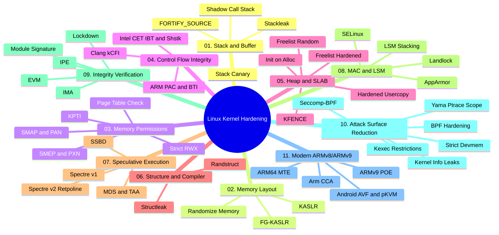

# 하드닝 피처 로드맵 카탈로그 (Hardening Features Taxonomy)

리눅스 커널 보안 하드닝 11개 핵심 카테고리 및 총 44개 실습 아티클 매핑 테이블임.

---

## 1. 하드닝 카테고리별 아티클 구성

```mermaid
mindmap
  root((Linux Kernel Hardening))
    01. Stack and Buffer
      Stack Canary
      FORTIFY_SOURCE
      Shadow Call Stack
      Stackleak
    02. Memory Layout
      KASLR
      FG-KASLR
      Randomize Memory
    03. Memory Permissions
      Strict RWX
      SMEP and PXN
      SMAP and PAN
      Page Table Check
      KPTI
    04. Control Flow Integrity
      Clang kCFI
      Intel CET IBT and Shstk
      ARM PAC and BTI
    05. Heap and SLAB
      Freelist Random
      Freelist Hardened
      Init on Alloc
      Hardened Usercopy
      KFENCE
    06. Structure and Compiler
      Structleak
      Randstruct
    07. Speculative Execution
      Spectre v1
      Spectre v2 Retpoline
      SSBD
      MDS and TAA
    08. MAC and LSM
      LSM Stacking
      AppArmor
      SELinux
      Landlock
    09. Integrity Verification
      IMA
      EVM
      IPE
      Lockdown
      Module Signature
    10. Attack Surface Reduction
      Seccomp-BPF
      BPF Hardening
      Strict Devmem
      Kernel Info Leaks
      Yama Ptrace Scope
      Kexec Restrictions
    11. Modern ARMv8/ARMv9
      ARM64 MTE
      ARMv9 POE
      Android AVF and pKVM
      Arm CCA
```

---

## 2. 세부 피처별 실습 상태 (44개 전체 피처)

### Category 01. 스택 및 버퍼 보호 (Stack & Buffer Protection)

| 번호 | 피처 명칭 | Kconfig 심볼 | 지원 아키텍처 | 실습 상태 |
| :---: | :--- | :--- | :---: | :---: |
| **01** | [Stack Protector (Canary)](01-stack-protector.md) | `CONFIG_STACKPROTECTOR_STRONG` | x86_64, arm64 | 실습 준비 완료 |
| **02** | [FORTIFY_SOURCE](02-fortify-source.md) | `CONFIG_FORTIFY_SOURCE` | x86_64, arm64 | 실습 준비 완료 |
| **03** | [Shadow Call Stack (SCS)](03-shadow-call-stack.md) | `CONFIG_SHADOW_CALL_STACK` | arm64 | 실습 준비 완료 |
| **04** | [STACKLEAK Plugin](04-stackleak.md) | `CONFIG_GCC_PLUGIN_STACKLEAK` | x86_64, arm64 | 실습 준비 완료 |

### Category 02. 메모리 레이아웃 랜덤화 (Memory Layout & Randomization)

| 번호 | 피처 명칭 | Kconfig 심볼 | 지원 아키텍처 | 실습 상태 |
| :---: | :--- | :--- | :---: | :---: |
| **05** | [KASLR](05-kaslr.md) | `CONFIG_RANDOMIZE_BASE` | x86_64, arm64 | 실습 준비 완료 |
| **06** | [FG-KASLR](06-fgkaslr.md) | `CONFIG_FG_KASLR` | x86_64 | 실습 준비 완료 |
| **07** | [Randomize Memory](07-randomize-memory.md) | `CONFIG_RANDOMIZE_MEMORY` | x86_64, arm64 | 실습 준비 완료 |

### Category 03. 메모리 권한 및 접근 분리 (Memory Permissions & Access Separation)

| 번호 | 피처 명칭 | Kconfig 심볼 | 지원 아키텍처 | 실습 상태 |
| :---: | :--- | :--- | :---: | :---: |
| **08** | [Strict Kernel RWX (W^X)](08-strict-rwx.md) | `CONFIG_STRICT_KERNEL_RWX` | x86_64, arm64 | 실습 준비 완료 |
| **09** | [SMEP & PXN (ret2usr Defense)](09-smep-pxn.md) | CPU Feature (SMEP / PXN) | x86_64, arm64 | 실습 준비 완료 |
| **10** | [SMAP & PAN (User Data Access Prevention)](10-smap-pan.md) | CPU Feature (SMAP / PAN) | x86_64, arm64 | 실습 준비 완료 |
| **11** | [Page Table Check](11-page-table-check.md) | `CONFIG_PAGE_TABLE_CHECK` | x86_64, arm64 | 실습 준비 완료 |
| **12** | [KPTI (Kernel Page Table Isolation)](12-kpti.md) | `CONFIG_PAGE_TABLE_ISOLATION` | x86_64, arm64 | 실습 준비 완료 |

### Category 04. 제어 흐름 무결성 (Control Flow Integrity)

| 번호 | 피처 명칭 | Kconfig 심볼 | 지원 아키텍처 | 실습 상태 |
| :---: | :--- | :--- | :---: | :---: |
| **13** | [Clang kCFI](13-kcfi.md) | `CONFIG_CFI_CLANG` | x86_64, arm64 | 실습 준비 완료 |
| **14** | [x86 IBT & Shadow Stack (CET)](14-ibt-shstk.md) | `CONFIG_X86_KERNEL_IBT` | x86_64 | 실습 준비 완료 |
| **15** | [ARM64 BTI & PAC](15-bti-pac.md) | `CONFIG_ARM64_BTI`, `CONFIG_ARM64_PTR_AUTH` | arm64 | 실습 준비 완료 |

### Category 05. 힙 및 슬랩 할당자 하드닝 (Heap & SLAB Allocator Hardening)

| 번호 | 피처 명칭 | Kconfig 심볼 | 지원 아키텍처 | 실습 상태 |
| :---: | :--- | :--- | :---: | :---: |
| **16** | [SLAB Freelist Hardening](16-slab-freelist.md) | `CONFIG_SLAB_FREELIST_HARDENED` | x86_64, arm64 | 실습 준비 완료 |
| **17** | [Heap Zeroing (Alloc & Free)](17-heap-init.md) | `CONFIG_INIT_ON_ALLOC_DEFAULT_ON` | x86_64, arm64 | 실습 준비 완료 |
| **18** | [Hardened Usercopy](18-hardened-usercopy.md) | `CONFIG_HARDENED_USERCOPY` | x86_64, arm64 | 실습 준비 완료 |
| **19** | [KFENCE (Memory Safety Detector)](19-kfence.md) | `CONFIG_KFENCE` | x86_64, arm64 | 실습 준비 완료 |

### Category 06. 구조체 및 컴파일러 레벨 보호 (Structure & Compiler Level Protections)

| 번호 | 피처 명칭 | Kconfig 심볼 | 지원 아키텍처 | 실습 상태 |
| :---: | :--- | :--- | :---: | :---: |
| **20** | [Structleak Plugin](20-structleak.md) | `CONFIG_GCC_PLUGIN_STRUCTLEAK_BYREF_ALL` | x86_64, arm64 | 실습 준비 완료 |
| **21** | [Randstruct Plugin](21-randstruct.md) | `CONFIG_RANDSTRUCT_FULL` | x86_64, arm64 | 실습 준비 완료 |

### Category 07. 추측 실행 공격 완화 (Speculative Execution Defenses)

| 번호 | 피처 명칭 | Kconfig 심볼 | 지원 아키텍처 | 실습 상태 |
| :---: | :--- | :--- | :---: | :---: |
| **22** | [Spectre v1 (array_index_nospec)](22-spectre-v1.md) | `array_index_nospec` | x86_64, arm64 | 실습 준비 완료 |
| **23** | [Spectre v2 (Retpoline, IBPB, STIBP)](23-spectre-v2.md) | `CONFIG_MITIGATION_RETPOLINE` | x86_64, arm64 | 실습 준비 완료 |
| **24** | [Speculative Store Bypass Disable (SSBD)](24-ssbd.md) | `CONFIG_MITIGATION_SSB` | x86_64, arm64 | 실습 준비 완료 |
| **25** | [MDS & TAA Mitigation (VERW)](25-mds.md) | `CONFIG_MITIGATION_MDS` | x86_64 | 실습 준비 완료 |

### Category 08. 강제적 접근 통제 및 LSM (MAC & LSM Framework)

| 번호 | 피처 명칭 | Kconfig 심볼 | 지원 아키텍처 | 실습 상태 |
| :---: | :--- | :--- | :---: | :---: |
| **26** | [Stackable LSM Architecture](26-lsm-stacking.md) | `CONFIG_LSM` | x86_64, arm64 | 실습 준비 완료 |
| **27** | [AppArmor Process Isolation](27-apparmor.md) | `CONFIG_SECURITY_APPARMOR` | x86_64, arm64 | 실습 준비 완료 |
| **28** | [SELinux Type Enforcement](28-selinux.md) | `CONFIG_SECURITY_SELINUX` | x86_64, arm64 | 실습 준비 완료 |
| **29** | [Landlock Sandboxing](29-landlock.md) | `CONFIG_SECURITY_LANDLOCK` | x86_64, arm64 | 실습 준비 완료 |

### Category 09. 시스템 및 바이너리 무결성 검증 (System & Binary Integrity)

| 번호 | 피처 명칭 | Kconfig 심볼 | 지원 아키텍처 | 실습 상태 |
| :---: | :--- | :--- | :---: | :---: |
| **30** | [IMA Integrity Measurement](30-ima.md) | `CONFIG_IMA` | x86_64, arm64 | 실습 준비 완료 |
| **31** | [EVM Metadata Protection](31-evm.md) | `CONFIG_EVM` | x86_64, arm64 | 실습 준비 완료 |
| **32** | [IPE Policy Enforcement](32-ipe.md) | `CONFIG_SECURITY_IPE` | x86_64, arm64 | 실습 준비 완료 |
| **33** | [Kernel Lockdown LSM](33-lockdown.md) | `CONFIG_SECURITY_LOCKDOWN_LSM` | x86_64, arm64 | 실습 준비 완료 |
| **34** | [Module Signature Verification](34-module-sig.md) | `CONFIG_MODULE_SIG_FORCE` | x86_64, arm64 | 실습 준비 완료 |

### Category 10. 공격 표면 축소 및 시스템 하드닝 (Attack Surface Reduction)

| 번호 | 피처 명칭 | Kconfig 심볼 | 지원 아키텍처 | 실습 상태 |
| :---: | :--- | :--- | :---: | :---: |
| **35** | [Seccomp-BPF Syscall Filtering](35-seccomp.md) | `CONFIG_SECCOMP_FILTER` | x86_64, arm64 | 실습 준비 완료 |
| **36** | [BPF Hardening & JIT Blinding](36-bpf-hardening.md) | `CONFIG_BPF_JIT_ALWAYS_ON` | x86_64, arm64 | 실습 준비 완료 |
| **37** | [Strict Devmem & Strict I/O](37-strict-devmem.md) | `CONFIG_STRICT_DEVMEM` | x86_64, arm64 | 실습 준비 완료 |
| **38** | [Kernel Info Leaks & Dmesg Restrict](38-info-leaks.md) | `CONFIG_SECURITY_DMESG_RESTRICT` | x86_64, arm64 | 실습 준비 완료 |
| **39** | [Yama LSM Ptrace Scope](39-yama-ptrace.md) | `CONFIG_SECURITY_YAMA` | x86_64, arm64 | 실습 준비 완료 |
| **40** | [Kexec Restrictions & Hardening](40-kexec-restrict.md) | `CONFIG_KEXEC_SIG_FORCE` | x86_64, arm64 | 실습 준비 완료 |

### Category 11. 최신 ARMv8/ARMv9 및 모바일 보안 (Modern ARMv8/ARMv9 & Mobile Security)

| 번호 | 피처 명칭 | Kconfig 심볼 | 지원 아키텍처 | 실습 상태 |
| :---: | :--- | :--- | :---: | :---: |
| **41** | [ARM64 MTE (Memory Tagging Extension)](41-arm64-mte.md) | `CONFIG_ARM64_MTE` | arm64 | 실습 준비 완료 |
| **42** | [ARMv9 POE / S1POE (Permission Overlay)](42-armv9-poe.md) | `CONFIG_ARM64_POE` | arm64 | 실습 준비 완료 |
| **43** | [Android Virtualization (AVF / pKVM)](43-avf-pkvm.md) | `CONFIG_KVM` | arm64 | 실습 준비 완료 |
| **44** | [Arm CCA (Confidential Compute Architecture)](44-arm-cca.md) | `CONFIG_ARM64_RME` | arm64 | 실습 준비 완료 |
