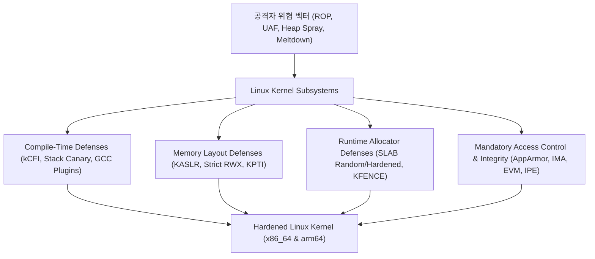

# Linux Kernel Hardening Lab

리눅스 커널 보안 하드닝(Hardening) 기술의 내부 메커니즘을 심층 분석하고, x86_64 및 arm64 아키텍처 환경에서 커널 빌드 및 QEMU 가상머신을 통해 직접 검증하는 엔지니어링 실습 랩.

---

## 1. 랩의 구성 및 설계 철학

- **이론과 실제 바이너리 검증의 유기적 결합**:
  - 보안 기능의 Kconfig 정의 및 커널 소스 코드 레벨 분석.
  - 보안 옵션 비활성화(Base) 상태와 활성화(Hardened) 상태의 커널 빌드 및 동작 비교.
  - LKDTM(Linux Kernel Dump Test Module) 및 맞춤형 Exploit PoC를 통한 방어 메커니즘 런타임 증명.
- **x86_64 및 arm64(aarch64) 듀얼 아키텍처 동시 지원**:
  - 인텔/AMD 환경의 하드웨어 보안 기술(CET IBT/SHSTK, SMEP, SMAP)과 ARM 환경의 보안 기술(PAC, BTI, PAN, PXN) 비교 실습.
- **엔지니어링 표준 준수**:
  - 간결하고 명확한 개조식 명사 종결형 문체 적용.
  - 다이어그램 중심의 직관적 아키텍처 설명 제공.

---

## 2. 10대 핵심 하드닝 카테고리 로드맵

| 카테고리 | 핵심 메커니즘 | 주요 Kconfig 및 기술 |
| :--- | :--- | :--- |
| **1. Stack & Buffer** | 함수 스택 프레임 무결성 검증 및 버퍼 경계 검사 | `CONFIG_STACKPROTECTOR_STRONG`, `CONFIG_FORTIFY_SOURCE` |
| **2. Memory Layout** | 커널 텍스트, 모듈, 물리 메모리 배치 난수화 | `CONFIG_RANDOMIZE_BASE` (KASLR), FG-KASLR |
| **3. Memory Permissions** | W^X 메모리 보호, 유저/커널 영역 간 불법 실행·접근 차단 | `CONFIG_STRICT_KERNEL_RWX`, SMEP/SMAP, KPTI |
| **4. Control Flow Integrity** | 컴파일 타임 및 하드웨어 지원 간접 분기 추적 | Clang kCFI, Intel CET (IBT/SHSTK), ARM PAC/BTI |
| **5. Heap & SLAB Hardening** | 힙 메타데이터 난독화, UAF 방지 자동 영(0) 초기화 | `CONFIG_SLAB_FREELIST_HARDENED`, `CONFIG_INIT_ON_ALLOC_DEFAULT_ON`, KFENCE |
| **6. Compiler Plugins** | 구조체 레이아웃 난수화, 스택 잔여 데이터 자동 소거 | `CONFIG_GCC_PLUGIN_RANDSTRUCT`, `CONFIG_GCC_PLUGIN_STACKLEAK` |
| **7. Speculative Mitigations** | CPU 투기적 실행 결함(Spectre, Meltdown) 소프트웨어 완화 | Retpoline, IBPB, STIBP, SSBD |
| **8. Access Control (LSM)** | 프로세스 단위 강제적 접근 통제 및 샌드박싱 | AppArmor, SELinux, Landlock |
| **9. Integrity Verification** | 파일 실행 무결성 해시 측정, xattr 서명, 정책 집행 | IMA, EVM, IPE, Kernel Lockdown |
| **10. Attack Surface Reduction** | 시스템 콜 필터링, 임의 메모리 접근 및 정보 누출 차단 | Seccomp-BPF, `CONFIG_STRICT_DEVMEM`, Yama ptrace |

---

## 3. 학습 진행 방식

1. [Quick Start](getting-started/index.md): 커널 빌드 도구 및 QEMU 에뮬레이터 환경 구축.
2. [Dual-Arch Environment](getting-started/dual-arch.md): x86_64 및 aarch64 교차 컴파일 및 실행 환경 검증.
3. [Architecture](architecture/index.md): 커널 메모리 모델 및 특권 레벨 전환 메커니즘 확인.
4. [Features Roadmap](features/index.md): 개별 하드닝 피처별 단계적 실습 및 로그 분석.
