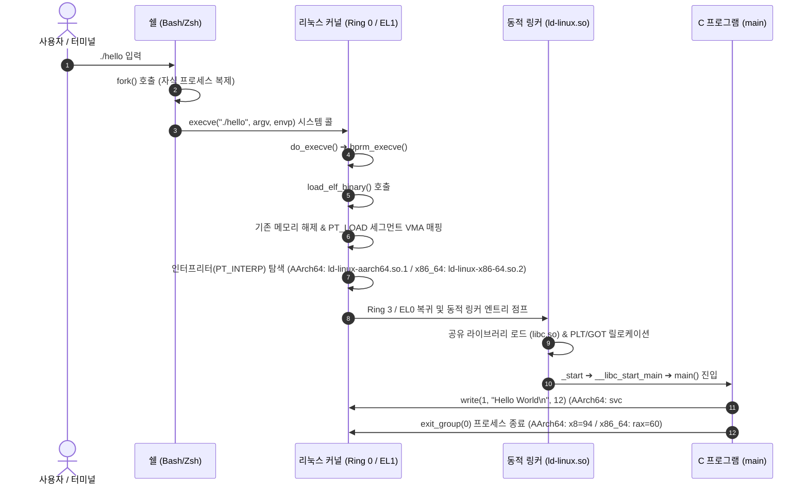

# 01. Hello World의 탄생과 실행 파이프라인 (Program Lifecycle)

모든 시스템 프로그래밍과 보안 학습의 출발점인 `"Hello World"` 프로그램이 작성되어 화면에 출력되고 종료되기까지, 컴파일러 툴체인과 리눅스 운영체제 커널 내부에서 발생하는 전체 실행 라이프사이클을 추적함. 임베디드 및 모바일 보안 표준인 **AArch64(ARM64)** 아키텍처를 기본(Default)으로 분석하며, **x86_64**와의 아키텍처적 차이점을 비교 대조함.

---

## 1. 학습 목표 및 개요

- C 소스 코드(<code>hello.c</code>)가 전처리기, 컴파일러, 어셈블러, 링커를 거쳐 64비트 ELF 바이너리(AArch64 / x86_64)로 조립되는 과정을 규명함.
- 쉘 프롬프트에서 <code>./hello</code>를 입력했을 때 <code>execve()</code> 시스템 콜을 통해 Ring 0 커널 공간으로 제어권이 전이되는 메커니즘을 분석함.
- 리눅스 커널의 <code>load_elf_binary()</code> 함수가 가상 주소 공간(VMA)을 구성하고 PT_LOAD 세그먼트를 매핑하는 방식을 이해함.
- 동적 링커(AArch64: <code>ld-linux-aarch64.so.1</code>, x86_64: <code>ld-linux-x86-64.so.2</code>)와 C 런타임 시작 지점(<code>_start</code> ➔ <code>__libc_start_main</code>)을 거쳐 최종적으로 <code>main()</code> 함수가 호출되는 흐름을 학습함.
- AArch64(<code>svc #0</code>)와 x86_64(<code>syscall</code>)의 시스템 콜 호출 및 반환 원리를 규명함.

---

## 2. 인터랙티브 실행 파이프라인 다이어그램

아래 다이어그램을 통해 소스 코드 컴파일부터 커널 내부 진입 및 종료까지 5단계의 흐름을 단계별로 탐색 가능함:

<div style="width: 100%; margin: 24px 0; border: 1px solid rgba(255,255,255,0.1); border-radius: 12px; overflow: hidden;">
  <iframe src="../../assets/diagrams/principles/01-hello-lifecycle.html" style="width: 100%; border: none; display: block; overflow: hidden;" scrolling="no" onload="try { const c = this.contentWindow.document.getElementById('diagramCanvas'); if(c) this.style.height = Math.ceil(c.getBoundingClientRect().height) + 'px'; } catch(e){}"></iframe>
</div>

---

## 3. 4단계 빌드 파이프라인 심층 분석

C 소스 코드가 실행 파일로 변환되는 과정은 독립적인 4개의 소프트웨어 도구를 순차적으로 통과함:

```
[hello.c] ➔ [전처리기 cpp] ➔ [hello.i] ➔ [컴파일러 cc1] ➔ [hello.s]
          ➔ [어셈블러 as] ➔ [hello.o] ➔ [링커 ld]      ➔ [hello (ELF64)]
```

1. **전처리 단계 (Preprocessing - `cpp`)**:
   - `#include <stdio.h>`와 같은 표준 헤더 파일 내용을 소스 파일 내부로 복사하고, 매크로 정의 치환 및 주석 제거를 수행함.
2. **컴파일 단계 (Compilation - `cc1`)**:
   - 고수준 C 문법을 파싱하고 추상 구문 트리(AST)를 생성한 뒤, 타깃 아키텍처(AArch64 또는 x86_64)의 어셈블리 텍스트(<code>hello.s</code>)로 변환함.
   - AArch64: 4바이트 고정 길이 명령어 체계(`adrp`, `add`, `bl`, `mov`, `ret` 등) 적용.
   - x86_64: 1~15바이트 가변 길이 CISC 명령어 체계(`lea`, `call`, `mov`, `ret` 등) 적용.
3. **어셈블 단계 (Assembly - `as`)**:
   - 어셈블리 명령어를 기계어 바이트(Opcode)로 1:1 매핑하여 재배치 가능한 오브젝트 파일(<code>hello.o</code>, ELF Relocatable)을 생성함.
4. **링킹 단계 (Linking - `ld`)**:
   - C 런타임 기동 오브젝트(<code>crt1.o</code>, <code>crti.o</code>) 및 표준 라이브러리(<code>libc.so</code>)의 심볼 주소를 결합하여 최종 실행 가능한 ELF 바이너리를 완성함.

---

## 4. 커널 공간에서의 프로세스 로딩: `load_elf_binary()`

터미널에서 사용자가 바이너리를 실행하면 사용자 공간의 쉘과 리눅스 커널 사이에 다음과 같은 협업 파이프라인이 작동함:



### 아키텍처별 시스템 콜 호출 규약 비교

| 항목 | AArch64 (ARM64) | x86_64 (AMD64) |
| :--- | :--- | :--- |
| **시스템 콜 트리거 명령어** | `svc #0` (Supervisor Call) | `syscall` |
| **시스템 콜 번호 레지스터** | `X8` (`__NR_write`: 64, `__NR_exit_group`: 94) | `RAX` (`__NR_write`: 1, `__NR_exit_group`: 60) |
| **인자 레지스터 순서** | `X0`, `X1`, `X2`, `X3`, `X4`, `X5` | `RDI`, `RSI`, `RDX`, `R10`, `R8`, `R9` |
| **반환값 레지스터** | `X0` | `RAX` |
| **동적 링커 경로** | `/lib/ld-linux-aarch64.so.1` | `/lib64/ld-linux-x86-64.so.2` |

---

## 5. 실습 소스 코드 및 ELF 바이너리 분석

- **실습 소스 코드**: [`hello.c`](../../assets/labs/principles/01-hello-lifecycle/hello.c) (로컬 원본) | [GitHub 소스 코드 저장소 :octicons-mark-github-16:](https://github.com/auking45/linux-kernel-hardening-lab/blob/main/labs/principles/01-hello-lifecycle/hello.c)
- **전용 Makefile**: [`Makefile`](../../assets/labs/principles/01-hello-lifecycle/Makefile)

### 5.1 실습 코드 실행

=== "AArch64 (기본 타깃)"
    ```bash
    cd labs/principles/01-hello-lifecycle
    make run
    ```

    ```
    === [1] Running Hello World Binary [aarch64] ===
    qemu-aarch64 -L /usr/aarch64-linux-gnu ./hello
    [+] Hello, System Security Principles!
    [+] Process PID: 40, PPID: 1
    [+] main() address: 0x7c26df420c24
    [+] g_greeting (.rodata): 0x7c26df420e64
    [+] g_run_counter (.data): 0x7c26df440010 (value=1)
    [+] argc: 1, argv[0]: ./hello
    ```

=== "x86_64 (비교 타깃)"
    ```bash
    cd labs/principles/01-hello-lifecycle
    make ARCH=x86_64 run
    ```

    ```
    === [1] Running Hello World Binary [x86_64] ===
    ./hello
    [+] Hello, System Security Principles!
    [+] Process PID: 12458, PPID: 11020
    [+] main() address: 0x55dc98a21149
    [+] g_greeting (.rodata): 0x55dc98a22008
    [+] g_run_counter (.data): 0x55dc98a24018 (value=1)
    [+] argc: 1, argv[0]: ./hello
    ```

### 5.2 ELF 세그먼트 및 섹션 심층 분석

=== "AArch64 (기본 타깃)"
    ```bash
    make inspect
    ```

    ```
    === [2] ELF Header Inspection (ELF Magic & Entry Point) [aarch64] ===
    ELF Header:
      Magic:   7f 45 4c 46 02 01 01 00 00 00 00 00 00 00 00 00 
      Class:                             ELF64
      Data:                              2's complement, little endian
      Version:                           1 (current)
      OS/ABI:                            UNIX - System V
      ABI Version:                       0
      Type:                              DYN (Position-Independent Executable file)
      Machine:                           AArch64
      Version:                           0x1
      Entry point address:               0x1040
    ```

    - `readelf -h hello`: ELF 매직 넘버(`\x7fELF`) 및 머신 타입(`AArch64`), 진입점(`Entry point: 0x1040`) 확인.
    - `readelf -l hello`: 커널이 가상 메모리에 매핑하는 `PT_LOAD` 세그먼트와 읽기/쓰기/실행(`R E`, `RW `) 권한 확인.
    - `readelf -S hello`: `.text`, `.rodata`, `.data`, `.bss` 섹션의 크기 및 메모리 오프셋 검증.

=== "x86_64 (비교 타깃)"
    ```bash
    make ARCH=x86_64 inspect
    ```

    - `readelf -h hello`: 머신 타입 `Advanced Micro Devices X86-64`, 진입점 `0x1060` 확인.
    - `readelf -l hello`: x86_64 `PT_LOAD` 세그먼트 구조 및 페이지 정렬(4KB) 확인.

---

## 6. 요약 및 다음 강의

- `"Hello World"` 프로그램은 단순한 C 코드 한 줄이지만, 실행되기 위해 컴파일러 도구 체인, ELF 헤더 파싱, 커널의 `execve` 시스템 콜, 동적 링커의 심볼 재배치, C 런타임 초기화 단계를 유기적으로 거침.
- AArch64 환경에서는 4바이트 고정 명령어, `svc #0` 기반 시스템 콜 호출, `/lib/ld-linux-aarch64.so.1` 링커 체계가 작동함.
- 다음 강의에서는 이렇게 메모리에 올라간 프로세스가 실제로 어떻게 64비트 가상 주소 공간을 분할하고 사용하는지 다루는 **[02. 리눅스 프로세스 구조와 가상 메모리 공간](02-virtual-memory-layout.md)**을 학습함.
