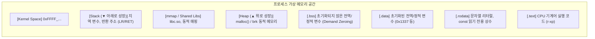
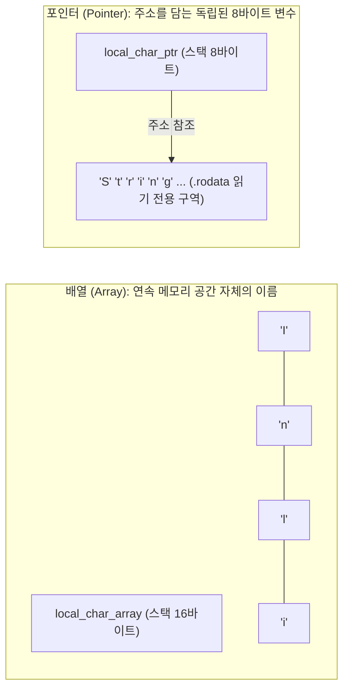
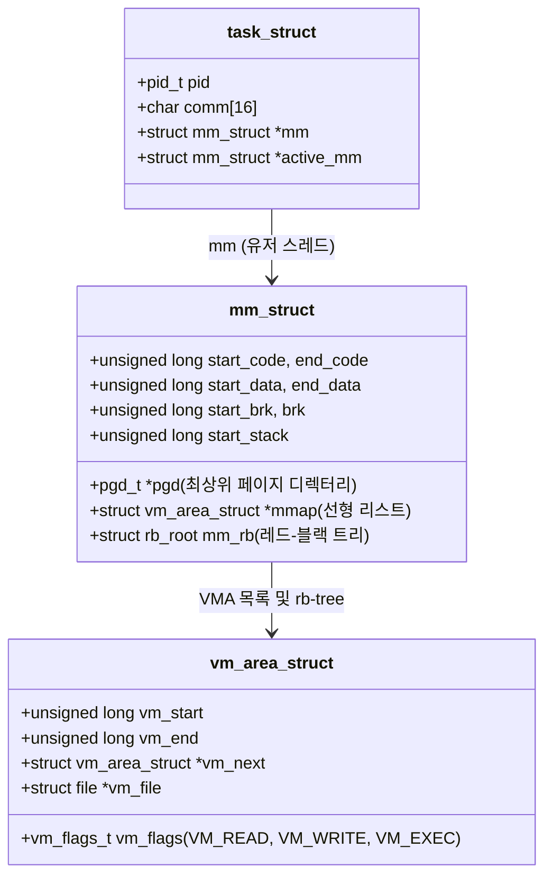
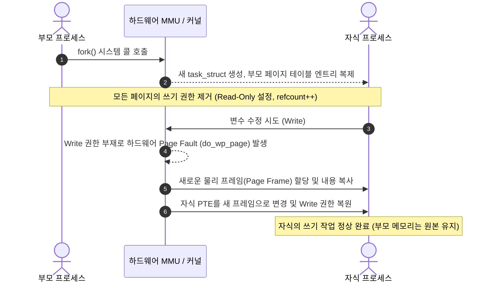
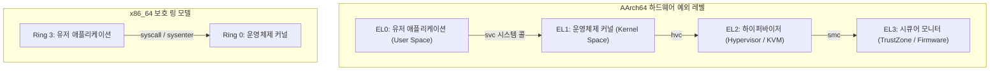

# 02. 리눅스 프로세스 구조와 가상 메모리 공간 (Virtual Address Space)

운영체제에서 실행되는 모든 리눅스 프로세스는 하드웨어 물리 메모리를 직접 보지 않고, 커널과 MMU(Memory Management Unit)가 제공하는 독립적인 **64비트 가상 주소 공간(Virtual Address Space)**에서 독점적으로 동작함. 모바일 및 임베디드 디바이스 보안의 핵심인 **AArch64(ARM64)** 아키텍처를 기본(Default)으로 분석하며, 서버/데스크톱 표준인 **x86_64**와의 아키텍처 차이를 심층 비교 대조함.

---

## 1. 학습 목표 및 개요

- 64비트 가상 메모리 분할 구조(유저 공간 vs 커널 공간) 및 AArch64 `TTBR0_EL1`/`TTBR1_EL1` 레지스터 분리 구조를 이해함.
- 전역 변수, 정적(static) 변수, 스택 지역 변수의 메모리 배치 및 수명(Storage Class Persistence)을 규명함.
- 배열(Array)과 포인터(Pointer)의 메모리 표현 차이(`&arr == arr == &arr[0]` vs `&ptr != ptr`) 및 문자열 상수 최적화를 분석함.
- 커널 내부 프로세스 관리 구조체(`task_struct`, `mm_struct`, `vm_area_struct`)와 스레드 및 커널 스레드의 메모리 공유 메커니즘을 파악함.
- `fork()`의 Copy-on-Write (COW) 원리와 `execve()` 바이너리 교체 시 VMA 재구성 메커니즘을 검증함.
- 하드웨어 권한 레벨(AArch64 EL0~EL3 vs x86 Ring 0~3)과 W^X(Write XOR Execute) 보안 통제 원칙을 이해함.
- 하드웨어 페이지 폴트(SIGSEGV)의 근본 원인인 `SEGV_MAPERR`와 `SEGV_ACCERR`의 차이를 진단하고 실습 코드로 검증함.

---

## 2. 인터랙티브 가상 메모리 맵 인스펙터

아래 메모리 타워를 클릭하여 최상위 커널 공간부터 최하위 널 트랩 구역까지 각 세그먼트의 상세 설명과 보안 함의를 확인 가능함:

<div style="width: 100%; margin: 24px 0; border: 1px solid rgba(255,255,255,0.1); border-radius: 12px; overflow: hidden;">
  <iframe src="../../assets/diagrams/principles/02-virtual-memory.html" style="width: 100%; border: none; display: block; overflow: hidden;" scrolling="no" onload="try { const c = this.contentWindow.document.getElementById('diagramCanvas'); if(c) this.style.height = Math.ceil(c.getBoundingClientRect().height) + 'px'; } catch(e){}"></iframe>
</div>

---

## 3. 64비트 가상 메모리 주소 체계 해부: AArch64 vs x86_64

현대 64비트 프로세서는 64비트 주소 전체($2^{64} \approx 16 \text{ EB}$)를 사용하지 않고, 48비트 가상 주소 체계($2^{48} = 256 \text{ TB}$)를 주로 채택함:

```
[0xFFFFFFFFFFFFFFFF] ───────────┐
                                │ 커널 공간 (Upper Half)
[0xFFFF000000000000] ───────────┘ (AArch64: TTBR1_EL1 / x86_64: CR3 최상위)
                                
  ( Non-Canonical / Unmapped )   주소 미할당 공간 (접근 시 하드웨어 트랩 발생)
                                
[0x0000FFFFFFFFFFFF] ───────────┐ (AArch64: TTBR0_EL1)
                                │ 유저 공간 (Lower Half)
[0x0000000000000000] ───────────┘
```

### 3.1 AArch64의 하드웨어 주소 분할 혁신 (`TTBR0_EL1` vs `TTBR1_EL1`)

ARM64 아키텍처는 유저 공간과 커널 공간의 분리를 하드웨어 베이스 레지스터 수준에서 물리적으로 양분함:

1. **`TTBR0_EL1` (Translation Table Base Register 0)**:
   - 유저 공간(`0x0000_0000_0000_0000 ~ 0x0000_FFFF_FFFF_FFFF`) 전용 변환 테이블의 베이스 주소를 보유함.
   - 프로세스 문맥 교환(Context Switch) 발생 시 커널은 `TTBR0_EL1`만 대상 프로세스의 페이지 테이블 주소로 교체함.
2. **`TTBR1_EL1` (Translation Table Base Register 1)**:
   - 커널 공간(`0xFFFF_0000_0000_0000 ~ 0xFFFF_FFFF_FFFF_FFFF`) 전용 변환 테이블의 베이스 주소를 보유함.
   - 문맥 교환 시 커널 매핑 테이블을 갱신할 필요가 없어 TLB 플러시 오버헤드를 억제함.
3. **`TCR_EL1` (Translation Control Register)**:
   - `T0SZ`와 `T1SZ` 필드를 통해 유저/커널 영역의 유효 가상 주소 비트 크기(39비트, 48비트, 52비트)를 독립 제어함.

### 3.2 x86_64의 정규 주소(Canonical Address) 규칙

x86_64는 단일 제어 레지스터(`CR3`)가 4단계(PML4) 또는 5단계(PML5) 페이지 디렉터리를 가리킴:

- 48비트 주소 체계에서 최상위 16개 비트(비트 48~63)는 47번 비트와 동일하게 부호 확장(Sign Extension)되어야 함.
- 47번 비트가 `0`이면 `0x00007FFFFFFFFFFF` 이하(유저 공간), `1`이면 `0xFFFF800000000000` 이상(커널 공간)만 유효함.
- 그 사이의 거대한 미할당 구역(약 16,777,216 TB)에 접근할 경우 CPU 하드웨어가 일반 보호 예외(`#GP Fault`)를 발생시킴.

---

## 4. 메모리 세그먼트와 변수 분류 (Storage Class Persistence)

프로그램 내에서 선언된 변수는 유효 범위(Scope)와 기억 부류(Storage Class)에 따라 서로 다른 메모리 세그먼트에 배치됨:



### 4.1 변수 종류별 메모리 배치 및 수명 비교

| 변수 구분 | 선언 예시 | 할당 위치 | 초기화 시점 | 유효 수명 (Lifetime) | 문법적 스코프 |
| :--- | :--- | :--- | :--- | :--- | :--- |
| **초기화된 전역 변수** | `int g_val = 10;` | `.data` | 컴파일 타임 | 프로세스 종료 시까지 영구 존속 | 프로그램 전체 (`extern` 가능) |
| **미초기화 전역 변수** | `int g_zero;` | `.bss` | 런타임 페이지 폴트 시 0 할당 | 프로세스 종료 시까지 영구 존속 | 프로그램 전체 |
| **정적(static) 지역 변수** | `static int cnt = 0;` | `.data` / `.bss` | 최초 1회 초기화 | 프로세스 종료 시까지 영구 존속 | 선언된 함수 내부로 한정 |
| **일반 스택 지역 변수** | `int local_x = 5;` | `Stack` | 함수 진입 런타임 | 함수 반환(Return) 시 소멸 | 선언된 블록/함수 내부 |
| **동적 힙 할당 변수** | `malloc(256);` | `Heap` | `malloc()` 호출 시 | `free()` 호출 시까지 존속 | 포인터를 보유한 모든 영역 |

### 4.2 함수 내부 정적(static) 변수의 메모리 존속성 메커니즘

함수 내부에서 선언된 `static` 지역 변수는 문법적 접근 범위만 함수 내부로 제한될 뿐, 메모리 물리 배치는 전역 변수와 동일하게 `.data` 세그먼트에 배치됨. 따라서 함수가 반환되어 스택 프레임이 소멸하더라도 변수의 값이 보존되며 다음 함수 호출 시 누적 반영됨:

```c
void demonstrate_static_persistence(void) {
    static int call_counter = 0; // .data 세그먼트에 단 1회 할당 및 보존
    call_counter++;
    printf("Invocation: %d (address: %p)\n", call_counter, (void *)&call_counter);
}
```

---

## 5. 배열(Array)과 포인터(Pointer)의 메모리 해부

C 언어에서 배열과 포인터는 문법적으로 유사하게 취급되나, 가상 메모리 공간에서의 실체와 하드웨어 수준 동작 방식은 근본적으로 다름.



### 5.1 배열의 주소 동일성 수렴 (`&arr == arr == &arr[0]`)

- 배열 식별자(`local_char_array`)는 포인터 변수가 아니며, 스택 프레임에 연속으로 할당된 메모리 공간 자체의 시작 위치를 나타내는 컴파일 타임 심볼임.
- 따라서 다음 세 연산식은 컴파일러에 의해 동일한 스택 주소로 수렴함:
  1. `&local_char_array`: 배열 전체 블록의 시작 주소
  2. `local_char_array`: 포인터로 붕괴(Decay)된 첫 번째 원소의 주소
  3. `&local_char_array[0]`: 첫 번째 바이트 원소의 직접 주소

### 5.2 포인터 변수의 독립성 (`&ptr != ptr`)

- 포인터 변수(`local_char_ptr`)는 스택 프레임 위에 독립된 8바이트 공간을 점유하는 실제 메모리 변수임.
- `&local_char_ptr`: 포인터 변수 자체가 위치한 **스택(Stack)** 주소.
- `local_char_ptr`: 포인터 변수 내부에 저장된 값으로, 대상 문자열 리터럴이 존재하는 **`.rodata`** 세그먼트의 주소.
- 문자열 수정 시 차이:
  - `char arr[] = "Test";` $\rightarrow$ 문자열이 스택으로 복사되어 원소 수정 가능 (`arr[0] = 'X'`).
  - `const char *ptr = "Test";` $\rightarrow$ `.rodata`의 원본을 가리키므로 수정 시도 시 하드웨어 보호 위반(`SEGV_ACCERR`) 발생.

---

## 6. 커널 내부의 프로세스 메모리 추상화 모델

리눅스 커널은 각 프로세스의 가상 주소 공간을 커널 메모리 내부의 계층 구조체를 통해 추적 및 제어함:



### 6.1 핵심 메모리 관리 구조체

1. **`task_struct` (Process Control Block)**:
   - 커널 내부에서 프로세스 및 스레드를 표현하는 최상위 디스크립터.
   - 유저 프로세스는 `mm` 필드가 유효한 `mm_struct`를 가리킴.
2. **`mm_struct` (Memory Descriptor)**:
   - 프로세스의 독립된 가상 주소 공간 전체를 포괄하는 관리 구조체.
   - `pgd`: 최상위 페이지 테이블 물리 주소 (컨텍스트 스위칭 시 AArch64 `TTBR0_EL1` 또는 x86 `CR3`에 적재).
   - `mmap` / `mm_rb`: 프로세스에 할당된 모든 가상 메모리 구역(`vm_area_struct`)을 선형 리스트 및 고속 탐색용 레드-블랙 트리(Red-Black Tree)로 유지.
3. **`vm_area_struct` (VMA)**:
   - 연속된 가상 주소 구간(`vm_start` ~ `vm_end`)과 페이지 권한(`vm_flags`)을 정의하는 기본 단위.
   - `/proc/[pid]/maps` 파일에서 출력되는 각 행이 정확히 하나의 `vm_area_struct`에 대응됨.

### 6.2 프로세스 vs 스레드 vs 커널 스레드의 메모리 모델

- **일반 프로세스 (`fork`)**: 독립된 `mm_struct`와 독립된 페이지 테이블을 보유함.
- **유저 스레드 (`pthread_create` / `clone(CLONE_VM)`)**: 동일 프로세스 내의 모든 스레드는 부모의 `mm_struct`를 공유함(`task_struct->mm` 포인터 동일). 동일 주소 공간을 공유하므로 메모리 동기화(Mutex/Lock)가 필수적임.
- **커널 스레드 (`kthreadd` 파생 스레드)**:
  - 유저 공간 메모리가 필요 없으므로 `task_struct->mm == NULL`임.
  - 컨텍스트 스위칭 시 이전에 실행되던 유저 프로세스의 `active_mm`을 일시 차용(Borrowing)하여 커널 공간 주소 변환에 활용함.

---

## 7. 프로세스 생명주기와 메모리 전이 (Lifecycle & Transitions)

### 7.1 `fork()`와 Copy-on-Write (COW) 메커니즘

전통적인 Unix `fork()`는 부모의 전체 메모리를 자식에게 물리적으로 복사해야 하므로 엄청난 메모리 낭비와 지연이 발생했음. 현대 리눅스는 **Copy-on-Write (COW)** 기법을 통해 이를 최적화함:



1. `fork()` 수행 시 자식 프로세스는 부모의 가상 주소 구조(`mm_struct`, VMA)와 페이지 테이블만 복제함.
2. 부모와 자식의 모든 쓰기 가능 페이지는 하드웨어 수준에서 **Read-Only**로 강제 변경됨.
3. 둘 중 어느 한쪽이 해당 페이지에 쓰기 연산을 시도하면 MMU가 **Page Fault Exception**을 발생시킴.
4. 커널의 `do_wp_page()` 핸들러가 새로운 물리 페이지 프레임을 즉시 할당하여 기존 내용을 복사하고, 쓰기를 시도한 프로세스의 페이지 테이블에 쓰기 권한을 복원함.

### 7.2 `execve()`와 가상 메모리 재구성

`execve()`가 호출되면 커널은 기존 프로세스의 가상 주소 공간 전체를 초기화하고 새 바이너리로 완전히 교체함:

1. 기존 `mm_struct`의 모든 VMA와 페이지 테이블 매핑을 해제(`exit_mmap`).
2. ELF 실행 파일 헤더를 파싱하여 `LOAD` 세그먼트(`.text`, `.rodata`, `.data`, `.bss`)를 위한 신규 VMA를 생성함.
3. 새로운 사용자 스택(환경변수, 명령행 인수 배치) 및 힙 영역을 초기화함.
4. 프로그램 카운터(PC / RIP)를 새 ELF의 엔트리 포인트(`_start`)로 설정하고 실행을 시작함.

---

## 8. 하드웨어 권한 레벨 및 W^X 메모리 보호

### 8.1 AArch64 예외 레벨(Exception Levels) vs x86_64 링(Ring) 모델



- **AArch64**:
  - `EL0`: 비특권 유저 공간. 시스템 자원 직접 접근 불가. `svc` (Supervisor Call) 명령어를 통해 `EL1` 커널로 진입.
  - `EL1`: 특권 커널 공간. MMU 제어, 페이지 테이블 조작(`TTBR0/1`), 인터럽트 처리 수행.
  - 하드웨어 비트: `AP[2:1]` (유저/커널 접근 권한), `UXN` (User Execute-Never), `PXN` (Privileged Execute-Never) 비트를 통해 권한 상승 공격(ret2usr, SMEP/PXN) 차단.
- **x86_64**:
  - `Ring 3` (유저 모드) $\leftrightarrow$ `Ring 0` (커널 모드). `syscall` 명령어로 전환.

### 8.2 W^X (Write XOR Execute) 보안 원칙

현대 운영체제는 공격자가 주입한 악성 쉘코드가 스택이나 힙에서 직접 실행되는 것을 방지하기 위해 하드웨어 페이지 테이블 수준에서 다음 불변식을 강제함:

$$\text{Permission} \subseteq \{ \text{Read, Write} \} \lor \text{Permission} \subseteq \{ \text{Read, Execute} \}$$

- 쓰기 가능한 메모리 페이지에는 실행 권한을 절대로 부여하지 않음(`W ^ X`).
- AArch64의 `XN` / `UXN` 비트, x86_64의 `NX` (No-Execute) 비트를 통해 하드웨어 MMU가 스택/힙 코드 실행 시도를 즉시 트랩함.

---

## 9. 하드웨어 세그멘테이션 폴트(SIGSEGV) 원인 해부

프로그램이 잘못된 메모리에 접근하여 비정상 종료될 때 커널은 하드웨어 MMU의 페이지 폴트 상태를 진단하여 `SIGSEGV` 시그널과 함께 원인 코드(`si_code`)를 전달함:

| 폴트 구분 | `si_code` 값 | 발생 원인 | 대표적 발생 시나리오 |
| :--- | :---: | :--- | :--- |
| **`SEGV_MAPERR`** | `1` | 주소가 어떤 VMA(`vm_area_struct`)에도 매핑되지 않음 | NULL 포인터 역참조(`0x0`), 미할당 정규 주소 홀 접근 |
| **`SEGV_ACCERR`** | `2` | 주소는 VMA에 매핑되어 있으나 해당 VMA의 권한을 위반함 | `.rodata` 읽기 전용 구역에 쓰기 시도, NX 스택 실행 시도 |

---

## 10. 실습 소스 코드 및 검증

- **실습 소스 코드**: [`address_space_demo.c`](../../assets/labs/principles/02-address-space/address_space_demo.c) (로컬 원본) | [GitHub 소스 코드 저장소 :octicons-mark-github-16:](https://github.com/auking45/linux-kernel-hardening-lab/blob/main/labs/principles/02-address-space/address_space_demo.c)
- **전용 Makefile**: [`Makefile`](../../assets/labs/principles/02-address-space/Makefile)

### 10.1 기본 세그먼트 및 변수/배열/포인터 분석

=== "AArch64 (기본 타깃)"
    ```bash
    cd labs/principles/02-address-space
    make run
    ```

    ```
    === Running address_space_demo on aarch64 ===
    qemu-aarch64 -L /usr/aarch64-linux-gnu ./address_space_demo
    ============================================================
     64-bit Process Virtual Address Space Inspection (PID: 35)
    ============================================================
    [1] Code Segment (.text)       : 0x74268fe312b0 (main)
                                   : 0x74268fe312a8 (dummy_function)
    [2] Read-Only Data (.rodata)   : 0x74268fe31700 ("System Security Principles 2026")
    [3] Initialized Data (.data)   : 0x74268fe50010 (0x1337)
    [4] Uninitialized Data (.bss)  : 0x74268fe50018 (0x0)
    [5] Heap Segment (malloc)      : 0x400000a3e2a0 (size=256)
    [6] Memory Mapped Region (mmap): 0x400000b3e000 (page-aligned)
    [7] Shared Library (libc)      : 0x4000008c0410 (printf)
    [8] Stack Segment (RSP/SP area): 0x4000007fecfc (&local_stack_var)
                                   : 0x4000007fecec (&argc)
    [9] Kernel Space Boundary      : 0xffff000000000000 (AArch64 TTBR1) / 0xffff800000000000 (x86_64)

    ------------------------------------------------------------
     Variable Classification & Static Persistence Analysis
    ------------------------------------------------------------
    [*] Static Function-Scope Variable Persistence Across Calls:
         - Invocation 1: address=0x74268fe5001c, value=1
         - Invocation 2: address=0x74268fe5001c, value=2
         - Invocation 3: address=0x74268fe5001c, value=3

    ------------------------------------------------------------
     Array vs. Pointer Memory Anatomy in Virtual Memory
    ------------------------------------------------------------
    [*] Array Identity Property (&arr == arr == &arr[0]):
        - Address of array (&local_char_array) : 0x4000007fed18
        - Array identifier  (local_char_array)  : 0x4000007fed18
        - First element     (&local_char_array[0]): 0x4000007fed18
        -> Status: All 3 expressions evaluate to the exact same stack address.

    [*] Pointer Distinction Property (&ptr != ptr):
        - Address of pointer variable (&local_char_ptr): 0x4000007fed00 (Stack)
        - Value of pointer variable   (local_char_ptr) : 0x74268fe31ea8 (.rodata)
        -> Status: Pointer variable on stack holds target address located in .rodata.
    ```

=== "x86_64 (비교 타깃)"
    ```bash
    cd labs/principles/02-address-space
    make ARCH=x86_64 run
    ```

    ```
    === Running address_space_demo on x86_64 ===
    ./address_space_demo
    ============================================================
     64-bit Process Virtual Address Space Inspection (PID: 36)
    ============================================================
    [1] Code Segment (.text)       : 0x5d8ed922995e (main)
                                   : 0x5d8ed9229953 (dummy_function)
    [2] Read-Only Data (.rodata)   : 0x5d8ed922a020 ("System Security Principles 2026")
    [3] Initialized Data (.data)   : 0x5d8ed922d010 (0x1337)
    [4] Uninitialized Data (.bss)  : 0x5d8ed922d018 (0x0)
    [5] Heap Segment (malloc)      : 0x5d8f0936f2a0 (size=256)
    [6] Memory Mapped Region (mmap): 0x74472957a000 (page-aligned)
    [7] Shared Library (libc)      : 0x744729260100 (printf)
    [8] Stack Segment (RSP/SP area): 0x7fffb2065044 (&local_stack_var)
                                   : 0x7fffb206503c (&argc)
    [9] Kernel Space Boundary      : 0xffff000000000000 (AArch64 TTBR1) / 0xffff800000000000 (x86_64)

    ------------------------------------------------------------
     Variable Classification & Static Persistence Analysis
    ------------------------------------------------------------
    [*] Static Function-Scope Variable Persistence Across Calls:
         - Invocation 1: address=0x5d8ed922d01c, value=1
         - Invocation 2: address=0x5d8ed922d01c, value=2
         - Invocation 3: address=0x5d8ed922d01c, value=3

    ------------------------------------------------------------
     Array vs. Pointer Memory Anatomy in Virtual Memory
    ------------------------------------------------------------
    [*] Array Identity Property (&arr == arr == &arr[0]):
        - Address of array (&local_char_array) : 0x7fffb2065060
        - Array identifier  (local_char_array)  : 0x7fffb2065060
        - First element     (&local_char_array[0]): 0x7fffb2065060
        -> Status: All 3 expressions evaluate to the exact same stack address.

    [*] Pointer Distinction Property (&ptr != ptr):
        - Address of pointer variable (&local_char_ptr): 0x7fffb2065048 (Stack)
        - Value of pointer variable   (local_char_ptr) : 0x5d8ed922a7ae (.rodata)
        -> Status: Pointer variable on stack holds target address located in .rodata.
    ```

### 10.2 Copy-on-Write (COW) 메모리 격리 검증

`make run-cow`를 실행하여 `fork()` 직후 부모와 자식이 동일한 가상 주소를 공유하다가, 자식 프로세스가 값을 변경하는 순간 커널 MMU가 새로운 물리 페이지 프레임을 즉시 할당하여 격리함을 확인 가능함:

```bash
make run-cow
```

```
============================================================
 Process Lifecycle & Copy-on-Write (COW) Verification
============================================================
[*] Parent Process (PID: 39) Initial State:
    - Global Variable (g_initialized_data) : 0x7e0dbf0d0010 = 0x1337
    - Local Variable  (local_cow_var)      : 0x4000007fecb0 = 100

[*] Invoking fork() system call...

[+] [Child PID: 41] Before Memory Modification:
    - Virtual Address g_initialized_data : 0x7e0dbf0d0010 = 0x1337
    - Virtual Address local_cow_var      : 0x4000007fecb0 = 100
    (Notice: Virtual addresses match parent exactly. MMU pages are shared read-only)

[+] [Child PID: 41] Modifying Variables (Triggering MMU COW Page Fault)...
[+] [Child PID: 41] After Memory Modification:
    - Virtual Address g_initialized_data : 0x7e0dbf0d0010 = 0xbeef
    - Virtual Address local_cow_var      : 0x4000007fecb0 = 999
    (MMU allocated private physical frames. Child modifications are isolated!)

[*] [Parent PID: 39] After Child Termination:
    - Virtual Address g_initialized_data : 0x7e0dbf0d0010 = 0x1337
    - Virtual Address local_cow_var      : 0x4000007fecb0 = 100
    (Parent memory remains completely untouched at 0x1337 and 100)
```

### 10.3 하드웨어 세그멘테이션 폴트(SIGSEGV) 진단 검증

`sigaction` 핸들러(`SA_SIGINFO`)를 등록하여 하드웨어 페이지 폴트 발생 시 `siginfo_t`를 직접 파싱함:

=== "SEGV_MAPERR (NULL 포인터 역참조)"
    ```bash
    make run-segv-null
    ```

    ```
    [*] Setting up sigaction for SIGSEGV inspection...
    [*] Triggering NULL Pointer Dereference (*(volatile int *)NULL = 0x41414141)...

    [!] ========================================================
    [!] HARDWARE PAGE FAULT TRAP: SIGSEGV (Signal 11) Received
    [!] Faulting Memory Address (si_addr) : (nil)
    [!] Kernel Diagnostic Code  (si_code) : 1 -> SEGV_MAPERR (Address not mapped to any Virtual Memory Area)
    [!] ========================================================
    ```

=== "SEGV_ACCERR (읽기 전용 구역 쓰기 위반)"
    ```bash
    make run-segv-rodata
    ```

    ```
    [*] Setting up sigaction for SIGSEGV inspection...
    [*] Triggering Write to Read-Only (.rodata) Memory: address=0x7aa343691700

    [!] ========================================================
    [!] HARDWARE PAGE FAULT TRAP: SIGSEGV (Signal 11) Received
    [!] Faulting Memory Address (si_addr) : 0x7aa343691700
    [!] Kernel Diagnostic Code  (si_code) : 2 -> SEGV_ACCERR (Invalid permissions for mapped Virtual Memory Area)
    [!] ========================================================
    ```

---

## 11. 요약 및 다음 강의

- 리눅스 프로세스는 텍스트, 데이터, 힙, mmap, 스택으로 구성된 정교한 가상 메모리 공간에서 실행됨.
- AArch64는 `TTBR0_EL1`과 `TTBR1_EL1`을 통해 유저와 커널 페이지 테이블을 하드웨어 수준에서 물리적으로 완벽히 격리함.
- `task_struct`와 `mm_struct`, `vm_area_struct`는 커널이 프로세스의 가상 주소 공간을 관리하고 W^X 보안을 강제하는 근간임.
- `fork()`의 Copy-on-Write와 하드웨어 SIGSEGV 핸들링(`SEGV_MAPERR` vs `SEGV_ACCERR`)은 MMU 페이지 폴트 메커니즘에 기반함.
- 다음 강의에서는 이 중에서도 함수가 호출될 때마다 동적으로 생성되고 소멸하며 보안 취약점의 핵심 무대가 되는 **[03. 스택 프레임 구조와 함수 호출 규약(ABI)](03-stack-frame-and-abi.md)**을 집중 분석함.
