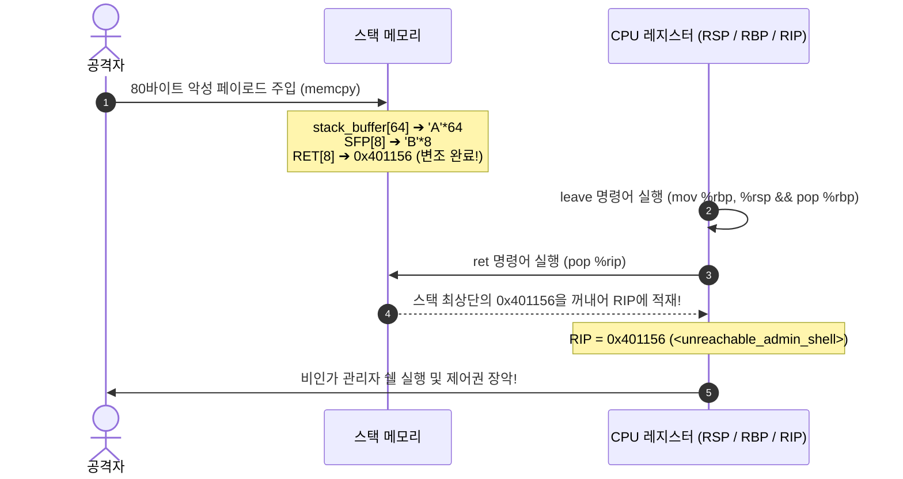

# 05. 클래식 버퍼 오버플로우와 RIP 장악 (Buffer Overflow & Control Flow Hijack)

C 언어의 경계 검사 부재 결함으로 인해 입력 데이터가 스택 프레임의 한계를 넘어 **복귀 주소(Return Address)를 덮어쓰고 CPU 명령어 포인터(RIP)를 탈취**하는 바이너리 익스플로잇의 기본 원리를 분석함.

---

## 1. 학습 목표 및 개요

- `strcpy()`, `gets()` 등 입력 길이를 확인하지 않는 레거시 C 함수의 취약점 메커니즘을 이해함.
- 지역 버퍼의 경계를 넘어 Saved RBP(SFP)와 Return Address가 순차적으로 변조되는 스택 메모리 스매싱 과정을 추적함.
- 함수 종료 시 실행되는 `ret` 명령어가 변조된 복귀 주소를 CPU의 `RIP` 레지스터로 POP하여 제어 흐름을 탈취하는 원리를 규명함.
- 클래식 버퍼 오버플로우를 저지하기 위해 고안된 현대의 3대 보호 기법(Stack Canary, NX/DEP, ASLR)의 탄생 배경을 종합적으로 연결함.

---

## 2. 인터랙티브 버퍼 오버플로우 & RIP 장악 시뮬레이터

아래 다이어그램에서 4단계(정상 상태 ➔ 버퍼 초과 유입 ➔ SFP/RET 변조 ➔ RIP 탈취)를 거치며 메모리 바이트와 CPU 레지스터가 어떻게 전이되는지 확인 가능함:

<div style="width: 100%; height: 600px; margin: 24px 0; border: 1px solid rgba(255,255,255,0.1); border-radius: 12px; overflow: hidden;">
  <iframe src="../../assets/diagrams/principles/05-bof-rip.html" style="width: 100%; height: 100%; border: none;"></iframe>
</div>

---

## 3. 취약점 메커니즘: 경계 검사 없는 메모리 복사

```c
void vulnerable_service(const char *user_input, size_t input_len) {
    char stack_buffer[64];
    /* 결함: stack_buffer 크기(64바이트)를 초과하는 입력 복사 허용 */
    memcpy(stack_buffer, user_input, input_len);
}
```

- 스택 메모리는 낮은 주소(RSP)에서 높은 주소 방향으로 데이터를 기록함.
- 따라서 `stack_buffer[0]`부터 쓰기 시작하여 64바이트를 초과하면, 그 바로 위 높은 주소에 위치한 **Saved Frame Pointer(SFP, 8바이트)**와 **Return Address(RET, 8바이트)**를 물리적으로 침범하게 됨.

---

## 4. 공격 페이로드 구조와 RIP 탈취 파이프라인

관리자 비밀 쉘 함수(`unreachable_admin_shell`, 주소: `0x401156`)로 제어권을 돌리기 위한 공격 페이로드의 바이트 레이아웃:

```
[0x00 .. 0x3F] (64 바이트) : 'A' * 64 (버퍼 패딩)
[0x40 .. 0x47] ( 8 바이트) : 'B' * 8  (Saved RBP / SFP 덮어쓰기)
[0x48 .. 0x4F] ( 8 바이트) : 0x0000000000401156 (타깃 함수 주소 주입)
총 80바이트
```



---

## 5. 실습 소스 코드 및 제어 흐름 탈취 검증

- **실습 소스 코드**: [`bof_demo.c`](../../assets/labs/principles/05-bof-rip/bof_demo.c) (로컬 원본) | [GitHub 소스 코드 저장소 :octicons-mark-github-16:](https://github.com/auking45/linux-kernel-hardening-lab/blob/main/labs/principles/05-bof-rip/bof_demo.c)
- **전용 Makefile**: [`Makefile`](../../assets/labs/principles/05-bof-rip/Makefile)

### 5.1 정상 실행 모드

```bash
cd labs/principles/05-bof-rip
make run-normal
```

```
============================================================
 Classic Buffer Overflow & RIP Hijacking Simulator
============================================================
[*] Target Function unreachable_admin_shell : 0x401156
[*] main() Function                         : 0x40124a

=== [Mode 1: Normal In-Bounds Operation] ===
[+] Sending safe payload (33 bytes) into 64-byte buffer.
--- [Stack State Before Input Copy] ---
  stack_buffer[0] Address : 0x7fffffffe000
  Saved RBP (SFP) Address : 0x7fffffffe040
  Saved RET Address       : 0x7fffffffe048 (points to: 0x401267)
  Buffer to RET Distance  : 72 bytes
---------------------------------------
[+] vulnerable_service() executing 'ret' instruction...
[+] Clean return from vulnerable_service()! Normal workflow resumed.
```

### 5.2 공격 실행 모드 (RIP 탈취)

```bash
make run-attack
```

```
=== [Mode 2: Buffer Overflow & RIP Hijack Attack] ===
[+] Fabricated Exploit Payload (80 bytes):
    [0..63]  Buffer Padding   : 64 bytes of 'A' (0x41)
    [64..71] SFP / Saved RBP  : 8 bytes of 'B' (0x42)
    [72..79] Target RET Addr  : 0x401156 (unreachable_admin_shell)

[!] Delivering exploit payload into vulnerable_service()...
--- [Stack State Before Input Copy] ---
  Saved RET Address       : 0x7fffffffe048 (points to: 0x401267)
--- [Stack State After Input Copy] ---
  Saved RET Address now   : 0x7fffffffe048 (points to: 0x401156)
---------------------------------------
[+] vulnerable_service() executing 'ret' instruction...

============================================================
 [!] CRITICAL SECURITY COMPROMISE: Control Flow Hijacked!
============================================================
 [★] CPU Instruction Pointer (RIP/PC) redirected to:
     unreachable_admin_shell() at 0x401156!
 [★] Attacker gained arbitrary code execution in target process.
============================================================
```

---

## 6. 현대 운영체제의 3대 방어선과 커널 하드닝의 연결

이러한 클래식 버퍼 오버플로우가 현대 운영체제에서 즉각적으로 통하지 않는 이유는 다음 3대 방어선이 컴파일러와 커널 수준에서 기본 활성화되어 있기 때문임:

1. **Stack Canary (`-fstack-protector`)**:
   - SFP 바로 앞에 랜덤 카나리 값을 삽입하여, RET를 덮어쓰기 위해 카나리가 오염되면 `__stack_chk_fail()`을 호출하고 프로세스를 즉각 강제 종료함.
2. **W^X / NX (Non-Executable Stack, DEP)**:
   - 스택 페이지에서 실행 권한을 박탈하여, 스택에 주입된 쉘코드로 점프하더라도 CPU가 `#PF` / `SIGSEGV`를 발생시킴.
3. **ASLR (Address Space Layout Randomization) & PIE**:
   - 바이너리 코드와 라이브러리 주소를 무작위로 흩뿌려, 공격자가 고정된 타깃 함수 주소를 사전에 예측할 수 없게 만듦.

> [!TIP]
> 이제 본 기초 원리를 바탕으로, 실제 양산형 로봇 및 임베디드 리눅스 시스템에서 발생한 실제 CVE 취약점과 커널 하드닝 방어 체계를 다루는 **[실전 공격 시나리오(Attack Scenarios)](../scenarios/index.md)**로 학습을 이어갈 수 있음.
