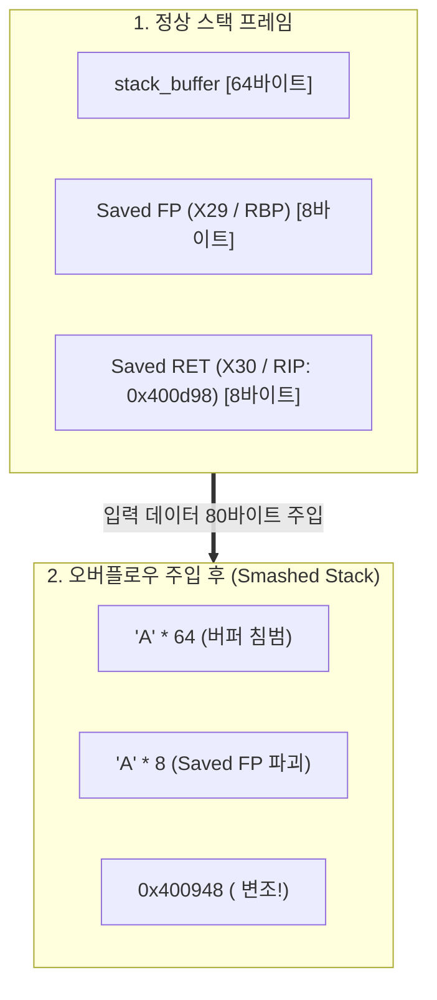
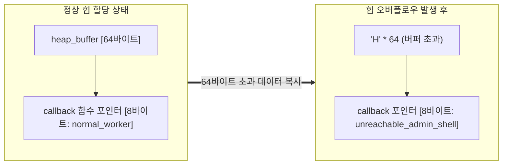

# 05. 클래식 버퍼 오버플로우와 RIP/PC 장악 (Buffer Overflow & Control Flow Hijack)

C 언어의 경계 검사 부재 결함으로 인해 입력 데이터가 메모리의 한계를 넘어 **함수 포인터 및 복귀 주소(Return Address)를 변조하고 CPU 명령어 포인터(PC / RIP)를 탈취**하는 바이너리 익스플로잇의 기본 원리를 분석함. 임베디드 및 모바일 보안 표준인 **AArch64(ARM64)** 아키텍처를 기본(Default)으로 분석하며, **x86_64**와의 스택/힙 프레임 차이 및 하드웨어 방어 체계(ARM PAC/BTI vs Intel CET)를 심층 비교함.

---

## 1. 학습 목표 및 개요

- `memcpy()`, `strcpy()`, `gets()` 등 입력 길이를 검증하지 않는 메모리 복사 함수의 취약점 메커니즘을 규명함.
- 스택 프레임 구조(`Buffer` ➔ `Saved FP` ➔ `Saved RET`) 및 GDB를 통한 메모리 덤프 추적 기법을 체득함.
- 1바이트 변조(Partial Overwrite)로 인한 크래시와 완전 덮어쓰기를 통한 제어 흐름 탈취 메커니즘을 분석함.
- 환경 변수와 실행 인자로 인한 스택 주소 미세 변동을 극복하는 **NOP 슬레드(NOP Sled)**의 작동 원리를 규명함.
- 스택에 국한되지 않고 힙(Heap) 동적 할당 구조체 내 함수 포인터를 변조하는 **힙 버퍼 오버플로우(Heap BOF)** 원리를 학습함.
- 포맷 스트링 취약점(`printf(buffer)`)의 기본 개념과 메모리 침해 연계 가능성을 이해함.
- 클래식 공격을 무력화하기 위한 현대 5대 다층 방어 체계(Canary, NX, ASLR, PAC/BTI, CET)의 원리를 비교 학습함.

---

## 2. 인터랙티브 버퍼 오버플로우 & PC/RIP 장악 시뮬레이터

아래 다이어그램에서 4단계(정상 상태 ➔ 버퍼 초과 유입 ➔ SFP/RET 변조 ➔ PC/RIP 탈취)를 거치며 메모리 바이트와 CPU 레지스터가 어떻게 전이되는지 확인 가능함:

<div style="width: 100%; margin: 24px 0; border: 1px solid rgba(255,255,255,0.1); border-radius: 12px; overflow: hidden;">
  <iframe src="../../assets/diagrams/principles/05-bof-rip.html" style="width: 100%; border: none; display: block; overflow: hidden;" scrolling="no" onload="try { const c = this.contentWindow.document.getElementById('diagramCanvas'); if(c) this.style.height = Math.ceil(c.getBoundingClientRect().height) + 'px'; } catch(e){}"></iframe>
</div>

---

## 3. 취약점의 근본 원인과 공격 전제 조건

### 3.1 위험 함수군과 경계 검사 부재

C 언어는 버퍼의 경계 검사(Bounds Checking)를 프로그래머의 책임으로 일임하므로, 목적지 버퍼 크기보다 큰 데이터를 복사할 때 메모리 인접 영역을 파괴함:

- **절대 사용 금지 함수**: `gets()` (입력 크기 제한 기능 자체가 부재함)
- **위험 함수군**: `strcpy()`, `strcat()`, `sprintf()`, `scanf("%s")` (종료 문자 `\0`를 만날 때까지 무제한 복사)
- **잘못 사용된 함수**: `memcpy(dest, src, n)` (인자 `n`이 `dest` 크기보다 크게 지정된 경우)

### 3.2 클래식 익스플로잇 구동을 위한 환경적 전제 조건

현대 리눅스 배포판은 기본적으로 다층 방어 기법이 작동하므로, 클래식 버퍼 오버플로우를 재현하기 위해서는 다음 옵션을 해제함:

1. **ASLR 비활성화**:
   ```bash
   sudo sysctl -w kernel.randomize_va_space=0
   ```
2. **컴파일러 보호 기법 비활성화**:
   - `-fno-stack-protector`: 스택 카나리 삽입 차단
   - `-z execstack`: 스택 세그먼트에 실행 권한 부여 (NX 해제)
   - `-no-pie`: 코드 세그먼트 주소 고정

---

## 4. 스택 기반 버퍼 오버플로우 (Stack-based BOF)

### 4.1 스택 프레임 구조와 메모리 덤프 추적

함수가 호출되면 스택 메모리에 다음 순서로 데이터가 배치됨:

```
[ 낮은 주소 (Low Memory - SP/RSP) ]
  ▲  stack_buffer[0..63]      (지역 버퍼 - 64바이트)
  │  [Padding / Alignment]    (컴파일러 16바이트 스택 정렬 공간)
  │  Saved Frame Pointer (FP) (호출자의 프레임 포인터: AArch64 X29 / x86_64 RBP - 8바이트)
  │  Saved Return Address     (호출자로 복귀할 PC/RIP: AArch64 X30 / x86_64 RET - 8바이트)
[ 높은 주소 (High Memory) ]
```



### 4.2 GDB 메모리 덤프 추적과 1바이트 부분 변조 (Partial Overwrite)

GDB를 사용하여 오버플로우 발생 전후의 스택 메모리를 덤프하여 상태 변화를 추적함:

1. **정상 상태 메모리 덤프 (`x/16gx $sp`)**:
   ```
   (gdb) x/16gx $sp
   0x7fffffffe000: 0x4141414141414141 0x0000000000000000
   0x7fffffffe040: 0x00007fffffffe060 0x00000000004014bd
   ```
   - `0x00007fffffffe060`: 호출자의 Saved Frame Pointer
   - `0x00000000004014bd`: 호출 함수로 돌아갈 정상 Return Address
2. **1바이트 변조(Off-by-One / Partial Overwrite) 실험**:
   - 복귀 주소의 최하위 1바이트만 널 바이트(`\x00`) 등으로 덮어써 `0x004014bd` ➔ `0x00401400`으로 변조되는 경우:
   - CPU가 복귀 시점에 엉뚱한 코드 영역으로 점프하여 유효하지 않은 명령어 실행 또는 `SIGSEGV` 크래시 발생.
3. **완전 변조(Full Smash)**:
   - 복귀 주소 8바이트 전체를 공격자가 원하는 대상 함수(`unreachable_admin_shell`, `0x400948`)로 덮어쓰면, 함수 에필로그(`ret` / `ret x30`) 실행 시 즉시 해당 관리자 루틴으로 제어권이 탈취됨.

---

## 5. NOP 슬레드(NOP Sled)와 스택 주소 예측

### 5.1 스택 주소 변동 문제

ASLR이 해제된 환경이라도 프로세스 실행 시 환경 변수(`envp`)의 길이, 실행 인자(`argv`)의 길이, 커널 스택 무작위 정렬(Stack Alignment)에 의해 스택 포인터(`SP`) 주소가 수십~수백 바이트 오차를 보임:

```c
/* 고전적 ESP 예측 함수 */
unsigned long get_esp(void) {
    __asm__("mov %rsp, %rax"); /* 또는 mov %sp, %x0 */
}
```

### 5.2 NOP 슬레드의 오차 흡수 원리

공격자는 주입하는 페이로드의 앞부분에 아무 동작도 하지 않는 `NOP` 명령어를 대량으로 배치함:

```
[ NOP Sledding 페이로드 레이아웃 ]
+---------------------------------------+---------------------+
| NOP Sled (\x90 또는 \x1f\x20\x03\xd5) | Shellcode / Target  |
+---------------------------------------+---------------------+
▲                                       ▲
공격자가 예측한 점프 목표 주소           실제 실행될 페이로드
```

- **아키텍처별 NOP 기계어**:
  - x86 / x86_64: `0x90` (`nop`)
  - AArch64: `0xd503201f` (`nop`)
- **작동 메커니즘**: 변조된 복귀 주소가 NOP 슬레드 구간 내 임의의 위치에 착륙하기만 하면, CPU는 순차적으로 NOP을 실행하며 미끄러져 내려와(Slide) 최종 쉘코드에 안전하게 도달함.

---

## 6. 힙 기반 버퍼 오버플로우 (Heap BOF)

버퍼 오버플로우 취약점은 스택에만 국한되지 않으며, `malloc()`으로 동적 할당된 힙(Heap) 메모리 상에서도 동일하게 발생함 (Slide Chapter 8.3 `heapexploit2` 모델):



```c
struct HeapTarget {
    char heap_buffer[64];
    void (*callback)(void); /* 인접한 함수 포인터 */
};

struct HeapTarget *target = malloc(sizeof(struct HeapTarget));
target->callback = normal_worker;

/* 결함: heap_buffer를 넘어 인접한 callback 포인터 오염 */
memcpy(target->heap_buffer, user_input, 72);

/* 간접 호출 시 변조된 함수로 점프! */
target->callback();
```

- 힙 오버플로우는 복귀 주소(Saved RET)를 건드리지 않고도 **데이터 영역에 존재하는 함수 포인터, C++ 가상 함수 테이블(vtable), 힙 청크 메타데이터**를 변조하여 제어 흐름을 탈취함.

---

## 7. 포맷 스트링 취약점 개요 (Format String Vulnerability)

Slide Chapter 8.4에서 소개된 포맷 스트링 결함은 프로그래머가 서식 지정자 없이 사용자 입력을 출력 함수에 직접 전달할 때 발생함:

```c
/* 취약한 코드 결함 */
printf(user_input); /* 올바른 코드: printf("%s", user_input); */
```

- **정보 유출 (`%x`, `%p`)**: 스택에 저장된 함수의 인자와 포인터 값을 순차적으로 읽어 들여 ASLR 기저 주소 및 스택 카나리 값을 유출함.
- **임의 메모리 쓰기 (`%n`)**: 현재까지 출력된 문자 수를 지정된 포인터 주소에 기록하므로, 스택의 복귀 주소나 GOT(Global Offset Table) 항목을 직접 덮어쓸 수 있음.

---

## 8. 실습 소스 코드 및 단계별 검증 결과

- **실습 소스 코드**: [`bof_demo.c`](../../assets/labs/principles/05-bof-rip/bof_demo.c) (로컬 원본) | [GitHub 소스 코드 저장소 :octicons-mark-github-16:](https://github.com/auking45/linux-kernel-hardening-lab/blob/main/labs/principles/05-bof-rip/bof_demo.c)
- **전용 Makefile**: [`Makefile`](../../assets/labs/principles/05-bof-rip/Makefile)

### 8.1 정상 실행 모드 (Mode 1: Normal In-Bounds)

=== "AArch64 (기본 타깃)"
    ```bash
    cd labs/principles/05-bof-rip
    make run-normal
    ```

    ```
    === [1] Running Normal Mode [aarch64] ===
    qemu-aarch64 -L /usr/aarch64-linux-gnu ./bof_demo
    ============================================================
     Classic Buffer Overflow & Control Flow Hijack [AArch64]
    ============================================================
    [*] unreachable_admin_shell Address : 0x400948
    [*] normal_worker Address           : 0x400928
    [*] main() Function Address         : 0x400e7c

    === [Mode 1: Normal In-Bounds Operation] ===
    [+] Sending safe payload (33 bytes) into 64-byte buffer.
    --- [Stack State Before Input Copy] ---
      session.stack_buffer[0] Address : 0x4000007fee48
      session.dispatch_handler Addr   : 0x4000007fee88 (points to: 0x400928)
      Saved Frame Pointer (FP/X29/RBP): 0x4000007fee20
      Saved Return Address (LR/X30/RIP): 0x400d98
      Buffer to Handler Distance      : 64 bytes
    ---------------------------------------
    --- [Stack State After Input Copy] ---
      session.dispatch_handler now    : 0x400928
    ---------------------------------------
    [+] Invoking session.dispatch_handler()...
    [+] normal_worker() executed safely. Operation completed.
    ```

### 8.2 스택 함수 포인터 변조 공격 (Mode 2: Stack FP Hijack)

=== "AArch64 (기본 타깃)"
    ```bash
    make run-attack
    ```

    ```
    === [2] Running Stack FP Hijack Attack [aarch64] ===
    qemu-aarch64 -L /usr/aarch64-linux-gnu ./bof_demo --stack-fp
    ...
    === [Mode 2: Stack Buffer Overflow (Function Pointer Hijack)] ===
    [+] Fabricated Exploit Payload (72 bytes):
        [0..63]  Buffer Padding   : 64 bytes of 'A' (0x41)
        [64..71] Hijacked Target  : 0x400948 (unreachable_admin_shell)

    [!] Delivering exploit payload into vulnerable_stack_service()...
    --- [Stack State After Input Copy] ---
      session.dispatch_handler now    : 0x400948
    ---------------------------------------
    [+] Invoking session.dispatch_handler()...

    ============================================================
     [!] CRITICAL SECURITY COMPROMISE: Control Flow Hijacked!
    ============================================================
     [★] CPU Instruction Pointer (RIP / PC) redirected to:
         unreachable_admin_shell() at 0x400948!
     [★] Attacker gained arbitrary code execution in target process.
    ============================================================
    ```

### 8.3 힙 버퍼 오버플로우 공격 (Mode 3: Heap BOF - Slide 8.3)

=== "AArch64 (기본 타깃)"
    ```bash
    make run-heap
    ```

    ```
    === [3] Running Heap Buffer Overflow Attack [aarch64] ===
    qemu-aarch64 -L /usr/aarch64-linux-gnu ./bof_demo --heap-bof
    ...
    === [Mode 3: Heap Buffer Overflow (Slide Chapter 8.3 heapexploit2)] ===
    [*] Allocating struct HeapTarget (72 bytes) on heap via malloc()...
    --- [Heap Layout Before Overflow] ---
      target->heap_buffer[0] Addr   : 0x4216b0
      target->callback Pointer Addr : 0x4216f0 (points to: 0x400928)
      Buffer to Callback Distance   : 64 bytes
    -------------------------------------
    [+] Injecting 72 bytes into 64-byte heap_buffer...
    --- [Heap Layout After Overflow] ---
      target->callback Pointer now  : 0x400948
    ------------------------------------
    [!] Invoking target->callback() on heap...

    ============================================================
     [!] CRITICAL SECURITY COMPROMISE: Control Flow Hijacked!
    ============================================================
     [★] CPU Instruction Pointer (RIP / PC) redirected to:
         unreachable_admin_shell() at 0x400948!
    ============================================================
    ```

### 8.4 NOP 슬레드 주소 오차 흡수 시뮬레이션 (Mode 4: NOP Sled)

=== "AArch64 (기본 타깃)"
    ```bash
    make run-nop-sled
    ```

    ```
    === [4] Running NOP Sled Simulation [aarch64] ===
    qemu-aarch64 -L /usr/aarch64-linux-gnu ./bof_demo --nop-sled
    ...
    === [Mode 4: NOP Sled Simulation & Address Drift Tolerance] ===
    [*] Classical exploit challenge: Exact stack addresses drift across runs.
        Pre-pending NOP instructions allows imprecise jumps to glide into payload.

      NOP Opcode for Target Architecture : 0xd503201f (AArch64 'nop')
      NOP Sled Size                      : 32 instructions
      Shellcode Location                 : Offset +32

      [Sled Trace Visualizer]
      Offset 0x00: [ 0xd503201f (AArch64 'nop') ] (Glide forward)
      Offset 0x04: [ 0xd503201f (AArch64 'nop') ] (Glide forward)
      Offset 0x08: [ 0xd503201f (AArch64 'nop') ] (Glide forward)
      Offset ....: [ ... NOP Sledding ... ]
      Offset 0x20: [ ★ SHELLCODE / TARGET ENTRY ★ ] ➔ Execution succeeds!
    ```

=== "x86_64 (비교 타깃)"
    ```bash
    make ARCH=x86_64 run-attack
    make ARCH=x86_64 run-heap
    make ARCH=x86_64 run-nop-sled
    ```

    - x86_64 환경에서 동일하게 스택 FP 탈취, 힙 버퍼 오버플로우, `0x90` NOP 슬레드 시뮬레이션 검증 수행.

---

## 9. 현대 운영체제의 5대 다층 하드닝 방어 체계

현대 시스템에서는 단순 버퍼 오버플로우 공격을 저지하기 위해 컴파일러와 하드웨어 수준에서 다층 방어 체계를 가동함:

| 방어 기법 | AArch64 (ARMv8.3+ / ARMv8.5+) | x86_64 (Intel CET) | 핵심 원리 및 작동 메커니즘 |
| :--- | :--- | :--- | :--- |
| **반환 주소 보호** | **PAC (Pointer Authentication)**<br/>(`paciasp` / `autiasp`) | **CET Shadow Stack**<br/>(하드웨어 그림자 스택) | 하드웨어 키로 포인터를 암호화 서명하거나 별도 전용 스택에 RET를 격리 보관하여 변조 검출 |
| **간접 분기 보호** | **BTI (Branch Target Identification)**<br/>(`bti c`, `bti j`) | **CET IBT**<br/>(`ENDBR64` 착륙 패드) | 간접 분기 목적지가 사전 인가된 전용 착륙 패드 명령어가 아닐 경우 하드웨어 예외 발생 |
| **스택 카나리** | Stack Canary (`-fstack-protector`) | Stack Canary (`-fstack-protector`) | 프레임 경계에 랜덤 매직값을 삽입하여 변조 감지 시 즉각 커널 크래시 유발 |
| **메모리 실행 차단** | XN (Execute-Never / NX) | NX / DEP (No-Execute) | 스택/힙 데이터 영역의 코드 실행 권한 박탈 (W^X 강제) |
| **주소 무작위화** | ASLR & PIE | ASLR & PIE | 실행 시마다 세그먼트 기저 주소를 난수화하여 타깃 주소 고정 예측 차단 |

> [!TIP]
> 이제 본 기초 원리를 바탕으로, 실제 임베디드 및 엔터프라이즈 리눅스 시스템에서 발생한 실제 CVE 취약점과 커널 하드닝 방어 체계를 다루는 **[실전 공격 시나리오(Attack Scenarios)](../scenarios/index.md)**로 학습을 이어갈 수 있음.
