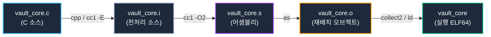

# 06. 컴파일 과정과 ELF 파일 구조 심층 분석 (Compilation & ELF File Format)

소스 코드가 컴파일러 툴체인을 거쳐 기계어로 변환되는 저수준 파이프라인과, 리눅스 실행 파일 표준 규격인 **ELF (Executable and Linkable Format)의 이중 뷰(Dual View: Linking View vs Execution View)** 아키텍처를 심층 분석함.

---

## 1. 학습 목표 및 개요

- C 소스 코드가 전처리기(`cpp`), 컴파일러(`cc1`), 어셈블러(`as`), 링커(`ld`)를 거쳐 중간 산출물(`.i`, `.s`, `.o`)을 생성하는 단계별 컴파일 파이프라인을 규명함.
- 재배치 가능 오브젝트 파일(`.o`)과 최종 실행 바이너리 간의 **ELF 헤더(`Elf64_Ehdr`) 및 메타데이터 차이점**을 정밀 비교함.
- ELF 포맷이 제공하는 **링킹 뷰(섹션 중심, Section Header Table)**와 **실행 뷰(세그먼트 중심, Program Header Table)**의 이중적 설계 목적을 분석함.
- 컴파일러 최적화에 의한 함수 치환(`printf` ➔ `puts`), 데이터 섹션 분기(`.rodata`, `.data`, `.bss`), 디버깅 정보(`.debug_*`)의 구조적 배치를 검증함.

---

## 2. 인터랙티브 ELF 파일 구조 및 이중 뷰 다이어그램

아래 다이어그램에서 ELF 헤더부터 각 세그먼트와 섹션의 매핑 관계, 그리고 W^X 메모리 권한 플래그를 인터랙티브하게 확인 가능함:

<div style="width: 100%; margin: 24px 0; border: 1px solid rgba(255,255,255,0.1); border-radius: 12px; overflow: hidden;">
  <iframe src="../../assets/diagrams/principles/06-elf-structure.html" style="width: 100%; border: none; display: block; overflow: hidden;" scrolling="no" onload="try { const c = this.contentWindow.document.getElementById('diagramCanvas'); if(c) this.style.height = Math.ceil(c.getBoundingClientRect().height) + 'px'; } catch(e){}"></iframe>
</div>

---

## 3. 컴파일러 툴체인 단계별 파이프라인과 중간 산출물

고수준 C 소스 코드가 CPU 기계어로 강등되는 과정은 4단계의 독립적인 도구 연쇄 호출로 이루어짐:



### 3.1 GCC 단계별 중간 산출물 보존 (`-v --save-temps`)

컴파일러 옵션 `-v --save-temps`를 전달하면 내부 도구 호출 로그와 함께 각 단계별 중간 파일이 파일 시스템에 영구 보존됨:


```bash
gcc-13 -v --save-temps -O2 -g vault_core.c -o vault_core 2> gcc_verbose.log
file vault_core.* vault_core
```

```
vault_core.i: C source, Unicode text, UTF-8 text
vault_core.s: assembler source, ASCII text
vault_core.o: ELF 64-bit LSB relocatable, x86-64, version 1 (SYSV), with debug_info
vault_core:   ELF 64-bit LSB pie executable, x86-64, version 1 (SYSV), dynamically linked
```

- **1단계: 전처리(`cpp / cc1 -E`)**: 매크로 치환(`#define`), 조건부 컴파일(`#ifdef`), 헤더 파일 인라인 삽입(`#include <stdio.h>`)을 수행하여 55,000줄 이상의 순수 C 코드 `vault_core.i`를 생성함.
- **2단계: 컴파일(`cc1`)**: 추상 구문 트리(AST) 및 중간 표현(GIMPLE/RTL)을 거쳐 대상 CPU(x86_64)에 특화된 어셈블리 텍스트 `vault_core.s`로 번역함.
- **3단계: 어셈블(`as`)**: 어셈블리 코드를 1:1 기계어 바이트로 인코딩하여 재배치 가능한 ELF 오브젝트 `vault_core.o`를 출력함.
- **4단계: 링크(`collect2 / ld`)**: 미해결 심볼을 해석하고, C 런타임 기동 오브젝트(`crt1.o`, `crti.o`, `crtn.o`) 및 공유 라이브러리(`libc.so`)와 결합하여 최종 실행 바이너리 `vault_core`를 완성함.

---

## 4. ELF 헤더 구조 비교: 오브젝트(`.o`) vs 실행 파일

리눅스 커널 로더와 링커는 파일의 첫 머리에 위치한 64바이트 **ELF 헤더(`Elf64_Ehdr`)**를 판독하여 파일의 성격과 내부 오프셋을 파악함.


```bash
# 재배치 가능 오브젝트 파일 헤더 확인
readelf -h vault_core.o

# 최종 실행 바이너리 헤더 확인
readelf -h vault_core
```

### 4.1 핵심 헤더 필드 비교 분석

| ELF 헤더 필드 (`Elf64_Ehdr`) | `vault_core.o` (오브젝트) | `vault_core` (실행 바이너리) | 기술적 의미 및 차이점 |
| :--- | :--- | :--- | :--- |
| **`e_ident[EI_MAG0..3]`** | `\x7fELF` | `\x7fELF` | 커널 파일 포맷 판독 매직 넘버 (공통) |
| **`e_type`** | `ET_REL` (Relocatable) | `ET_DYN` (PIE Executable) | 독립 실행 불가 vs ASLR 지원 독립 실행 가능 |
| **`e_entry`** | `0x0` (미지정) | `0x1190` (`_start`) | 오브젝트는 진입점이 없으며, 실행 파일만 커널 진입점 보유 |
| **`e_phoff` / `e_phnum`** | `0` (0개) | `64` (13개) | 커널 메모리 매핑 세그먼트 테이블은 실행 파일에만 존재 |
| **`e_shoff` / `e_shnum`** | `9816` (24개) | `16832` (39개) | 링커용 섹션 헤더 테이블. 실행 파일은 런타임 섹션 추가로 확장 |

---

## 5. 섹션 헤더 테이블과 컴파일러 최적화 분석

ELF 링킹 뷰의 핵심인 **섹션 헤더 테이블(Section Header Table)**은 바이너리의 용도별 메모리 조각을 정의함:


```bash
readelf -s vault_core.o
```

```
Symbol table '.symtab' contains 24 entries:
   Num:    Value          Size Type    Bind   Vis      Ndx Name
    18: 0000000000000000   272 FUNC    GLOBAL DEFAULT    6 main
    19: 0000000000000000     0 NOTYPE  GLOBAL DEFAULT  UND puts
    20: 0000000000000000     8 OBJECT  GLOBAL DEFAULT    8 g_banner
    21: 0000000000000000     0 NOTYPE  GLOBAL DEFAULT  UND __printf_chk
    22: 0000000000000000   256 OBJECT  GLOBAL DEFAULT    3 g_session_token
    23: 0000000000000000     4 OBJECT  GLOBAL DEFAULT    2 g_vault_status
```

### 5.1 심볼 테이블 및 컴파일러 변환 규칙

1. **`printf` ➔ `puts` 자동 최적화**:
   - `printf("Security Vault Active\n")`처럼 포맷 지정자가 없는 단순 개행 문자열은 컴파일러(`cc1 -O2`)가 포맷 파싱 오버헤드를 제거하기 위해 `puts()` 심볼(Ndx=UND)로 자동 강등하여 호출함.
   - 포맷 지정자가 포함된 호출은 스택 버퍼 오버플로우 방어 기능이 내장된 `__printf_chk`로 바인딩됨.
2. **변수 배치에 따른 섹션 분류**:
   - `g_vault_status = 1` (초기화된 전역 변수): `.data` 섹션(Ndx=2, 쓰기 가능)에 배치됨.
   - `g_session_token[256]` (미초기화 전역 버퍼): 파일 크기를 절약하기 위해 실제 디스크 공간을 차지하지 않는 `.bss` 섹션(Ndx=3, NOBITS)에 배치됨.
   - `g_banner = "..."` (상수 문자열 포인터): `.rodata` 섹션(읽기 전용)에 저장됨.

```bash
# .rodata 섹션 내 상수 문자열 확인
readelf -p .rodata vault_core

# 컴파일러 버전 정보 확인 (.comment 섹션)
readelf -p .comment vault_core
```

---

## 6. 실습 소스 코드 및 명령어 검증

- **실습 소스 코드**: [`vault_core.c`](../../assets/labs/principles/06-elf-structure/vault_core.c) | [`elf_inspector.c`](../../assets/labs/principles/06-elf-structure/elf_inspector.c)
- **전용 Makefile**: [`Makefile`](../../assets/labs/principles/06-elf-structure/Makefile)

### 6.1 파이프라인 빌드 및 헤더/섹션 검사

```bash
cd labs/principles/06-elf-structure

# 1. 컴파일 파이프라인 중간 파일 생성
make pipeline

# 2. ELF 헤더 비교 (vault_core.o vs vault_core)
make inspect-header

# 3. 섹션 헤더 테이블 (.text, .rodata, .data, .bss) 확인
make inspect-sections

# 4. 상수 문자열 덤프 (.rodata, .comment)
make inspect-strings

# 5. 최적화된 심볼 테이블 및 puts 호출 확인
make inspect-symbols

# 6. DWARF 디버그 섹션 (-g) 확인
make inspect-debug
```

---

## 7. 요약 및 다음 강의

- 컴파일러 파이프라인은 전처리(`.i`), 어셈블리(`.s`), 오브젝트(`.o`), 실행 파일의 4단계를 거치며 코드를 점진적으로 구체화함.
- 재배치 가능 오브젝트(`.o`)는 링커를 위한 섹션 테이블만 보유하며, 실행 파일은 커널 로더를 위한 13개의 프로그램 헤더(세그먼트)를 추가로 구성함.
- 다음 강의에서는 여러 오브젝트 파일 속의 심볼들을 메모리 주소로 해석하고 충돌을 처리하는 **[07. 심볼 테이블과 링킹 메커니즘](07-symbols-and-linking.md)**을 학습함.
