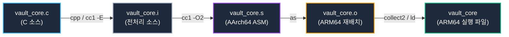

# 06. 컴파일 과정과 ELF 파일 구조 심층 분석 (Compilation & ELF File Format)

소스 코드가 컴파일러 툴체인을 거쳐 기계어로 변환되는 저수준 파이프라인과, 모바일 및 디바이스 시스템 보안의 핵심인 **AArch64 (ARM64)**를 기본(Default)으로 하여 서버/레거시 **x86_64**를 아우르는 **ELF (Executable and Linkable Format)의 이중 뷰(Dual View)** 아키텍처를 심층 분석함.

---

## 1. 학습 목표 및 개요

- C 소스 코드가 AArch64 크로스 컴파일러(`aarch64-linux-gnu-gcc`)를 거쳐 중간 산출물(`.i`, `.s`, `.o`)을 생성하는 단계별 컴파일 파이프라인을 규명함.
- 재배치 가능 오브젝트 파일(`.o`)과 최종 실행 바이너리 간의 **ELF 헤더(`Elf64_Ehdr`) 및 메타데이터 차이점**을 정밀 비교함.
- ELF 포맷이 제공하는 **링킹 뷰(섹션 중심, Section Header Table)**와 **실행 뷰(세그먼트 중심, Program Header Table)**의 이중적 설계 목적을 분석함.
- ARM64 고유의 **매핑 심볼(`$x` 코드, `$d` 데이터)**과 컴파일러 최적화에 의한 함수 치환(`printf` ➔ `puts`), 데이터 섹션 분기(`.rodata`, `.data`, `.bss`)를 검증함.
- **AArch64 디바이스 환경과 x86_64 서버 환경의 ELF 구조 차이점**을 1:1 비교 분석함.

---

## 2. 인터랙티브 ELF 파일 구조 및 이중 뷰 다이어그램

아래 다이어그램에서 ELF 헤더부터 각 세그먼트와 섹션의 매핑 관계, 그리고 W^X 메모리 권한 플래그를 인터랙티브하게 확인 가능함:

<div style="width: 100%; margin: 24px 0; border: 1px solid rgba(255,255,255,0.1); border-radius: 12px; overflow: hidden;">
  <iframe src="../../assets/diagrams/principles/06-elf-structure.html" style="width: 100%; border: none; display: block; overflow: hidden;" scrolling="no" onload="try { const c = this.contentWindow.document.getElementById('diagramCanvas'); if(c) this.style.height = Math.ceil(c.getBoundingClientRect().height) + 'px'; } catch(e){}"></iframe>
</div>

---

## 3. 컴파일러 툴체인 단계별 파이프라인과 중간 산출물

고수준 C 소스 코드가 CPU 기계어로 강등되는 과정은 4단계의 독립적인 도구 연쇄 호출로 이루어짐:



### 3.1 AArch64 단계별 중간 산출물 보존 (`-v --save-temps`)

컴파일러 옵션 `-v --save-temps`를 전달하면 내부 도구 호출 로그와 함께 각 단계별 중간 파일이 파일 시스템에 영구 보존됨:


=== "AArch64 (Default - Device)"
    ```bash
    aarch64-linux-gnu-gcc -v --save-temps -O2 -g vault_core.c -o vault_core 2> gcc_verbose.log
    file vault_core.* vault_core
    ```
    ```
    vault_core.i: C source, Unicode text, UTF-8 text
    vault_core.s: assembler source, ASCII text (AArch64 GAS syntax)
    vault_core.o: ELF 64-bit LSB relocatable, ARM aarch64, version 1 (SYSV)
    vault_core:   ELF 64-bit LSB pie executable, ARM aarch64, version 1 (SYSV), dynamically linked
    ```

=== "x86_64 (Server/Legacy)"
    ```bash
    gcc-13 -v --save-temps -O2 -g vault_core.c -o vault_core_x86 2> gcc_verbose.log
    file vault_core_x86.* vault_core_x86
    ```
    ```
    vault_core_x86.s: assembler source, ASCII text (x86_64 AT&T syntax)
    vault_core_x86.o: ELF 64-bit LSB relocatable, x86-64, version 1 (SYSV)
    vault_core_x86:   ELF 64-bit LSB pie executable, x86-64, version 1 (SYSV), dynamically linked
    ```

- **1단계: 전처리(`cpp / cc1 -E`)**: 매크로 치환(`#define`), 조건부 컴파일(`#ifdef`), 헤더 파일 인라인 삽입(`#include <stdio.h>`)을 수행하여 55,000줄 이상의 순수 C 코드 `vault_core.i`를 생성함.
- **2단계: 컴파일(`cc1`)**: 추상 구문 트리(AST) 및 중간 표현(GIMPLE/RTL)을 거쳐 AArch64 레지스터(`x0`~`x30`) 할당 및 32비트 고정 길이 명령어 어셈블리 텍스트 `vault_core.s`로 번역함.
- **3단계: 어셈블(`as`)**: 어셈블리 코드를 A64 기계어 바이트로 인코딩하여 재배치 가능한 ELF 오브젝트 `vault_core.o`를 출력함.
- **4단계: 링크(`collect2 / ld`)**: 미해결 심볼을 해석하고, AArch64 C 런타임 시작 파일 및 공유 라이브러리(`libc.so`)와 결합하여 최종 실행 바이너리 `vault_core`를 완성함.

---

## 4. ELF 헤더 구조 비교: 오브젝트(`.o`) vs 실행 파일

리눅스 커널 로더와 링커는 파일의 첫 머리에 위치한 64바이트 **ELF 헤더(`Elf64_Ehdr`)**를 판독하여 아키텍처 및 내부 오프셋을 파악함:


```bash
# AArch64 재배치 가능 오브젝트 파일 헤더 확인
aarch64-linux-gnu-readelf -h vault_core.o

# AArch64 최종 실행 바이너리 헤더 확인
aarch64-linux-gnu-readelf -h vault_core
```

### 4.1 핵심 헤더 필드 및 듀얼 아키텍처 비교표

| ELF 헤더 필드 (`Elf64_Ehdr`) | AArch64 오브젝트 (`.o`) | AArch64 실행 바이너리 | x86_64 실행 바이너리 | 아키텍처 및 보안 의의 |
| :--- | :--- | :--- | :--- | :--- |
| **`e_ident[EI_MAG0..3]`** | `\x7fELF` | `\x7fELF` | `\x7fELF` | 커널 파일 포맷 판독 매직 넘버 (공통) |
| **`e_machine`** | **`AArch64` (183)** | **`AArch64` (183)** | `x86-64` (62) | 디바이스 ARM 코어 vs x86 코어 식별자 |
| **`e_type`** | `ET_REL` (Relocatable) | `ET_DYN` (PIE Executable) | `ET_DYN` (PIE Executable) | 독립 실행 불가 vs ASLR 지원 독립 실행 가능 |
| **`e_entry`** | `0x0` (미지정) | `0x7c0` (`_start`) | `0x1190` (`_start`) | 오브젝트는 진입점이 없으며 실행 파일만 진입점 보유 |
| **`e_phoff` / `e_phnum`** | `0` (0개) | `64` (9개) | `64` (13개) | 커널 메모리 매핑 세그먼트 테이블 (AArch64 9개, x86 13개) |
| **`e_shoff` / `e_shnum`** | `7920` (29개) | `71752` (36개) | `16832` (39개) | 링커용 섹션 헤더 테이블 오프셋 및 개수 |

---

## 5. 섹션 헤더 테이블과 AArch64 매핑 심볼 (`$x`, `$d`)

ELF 링킹 뷰의 핵심인 **섹션 헤더 테이블**과 AArch64 고유의 심볼 테이블 특성을 분석함:


```bash
aarch64-linux-gnu-readelf -s vault_core.o
```

```
Symbol table '.symtab' contains 32 entries:
   Num:    Value          Size Type    Bind   Vis      Ndx Name
     6: 0000000000000000     0 NOTYPE  LOCAL  DEFAULT    4 $d
     8: 0000000000000000     0 SECTION LOCAL  DEFAULT    5 $x
    25: 0000000000000000   168 FUNC    GLOBAL DEFAULT    5 main
    26: 0000000000000000     0 NOTYPE  GLOBAL DEFAULT  UND puts
    27: 0000000000000000     0 NOTYPE  GLOBAL DEFAULT  UND __printf_chk
    29: 0000000000000000   256 OBJECT  GLOBAL DEFAULT    3 g_session_token
    30: 0000000000000000     8 OBJECT  GLOBAL DEFAULT    7 g_banner
    31: 0000000000000000     4 OBJECT  GLOBAL DEFAULT    2 g_vault_status
```

### 5.1 AArch64 매핑 심볼(Mapping Symbols)의 역할

- **`$x` (A64 Instruction Mapping Symbol)**:
  - 링커와 디스어셈블러에게 해당 주소부터 시작하는 바이트들이 32비트 고정 폭 **AArch64 (A64) 기계어 명령어**임을 고지함.
- **`$d` (Data Mapping Symbol)**:
  - 코드 섹션 내에 인라인화된 리터럴 풀(Literal Pool)이나 상수 데이터가 시작됨을 명시함.
  - x86_64에는 존재하지 않는 ARM 아키텍처 특유의 심볼 표준 규격임.

### 5.2 컴파일러 최적화 및 섹션 배치 규칙

1. **`printf` ➔ `puts` 자동 최적화**:
   - `printf("Security Vault Service Online\n")`처럼 포맷 지정자가 없는 단순 개행 문자열은 컴파일러(`cc1 -O2`)가 포맷 파싱 오버헤드를 제거하기 위해 `puts()` 심볼(Ndx=UND)로 자동 강등하여 호출함.
   - 포맷 문자열이 포함된 호출은 스택 버퍼 오버플로우 방어 기능이 내장된 `__printf_chk`로 바인딩됨.
2. **변수 배치에 따른 섹션 분류**:
   - `g_vault_status = 1` (초기화된 전역 변수): `.data` 섹션(쓰기 가능)에 배치됨.
   - `g_session_token[256]` (미초기화 전역 버퍼): 파일 크기를 절약하기 위해 디스크 공간을 차지하지 않는 `.bss` 섹션(NOBITS)에 배치됨.
   - `g_banner = "..."` (상수 문자열 포인터): `.rodata` 섹션(읽기 전용)에 저장됨.

---

## 6. 실습 소스 코드 및 명령어 검증 (Dual Architecture)

- **실습 소스 코드**: [`vault_core.c`](../../assets/labs/principles/06-elf-structure/vault_core.c) | [`elf_inspector.c`](../../assets/labs/principles/06-elf-structure/elf_inspector.c)
- **전용 Makefile**: [`Makefile`](../../assets/labs/principles/06-elf-structure/Makefile)

=== "AArch64 (Default - Device)"
    ```bash
    cd labs/principles/06-elf-structure

    # 1. 컴파일 파이프라인 중간 파일 생성 (AArch64)
    make pipeline

    # 2. QEMU 유저 에뮬레이터로 AArch64 바이너리 실행
    make run

    # 3. ELF 헤더 비교 (vault_core.o vs vault_core)
    make inspect-header

    # 4. 섹션 헤더 테이블 (.text, .rodata, .data, .bss) 확인
    make inspect-sections

    # 5. 최적화된 심볼 테이블 및 $x, $d 매핑 심볼 확인
    make inspect-symbols
    ```

=== "x86_64 (Server/Legacy)"
    ```bash
    # x86_64 타깃으로 파이프라인 생성 및 호스트 네이티브 실행
    make pipeline ARCH=x86_64
    make run ARCH=x86_64
    make inspect-header ARCH=x86_64
    make inspect-symbols ARCH=x86_64
    ```

---

## 7. 요약 및 다음 강의

- 컴파일러 파이프라인은 전처리(`.i`), 어셈블리(`.s`), 오브젝트(`.o`), 실행 파일의 4단계를 거치며 코드를 점진적으로 구체화함.
- AArch64 ELF는 `EM_AARCH64 (183)` 머신 식별자와 코드/데이터를 구분하는 매핑 심볼(`$x`, `$d`)을 규정함.
- 다음 강의에서는 여러 오브젝트 파일 속의 심볼들을 메모리 주소로 해석하고 충돌을 처리하는 **[07. 심볼 테이블과 링킹 메커니즘](07-symbols-and-linking.md)**을 학습함.
