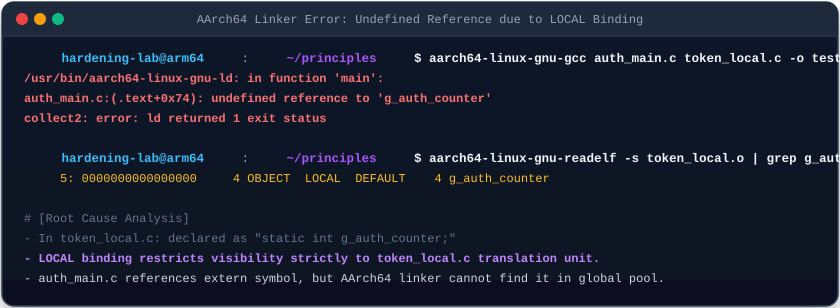
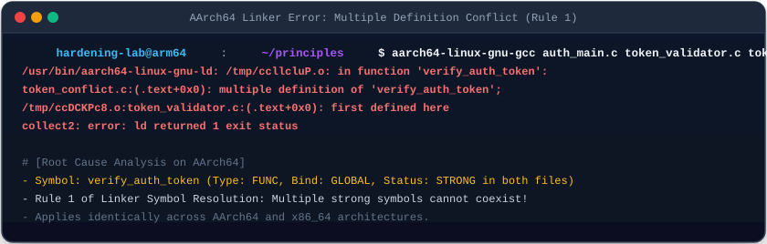
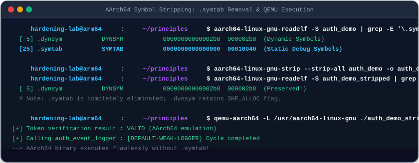

# 07. 심볼 테이블과 링킹 메커니즘 (Symbols & Relocation)

독립적으로 컴파일된 여러 오브젝트 파일(`.o`)들이 결합될 때, 변수와 함수 이름을 메모리 주소로 바인딩하는 **심볼 해석(Symbol Resolution)**과 기계어 명령어 내 오프셋을 패치하는 **릴로케이션(Relocation)** 메커니즘을 **AArch64 디바이스 환경을 기본(Default)**으로 하여 심층 분석함.

---

## 1. 학습 목표 및 개요

- ELF 심볼 테이블 구조체(`Elf64_Sym`)의 바이트 필드와 심볼 바인딩 속성(`GLOBAL`, `LOCAL`, `WEAK`)을 규명함.
- `static` 키워드가 부여하는 `LOCAL` 바인딩 속성과 모듈 간 참조 실패(`undefined reference`) 에러의 근본 원인을 분석함.
- 링커의 **Strong vs Weak 심볼 해석 3대 규칙**과 중복 정의 충돌(`multiple definition`) 메커니즘을 AArch64 및 x86_64 환경에서 검증함.
- 바이너리 경량화 및 난독화 기법인 **심볼 스트리핑(`strip`)** 시 `.symtab` 제거와 `.dynsym` 보존의 런타임 차이점을 QEMU 에뮬레이션으로 실증함.
- AArch64 고유의 PC-상대 릴로케이션(`R_AARCH64_ADR_PREL_PG_HI21`, `R_AARCH64_ADD_ABS_LO12_NC`, `R_AARCH64_CALL26`) 연산 메커니즘을 계산함.

---

## 2. 인터랙티브 심볼 해석 & 릴로케이션 다이어그램

아래 다이어그램에서 4단계(미해결 심볼 수집 ➔ Strong/Weak 해석 ➔ 섹션 병합 ➔ 릴로케이션 패치)를 거치며 심볼 테이블과 기계어 바이트가 완성되는 과정을 인터랙티브하게 확인 가능함:

<div style="width: 100%; margin: 24px 0; border: 1px solid rgba(255,255,255,0.1); border-radius: 12px; overflow: hidden;">
  <iframe src="../../assets/diagrams/principles/07-symbols-linking.html" style="width: 100%; border: none; display: block; overflow: hidden;" scrolling="no" onload="try { const c = this.contentWindow.document.getElementById('diagramCanvas'); if(c) this.style.height = Math.ceil(c.getBoundingClientRect().height) + 'px'; } catch(e){}"></iframe>
</div>

---

## 3. ELF 심볼 테이블 구조체 (`Elf64_Sym`)와 바인딩 스코프

모든 전역 함수와 변수는 컴파일러에 의해 심볼(Symbol)로 등록되며, 링커는 이를 기반으로 교차 참조를 해결함:

```c
typedef struct {
    Elf64_Word    st_name;  /* .strtab 문자열 테이블 내 이름 오프셋 (4B) */
    unsigned char st_info;  /* 상위 4비트: 바인딩(Bind), 하위 4비트: 타입(Type) (1B) */
    unsigned char st_other; /* 심볼 가시성 (Visibility: DEFAULT, HIDDEN) (1B) */
    Elf64_Section st_shndx; /* 소속 섹션 인덱스 (미해결 시 SHN_UNDEF) (2B) */
    Elf64_Addr    st_value; /* 섹션 내 오프셋 또는 확정된 가상 메모리 주소 (8B) */
    Elf64_Xword   st_size;  /* 심볼 객체의 크기 바이트 (8B) */
} Elf64_Sym; /* 총 24바이트 */
```

### 3.1 `LOCAL` vs `GLOBAL` 바인딩과 `static` 스코프 차단

C 언어에서 변수나 함수 앞에 `static`을 명시하면 컴파일러는 심볼의 바인딩을 `STB_LOCAL`로 강등함:



=== "AArch64 (Default - Device)"
    ```bash
    aarch64-linux-gnu-gcc auth_main.c token_local.c -o test_local
    ```
    ```
    /usr/bin/aarch64-linux-gnu-ld: in function 'main':
    auth_main.c:(.text+0x74): undefined reference to 'g_auth_counter'
    collect2: error: ld returned 1 exit status
    ```
    ```bash
    aarch64-linux-gnu-readelf -s token_local.o | grep g_auth_counter
         5: 0000000000000000     4 OBJECT  LOCAL  DEFAULT    4 g_auth_counter
    ```

=== "x86_64 (Server/Legacy)"
    ```bash
    gcc-13 auth_main.c token_local.c -o test_local_x86
    ```
    ```
    /usr/bin/ld: in function 'main':
    auth_main.c:(.text+0x82): undefined reference to 'g_auth_counter'
    collect2: error: ld returned 1 exit status
    ```

- `token_local.c`의 `static int g_auth_counter`는 `LOCAL` 바인딩을 가지므로 오직 해당 번역 단위 내부에서만 가시성이 유지됨.
- `auth_main.c`에서 `extern int g_auth_counter;`로 외부 참조를 시도하더라도 링커는 전역 심볼 풀에서 이를 찾을 수 없어 아키텍처에 관계없이 `undefined reference` 링킹 에러를 발생시킴.

---

## 4. Strong vs Weak 심볼 해석 규칙과 중복 정의 충돌

링커(`ld`)가 복수의 오브젝트 파일에서 동일한 이름의 심볼을 발견했을 때 적용하는 표준 해결 규칙:

| 심볼 구분 | 성격 및 C 언어 문법 정의 | 링킹 우선순위 |
| :--- | :--- | :--- |
| **Strong 심볼** | 함수 본체, 명시적으로 초기화된 전역 변수 (`int g_val = 10;`) | 최우선 채택 (중복 불가) |
| **Weak 심볼** | 초기화되지 않은 전역 변수, `__attribute__((weak))` 선언 함수 | 대체 가능 (하위 우선순위) |

### 4.1 규칙 1: Strong 심볼 중복 충돌 (`multiple definition`)

둘 이상의 오브젝트 파일에서 동일한 이름의 Strong 심볼이 정의된 경우 링커는 빌드를 즉각 중단함:



```bash
aarch64-linux-gnu-gcc auth_main.c token_validator.c token_conflict.c -o test_conflict
```

```
/usr/bin/aarch64-linux-gnu-ld: token_conflict.c:(.text+0x0): multiple definition of 'verify_auth_token'; 
token_validator.c:(.text+0x0): first defined here
collect2: error: ld returned 1 exit status
```

### 4.2 규칙 2: Strong 심볼의 Weak 심볼 오버라이딩

Strong 심볼과 Weak 심볼이 경합할 경우, 링커는 에러 없이 **Strong 심볼을 최종 선택**함:
- `token_validator.c`에서 기본 보안 로거를 `__attribute__((weak))`로 정의함.
- `auth_hook.c`에서 동일 이름의 강한 심볼(`auth_event_logger`)을 제공하면, 링커는 기본 약한 로거를 버리고 강화된 보안 로거로 교체 바인딩함.

---

## 5. 심볼 스트리핑 실증: `.symtab` vs `.dynsym`

컴파일된 바이너리는 용도에 따라 2개의 분리된 심볼 테이블을 보유함:



```bash
# 스트립 전: 두 심볼 테이블 모두 존재
aarch64-linux-gnu-readelf -S auth_demo | grep -E '\.symtab|\.dynsym'
  [ 5] .dynsym           DYNSYM           00000000000002b8  000002b8
  [25] .symtab           SYMTAB           0000000000000000  00010040

# strip 명령어로 정적 디버그 심볼 제거
aarch64-linux-gnu-strip --strip-all auth_demo -o auth_demo_stripped

# 스트립 후: .symtab 제거, .dynsym 유지
aarch64-linux-gnu-readelf -S auth_demo_stripped | grep -E '\.symtab|\.dynsym'
  [ 5] .dynsym           DYNSYM           00000000000002b8  000002b8
```

```bash
# QEMU 에뮬레이터로 스트립된 AArch64 바이너리 실행
qemu-aarch64 -L /usr/aarch64-linux-gnu ./auth_demo_stripped
```

- **`.symtab`**: 로컬 함수, `static` 변수, 디버거용 메타데이터를 포함함. 메모리에 적재되지 않는 디스크 전용 섹션이며 `strip` 시 완전히 제거됨.
- **`.dynsym`**: 런타임에 동적 링커(`ld-linux-aarch64.so.1`)가 외부 라이브러리와 심볼을 바인딩하는 데 필수적이므로 메모리 할당 플래그(`SHF_ALLOC`)를 가지며 `strip` 후에도 절대 삭제되지 않음.
- `.symtab`이 제거된 바이너리는 디버깅은 불가능해지나 런타임 실행은 100% 정상 수행됨.

---

## 6. AArch64 vs x86_64 릴로케이션 연산 메커니즘

컴파일러는 번역 단위 내에서 외부 심볼의 실제 주소를 알지 못하므로 플레이스홀더를 남겨두고 릴로케이션 엔트리를 생성함:

| 아키텍처 | 주요 릴로케이션 타입 | 명령어 패치 방식 | 연산 공식 |
| :--- | :--- | :--- | :--- |
| **AArch64** | `R_AARCH64_ADR_PREL_PG_HI21` | `adrp` 명령어 (상위 21비트 4KB 페이지) | `Page(S + A) - Page(P)` |
| **AArch64** | `R_AARCH64_ADD_ABS_LO12_NC` | `add` / `ldr` 명령어 (하위 12비트 오프셋) | `(S + A) & 0xFFF` |
| **AArch64** | `R_AARCH64_CALL26` | `bl` 함수 호출 분기 (26비트 오프셋) | `(S + A - P) >> 2` |
| **x86_64** | `R_X86_64_PC32` | `call` / `jmp` (32비트 상대 오프셋) | `S + A - P` |
| **x86_64** | `R_X86_64_64` | 64비트 절대 주소 데이터 | `S + A` |

- AArch64는 모든 명령어가 32비트 고정 길이이므로, 64비트 가상 주소를 단일 명령어에 담지 못하고 **`adrp`(페이지 계산) + `add`(페이지 내 오프셋)**의 2단계 릴로케이션 쌍으로 분할 처리함.

---

## 7. 실습 소스 코드 및 검증 (Dual Architecture)

- **실습 소스 코드**: [`auth_main.c`](../../assets/labs/principles/07-symbols-linking/auth_main.c) | [`token_validator.c`](../../assets/labs/principles/07-symbols-linking/token_validator.c) | [`token_conflict.c`](../../assets/labs/principles/07-symbols-linking/token_conflict.c) | [`token_local.c`](../../assets/labs/principles/07-symbols-linking/token_local.c) | [`auth_hook.c`](../../assets/labs/principles/07-symbols-linking/auth_hook.c)
- **전용 Makefile**: [`Makefile`](../../assets/labs/principles/07-symbols-linking/Makefile)

=== "AArch64 (Default - Device)"
    ```bash
    cd labs/principles/07-symbols-linking

    # 1. 기본 약한 심볼 실행 (QEMU AArch64)
    make run

    # 2. 강력한 심볼 오버라이딩 빌드 및 실행
    make run-override

    # 3. 중복 정의 충돌(Rule 1 위반) 에러 재현
    make demo-conflict

    # 4. LOCAL 바인딩(static) 미참조 에러 재현
    make demo-local

    # 5. 심볼 바인딩(GLOBAL vs LOCAL) 확인
    make inspect-symbols

    # 6. 심볼 스트리핑(.symtab vs .dynsym) 검증
    make demo-strip
    ```

=== "x86_64 (Server/Legacy)"
    ```bash
    # x86_64 타깃으로 실행 및 에러 재현
    make run ARCH=x86_64
    make run-override ARCH=x86_64
    make demo-conflict ARCH=x86_64
    make demo-strip ARCH=x86_64
    ```

---

## 8. 요약 및 다음 강의

- 심볼 테이블은 코드와 데이터의 식별자를 메모리 주소로 매핑하며, `static` 키워드는 전역 가시성을 차단함.
- AArch64는 32비트 고정 명령어 체계로 인해 `adrp`와 `add` 릴로케이션 쌍으로 주소를 구성함.
- 다음 강의에서는 모든 외부 라이브러리와 C 런타임을 단일 바이너리에 결합하는 **[08. 정적 링킹과 바이너리 로딩](08-static-linking-and-loading.md)**을 학습함.
