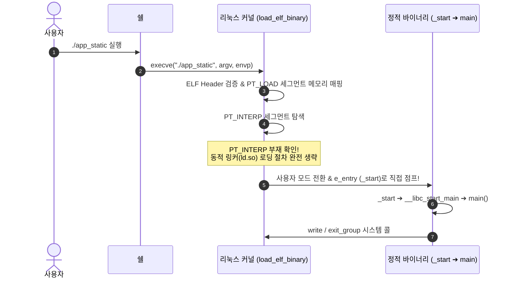

# 08. 정적 링킹과 바이너리 로딩 (Static Linking & Loading)

애플리케이션이 참조하는 모든 외부 라이브러리 코드와 C 런타임 루틴을 하나의 실행 바이너리 내부로 영구 통합하는 **정적 링킹(Static Linking)**과, 동적 링커를 거치지 않고 커널이 곧바로 기동하는 **자체 완결형(Self-Contained) 로딩** 메커니즘을 분석함.

---

## 1. 학습 목표 및 개요

- 정적 라이브러리 아카이브(Archive, `.a`)의 파일 구조와 링커(`ld`)의 모듈 선택적 추출 알고리즘을 이해함.
- 정적 링킹 옵션(`-static`)이 표준 C 라이브러리(`libc.a`)와 런타임 기동 코드(`crt0.o`)를 바이너리에 인라인화하는 과정을 규명함.
- 커널의 `load_elf_binary()` 함수가 `PT_INTERP` 세그먼트의 부재를 감지하고 동적 링커(`ld.so`)를 건너뛰어 진입점(`_start`)으로 직접 점프하는 로딩 파이프라인을 분석함.
- 정적 링킹의 보안적 장단점(환경 변수 하이재킹 차단 vs 취약 라이브러리 업데이트 불가)을 비교 평가함.

---

## 2. 인터랙티브 정적 링킹 및 커널 직접 로딩 다이어그램

아래 다이어그램에서 4단계 타임라인을 클릭하여 아카이브 결합부터 커널의 `_start` 직접 진입 과정과 정적 vs 동적 바이너리의 기술적 차이를 확인 가능함:

<div style="width: 100%; margin: 24px 0; border: 1px solid rgba(255,255,255,0.1); border-radius: 12px; overflow: hidden;">
  <iframe src="../../assets/diagrams/principles/08-static-loading.html" style="width: 100%; min-height: 680px; border: none; display: block; overflow: hidden;" scrolling="no" onload="try { const h = this.contentWindow.document.documentElement.scrollHeight; if(h) this.style.height = (h + 30) + 'px'; } catch(e){}"></iframe>
</div>

---

## 3. 정적 라이브러리 아카이브(`.a`)의 내부 구조

정적 라이브러리는 여러 개의 오브젝트 파일(`.o`)들을 `ar` 유틸리티로 압축 없이 인덱스와 함께 묶어놓은 단순 아카이브 파일임:

```bash
ar rcs libops.a libops.o
```

- **링커의 선별적 추출(Selective Extraction) 알고리즘**:
  - 링커는 아카이브 전체를 통째로 바이너리에 복사하지 않음.
  - 현재까지 미해결된 심볼 집합($U$)에 포함된 심볼을 정의하고 있는 오브젝트 파일 멤버만을 아카이브에서 선별적으로 꺼내어 병합함.
  - 이로 인해 **링커 명령행에서 라이브러리의 배치 순서**가 중요함 (`gcc app.o -lops`는 성공하지만 `gcc -lops app.o`는 미해결 심볼 오류가 발생할 수 있음).

---

## 4. 커널의 정적 바이너리 직접 로딩 흐름

정적으로 링크된 바이너리는 런타임에 외부 공유 라이브러리를 일체 요구하지 않음:



---

## 5. 정적 링킹 vs 동적 링킹 보안 트레이드오프

| 평가 영역 | 정적 링킹 (`-static`) | 동적 링킹 (기본값) |
| :--- | :--- | :--- |
| **바이너리 용량** | 대용량 (수백 KB ~ 수십 MB, libc 내장) | 초소형 (수 KB ~ 수십 KB) |
| **배포 용이성** | 완전 자립형 (타깃 시스템에 라이브러리 불필요) | 시스템 라이브러리 버전 불일치 위험 |
| **메모리 효율** | 프로세스마다 독자 코드 페이지 보유 (RAM 낭비) | 여러 프로세스가 공유 라이브러리 코드(RX) 공유 |
| **라이브러리 하이재킹** | `LD_PRELOAD`, `LD_LIBRARY_PATH` 공격 원천 무효화 | 환경 변수 조작을 통한 인젝션 위험 존재 |
| **보안 패치 편의성** | libc 취약점 시 시스템 내 모든 바이너리 재컴파일 필요 | 시스템의 `libc.so` 교체 시 즉시 모든 프로그램 패치 |

---

## 6. 실습 소스 코드 및 바이너리 메타데이터 비교

- **실습 소스 코드**: [`app.c`](../../assets/labs/principles/08-static-linking-loading/app.c) (로컬 원본) | [GitHub 소스 코드 저장소 :octicons-mark-github-16:](https://github.com/auking45/linux-kernel-hardening-lab/blob/main/labs/principles/08-static-linking-loading/app.c)
- **전용 Makefile**: [`Makefile`](../../assets/labs/principles/08-static-linking-loading/Makefile)

### 6.1 동적 vs 정적 바이너리 메타데이터 비교

```bash
cd labs/principles/08-static-linking-loading
make compare
```

```
=== [Binary Metadata Comparison] ===
file app_dyn
app_dyn: ELF 64-bit LSB executable, x86-64, version 1 (SYSV), dynamically linked, interpreter /lib64/ld-linux-x86-64.so.2, not stripped
file app_static
app_static: ELF 64-bit LSB executable, x86-64, version 1 (GNU/Linux), statically linked, with debug_info, not stripped

=== [Binary File Sizes] ===
ls -lh app_dyn app_static
-rwxr-xr-x 1 user user  16K app_dyn
-rwxr-xr-x 1 user user 952K app_static
```

- `app_dyn`은 크기가 16KB이며 인터프리터(`/lib64/ld-linux-x86-64.so.2`)를 요구하는 반면, `app_static`은 952KB 크기로 인터프리터가 전혀 명시되지 않는 정적 바이너리임을 확인 가능함.

### 6.2 의존성 라이브러리 검사 (`ldd`)

```bash
make run-static
```

- `ldd app_static` 실행 시 `"not a dynamic executable"` 메시지가 출력되며 외부 공유 객체 의존성이 전무함을 입증함.

---

## 7. 요약 및 다음 강의

- 정적 링킹은 외부 환경에 구애받지 않는 독립적인 자체 완결형 바이너리를 생성하지만, 메모리 중복 소비와 보안 패치 지연이라는 트레이드오프가 존재함.
- 다음 강의에서는 현대 리눅스 시스템의 표준 실행 방식인 **[09. 동적 링킹(PLT/GOT)과 런타임 동적 로딩(dlopen)](09-dynamic-linking-and-loading.md)**을 학습함.
