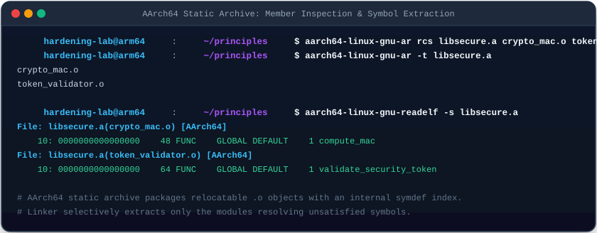
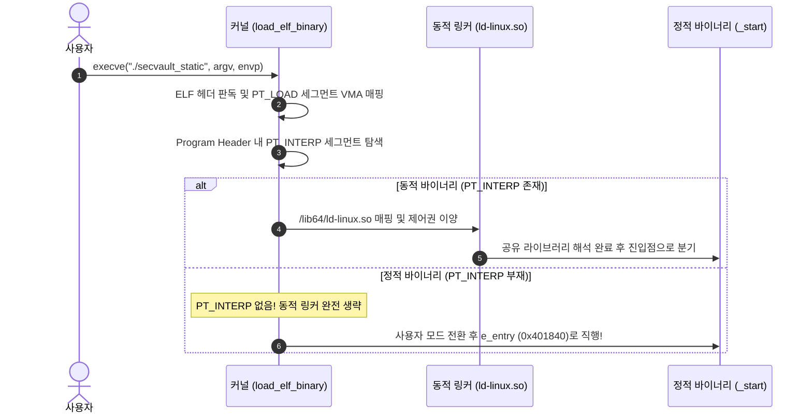
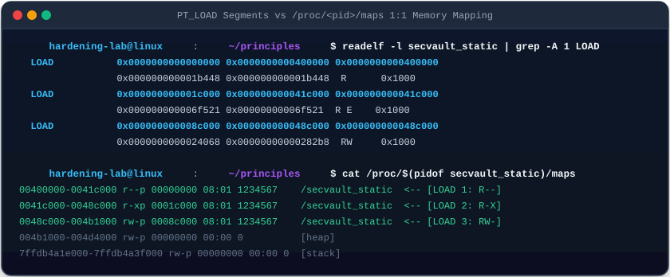

# 08. 정적 링킹과 바이너리 로딩 (Static Linking & Loading)

애플리케이션이 참조하는 모든 외부 라이브러리 코드와 C 런타임 루틴을 하나의 실행 바이너리 내부로 영구 통합하는 **정적 링킹(Static Linking)**과, 동적 링커를 거치지 않고 커널이 곧바로 기동하는 **자체 완결형(Self-Contained) 로딩** 메커니즘을 심층 분석함.

---

## 1. 학습 목표 및 개요

- 정적 라이브러리 아카이브(Archive, `.a`)의 내부 구조와 `ar` 도구를 통한 아카이브 생성 및 심볼 인덱싱을 규명함.
- 링커(`ld`)의 **선별적 모듈 추출(Selective Extraction) 알고리즘**과 명령행 배치 순서에 따른 심볼 미해결 위험을 이해함.
- 커널의 `load_elf_binary()` 함수가 `PT_INTERP` 세그먼트의 부재를 감지하고 진입점(`_start`)으로 직접 점프하는 로딩 파이프라인을 분석함.
- 실행 파일의 `PT_LOAD` 세그먼트와 프로세스 가상 메모리(`/proc/<pid>/maps`) 간의 **1:1 주소 공간 매핑**을 실측 검증함.
- 정적 링킹과 동적 링킹 간의 바이너리 용량, 메모리 효율, 그리고 `LD_PRELOAD` 환경 변수 하이재킹 차단 등의 보안 트레이드오프를 평가함.

---

## 2. 인터랙티브 정적 링킹 및 커널 직접 로딩 다이어그램

아래 다이어그램에서 4단계 타임라인을 클릭하여 아카이브 결합부터 커널의 `_start` 직접 진입 과정과 정적 vs 동적 바이너리의 기술적 차이를 확인 가능함:

<div style="width: 100%; margin: 24px 0; border: 1px solid rgba(255,255,255,0.1); border-radius: 12px; overflow: hidden;">
  <iframe src="../../assets/diagrams/principles/08-static-loading.html" style="width: 100%; border: none; display: block; overflow: hidden;" scrolling="no" onload="try { const c = this.contentWindow.document.getElementById('diagramCanvas'); if(c) this.style.height = Math.ceil(c.getBoundingClientRect().height) + 'px'; } catch(e){}"></iframe>
</div>

---

## 3. 정적 라이브러리 아카이브(`.a`) 내부 구조와 선별적 추출

정적 라이브러리는 여러 개의 오브젝트 파일(`.o`)들을 `ar` 유틸리티를 사용하여 심볼 인덱스와 함께 단일 파일로 묶어놓은 아카이브 규격임:



```bash
# 1. 독립 오브젝트 파일들을 묶어 정적 라이브러리 아카이브 생성
ar rcs libsecure.a crypto_mac.o token_validator.o

# 2. 아카이브 내 멤버 파일 목록 확인
ar -t libsecure.a

# 3. 각 멤버 파일별 심볼 테이블 확인
readelf -s libsecure.a
```

```
File: libsecure.a(crypto_mac.o)
     3: 0000000000000000    54 FUNC    GLOBAL DEFAULT    1 compute_mac
File: libsecure.a(token_validator.o)
     3: 0000000000000000    68 FUNC    GLOBAL DEFAULT    1 validate_security_token
```

### 3.1 링커의 선별적 모듈 추출(Selective Extraction) 알고리즘

- 링커는 아카이브 전체를 통째로 실행 파일에 복사하지 않음.
- 미해결 심볼 집합($U$)에 등록된 심볼을 정의하고 있는 오브젝트 파일 멤버만을 아카이브에서 선별적으로 꺼내어 병합함.
- 따라서 사용되지 않는 모듈(Dead Module)은 최종 바이너리에 포함되지 않아 크기를 절약함.
- **명령행 순서 의존성**: 링커는 좌측에서 우측으로 심볼을 탐색하므로, `gcc secvault.o -lsecure` 순서로 배치해야 정상적으로 링크됨 (`gcc -lsecure secvault.o`로 배치 시 $U$가 비어있어 아카이브가 무시됨).

---

## 4. 커널 로더(`load_elf_binary`)와 `PT_INTERP` 세그먼트 부재

정적 링킹 옵션(`-static`)을 적용하면 컴파일러는 표준 C 라이브러리(`libc.a`)와 런타임 시작 코드(`crt1.o`)를 실행 바이너리에 직접 인라인화함:



```bash
# 동적 바이너리: 인터프리터 경로 명시
readelf -l secvault_dyn | grep -A 1 INTERP
  INTERP         0x0000000000000318 0x0000000000000318 0x0000000000000318
                 0x000000000000001c 0x000000000000001c  R      0x1

# 정적 바이너리: PT_INTERP 완전 부재
readelf -l secvault_static | grep -A 1 INTERP || echo "PT_INTERP 부재 확인"
```

---

## 5. `PT_LOAD` 세그먼트와 프로세스 메모리(`/proc/<pid>/maps`) 1:1 매핑

정적 바이너리는 커널 로더가 직접 가상 메모리 공간(VMA)에 1:1로 매핑하여 기동함:



```bash
# 실행 파일의 세그먼트 로드 정보 확인
readelf -l secvault_static | grep -A 1 LOAD
```

```
  LOAD           0x0000000000000000 0x0000000000400000 0x0000000000400000
                 0x000000000001b448 0x000000000001b448  R      0x1000
  LOAD           0x000000000001c000 0x000000000041c000 0x000000000041c000
                 0x000000000006f521 0x000000000006f521  R E    0x1000
  LOAD           0x000000000008c000 0x000000000048c000 0x000000000048c000
                 0x0000000000024068 0x00000000000282b8  RW     0x1000
```

### 5.1 커널 VMA 매핑 1:1 대조표

| 세그먼트 | Program Header 오프셋 및 가상 주소 | 메모리 권한 | `/proc/<pid>/maps` 실측 매핑 | 역할 및 주요 섹션 |
| :--- | :--- | :--- | :--- | :--- |
| **LOAD 1** | `VirtAddr: 0x400000`, `Size: 0x1b448` | `R` (읽기 전용) | `00400000-0041c000 r--p` | ELF 헤더, `.rodata`, `.eh_frame` |
| **LOAD 2** | `VirtAddr: 0x41c000`, `Size: 0x6f521` | `R E` (읽기/실행) | `0041c000-0048c000 r-xp` | 기계어 코드 섹션 (`.text`, `_start`, `main`) |
| **LOAD 3** | `VirtAddr: 0x48c000`, `Size: 0x24068` | `RW` (읽기/쓰기) | `0048c000-004b1000 rw-p` | 데이터 섹션 (`.data`, `.bss`) |

---

## 6. 정적 링킹 vs 동적 링킹 비교 및 보안 트레이드오프

```bash
ls -lh secvault_dyn secvault_static
ldd secvault_dyn
ldd secvault_static
```

```
-rwxr-xr-x 1 user user  16K secvault_dyn
-rwxr-xr-x 1 user user 768K secvault_static

secvault_dyn:
	libc.so.6 => /lib/x86_64-linux-gnu/libc.so.6 (0x000073fd45a00000)
	/lib64/ld-linux-x86-64.so.2 (0x000073fd45c3d000)

secvault_static:
	not a dynamic executable
```

| 평가 영역 | 정적 링킹 (`secvault_static`) | 동적 링킹 (`secvault_dyn`) | 보안 및 엔지니어링 시사점 |
| :--- | :--- | :--- | :--- |
| **디스크 용량** | 768 KB (C 런타임 루틴 내장) | 16 KB (외부 의존) | 임베디드 또는 복구 환경에서 정적 바이너리 선호 |
| **외부 의존성** | 전무 (`not a dynamic executable`) | glibc 및 동적 링커 필수 | 배포 환경 라이브러리 버전 불일치 문제 예방 |
| **라이브러리 하이재킹** | **완전 면역** (`LD_PRELOAD` 무효화) | 환경 변수 조작 위험 노출 | 공격자가 `LD_PRELOAD`로 함수 인터셉트 불가 |
| **보안 패치 편의성** | 취약점 발견 시 전체 재컴파일 필수 | 시스템의 `libc.so` 교체 시 즉시 패치 | 대규모 서비스 운영 시 중앙 라이브러리 패치가 유리함 |

---

## 7. 실습 소스 코드 및 검증

- **실습 소스 코드**: [`secvault.c`](../../assets/labs/principles/08-static-linking-loading/secvault.c) | [`crypto_mac.c`](../../assets/labs/principles/08-static-linking-loading/crypto_mac.c) | [`token_validator.c`](../../assets/labs/principles/08-static-linking-loading/token_validator.c) | [`libsecure.h`](../../assets/labs/principles/08-static-linking-loading/libsecure.h)
- **전용 Makefile**: [`Makefile`](../../assets/labs/principles/08-static-linking-loading/Makefile)

```bash
cd labs/principles/08-static-linking-loading

# 1. 정적 라이브러리 아카이브 생성
make libsecure.a

# 2. 동적 바이너리 및 정적 바이너리 빌드
make secvault_dyn secvault_static

# 3. 아카이브 멤버 및 심볼 확인
make inspect-archive

# 4. PT_INTERP 세그먼트 비교
make inspect-interp

# 5. 진입점 주소 및 _start 디스어셈블리 확인
make inspect-entry

# 6. 바이너리 크기 및 ldd 의존성 비교
make compare
```

---

## 8. 요약 및 다음 강의

- 정적 링킹은 외부 의존성이 전혀 없는 자체 완결형 바이너리를 생성하며, 커널 로더가 `PT_INTERP` 없이 메모리에 직접 매핑하여 진입점으로 분기함.
- `LD_PRELOAD`와 같은 라이브러리 주입 공격에 원천 면역성을 제공하지만, 파일 용량 증가와 라이브러리 보안 패치 지연이라는 트레이드오프가 수반됨.
- 다음 강의에서는 현대 리눅스의 표준 실행 체계인 **[09. 동적 링킹과 런타임 동적 로딩](09-dynamic-linking-and-loading.md)**을 학습함.
