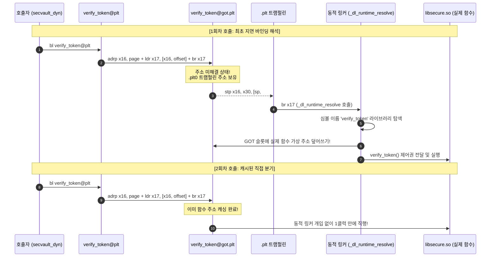

# 09. 동적 링킹과 런타임 동적 로딩 (Dynamic Linking & Loading)

현대 리눅스 운영체제의 메모리 절약과 무중단 패치를 가능하게 하는 **동적 링킹(Dynamic Linking, Shared Objects)**, 저수준 함수 분기 테이블인 **PLT / GOT의 지연 바인딩(Lazy Binding)** 메커니즘, 그리고 프로그램 구동 중에 라이브러리를 동적으로 적재하는 **`dlopen` API**를 **AArch64 디바이스 환경을 기본(Default)**으로 하여 심층 분석함.

---

## 1. 학습 목표 및 개요

- 공유 객체(Shared Object, `.so`)가 프로세스 간 물리 메모리(RX)를 공유하기 위해 필수적인 **위치 독립적 코드(PIC)**와 데이터 간접 참조 메커니즘을 이해함.
- 동적 링커(`ld-linux-aarch64.so.1`)가 참조하는 `.dynamic` 섹션의 `DT_NEEDED` 의존성 탐색 구조를 규명함.
- **AArch64 PLT 간접 분기 (`adrp` + `ldr` + `br x17`)**와 x86_64 간접 점프(`jmp *GOT`) 간의 아키텍처별 어셈블리 동작 차이를 비교함.
- **`.plt0` 트램펄린**이 `stp x16, x30, [sp, #-16]!` 명령어를 통해 GOT 슬롯과 복귀 주소(Link Register `x30`)를 보존하는 원리를 추적함.
- 릴로케이션 엔트리(`Elf64_Rela`)의 `R_AARCH64_JUMP_SLOT` 구조체 바이트와 동적 심볼 해석을 분석함.
- 쓰기 가능한 GOT 엔트리를 노리는 **GOT Overwrite 공격**과 이를 원천 차단하는 **Full RELRO (`-z relro -z now`)**, 그리고 ARMv8.5+ **BTI / PAC** 하드웨어 방어선을 검증함.

---

## 2. 인터랙티브 PLT/GOT & dlopen 아키텍처 다이어그램

아래 다이어그램에서 3가지 모드(1회차 지연 바인딩, 2회차 직접 점프, 런타임 dlopen 로딩)를 전환하며 PLT와 GOT의 메모리 전이 과정을 인터랙티브하게 확인 가능함:

<div style="width: 100%; margin: 24px 0; border: 1px solid rgba(255,255,255,0.1); border-radius: 12px; overflow: hidden;">
  <iframe src="../../assets/diagrams/principles/09-dynamic-linking.html" style="width: 100%; border: none; display: block; overflow: hidden;" scrolling="no" onload="try { const c = this.contentWindow.document.getElementById('diagramCanvas'); if(c) this.style.height = Math.ceil(c.getBoundingClientRect().height) + 'px'; } catch(e){}"></iframe>
</div>

---

## 3. 위치 독립적 코드(PIC)와 동적 링커 메타데이터

공유 라이브러리(`libsecure.so`)의 코드 영역(RX)은 ASLR 환경에서 각 프로세스마다 서로 다른 가상 주소(VMA)에 적재될 수 있음:

- 코드 세그먼트 내에 절대 주소를 직접 하드코딩할 수 없으므로, 모든 전역 데이터와 외부 함수 주소는 **데이터 세그먼트에 위치한 GOT (Global Offset Table)**를 통해 간접 참조함(`-fPIC` 컴파일).
- ELF 실행 파일은 `.dynamic` 섹션과 `PT_INTERP` 세그먼트를 통해 동적 링커를 지정하고, 필요한 의존 라이브러리 태그(`DT_NEEDED`)를 등록함.

```bash
# 인터프리터 경로 확인 (AArch64)
aarch64-linux-gnu-readelf -p .interp secvault_dyn

# 동적 의존성 태그 (DT_NEEDED) 확인
aarch64-linux-gnu-readelf -d secvault_dyn | grep -E 'NEEDED|RPATH|RUNPATH'
```

```
 0x0000000000000001 (NEEDED)             공유 라이브러리: [libsecure.so]
 0x0000000000000001 (NEEDED)             공유 라이브러리: [libc.so.6]
 0x000000000000001d (RUNPATH)            라이브러리 실행 경로: [.]
```

---

## 4. 저수준 지연 바인딩(Lazy Binding) 동작 메커니즘

함수가 실제로 호출되는 시점까지 심볼 해석을 유예하는 **지연 바인딩(Lazy Binding, `-Wl,-z,lazy`)**의 AArch64 및 x86_64 분기 파이프라인:



---

## 5. AArch64 vs x86_64 PLT 디스어셈블리 정밀 비교


=== "AArch64 (Default - Device)"
    ```armasm
    ; 1. 함수별 개별 PLT 스텁 (verify_token@plt)
    0000000000000780 <verify_token@plt>:
     780:  90000110  adrp  x16, 20000        ; PC 기준 GOT 4KB 페이지 주소 계산
     784:  f9402211  ldr   x17, [x16, #64]   ; GOT[verify_token] 슬롯에서 주소 로드
     788:  91010210  add   x16, x16, #0x40   ; 릴로케이션 슬롯 주소를 x16에 보관
     78c:  d61f0220  br    x17               ; x17로 간접 분기

    ; 2. 공통 PLT 헤더 (.plt0 트램펄린)
    00000000000006e0 <.plt>:
     6e0:  a9bf7bf0  stp   x16, x30, [sp, #-16]! ; GOT 슬롯(x16)과 복귀 주소(LR x30) 스택 저장
     6e4:  f00000f0  adrp  x16, 1f000            ; 링커 트램펄린 페이지 계산
     6e8:  f947fe11  ldr   x17, [x16, #4088]     ; _dl_runtime_resolve 주소 로드
     6ec:  913fe210  add   x16, x16, #0xff8
     6f0:  d61f0220  br    x17                   ; 동적 링커로 직행
    ```

=== "x86_64 (Server/Legacy)"
    ```nasm
    ; 1. 함수별 개별 PLT 스텁 (verify_token@plt.sec)
    00000000000010d0 <verify_token@plt>:
      10d0: endbr64
      10d4: jmp    *0x2f46(%rip)        ; GOT 엔트리로 직접 간접 점프 (0x4020)

    ; 2. 공통 PLT 헤더 (.plt)
    0000000000001020 <.plt>:
      1020: push   0x2fca(%rip)         ; link_map 푸시
      1026: jmp    *0x2fcc(%rip)        ; _dl_runtime_resolve 점프
    ```

- **AArch64의 장점**: x86_64와 달리 `adrp`와 `ldr`을 사용하여 4KB 페이지 상대 주소로 GOT에 접근하므로, IP 상대 변위를 정밀하게 통제 가능함.
- **하드웨어 가드**: AArch64에서는 `br x17` 분기 타깃에 **BTI (`bti c`)** 랜딩 패드가 배치되어 인가되지 않은 간접 분기 시 커널 예외(SIGILL)를 발생시킴.

---

## 6. 동적 릴로케이션 테이블과 `Elf64_Rela` 바이트 구조

동적 링커는 `.rela.plt` 섹션에 명시된 릴로케이션 엔트리를 기반으로 심볼 이름과 GOT 슬롯을 매핑함:


```bash
aarch64-linux-gnu-readelf -r secvault_dyn
```

```
Relocation section '.rela.plt' at offset 0x5e8 contains 9 entries:
  Offset          Info           Type           Sym. Value    Sym. Name + Addend
000000020040  000d00000402 R_AARCH64_JUMP_SL 0000000000000000 verify_token + 0
```

### 6.1 `Elf64_Rela` 구조체 바이트 매핑 (AArch64)

```c
typedef struct {
    Elf64_Addr   r_offset; /* 0x000000020040 : 링커가 패치할 대상 GOT 슬롯 주소 (8B) */
    Elf64_Xword  r_info;   /* 0x000d00000402 : 심볼 인덱스(상위 32b) + 릴로케이션 타입(하위 32b) (8B) */
    Elf64_Sxword r_addend; /* 0x000000000000 : 보정 상수 (8B) */
} Elf64_Rela; /* 총 24바이트 */
```

- **`r_offset = 0x20040`**: `verify_token`의 GOT 슬롯 가상 메모리 주소.
- **`r_info = 0x000d00000402`**:
  - 상위 32비트 (`0xd = 13`): `.dynsym` 동적 심볼 테이블 내 13번째 심볼(`verify_token`).
  - 하위 32비트 (`0x402 = 1026`): `R_AARCH64_JUMP_SLOT` 릴로케이션 타입.

---

## 7. 보안 취약점: GOT Overwrite와 Full RELRO 및 BTI/PAC 방어선

- **GOT Overwrite 공격**:
  - 지연 바인딩을 유지하기 위해 `.got.plt` 메모리 영역은 런타임에 쓰기 권한(`rw-p`)을 보유해야 함.
  - 공격자가 메모리 결함을 통해 GOT 엔트리를 악의적 쉘코드나 `system()` 주소로 덮어쓰면 임의 코드 실행이 가능해짐.
- **방어 대책 1: Full RELRO (`-Wl,-z,relro,-z,now`)**:
  - 프로세스 기동 즉시 모든 외부 심볼을 강제 해결한 후 커널이 `.got` 영역을 **읽기 전용(`r--p`)으로 강제 잠금(mprotect)** 처리하여 변조를 차단함.
- **방어 대책 2: ARM64 하드웨어 방어선 (BTI & PAC)**:
  - **BTI (Branch Target Identification)**: 모든 간접 점프(`br x17`) 타깃 위치가 유효한 `bti c` 명령어인지 하드웨어가 검증함.
  - **PAC (Pointer Authentication)**: 스택에 저장되는 Link Register(`x30`)를 암호화 서명(`paciasp`) 및 검증(`autiasp`)하여 ROP를 원천 봉쇄함.

---

## 8. 실습 소스 코드 및 검증 (Dual Architecture)

- **실습 소스 코드**: [`secvault_dyn.c`](../../assets/labs/principles/09-dynamic-linking-loading/secvault_dyn.c) | [`libsecure.c`](../../assets/labs/principles/09-dynamic-linking-loading/libsecure.c) | [`dlopen_demo.c`](../../assets/labs/principles/09-dynamic-linking-loading/dlopen_demo.c) | [`plugin.c`](../../assets/labs/principles/09-dynamic-linking-loading/plugin.c) | [`trace_got.gdb`](../../assets/labs/principles/09-dynamic-linking-loading/trace_got.gdb)
- **전용 Makefile**: [`Makefile`](../../assets/labs/principles/09-dynamic-linking-loading/Makefile)

=== "AArch64 (Default - Device)"
    ```bash
    cd labs/principles/09-dynamic-linking-loading

    # 1. AArch64 동적 바이너리 실행 (QEMU 에뮬레이션)
    make run

    # 2. 런타임 dlopen 플러그인 동적 로딩 실행
    make run-dlopen

    # 3. PT_INTERP 및 DT_NEEDED 의존성 검사
    make inspect-interp
    make inspect-dynamic

    # 4. PLT 디스어셈블리 및 GOT 릴로케이션 검사
    make inspect-got

    # 5. AArch64 PLT 간접 분기 구조 분석
    make trace-lazy-binding
    ```

=== "x86_64 (Server/Legacy)"
    ```bash
    # x86_64 타깃으로 실행 및 GDB 실시간 GOT 전이 배치 추적
    make run ARCH=x86_64
    make trace-lazy-binding ARCH=x86_64
    ```

---

## 9. 요약 및 커리큘럼 전환

- 동적 링킹은 위치 독립적 코드(PIC)와 PLT/GOT 테이블을 통해 공유 라이브러리의 메모리 효율성을 극대화함.
- AArch64는 `adrp`와 `br x17` 명령어를 통해 PC 상대 분기를 수행하며, BTI/PAC 하드웨어 가드로 강화됨.
- 이제 본 시스템 기초 원리를 바탕으로, 실제 공격을 가로막는 **[커널 보안 기능 레퍼런스(Features)](../features/index.md)**와 **[실전 공격 시나리오(Attack Scenarios)](../scenarios/index.md)**로 진입하여 심화 학습을 수행함.
