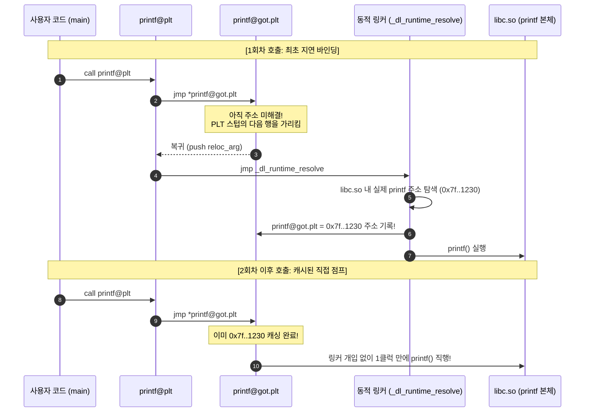

# 09. 동적 링킹과 런타임 동적 로딩 (Dynamic Linking & Loading)

현대 리눅스 운영체제의 메모리 절약과 무중단 패치를 가능하게 하는 **동적 링킹(Dynamic Linking, Shared Objects)**, 저수준 함수 호출 분기 테이블인 **PLT / GOT의 지연 바인딩(Lazy Binding)** 메커니즘, 그리고 프로그램 구동 중에 라이브러리를 동적으로 적재하는 **`dlopen` API**를 심층 분석함.

---

## 1. 학습 목표 및 개요

- 공유 객체(Shared Object, `.so`)가 여러 프로세스 간에 물리 메모리 페이지를 공유하기 위해 필수적인 **위치 독립적 코드(Position-Independent Code / PIC)**의 원리를 이해함.
- 동적 링커(<code>ld-linux.so</code>)가 런타임에 심볼을 바인딩하는 핵심 구조체인 **PLT (Procedure Linkage Table)**와 **GOT (Global Offset Table)**의 상호작용을 추적함.
- **지연 바인딩(Lazy Binding)**의 1회차 호출(동적 해석)과 2회차 이후 호출(직접 분기)의 어셈블리 수준 차이를 규명함.
- 쓰기 가능한 GOT 엔트리를 노리는 **GOT Overwrite 공격**과 이를 무력화하는 **Full RELRO (`-z relro -z now`)** 보호 기법을 분석함.
- `dlopen()`, `dlsym()`, `dlclose()`를 통한 런타임 플러그인 동적 로딩 아키텍처를 실습함.

---

## 2. 인터랙티브 PLT/GOT & dlopen 아키텍처 다이어그램

아래 다이어그램에서 3가지 모드(1회차 지연 바인딩, 2회차 직접 점프, 런타임 dlopen 로딩)를 전환하며 PLT와 GOT의 메모리 전이 과정을 확인 가능함:

<div style="width: 100%; margin: 24px 0; border: 1px solid rgba(255,255,255,0.1); border-radius: 12px; overflow: hidden;">
  <iframe src="../../assets/diagrams/principles/09-dynamic-linking.html" style="width: 100%; border: none; display: block; overflow: hidden;" scrolling="no" onload="try { const c = this.contentWindow.document.getElementById('diagramCanvas'); if(c) this.style.height = Math.ceil(c.getBoundingClientRect().height) + 'px'; } catch(e){}"></iframe>
</div>

---

## 3. 위치 독립적 코드(PIC)와 GOT의 필요성

공유 라이브러리(<code>libc.so</code>)의 코드 영역(RX)은 물리 메모리에 단 하나만 적재되어 수천 개의 프로세스가 동시에 공유해야 함:

- 그러나 각 프로세스마다 라이브러리가 매핑되는 가상 주소(VMA)가 서로 다를 수 있음(ASLR 환경).
- 따라서 코드 영역 내부의 주소를 절대 주소로 고정할 수 없으며, 모든 전역 데이터 및 외부 함수 참조를 **상대 오프셋 기반의 데이터 테이블(GOT)**을 통해 간접 참조(Indirect Access)하도록 컴파일함(`-fPIC` 옵션).

---

## 4. PLT / GOT 협업 및 지연 바인딩(Lazy Binding) 파이프라인

외부 함수 `printf()`를 호출할 때 일어나는 저수준 분기 메커니즘:



---

## 5. 보안 취약점: GOT Overwrite와 RELRO 방어선

- **GOT Overwrite 공격**:
  - 지연 바인딩을 지원하기 위해 `.got.plt` 메모리 영역은 프로그램 실행 중에 반드시 쓰기 권한(`rw-p`)을 유지해야 함.
  - 공격자가 포맷 스트링이나 힙 메모리 결함을 통해 `printf@got` 엔트리를 `system()` 함수의 주소로 덮어쓰면, 프로그램이 다음에 `printf("/bin/sh")`를 호출할 때 쉘이 획득됨.
- **방어 대책: Full RELRO (Read-Only Relocations)**:
  - 컴파일 시 `-Wl,-z,relro,-z,now` 플래그 적용.
  - 지연 바인딩을 포기하고 프로세스가 기동되는 즉시 모든 외부 심볼을 강제 해결(Immediate Binding)한 뒤, `.got` 영역을 **읽기 전용(`r--p`)으로 잠금 조치**하여 덮어쓰기를 원천 봉쇄함.

---

## 6. 런타임 동적 로딩 API (`dlopen` / `dlsym`)

컴파일 시점에 링크하지 않고, 실행 중에 필요에 따라 공유 모듈을 메모리에 적재하는 표준 C API:

```c
#include <dlfcn.h>

void *handle = dlopen("./libplugin.so", RTLD_NOW); /* 공유 객체 적재 */
int (*run)(int) = dlsym(handle, "plugin_execute"); /* 심볼 함수 포인터 획득 */
run(42);                                           /* 동적 함수 호출 */
dlclose(handle);                                   /* 메모리 해제 */
```

---

## 7. 실습 소스 코드 및 검증

- **실습 소스 코드**: [`dlopen_demo.c`](../../assets/labs/principles/09-dynamic-linking-loading/dlopen_demo.c) (로컬 원본) | [GitHub 소스 코드 저장소 :octicons-mark-github-16:](https://github.com/auking45/linux-kernel-hardening-lab/blob/main/labs/principles/09-dynamic-linking-loading/dlopen_demo.c)
- **전용 Makefile**: [`Makefile`](../../assets/labs/principles/09-dynamic-linking-loading/Makefile)

### 7.1 런타임 `dlopen` 플러그인 로딩 실행

```bash
cd labs/principles/09-dynamic-linking-loading
make run-dlopen
```

```
=== [1] Running Runtime Dynamic Loading (dlopen) ===
./dlopen_demo
============================================================
 Runtime Dynamic Loading (dlopen / dlsym Demonstration)
============================================================
[+] Opening shared library at runtime: ./libplugin.so
[+] Library mapped into address space! Handle: 0x3b0326d0
[+] Resolved symbol 'plugin_name'    at address: 0x7fa7329a5110
[+] Resolved symbol 'plugin_execute' at address: 0x7fa7329a5120

[*] Plugin Name Result  : High-Precision Telemetry Sensor Plugin v1.0
[libplugin.so] Executing telemetry calculation on input=10...
[*] Plugin Execute Result: 427

[+] Calling dlclose(0x3b0326d0) to unmap library...
[+] Library safely unmapped from process memory.
============================================================
```

### 7.2 PLT 섹션 및 GOT 릴로케이션 엔트리 검사

```bash
make inspect-got
```

- `readelf -r`을 통해 `.rela.plt` 테이블 내의 `R_X86_64_JUMP_SLOT` 릴로케이션 타입과 오프셋을 직접 확인 가능함.

---

## 8. 요약 및 커리큘럼 연결

- 동적 링킹은 위치 독립적 코드(PIC)와 PLT/GOT 협업을 통해 시스템 전체의 메모리 효율성을 극대화하며, `dlopen`을 통해 유연한 런타임 확장성을 제공함.
- 이제 본 기초 원리를 바탕으로, 실제 시스템 침투를 막아내는 **[커널 보안 기능 레퍼런스(Features)](../features/index.md)**와 **[실전 공격 시나리오(Attack Scenarios)](../scenarios/index.md)**로 진입하여 심화 학습을 수행함.
