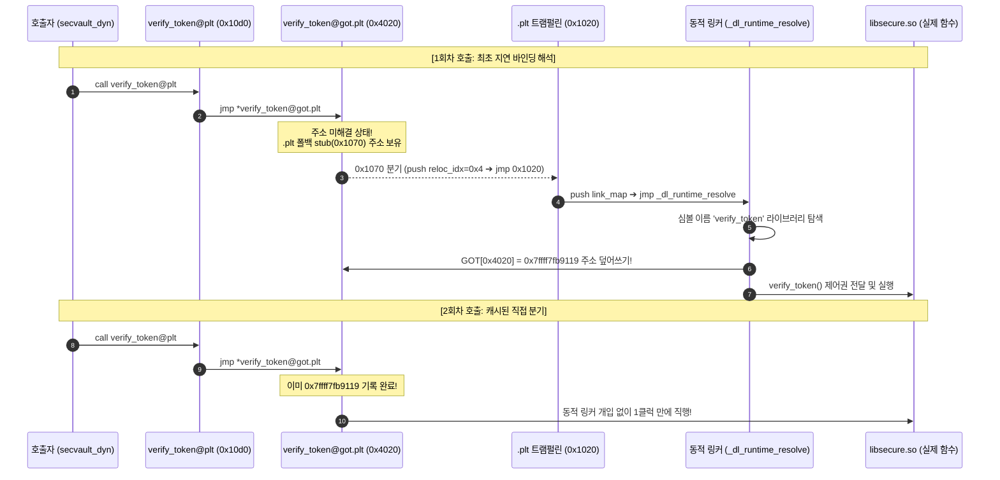

# 09. 동적 링킹과 런타임 동적 로딩 (Dynamic Linking & Loading)

현대 리눅스 운영체제의 메모리 절약과 무중단 패치를 가능하게 하는 **동적 링킹(Dynamic Linking, Shared Objects)**, 저수준 함수 분기 테이블인 **PLT / GOT의 지연 바인딩(Lazy Binding)** 메커니즘, 그리고 프로그램 구동 중에 라이브러리를 동적으로 적재하는 **`dlopen` API**를 심층 분석함.

---

## 1. 학습 목표 및 개요

- 공유 객체(Shared Object, `.so`)가 프로세스 간 물리 메모리(RX)를 공유하기 위해 필수적인 **위치 독립적 코드(PIC)**와 데이터 간접 참조 메커니즘을 이해함.
- 동적 링커(`ld-linux.so`)가 참조하는 `.dynamic` 섹션의 `DT_NEEDED` 의존성 탐색 구조를 규명함.
- **PLT (Procedure Linkage Table)**와 **GOT (Global Offset Table)** 간의 협업 및 지연 바인딩 1회차/2회차 전이 과정을 GDB로 실시간 추적함.
- 릴로케이션 엔트리(`Elf64_Rela`)의 `R_X86_64_JUMP_SLOT` 구조체 바이트와 동적 심볼 해석의 세부 동작을 분석함.
- 쓰기 가능한 GOT 엔트리를 노리는 **GOT Overwrite 공격**과 이를 원천 차단하는 **Full RELRO (`-z relro -z now`)** 방어 기법을 검증함.
- `dlopen()`, `dlsym()`, `dlclose()` API를 통한 런타임 모듈 플러그인 아키텍처를 실습함.

---

## 2. 인터랙티브 PLT/GOT & dlopen 아키텍처 다이어그램

아래 다이어그램에서 3가지 모드(1회차 지연 바인딩, 2회차 직접 점프, 런타임 dlopen 로딩)를 전환하며 PLT와 GOT의 메모리 전이 과정을 인터랙티브하게 확인 가능함:

<div style="width: 100%; margin: 24px 0; border: 1px solid rgba(255,255,255,0.1); border-radius: 12px; overflow: hidden;">
  <iframe src="../../assets/diagrams/principles/09-dynamic-linking.html" style="width: 100%; border: none; display: block; overflow: hidden;" scrolling="no" onload="try { const c = this.contentWindow.document.getElementById('diagramCanvas'); if(c) this.style.height = Math.ceil(c.getBoundingClientRect().height) + 'px'; } catch(e){}"></iframe>
</div>

---

## 3. 위치 독립적 코드(PIC)와 동적 링커 메타데이터

공유 라이브러리(`libsecure.so`)의 코드 영역(RX)은 ASLR 환경에서 각 프로세스마다 서로 다른 가상 주소(VMA)에 적재될 수 있음:

- 코드 세그먼트 내에 절대 주소를 직접 하드코딩할 수 없으므로, 모든 전역 데이터와 외부 함수 주소는 **데이터 세그먼트에 위치한 GOT (Global Offset Table)**를 통해 간접 참조함(`-fPIC` 컴파일).
- ELF 실행 파일은 `.dynamic` 섹션과 `PT_INTERP` 세그먼트를 통해 동적 링커(`ld-linux-x86-64.so.2`)를 지정하고, 필요한 의존 라이브러리 태그(`DT_NEEDED`)를 등록함.

```bash
# 인터프리터 경로 확인
readelf -p .interp secvault_dyn

# 동적 의존성 태그 (DT_NEEDED) 확인
readelf -d secvault_dyn | grep -E 'NEEDED|RPATH|RUNPATH'
```

```
 0x0000000000000001 (NEEDED)             공유 라이브러리: [libsecure.so]
 0x0000000000000001 (NEEDED)             공유 라이브러리: [libc.so.6]
 0x000000000000001d (RUNPATH)            라이브러리 실행 경로: [.]
```

---

## 4. 저수준 지연 바인딩(Lazy Binding) 동작 메커니즘

현대 컴파일러는 기본적으로 모든 심볼을 즉시 해석하는 Full RELRO를 선호하지만, 전통적인 유닉스 시스템과 성능 최적화 환경에서는 함수가 실제로 호출되는 시점까지 심볼 해석을 유예하는 **지연 바인딩(Lazy Binding, `-Wl,-z,lazy`)**을 사용함:



---

## 5. GDB 실시간 추적: 지연 바인딩 상태 전이 실증

`secvault_dyn` 바이너리에서 `verify_token()`을 연속 2회 호출하며 GOT 엔트리(`0x555555558020`)의 값이 어떻게 변경되는지 GDB로 실측함:

### 5.1 1단계: 1회차 호출 이전 (미해결 상태)

함수가 호출되기 전 GOT 엔트리는 공유 라이브러리가 아닌 내부 `.plt` 폴백 스텁을 가리킴:


```bash
gdb -q -nx ./secvault_dyn
(gdb) b main && run
(gdb) x/gx &verify_token@got.plt
0x555555558020 <verify_token@got.plt>:    0x0000555555555070

(gdb) x/2i 0x0000555555555070
   0x555555555070:  endbr64
   0x555555555074:  push   $0x4        # .rela.plt 내 릴로케이션 슬롯 인덱스
   0x555555555079:  jmp    0x555555555020 # .plt 헤더 (_dl_runtime_resolve)
```

### 5.2 2단계: 1회차 호출 완료 후 (해결 완료 상태)

동적 링커(`_dl_runtime_resolve`)가 심볼을 해석한 후 GOT 엔트리에 실제 메모리 주소를 덮어씀:


```bash
(gdb) continue # 1회차 호출 수행
[*] [Call 1] Invoking verify_token() for the first time...
[+] [Call 1 Result] AUTHORIZED

(gdb) x/gx &verify_token@got.plt
0x555555558020 <verify_token@got.plt>:    0x00007ffff7fb9119

(gdb) info symbol 0x00007ffff7fb9119
verify_token in section .text of ./libsecure.so
```

- 2회차 호출 시부터는 `jmp *0x555555558020` 명령어가 동적 링커를 거치지 않고 `libsecure.so`의 함수 본체로 1클럭 만에 직행함.

---

## 6. 동적 릴로케이션 테이블과 `Elf64_Rela` 바이트 구조

동적 링커는 `.rela.plt` 섹션에 명시된 릴로케이션 엔트리를 기반으로 심볼 이름과 GOT 슬롯을 매핑함:


```bash
readelf -r secvault_dyn
```

```
Relocation section '.rela.plt' at offset 0x668 contains 5 entries:
  Offset          Info           Type           Sym. Value        Sym. Name + Addend
  000000004020  000500000007 R_X86_64_JUMP_SLOT 0000000000000000 verify_token + 0
```

### 6.1 `Elf64_Rela` 구조체 바이트 매핑

```c
typedef struct {
    Elf64_Addr   r_offset; /* 0x00004020 : 링커가 패치할 대상 GOT 슬롯 오프셋 (8B) */
    Elf64_Xword  r_info;   /* 0x000500000007 : 심볼 인덱스(상위 32b) + 릴로케이션 타입(하위 32b) (8B) */
    Elf64_Sxword r_addend; /* 0x00000000 : 보정 상수 (8B) */
} Elf64_Rela; /* 총 24바이트 */
```

- **`r_offset = 0x4020`**: `_GLOBAL_OFFSET_TABLE_` 기준 `verify_token`의 GOT 슬롯 주소.
- **`r_info = 0x000500000007`**:
  - 상위 32비트 (`0x5`): `.dynsym` 동적 심볼 테이블 내 5번째 심볼(`verify_token`).
  - 하위 32비트 (`0x7`): `R_X86_64_JUMP_SLOT` 릴로케이션 타입 (PLT 점프 슬롯 패치용).

---

## 7. 보안 취약점: GOT Overwrite와 Full RELRO 방어선

- **GOT Overwrite 공격**:
  - 지연 바인딩을 유지하기 위해 `.got.plt` 메모리 영역은 프로그램 실행 중에 반드시 쓰기 권한(`rw-p`)을 보유해야 함.
  - 공격자가 포맷 스트링 또는 메모리 결함을 통해 GOT 엔트리를 악의적인 쉘코드나 `system()` 함수의 주소로 덮어쓰면 임의 코드 실행이 가능해짐.
- **방어 대책: Full RELRO (`-Wl,-z,relro,-z,now`)**:
  - 지연 바인딩을 포기하고 프로세스 기동 즉시 모든 외부 심볼을 강제 해결함.
  - 해결 직후 커널이 `.got` 메모리 영역을 **읽기 전용(`r--p`)으로 강제 잠금(mprotect)** 처리하여 런타임 변조를 원천 봉쇄함.

---

## 8. 런타임 동적 적재 API (`dlopen` / `dlsym`)

컴파일 시 링크하지 않고 런타임에 동적으로 공유 라이브러리를 로드하여 플러그인 아키텍처를 구현하는 표준 API:

```c
#include <dlfcn.h>

void *handle = dlopen("./libplugin.so", RTLD_NOW);
int (*exec)(int) = dlsym(handle, "plugin_execute");
exec(42);
dlclose(handle);
```

---

## 9. 실습 소스 코드 및 검증

- **실습 소스 코드**: [`secvault_dyn.c`](../../assets/labs/principles/09-dynamic-linking-loading/secvault_dyn.c) | [`libsecure.c`](../../assets/labs/principles/09-dynamic-linking-loading/libsecure.c) | [`dlopen_demo.c`](../../assets/labs/principles/09-dynamic-linking-loading/dlopen_demo.c) | [`plugin.c`](../../assets/labs/principles/09-dynamic-linking-loading/plugin.c) | [`trace_got.gdb`](../../assets/labs/principles/09-dynamic-linking-loading/trace_got.gdb)
- **전용 Makefile**: [`Makefile`](../../assets/labs/principles/09-dynamic-linking-loading/Makefile)

```bash
cd labs/principles/09-dynamic-linking-loading

# 1. 동적 바이너리 실행
make run

# 2. 런타임 dlopen 플러그인 동적 로딩 실행
make run-dlopen

# 3. PT_INTERP 및 DT_NEEDED 의존성 검사
make inspect-interp
make inspect-dynamic

# 4. PLT 및 GOT 릴로케이션 엔트리 검사
make inspect-got

# 5. GDB 배치 스크립트를 통한 지연 바인딩 실시간 상태 추적
make trace-lazy-binding
```

---

## 10. 요약 및 커리큘럼 전환

- 동적 링킹은 위치 독립적 코드(PIC)와 PLT/GOT 테이블을 통해 공유 라이브러리의 메모리 효율성을 극대화함.
- 지연 바인딩은 1회차에만 동적 링커를 거쳐 GOT를 갱신하며, 이후 호출은 직접 분기함.
- 이제 본 시스템 기초 원리를 바탕으로, 실제 공격을 가로막는 **[커널 보안 기능 레퍼런스(Features)](../features/index.md)**와 **[실전 공격 시나리오(Attack Scenarios)](../scenarios/index.md)**로 진입하여 심화 학습을 수행함.
