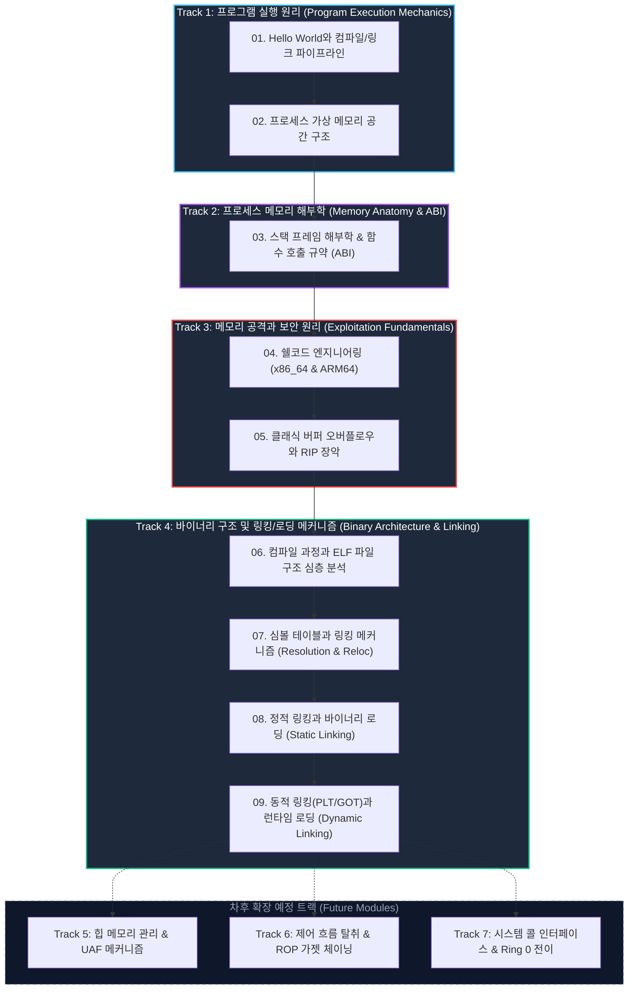

# 시스템 보안 원리 및 프로그램 동작 메커니즘 (System Security Principles)

본 커리큘럼은 **"Hello World 프로그램은 어떻게 컴파일되어 CPU에서 실행되는가?"**라는 가장 근본적인 질문에서 출발하여, 리눅스 프로세스 메모리 구조, 함수 호출 규약(ABI), 기계어 쉘코드 엔지니어링, 그리고 클래식 버퍼 오버플로우를 통한 제어 흐름 장악(RIP Hijacking)까지 시스템 보안의 불변 원리를 단계별로 분석함.

---

## 🎯 교육 목표 및 핵심 학습 철학

1. **상향식(Bottom-Up) 시스템 관점 확립**:
   - 고수준 C 소스 코드가 어떻게 어셈블리와 ELF 기계어 바이너리로 변환되고, 리눅스 커널의 `execve()`와 가상 메모리 관리자(MMU)에 의해 프로세스로 구체화되는지 저수준 메커니즘을 규명함.
2. **다이어그램 중심의 직관적 시각화**:
   - 눈에 보이지 않는 메모리 바이트 배열, 스택 프레임의 성장 방향, CPU 레지스터의 전이 과정을 반응형 인터랙티브 다이어그램으로 시각화하여 학습 이해도를 극대화함.
3. **확장 가능한 모듈형 커리큘럼 설계**:
   - 프로그램 실행 원리부터 메모리 해부학, 익스플로잇 기법, 힙/ROP/커널 시스템 콜 등으로 지속 확장 가능한 모듈형 트랙(Track) 구조를 채택함.

---

## 🗺️ 시스템 보안 원리 로드맵 (Curriculum Tracks)

---

## 📚 모듈별 강의 구성 및 실습 현황

| 챕터 | 주제 및 학습 핵심 | 다루는 주요 개념 | 전용 실습 코드 | 상태 |
| :---: | :--- | :--- | :--- | :---: |
| **01** | **[Hello World 실행 파이프라인](01-hello-world-pipeline.md)** | C 소스 ➔ 전처리 ➔ 컴파일 ➔ 어셈블 ➔ 링킹 ➔ `execve` 커널 진입 ➔ `load_elf_binary` ➔ `_start` ➔ `main()` | `readelf`, `objdump`, `nm`, `strace` | 완료 |
| **02** | **[프로세스 구조와 가상 메모리 공간](02-virtual-memory-layout.md)** | 64비트 가상 주소 공간 분할, Canonical Hole, Text/Data/BSS/Heap/mmap/Stack 세그먼트 권한(W^X) | `/proc/[pid]/maps` 주소 덤프 | 완료 |
| **03** | **[스택 프레임 구조와 호출 규약(ABI)](03-stack-frame-and-abi.md)** | LIFO 역방향 스택 성장, 프롤로그(`push rbp; mov rbp, rsp`), 에필로그(`leave; ret`), SFP, RET 주소 오프셋 계산 | System V AMD64 vs ARM64 AAPCS | 완료 |
| **04** | **[쉘코드 엔지니어링](04-shellcode-engineering.md)** | 기계어 Opcode 구조, `execve("/bin/sh")` 시스템 콜 셋업, Null Byte(`\x00`) 제거 원리, 위치 독립성(PIC) | x86_64 & ARM64 Null-Free 쉘코드 | 완료 |
| **05** | **[클래식 버퍼 오버플로우와 RIP 장악](05-stack-bof-rip.md)** | 경계 검사 없는 메모리 복사, 버퍼 ➔ SFP ➔ RET 덮어쓰기 파이프라인, 임의 코드 실행 및 현대 보안 기법(Canary, NX, ASLR) 연계 | 스택 오버플로우 제어 흐름 탈취 시뮬레이터 | 완료 |
| **06** | **[컴파일 과정과 ELF 파일 구조](06-compilation-and-elf.md)** | AST ➔ IR ➔ ASM 파이프라인, Linking View(섹션) vs Execution View(세그먼트), `PT_LOAD`, `PT_INTERP`, `PT_GNU_STACK` | C 언어 기반 `Elf64_Ehdr` 직접 파서 | 완료 |
| **07** | **[심볼 테이블과 링킹 메커니즘](07-symbols-and-linking.md)** | 심볼 테이블(`Elf64_Sym`), Strong vs Weak 심볼 해석 3대 규칙, 릴로케이션 연산 공식(`S + A - P`) 및 바이트 패치 | Weak 심볼 오버라이딩 검증 랩 | 완료 |
| **08** | **[정적 링킹과 바이너리 로딩](08-static-linking-and-loading.md)** | 정적 아카이브(`.a`), 인라인된 `libc.a`, `PT_INTERP` 부재 및 커널 `_start` 직접 점프, 정적 vs 동적 바이너리 비교 | 정적 아카이브 및 자체 완결형 바이너리 | 완료 |
| **09** | **[동적 링킹과 런타임 동적 로딩](09-dynamic-linking-and-loading.md)** | 공유 라이브러리(`.so`), 위치 독립적 코드(PIC), PLT/GOT 지연 바인딩(Lazy Binding), GOT Overwrite vs Full RELRO, `dlopen` | PLT/GOT 인스펙터 & `dlopen` 플러그인 | 완료 |

---

## 🚀 학습 시작 안내

가장 기초적인 소프트웨어 빌드 과정과 운영체제 커널의 프로세스 로딩 파이프라인을 다루는 **[01. Hello World의 탄생과 실행 라이프사이클](01-hello-world-pipeline.md)**부터 수강을 시작함.
